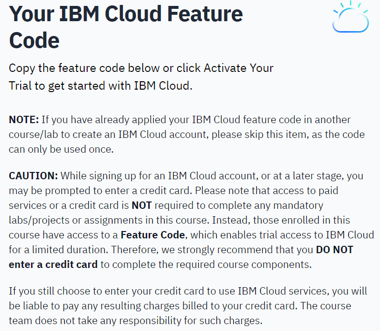
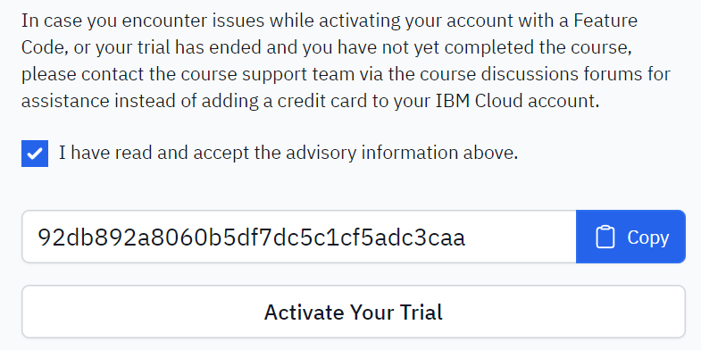
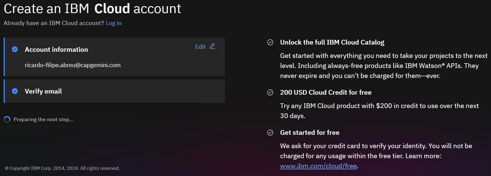
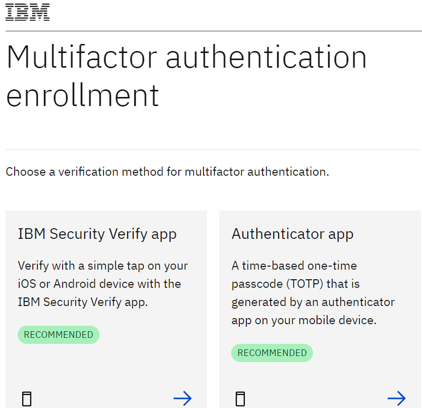
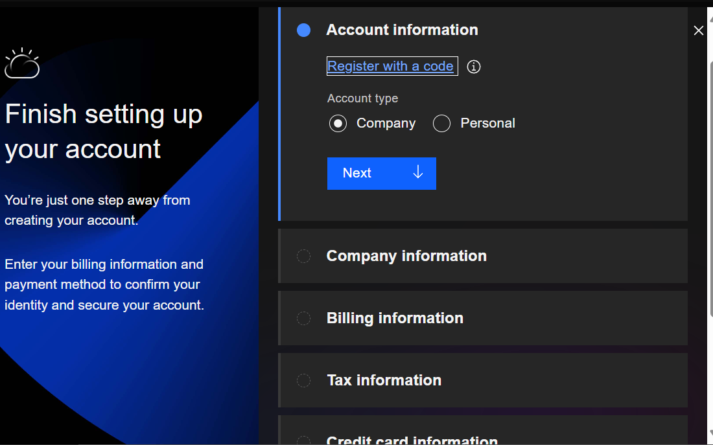
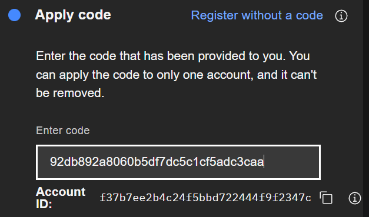
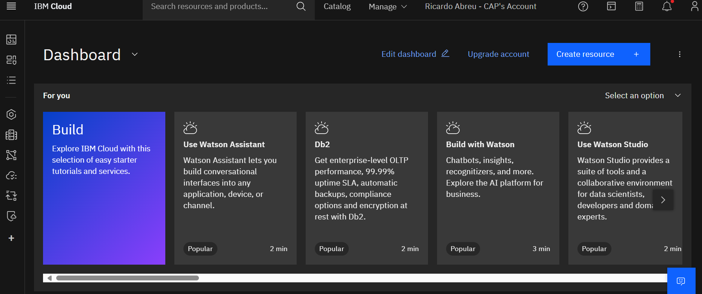

sign in with IBMid

i chose the authenticator app, I'm using Authy for that

and then registered with that code...

and there you go...

After this, 

[Optional] Hands-on Lab Using IBM Db2
You can practice the module's concepts using the IBM Db2 system. Here are links to resources that will guide you in using Db2 for managing Relational Databases:

[Hands-on Lab: Create Db2 service instance and Get started with the Db2 console | Coursera](https://cf-courses-data.s3.us.cloud-object-storage.appdomain.cloud/IBMDeveloperSkillsNetwork-DB0201EN-SkillsNetwork/labs/Labs_Coursera_V5/labs/Lab%20-%20Sign%20up%20for%20IBM%20Cloud%20-%20Create%20Db2%20service%20instance%20-%20Get%20started%20with%20the%20Db2%20console/instructional-labs.md.html?origin=www.coursera.org)

[Hands-on Lab: Create and Load Tables using SQL Scripts | Coursera](https://cf-courses-data.s3.us.cloud-object-storage.appdomain.cloud/IBMDeveloperSkillsNetwork-DB0201EN-SkillsNetwork/labs/Labs_Coursera_V5/labs/Lab%20-%20Create%20tables%20using%20SQL%20scripts%20and%20Load%20data%20into%20tables/instructional-labs.md.html?origin=www.coursera.org)

[Hands-on Lab: CREATE, ALTER, TRUNCATE, DROP | Coursera](https://cf-courses-data.s3.us.cloud-object-storage.appdomain.cloud/IBMDeveloperSkillsNetwork-DB0201EN-SkillsNetwork/labs/Labs_Coursera_V5/Create_and_alter.md.html?origin=www.coursera.org)