# Azure Cosmos DB

[Explore Azure Cosmos DB](https://microsoftlearning.github.io/DP-900T00A-Azure-Data-Fundamentals/Instructions/Labs/dp900-03-cosmos-lab.html)

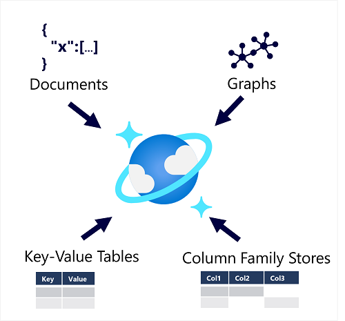

Azure Cosmos DB supports multiple application programming interfaces (APIs) that enable developers to use the programming semantics of many common kinds of data store to work with data in a Cosmos DB database. The internal data structure is abstracted, enabling developers to use Cosmos DB to store and query data using APIs with which they're already familiar.

Cosmos DB is a highly scalable database management system. Cosmos DB automatically allocates space in a container for your partitions, and each partition can grow up to 10 GB in size. Indexes are created and maintained automatically. There's virtually no administrative overhead.Cosmos DB is highly suitable for the following scenarios:

* IoT and telematics. These systems typically ingest large amounts of data in frequent bursts of activity. Cosmos DB can accept and store this information quickly. The data can then be used by analytics services, such as Azure Machine Learning, Microsoft Fabric, and Power BI. Additionally, you can process the data in real-time using Azure Functions that are triggered as data arrives in the database.

* Retail and marketing. Microsoft uses Cosmos DB for its own e-commerce platforms that run as part of Windows Store and Xbox Live. It's also used in the retail industry for storing catalog data and for event sourcing in order processing pipelines.

* Gaming. The database tier is a crucial component of gaming applications. Modern games perform graphical processing on mobile/console clients, but rely on the cloud to deliver customized and personalized content like in-game stats, social media integration, and high-score leaderboards. Games often require single-millisecond latencies for reads and write to provide an engaging in-game experience. A game database needs to be fast and be able to handle massive spikes in request rates during new game launches and feature updates.

* Web and mobile applications. Azure Cosmos DB is commonly used within web and mobile applications, and is well suited for modeling social interactions, integrating with third-party services, and for building rich personalized experiences. The Cosmos DB SDKs can be used to build rich iOS and Android applications using the popular Xamarin framework.

## Azure Cosmos DB for NoSQL

Azure Cosmos DB for NoSQL is Microsoft’s native non-relational service for working with the document data model. It manages data in JSON document format, and despite being a NoSQL data storage solution, uses SQL syntax to work with the data.

A SQL query for an Azure Cosmos DB database containing customer data might look similar to this:

```sql
SELECT *
FROM customers c
WHERE c.id = "joe@litware.com"
```

The result of this query consists of one or more JSON documents, as shown here:

```json
{
   "id": "joe@litware.com",
   "name": "Joe Jones",
   "address": {
        "street": "1 Main St.",
        "city": "Seattle"
    }
}
```

## Azure Cosmos DB for MongoDB

MongoDB is a popular open source database in which data is stored in Binary JSON (BSON) format. Azure Cosmos DB for MongoDB enables developers to use MongoDB client libraries and code to work with data in Azure Cosmos DB.

MongoDB Query Language (MQL) uses a compact, object-oriented syntax in which developers use objects to call methods. For example, the following query uses the find method to query the products collection in the db object:

```mql
db.products.find({id: 123})
```

The results of this query consist of JSON documents, similar to this:

```json
{
   "id": 123,
   "name": "Hammer",
   "price": 2.99
}
```

## Azure Cosmos DB for PostgreSQL

Azure Cosmos DB for PostgreSQL is the distributed PostgreSQL option in Azure. Azure Cosmos DB for PostgreSQL is a native PostgreSQL, globally distributed relational database that automatically shards data to help you build highly scalable apps. You can start building apps on a single node server group, the same way you would with PostgreSQL anywhere else.

```sql
SELECT ProductName, Price 
FROM Products
WHERE ProductID = 123;
```

## Azure Cosmos DB for Table

Azure Cosmos DB for Table is used to work with data in key-value tables, similar to Azure Table Storage. It offers greater scalability and performance than Azure Table Storage. For example, you might define a table named Customers like this:

```none
PartitionKey    RowKey  Name    Email
1   123 Joe Jones   joe@litware.com
1   124 Samir Nadoy samir@northwind.com
```

You can then use the Table API through one of the language-specific SDKs to make calls to your service endpoint to retrieve data from the table. For example, the following request returns the row containing the record for Samir Nadoy in the previous table:

```text
https://endpoint/Customers(PartitionKey='1',RowKey='124')
```

## Azure Cosmos DB for Apache Cassandra

Azure Cosmos DB for Apache Cassandra is compatible with Apache Cassandra, which is a popular open source database that uses a column-family storage structure. Column families are tables, similar to those in a relational database, with the exception that it's not mandatory for every row to have the same columns.

## Azure Cosmos DB for Apache Gremlin

Azure Cosmos DB for Apache Gremlin is used with data in a graph structure; in which entities are defined as vertices that form nodes in connected graph. Nodes are connected by edges that represent relationships, like this:

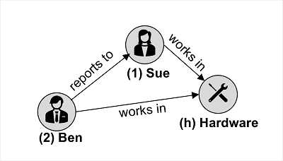

The example in the image shows two kinds of vertex (employee and department) and edges that connect them (employee "Ben" reports to employee "Sue", and both employees work in the "Hardware" department).

Gremlin syntax includes functions to operate on vertices and edges, enabling you to insert, update, delete, and query data in the graph. For example, you could use the following code to add a new employee named Alice that reports to the employee with ID 1 (Sue)

```apache
g.addV('employee').property('id', '3').property('firstName', 'Alice')
g.V('3').addE('reports to').to(g.V('1'))
```

The following query returns all of the employee vertices, in order of ID.

```apache
g.V().hasLabel('employee').order().by('id')
```

## lab

* Create a resource: Azure Cosmos DB for NoSQL

  * values
  * Subscription: If you’re using a sandbox, select Concierge Subscription. Otherwise, select your Azure subscription.
  * Resource group: If you’re using a sandbox, select the existing resource group (which will have a name like learn-xxxx…). Otherwise, create a new resource group with a name of your choice.
  * Account Name: Enter a unique name
  * Location: Choose any recommended location
  * Capacity mode: Provisioned throughput
  * Apply Free-Tier Discount: Select Apply if available
  * Limit total account throughput: Unselected

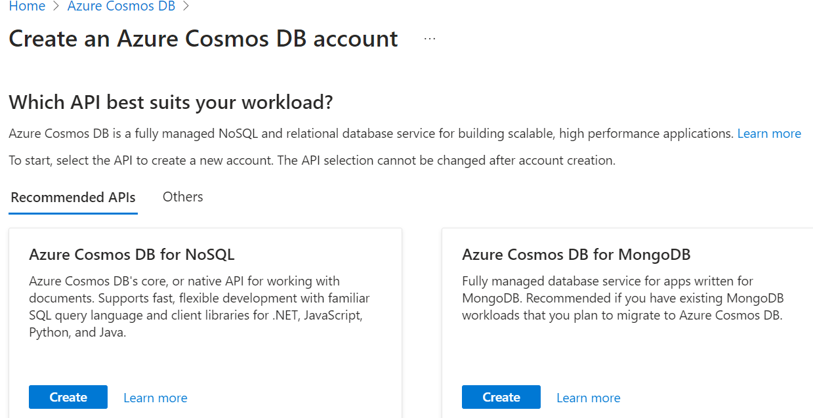

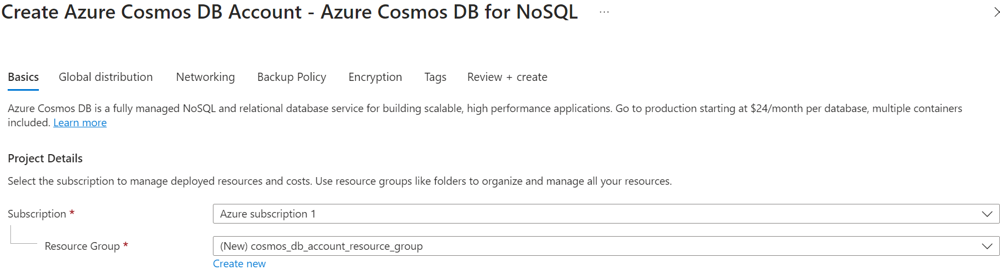

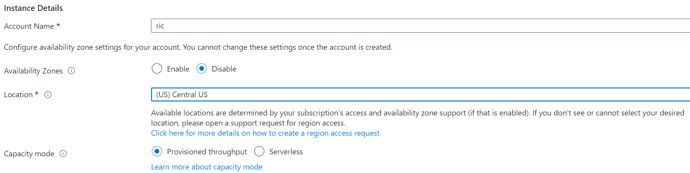

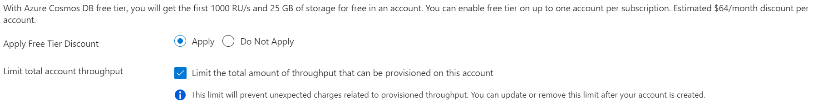

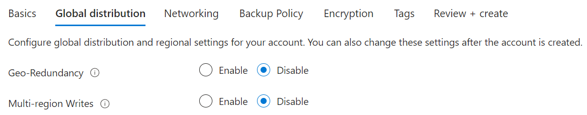

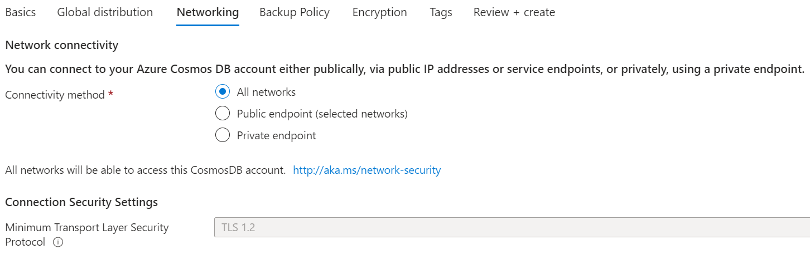

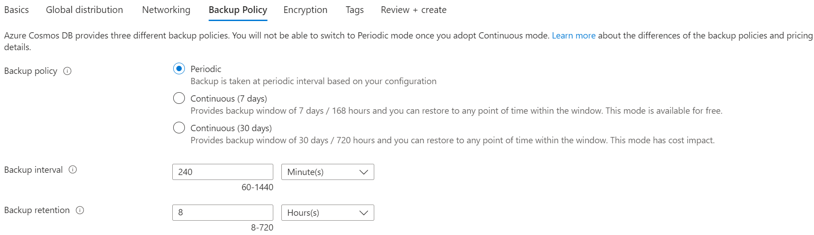

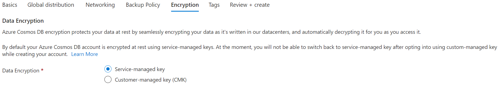

* Create a sample database

Data Explorer > Launch quick start. It creates a container called SampleContainer with a SampleDB

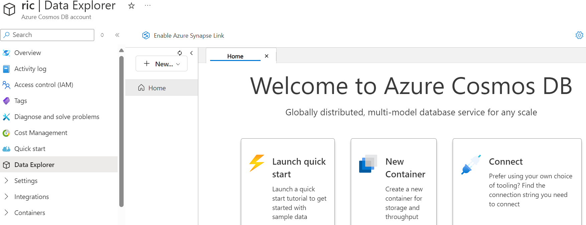

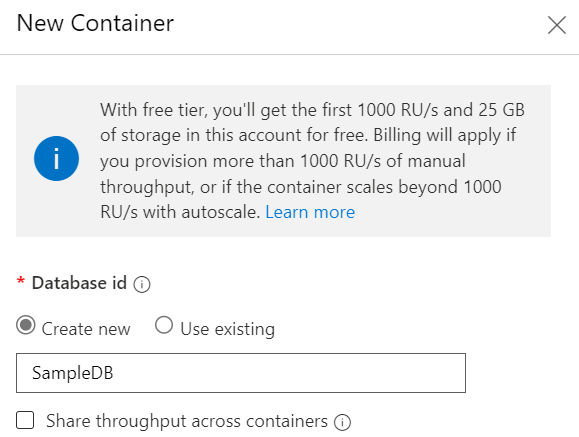

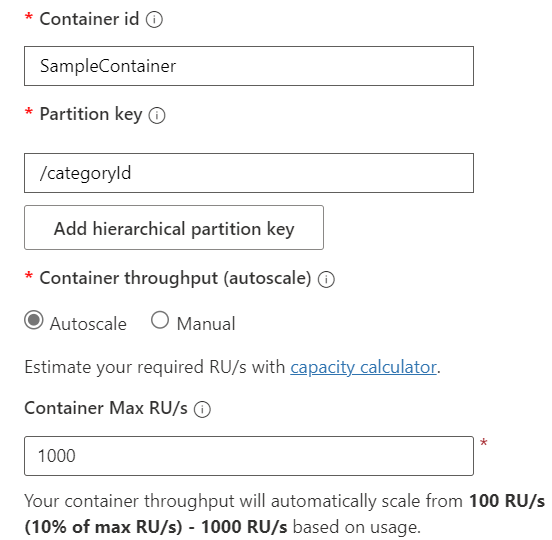

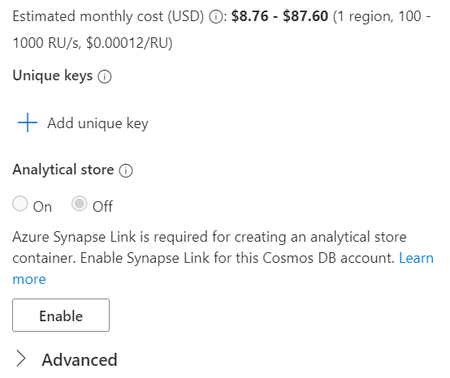

* View and create items

  * create a new blank item (New item)
  * modify the JSON for the new item (Save)

  ```json
  {
      "name": "Road Helmet,45",
      "id": "123456789",
      "categoryID": "123456789",
      "SKU": "AB-1234-56",
      "description": "The product called \"Road Helmet,45\" ",
      "price": 48.74
  }
  ```

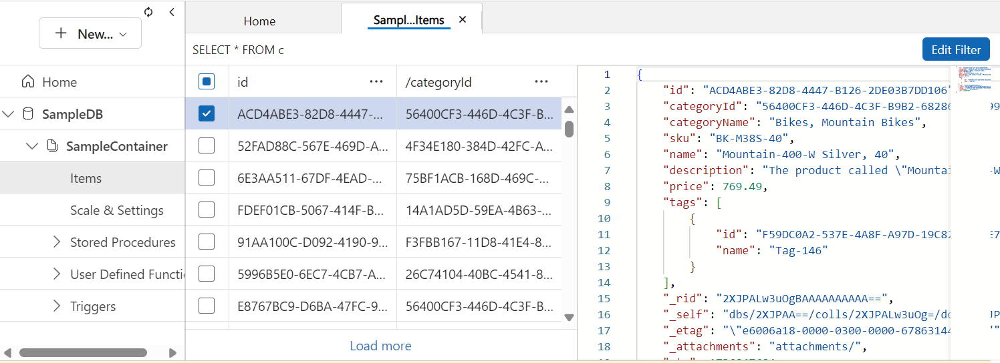

* Query the database

Data Explorer > New SQL Query

```sql
SELECT *
FROM c
WHERE CONTAINS(c.name,"Helmet")
```

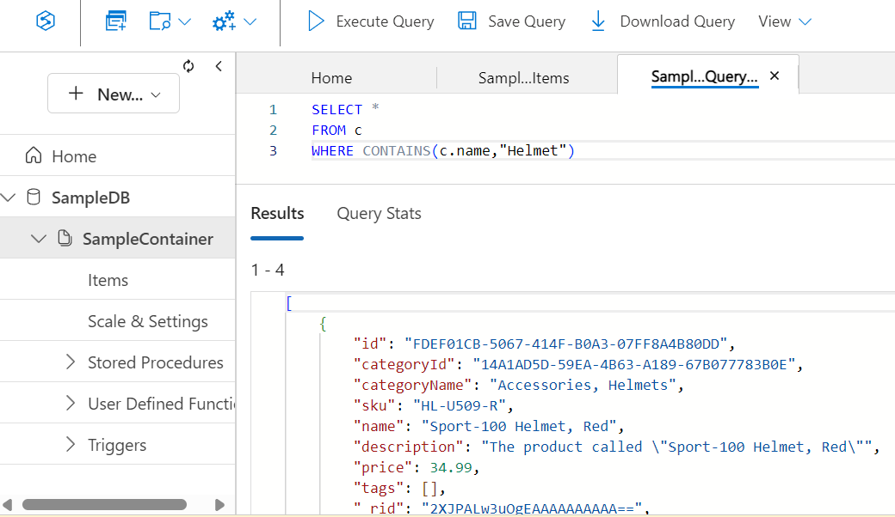
