#

[Explore Azure Database for PostgreSQL](https://microsoftlearning.github.io/DP-900T00A-Azure-Data-Fundamentals/Instructions/Labs/dp900-01a-postgresql-lab.html)

Create a resource: Azure Database for PostgreSQL

* select Flexible server (Recommended)

* values
  * Subscription: Select your Azure subscription.
  * Resource group: Create a new resource group with a name of your choice.
  * Server name: Enter a unique name.
  * Region: Select a region near you.
  * PostgreSQL version: Leave unchanged.
  * Workload type: Select Development.
  * Compute + storage: Leave unchanged.
  * Availability zone: Leave unchanged.
  * Enable high availability: Leave unchanged.
  * Admin username: Your name.
  * Password and Confirm password: A suitably complex password.

* Under Firewall rules, select ＋ Add current client IP address.

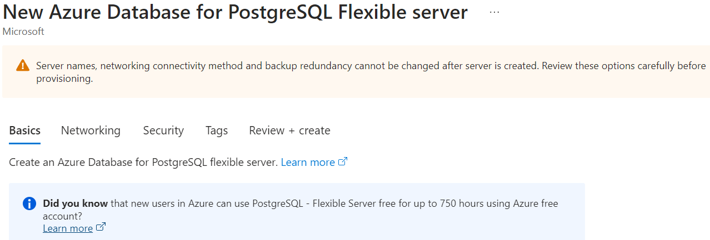

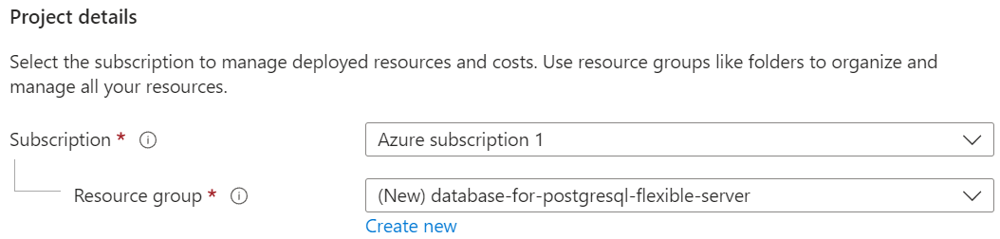

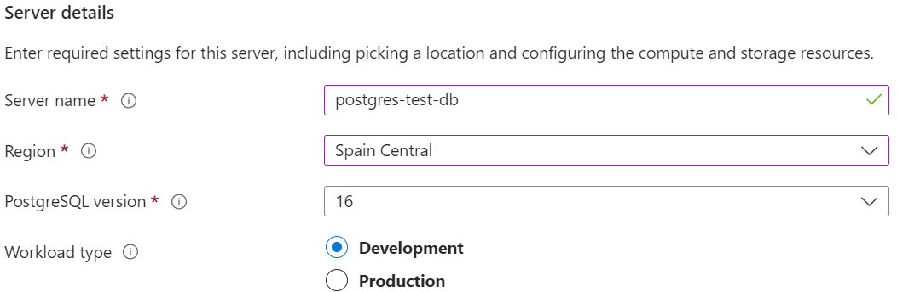

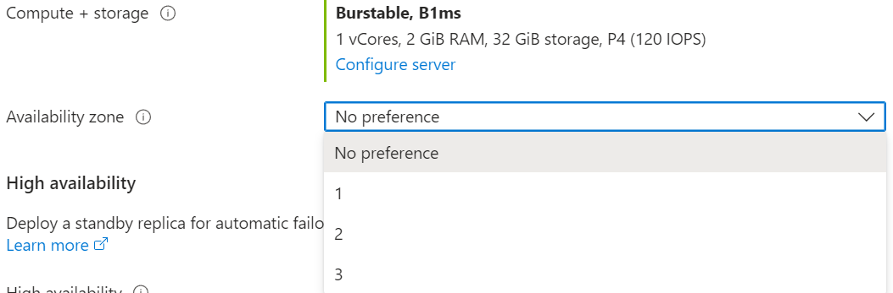

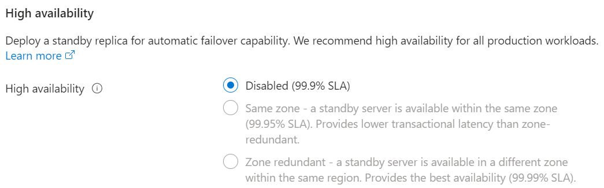

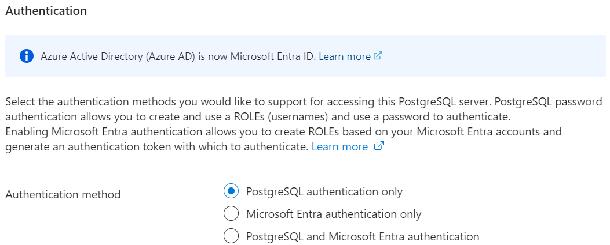

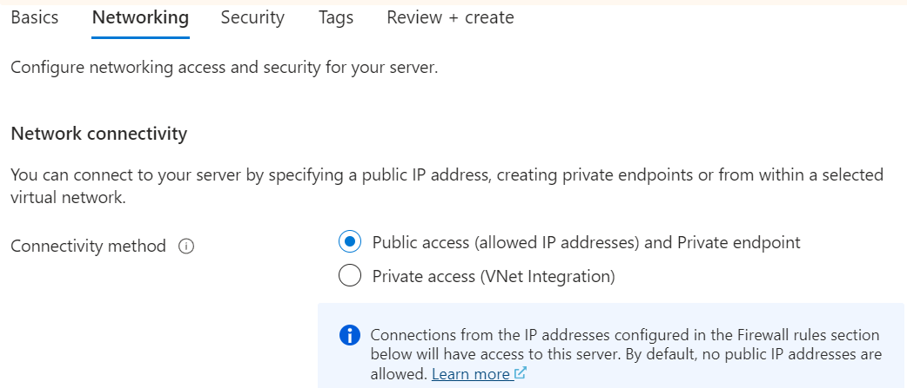

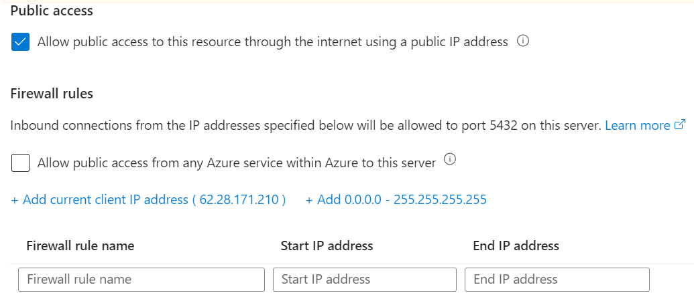

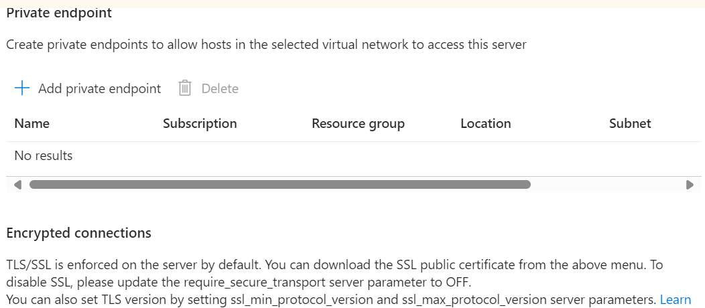

* connect to it

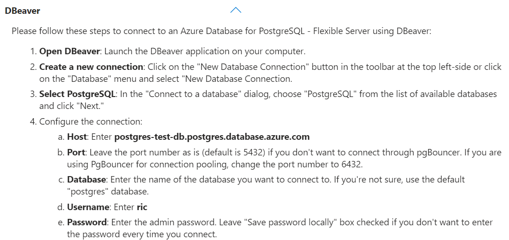

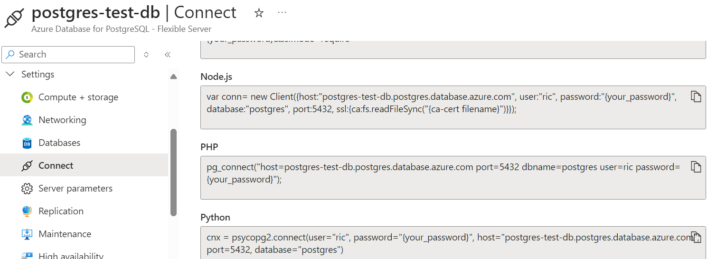

```python
import psycopg2

cnx = psycopg2.connect(user="ric", password="{your_password}", host="postgres-test-db.postgres.database.azure.com", port=5432, database="postgres")
```

* create a database

  <https://github.com/Azure-Samples/postgresql-samples-databases>
