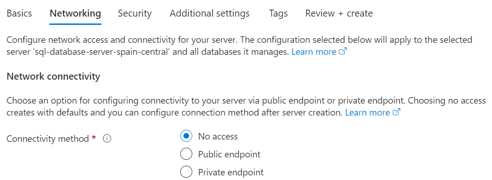
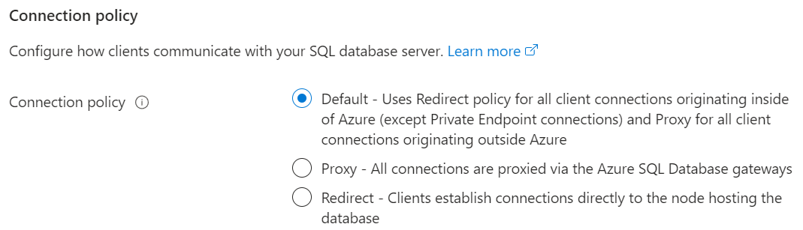
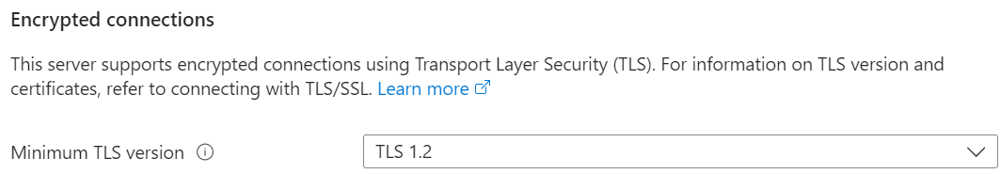
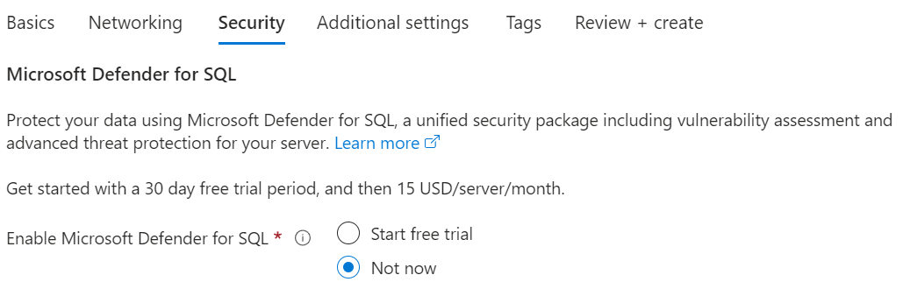
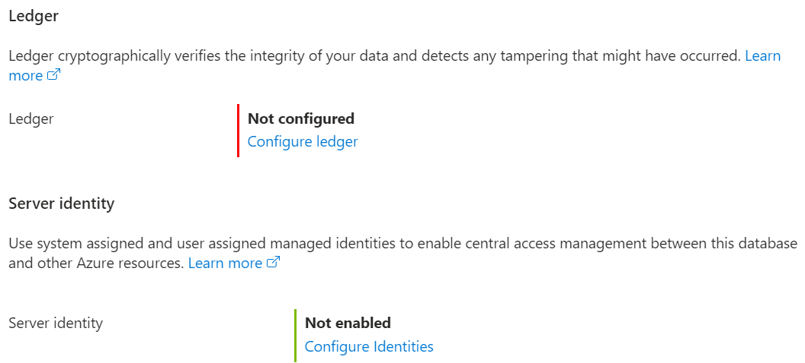
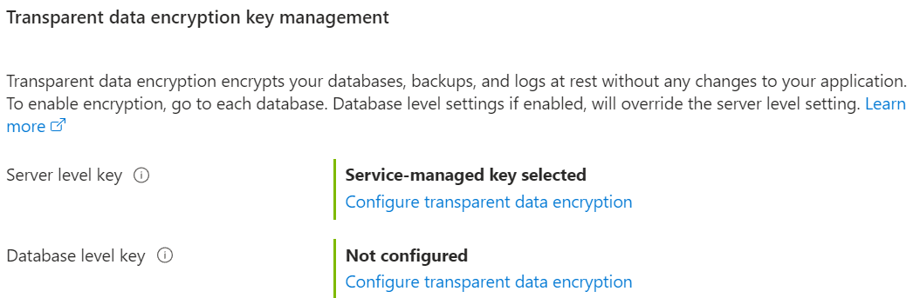
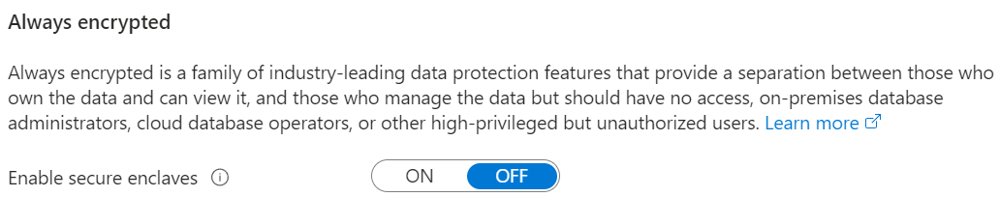
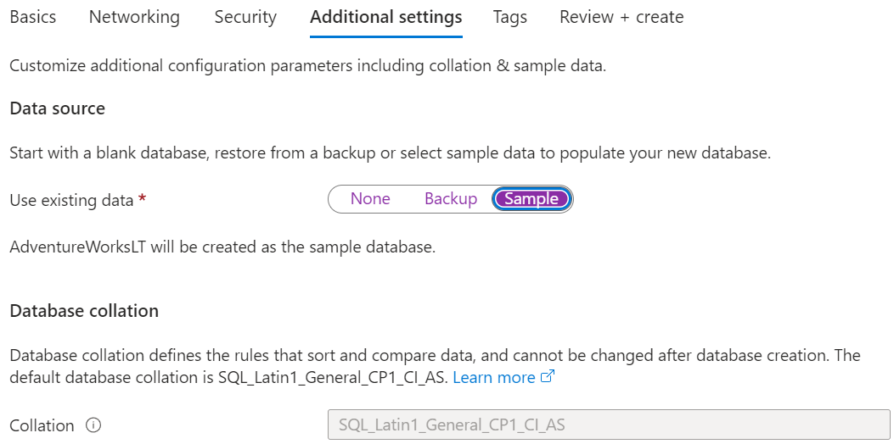

#

[Explore Azure SQL Database](https://microsoftlearning.github.io/DP-900T00A-Azure-Data-Fundamentals/Instructions/Labs/dp900-01-sql-lab.html)

Provision an Azure SQL Database resource

* Create a resource: Azure SQL

  resource type: Single database (the other options are: Elastic pool and Database server)

  Enter the following values on the Create SQL Database page, and leave all other properties with their default setting:

  * Subscription: Select your Azure subscription.
  * Resource group: Create a new resource group with a name of your choice.
  * Database name: AdventureWorks
  * Server: Select Create new and create a new server with a unique name in any available location. Use SQL authentication and specify your name as the server admin login and a suitably complex password (remember the password - you’ll need it later!)

    eg.

    server details

    sql-database-server-spain-central
    in (Europe) Spain Central

    authentication method
    * Use Microsoft Entra-only authentication
    * Use both SQL and Microsoft Entra authentication
    * Use SQL authentication (create a server admin login and password)

    Azure Active Directory (Azure AD) is now Microsoft Entra ID

    for sql authentication
    * Server admin login: ric
    * password: redacted

  * Want to use SQL elastic pool?: No
  * Workload environment: Development (other option: Production)
  * Compute + storage: Leave unchanged

    eg. General Purpose - Serverless: Standard-series (Gen5), 1 vCore, 32 GB storage, zone redundant disabled. I can configure database if i need to.

  * Backup storage redundancy: Locally-redundant backup storage (other option: Zone-redundant backup storage)

  Next :Networking >, and on the Networking page, in the Network connectivity section, select Public endpoint. Then select Yes for both options in the Firewall rules section to allow access to your database server from Azure services and your current client IP address.

  Next: Security > and set the Enable Microsoft Defender for SQL option to Not now.

  Next: Additional Settings > and on the Additional settings tab, set the Use existing data option to Sample (this will create a sample database that you can explore later).
  
  

  

  

  

  

  

  

  

  

* Wait for deployment to complete. Then go to the resource that was deployed

select Query editor (preview), and then sign in using the administrator login and password you specified for your server.

```sql
 SELECT p.ProductID, p.Name AS ProductName,
         c.Name AS Category, p.ListPrice
 FROM SalesLT.Product AS p
 JOIN [SalesLT].[ProductCategory] AS c
     ON p.ProductCategoryID = c.ProductCategoryID;
```
