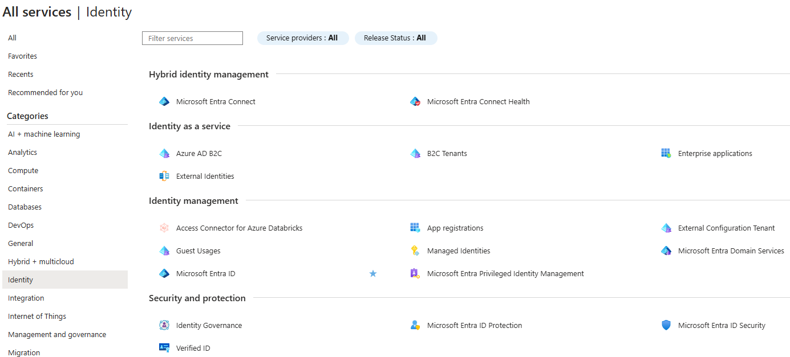
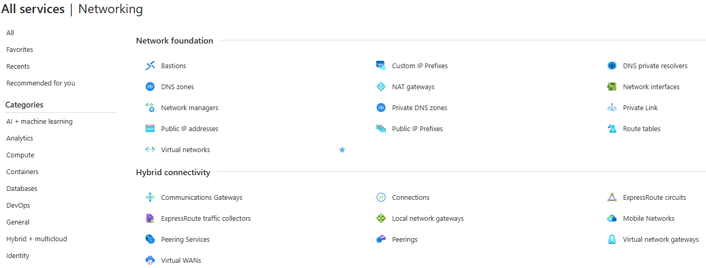
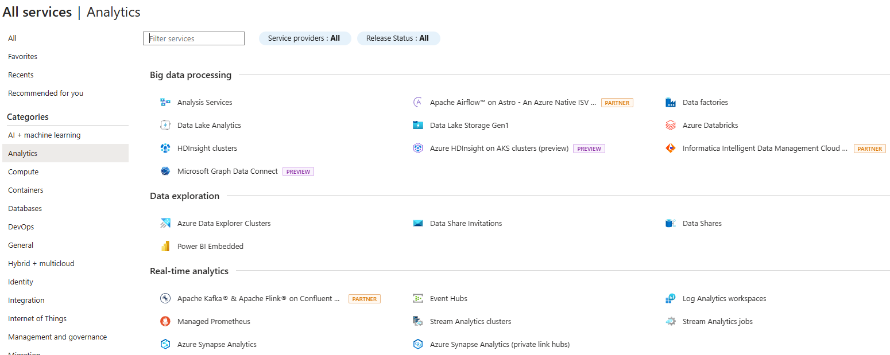

#

## data operations

* Data integration
  
  Data Integration involves establishing links between operational and analytical services and data sources to enable secure, reliable access to data across multiple systems. For example, a business process might rely on data that is spread across multiple systems, and a data engineer is required to establish links so that the required data can be extracted from all of these systems.

* Data transformation

  Operational data usually needs to be transformed into suitable structure and format for analysis, often as part of an extract, transform, and load (ETL) process; though increasingly a variation in which you extract, load, and transform (ELT) the data is used to quickly ingest the data into a data lake and then apply "big data" processing techniques to transform it. Regardless of the approach used, the data is prepared to support downstream analytical needs.

* Data consolidation

  Data consolidation is the process of combining data that has been extracted from multiple data sources into a consistent structure - usually to support analytics and reporting. Commonly, data from operational systems is extracted, transformed, and loaded into analytical stores such as a data lake or data warehouse.

## batch vs streaming data

* Operational and analytical data

  Operational data is usually transactional data that is generated and stored by applications, often in a relational or non-relational database. Analytical data is data that has been optimized for analysis and reporting, often in a data warehouse. One of the core responsibilities of a data engineer is to design, implement, and manage solutions that integrate operational and analytical data sources or extract operational data from multiple systems, transform it into appropriate structures for analytics, and load it into an analytical data store (usually referred to as ETL solutions).

* Streaming data

  Streaming data refers to perpetual sources of data that generate data values in real-time, often relating to specific events. Common sources of streaming data include internet-of-things (IoT) devices and social media feeds. Data engineers often need to implement solutions that capture real-time stream of data and ingest them into analytical data systems, often combining the real-time data with other application data that is processed in batches.

## Azures services for data engineering

Microsoft Azure includes many services that can be used to implement and manage data engineering workloads.

* Azure Synapse Analytics
* Azure Data Lake Storage Gen2
* Azure Stream Analytics
* Azure Data Factory
* Azure Databricks

## services - general: resources, billing

* Azure Resource

  

* Azure Resource Groups

* Azure Resource Manager

all the json files that represent the resources are available at [resources.azure.com](https://resources.azure.com/)

links

* <https://www.youtube.com/watch?v=gIhf-S7BCdo>

## services - identity

services related to identity and access management

* authentication, authorization

  

* Microsoft Entra Id (previously called Azure Active Directory)

  To login, you must use the "full username"

  

* Users

* Groups

* Access Control (IAM)

links

* <https://www.youtube.com/watch?v=b_WIjY-burU>
* <https://learn.microsoft.com/en-us/shows/on-demand-instructor-led-training-series/az-900-module-5>

* Role-based Acess Control (RBAC)

  

  

links

* <https://www.youtube.com/watch?v=4v7ffXxOnwU>

## services - security

* Azure Security

  

there's some overlap with the previous category

links

* <https://www.youtube.com/watch?v=tyztKP9rszU&>

## storing sensitive information

* encryption keys, secrets and certificates

* Azure Key Vault

  

  

links

* <https://www.youtube.com/watch?v=AA3yYg9Zq9w>

## services - compute + container

* Virtual machines
* Virtual machine scale sets
* App Services
* Functions

* Container Instances (ACI)
* Kubernetes Service (AKS)

links

* <https://www.youtube.com/watch?v=inaXkN2UrFE>

## services - networking

* Virtual Network
* Load Balancer
* VPN Gateway
* Application Gateway
* Content Delivery Network

links

* <https://www.youtube.com/watch?v=5NMcM4zJPM4>

## services - storage

* Disks
* Storage accounts
  * Azure Blob Storage or Azure Data Lake Storage Gen 2. This one has the data storage options: Containers (these are like folders), File shares (specific for sharing files), Queues, Tables
  * Azure Files
  * Other (tables and queues)

links

* <https://www.youtube.com/watch?v=_Qlkvd4ZQuo>

## services - databases

* Cosmos DB
* SQL Database
* Database for MySQL
* Database for PostgreSQL
* SQL Managed Instance

links

* <https://www.youtube.com/watch?v=RqD4nMyBazU>

## services - analytics

big data processing

* Analysis Services
* HDInsight clusters
* Data factories
* Azure Databricks

real-time analytics

* Azure Synapse Analytics
* Event Hubs

links

* <https://www.youtube.com/watch?v=JUQXx0R0RfE>
* <https://learn.microsoft.com/training/paths/implement-data-analytics-azure-synapse-analytics/>
* <https://learn.microsoft.com/en-us/training/modules/intro-to-azure-data-factory/>
* <https://learn.microsoft.com/training/paths/data-engineer-azure-databricks/>
* <https://learn.microsoft.com/en-us/training/paths/implement-data-streaming-with-asa/>

## services - Ai + ML

* Azure Machine Learning
* Azure AI Foundry

links

* <https://www.youtube.com/watch?v=8aMzR8iaB9s>
* [Kevin Feasel - Azure ML](https://www.youtube.com/watch?v=YLccHH7bS7g&list=PLeWL8zChJ2uuGs-8nvxMdo26XkYGWt7ui&index=1)

## services - Web and Mobile

## services - integration

## services - IoT

