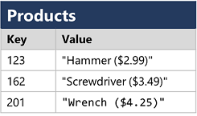
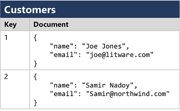
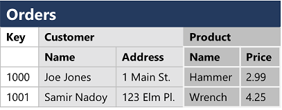
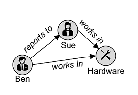
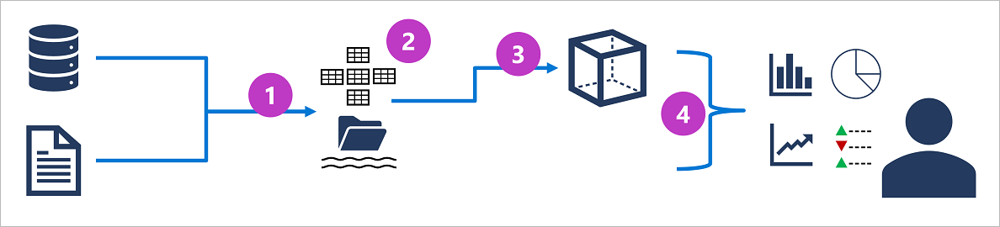

#

* learning path 1: Explore core data concepts
  * module 1: Explore core data concepts
    * Identify data formats
    * Explore file storage
    * Explore databases
    * Explore transactional data processing
    * Explore analytical data processing
  * module 2: Explore data roles and services
    * Explore job roles in the world of data
    * Identify data services

## data formats

### Structured data

Structured data is data that adheres to a fixed schema, so all of the data has the same fields or properties. Most commonly, the schema for structured data entities is tabular - in other words, the data is represented in one or more tables that consist of rows to represent each instance of a data entity, and columns to represent attributes of the entity.
Structured data is often stored in a database in which multiple tables can reference one another by using key values in a relational model;

### Semi-structured data

Semi-structured data is information that has some structure, but which allows for some variation between entity instances. For example, while most customers may have an email address, some might have multiple email addresses, and some might have none at all.

One common format for semi-structured data is JavaScript Object Notation (JSON). The example below shows a pair of JSON documents that represent customer information. Each customer document includes address and contact information, but the specific fields vary between customers. JSON is just one of many ways in which semi-structured data can be represented.

```json
// Customer 1
{
  "firstName": "Joe",
  "lastName": "Jones",
  "address":
  {
    "streetAddress": "1 Main St.",
    "city": "New York",
    "state": "NY",
    "postalCode": "10099"
  },
  "contact":
  [
    {
      "type": "home",
      "number": "555 123-1234"
    },
    {
      "type": "email",
      "address": "joe@litware.com"
    }
  ]
}

// Customer 2
{
  "firstName": "Samir",
  "lastName": "Nadoy",
  "address":
  {
    "streetAddress": "123 Elm Pl.",
    "unit": "500",
    "city": "Seattle",
    "state": "WA",
    "postalCode": "98999"
  },
  "contact":
  [
    {
      "type": "email",
      "address": "samir@northwind.com"
    }
  ]
}
```

### Unstructured data

Not all data is structured or even semi-structured. For example, documents, images, audio and video data, and binary files might not have a specific structure. This kind of data is referred to as unstructured data.

## data stores

Organizations typically store data in structured, semi-structured, or unstructured format to record details of entities (for example, customers and products), specific events (such as sales transactions), or other information in documents, images, and other formats. The stored data can then be retrieved for analysis and reporting later.

There are two broad categories of data store in common use:

* File stores
* Databases

A database is used to define a central system in which data can be stored and queried. In a simplistic sense, the file system on which files are stored is a kind of database; but when we use the term in a professional data context, we usually mean a dedicated system for managing data records rather than files.

### file stores

The ability to store data in files is a core element of any computing system. Files can be stored in local file systems on the hard disk of your personal computer, and on removable media such as USB drives; but in most organizations, important data files are stored centrally in some kind of shared file storage system. Increasingly, that central storage location is hosted in the cloud, enabling cost-effective, secure, and reliable storage for large volumes of data.

The specific file format used to store data depends on a number of factors, including:

* The type of data being stored (structured, semi-structured, or unstructured).
* The applications and services that will need to read, write, and process the data.
* The need for the data files to be readable by humans, or optimized for efficient storage and processing.

### file formats - Delimited text files

Data is often stored in plain text format with specific field delimiters and row terminators. The most common format for delimited data is comma-separated values (CSV) in which fields are separated by commas, and rows are terminated by a carriage return / new line. Optionally, the first line may include the field names. Other common formats include tab-separated values (TSV) and space-delimited (in which tabs or spaces are used to separate fields), and fixed-width data in which each field is allocated a fixed number of characters. Delimited text is a good choice for structured data that needs to be accessed by a wide range of applications and services in a human-readable format.

The following example shows customer data in comma-delimited format:

```csv
FirstName,LastName,Email
Joe,Jones,joe@litware.com
Samir,Nadoy,samir@northwind.com
```

### file formats - JavaScript Object Notation (JSON)

JSON is a ubiquitous format in which a hierarchical document schema is used to define data entities (objects) that have multiple attributes. Each attribute might be an object (or a collection of objects); making JSON a flexible format that's good for both structured and semi-structured data.

The following example shows a JSON document containing a collection of customers. Each customer has three attributes (firstName, lastName, and contact), and the contact attribute contains a collection of objects that represent one or more contact methods (email or phone). Note that objects are enclosed in braces ({..}) and collections are enclosed in square brackets ([..]). Attributes are represented by name : value pairs and separated by commas (,).

```json
{
  "customers":
  [
    {
      "firstName": "Joe",
      "lastName": "Jones",
      "contact":
      [
        {
          "type": "home",
          "number": "555 123-1234"
        },
        {
          "type": "email",
          "address": "joe@litware.com"
        }
      ]
    },
    {
      "firstName": "Samir",
      "lastName": "Nadoy",
      "contact":
      [
        {
          "type": "email",
          "address": "samir@northwind.com"
        }
      ]
    }
  ]
}
```

### file formats - Extensible Markup Language (XML)

XML is a human-readable data format that was popular in the 1990s and 2000s. It's largely been superseded by the less verbose JSON format, but there are still some systems that use XML to represent data. XML uses tags enclosed in angle-brackets (<../>) to define elements and attributes, as shown in this example:

```xml
<Customers>
  <Customer name="Joe" lastName="Jones">
    <ContactDetails>
      <Contact type="home" number="555 123-1234"/>
      <Contact type="email" address="joe@litware.com"/>
    </ContactDetails>
  </Customer>
  <Customer name="Samir" lastName="Nadoy">
    <ContactDetails>
      <Contact type="email" address="samir@northwind.com"/>
    </ContactDetails>
  </Customer>
</Customers>
```

### file formats - Binary Large Object (BLOB)

Ultimately, all files are stored as binary data (1's and 0's), but in the human-readable formats discussed above, the bytes of binary data are mapped to printable characters (typically through a character encoding scheme such as ASCII or Unicode). Some file formats however, particularly for unstructured data, store the data as raw binary that must be interpreted by applications and rendered. Common types of data stored as binary include images, video, audio, and application-specific documents.

When working with data like this, data professionals often refer to the data files as BLOBs (Binary Large Objects).

### file formats - optimized formats

While human-readable formats for structured and semi-structured data can be useful, they're typically not optimized for storage space or processing. Over time, some specialized file formats that enable compression, indexing, and efficient storage and processing have been developed.

Some common optimized file formats you might see include Avro, ORC, and Parquet:

* Avro is a row-based format. It was created by Apache. Each record contains a header that describes the structure of the data in the record. This header is stored as JSON. The data is stored as binary information. An application uses the information in the header to parse the binary data and extract the fields it contains. Avro is a good format for compressing data and minimizing storage and network bandwidth requirements.

* ORC (Optimized Row Columnar format) organizes data into columns rather than rows. It was developed by HortonWorks for optimizing read and write operations in Apache Hive (Hive is a data warehouse system that supports fast data summarization and querying over large datasets). An ORC file contains stripes of data. Each stripe holds the data for a column or set of columns. A stripe contains an index into the rows in the stripe, the data for each row, and a footer that holds statistical information (count, sum, max, min, and so on) for each column.

* Parquet is another columnar data format. It was created by Cloudera and X. A Parquet file contains row groups. Data for each column is stored together in the same row group. Each row group contains one or more chunks of data. A Parquet file includes metadata that describes the set of rows found in each chunk. An application can use this metadata to quickly locate the correct chunk for a given set of rows, and retrieve the data in the specified columns for these rows. Parquet specializes in storing and processing nested data types efficiently. It supports very efficient compression and encoding schemes.

### relational databases

Relational databases are commonly used to store and query structured data. The data is stored in tables that represent entities, such as customers, products, or sales orders. Each instance of an entity is assigned a primary key that uniquely identifies it; and these keys are used to reference the entity instance in other tables. For example, a customer's primary key can be referenced in a sales order record to indicate which customer placed the order. This use of keys to reference data entities enables a relational database to be normalized; which in part means the elimination of duplicate data values so that, for example, the details of an individual customer are stored only once; not for each sales order the customer places. The tables are managed and queried using Structured Query Language (SQL), which is based on an ANSI standard, so it's similar across multiple database systems.

### Non-relational databases

Non-relational databases are data management systems that don’t apply a relational schema to the data. Non-relational databases are often referred to as NoSQL database, even though some support a variant of the SQL language.

There are four common types of Non-relational database commonly in use.

* Key-value databases in which each record consists of a unique key and an associated value, which can be in any format.



* Document databases, which are a specific form of key-value database in which the value is a JSON document (which the system is optimized to parse and query)



* Column family databases, which store tabular data comprising rows and columns, but you can divide the columns into groups known as column-families. Each column family holds a set of columns that are logically related together.



* Graph databases, which store entities as nodes with links to define relationships between them.



## transactional data processing

A transactional data processing system is what most people consider the primary function of business computing. A transactional system records transactions that encapsulate specific events that the organization wants to track. A transaction could be financial, such as the movement of money between accounts in a banking system, or it might be part of a retail system, tracking payments for goods and services from customers. Think of a transaction as a small, discrete, unit of work.

Transactional systems are often high-volume, sometimes handling many millions of transactions in a single day. The data being processed has to be accessible very quickly. The work performed by transactional systems is often referred to as Online Transactional Processing (OLTP).

OLTP solutions rely on a database system in which data storage is optimized for both read and write operations in order to support transactional workloads in which data records are created, retrieved, updated, and deleted (often referred to as CRUD operations). These operations are applied transactionally, in a way that ensures the integrity of the data stored in the database. To accomplish this, OLTP systems enforce transactions that support so-called ACID semantics:

* Atomicity – each transaction is treated as a single unit, which succeeds completely or fails completely. For example, a transaction that involved debiting funds from one account and crediting the same amount to another account must complete both actions. If either action can't be completed, then the other action must fail.
* Consistency – transactions can only take the data in the database from one valid state to another. To continue the debit and credit example above, the completed state of the transaction must reflect the transfer of funds from one account to the other.
* Isolation – concurrent transactions cannot interfere with one another, and must result in a consistent database state. For example, while the transaction to transfer funds from one account to another is in-process, another transaction that checks the balance of these accounts must return consistent results - the balance-checking transaction can't retrieve a value for one account that reflects the balance before the transfer, and a value for the other account that reflects the balance after the transfer.
* Durability – when a transaction has been committed, it will remain committed. After the account transfer transaction has completed, the revised account balances are persisted so that even if the database system were to be switched off, the committed transaction would be reflected when it is switched on again.

OLTP systems are typically used to support live applications that process business data - often referred to as line of business (LOB) applications.

## analytical data processing

Analytical data processing typically uses read-only (or read-mostly) systems that store vast volumes of historical data or business metrics. Analytics can be based on a snapshot of the data at a given point in time, or a series of snapshots.

The specific details for an analytical processing system can vary between solutions, but a common architecture for enterprise-scale analytics looks like this:



* Operational data is extracted, transformed, and loaded (ETL) into a data lake for analysis.
* Data is loaded into a schema of tables - typically in a Spark-based data lakehouse with tabular abstractions over files in the data lake, or a data warehouse with a fully relational SQL engine.
* Data in the data warehouse may be aggregated and loaded into an online analytical processing (OLAP) model, or cube. Aggregated numeric values (measures) from fact tables are calculated for intersections of dimensions from dimension tables. For example, sales revenue might be totaled by date, customer, and product.
* The data in the data lake, data warehouse, and analytical model can be queried to produce reports, visualizations, and dashboards.

Data lakes are common in large-scale data analytical processing scenarios, where a large volume of file-based data must be collected and analyzed.

Data warehouses are an established way to store data in a relational schema that is optimized for read operations – primarily queries to support reporting and data visualization. Data Lakehouses are a more recent innovation that combine the flexible and scalable storage of a data lake with the relational querying semantics of a data warehouse. The table schema may require some denormalization of data in an OLTP data source (introducing some duplication to make queries perform faster).

An OLAP model is an aggregated type of data storage that is optimized for analytical workloads. Data aggregations are across dimensions at different levels, enabling you to drill up/down to view aggregations at multiple hierarchical levels; for example to find total sales by region, by city, or for an individual address. Because OLAP data is pre-aggregated, queries to return the summaries it contains can be run quickly.

Different types of user might perform data analytical work at different stages of the overall architecture. For example:

* Data scientists might work directly with data files in a data lake to explore and model data.
* Data Analysts might query tables directly in the data warehouse to produce complex reports and visualizations.
* Business users might consume pre-aggregated data in an analytical model in the form of reports or dashboards.

## job roles

There's a wide variety of roles involved in managing, controlling, and using data. Some roles are business-oriented, some involve more engineering, some focus on research, and some are hybrid roles that combine different aspects of data management. Your organization may define roles differently, or give them different names, but the roles described in this unit encapsulate the most common division of tasks and responsibilities.

The three key job roles that deal with data in most organizations are:

* Database administrators manage databases, assigning permissions to users, storing backup copies of data, and restoring data in the event of a failure.

  A database administrator is responsible for the design, implementation, maintenance, and operational aspects of on-premises and cloud-based database systems. They're responsible for the overall availability and consistent performance and optimizations of databases. They work with stakeholders to implement policies, tools, and processes for backup and recovery plans to recover following a natural disaster or human-made error.

  The database administrator is also responsible for managing the security of the data in the database, granting privileges over the data, granting or denying access to users as appropriate.

* Data engineers manage infrastructure and processes for data integration across the organization, applying data cleaning routines, identifying data governance rules, and implementing pipelines to transfer and transform data between systems.

  A data engineer collaborates with stakeholders to design and implement data-related workloads, including data ingestion pipelines, cleansing and transformation activities, and data stores for analytical workloads. They use a wide range of data platform technologies, including relational and non-relational databases, file stores, and data streams.

  They're also responsible for ensuring that the privacy of data is maintained within the cloud and spanning from on-premises to the cloud data stores. They own the management and monitoring of data pipelines to ensure that data loads perform as expected.

* Data analysts explore and analyze data to create visualizations and charts that enable organizations to make informed decisions.

  A data analyst enables businesses to maximize the value of their data assets. They're responsible for exploring data to identify trends and relationships, designing and building analytical models, and enabling advanced analytics capabilities through reports and visualizations.

  A data analyst processes raw data into relevant insights based on identified business requirements to deliver relevant insights.

The job roles define differentiated tasks and responsibilities. In some organizations, the same person might perform multiple roles; so in their role as database administrator they might provision a transactional database, and then in their role as a data engineer they might create a pipeline to transfer data from the database to a data warehouse for analysis.

The roles described here represent the key data-related roles found in most medium to large organizations. There are additional data-related roles not mentioned here, such as data scientist and data architect; and there are other technical professionals that work with data, including application developers and software engineers.

## data services

### Azure SQL

Azure SQL is the collective name for a family of relational database solutions based on the Microsoft SQL Server database engine. Specific Azure SQL services include:

* Azure SQL Database – a fully managed platform-as-a-service (PaaS) database hosted in Azure.
* Azure SQL Managed Instance – a hosted instance of SQL Server with automated maintenance, which allows more flexible configuration than  Azure SQL DB but with more administrative responsibility for the owner.
* Azure SQL VM – a virtual machine with an installation of SQL Server, allowing maximum configurability with full management responsibility.
Database administrators typically provision and manage Azure SQL database systems to support line of business (LOB) applications that need to store transactional data.

Data engineers may use Azure SQL database systems as sources for data pipelines that perform extract, transform, and load (ETL) operations to ingest the transactional data into an analytical system.

Data analysts may query Azure SQL databases directly to create reports, though in large organizations the data is generally combined with data from other sources in an analytical data store to support enterprise analytics.

### Open-source databases in Azure

Azure includes managed services for popular open-source relational database systems, including:

* Azure Database for MySQL - a simple-to-use open-source database management system that is commonly used in Linux, Apache, MySQL, and PHP (LAMP) stack apps.

* Azure Database for MariaDB - a newer database management system, created by the original developers of MySQL. The database engine has since been rewritten and optimized to improve performance. MariaDB offers compatibility with Oracle Database (another popular commercial database management system).

* Azure Database for PostgreSQL - a hybrid relational-object database. You can store data in relational tables, but a PostgreSQL database also enables you to store custom data types, with their own non-relational properties.

As with Azure SQL database systems, open-source relational databases are managed by database administrators to support transactional applications, and provide a data source for data engineers building pipelines for analytical solutions and data analysts creating reports.

### Azure Cosmos DB

Azure Cosmos DB is a global-scale non-relational (NoSQL) database system that supports multiple application programming interfaces (APIs), enabling you to store and manage data as JSON documents, key-value pairs, column-families, and graphs.

In some organizations, Cosmos DB instances may be provisioned and managed by a database administrator; though often software developers manage NoSQL data storage as part of the overall application architecture. Data engineers often need to integrate Cosmos DB data sources into enterprise analytical solutions that support modeling and reporting by data analysts.

### Azure Storage

Azure Storage is a core Azure service that enables you to store data in:

* Blob containers - scalable, cost-effective storage for binary files.
* File shares - network file shares such as you typically find in corporate networks.
* Tables - key-value storage for applications that need to read and write data values quickly.

Data engineers use Azure Storage to host data lakes - blob storage with a hierarchical namespace that enables files to be organized in folders in a distributed file system.

### Azure Data Factory

Azure Data Factory is an Azure service that enables you to define and schedule data pipelines to transfer and transform data. You can integrate your pipelines with other Azure services, enabling you to ingest data from cloud data stores, process the data using cloud-based compute, and persist the results in another data store.

Azure Data Factory is used by data engineers to build extract, transform, and load (ETL) solutions that populate analytical data stores with data from transactional systems across the organization.

### Microsoft Fabric

Microsoft Fabric is a unified Software-as-a-Service (SaaS) analytics platform based on an open and governed lakehouse that includes functionality to support:

* Data ingestion and ETL
* Data lakehouse analytics
* Data warehouse analytics
* Data Science and machine learning
* Realtime analytics
* Data visualization
* Data governance and management
* AI-powered insights

Data engineers can use Microsoft Fabric to create a unified data analytics solution that combines data ingestion pipelines, data warehouses, real-time analytics, business intelligence, and AI-powered insights through a single service all centrally stored with Microsoft OneLake.

### Azure Databricks

Azure Databricks is an Azure-integrated version of the popular Databricks platform, which combines the Apache Spark data processing platform with SQL database semantics and an integrated management interface to enable large-scale data analytics.

Data engineers can use existing Databricks and Spark skills to create analytical data stores in Azure Databricks.

Data Analysts can use the native notebook support in Azure Databricks to query and visualize data in an easy to use web-based interface.

### Azure Stream Analytics

Azure Stream Analytics is a real-time stream processing engine that captures a stream of data from an input, applies a query to extract and manipulate data from the input stream, and writes the results to an output for analysis or further processing.

Data engineers can incorporate Azure Stream Analytics into data analytics architectures that capture streaming data for ingestion into an analytical data store or for real-time visualization.

### Azure Data Explorer

Azure Data Explorer is a fully managed, standalone, big data analytics platform that offers high-performance querying of log and telemetry data.

Data analysts can use Azure Data Explorer to query and analyze data that includes a timestamp attribute, such as is typically found in log files and Internet-of-things (IoT) telemetry data.

### Microsoft Purview

Microsoft Purview provides a solution for enterprise-wide data governance and discoverability. You can use Microsoft Purview to create a map of your data and track data lineage across multiple data sources and systems, enabling you to find trustworthy data for analysis and reporting.

Data engineers can use Microsoft Purview to enforce data governance across the enterprise and ensure the integrity of data used to support analytical workloads.
