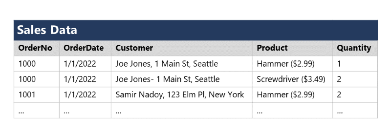
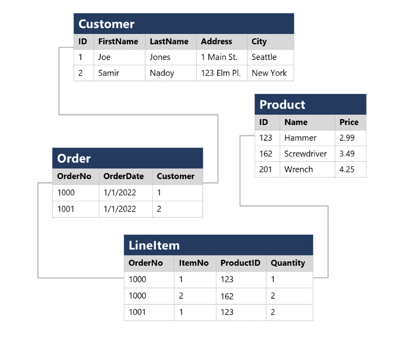
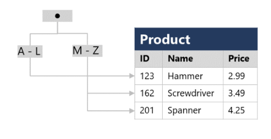

#

* learning path 2: Explore relational data in Azure
  * Explore fundamental relational data concepts
    * Understand relational data
    * Understand normalization
    * Explore SQL
    * Describe database objects
  * Explore relational database services in Azure
    * Describe Azure SQL services and capabilities
    * Describe Azure services for open-source databases
    * labs
      * [Explore Azure SQL Database](https://microsoftlearning.github.io/DP-900T00A-Azure-Data-Fundamentals/Instructions/Labs/dp900-01-sql-lab.html)
      * [Explore Azure Database for PostgreSQL](https://microsoftlearning.github.io/DP-900T00A-Azure-Data-Fundamentals/Instructions/Labs/dp900-01a-postgresql-lab.html)
      * [Explore Azure Database for MySQL](https://microsoftlearning.github.io/DP-900T00A-Azure-Data-Fundamentals/Instructions/Labs/dp900-01b-mysql-lab.html)

In a relational database, you model collections of entities from the real world as tables. An entity can be anything for which you want to record information; typically important objects and events. For example, in a retail system example, you might create tables for customers, products, orders, and line items within an order. A table contains rows, and each row represents a single instance of an entity. In the retail scenario, each row in the customer table contains the data for a single customer, each row in the product table defines a single product, each row in the order table represents an order made by a customer, and each row in the line item table represents a product that was included in an order.

Relational tables are a format for structured data, and each row in a table has the same columns; though in some cases, not all columns need to have a value – for example, a customer table might include a MiddleName column; which can be empty (or NULL) for rows that represent customers with no middle name or whose middle name is unknown.

Each column stores data of a specific datatype. For example, an Email column in a Customer table would likely be defined to store character-based (text) data (which might be fixed or variable in length), a Price column in a Product table might be defined to store decimal numeric data, while a Quantity column in an Order table might be constrained to integer numeric values; and an OrderDate column in the same Order table would be defined to store date/time values. The available datatypes that you can use when defining a table depend on the database system you are using; though there are standard datatypes defined by the American National Standards Institute (ANSI) that are supported by most database systems.

## normalization

Normalization is a term used by database professionals for a schema design process that minimizes data duplication and enforces data integrity.

While there are many complex rules that define the process of refactoring data into various levels (or forms) of normalization, a simple definition for practical purposes is:

* Separate each entity into its own table.
* Separate each discrete attribute into its own column.
* Uniquely identify each entity instance (row) using a primary key.
* Use foreign key columns to link related entities.

To understand the core principles of normalization, suppose the following table represents a spreadsheet that a company uses to track its sales.



Notice that the customer and product details are duplicated for each individual item sold; and that the customer name and postal address, and the product name and price are combined in the same spreadsheet cells.

Now let's look at how normalization changes the way the data is stored.



Each entity that is represented in the data (customer, product, sales order, and line item) is stored in its own table, and each discrete attribute of those entities is in its own column.

Recording each instance of an entity as a row in an entity-specific table removes duplication of data. For example, to change a customer's address, you need only modify the value in a single row.

The decomposition of attributes into individual columns ensures that each value is constrained to an appropriate data type - for example, product prices must be decimal values, while line item quantities must be integer numbers. Additionally, the creation of individual columns provides a useful level of granularity in the data for querying - for example, you can easily filter customers to those who live in a specific city.

Instances of each entity are uniquely identified by an ID or other key value, known as a primary key; and when one entity references another (for example, an order has an associated customer), the primary key of the related entity is stored as a foreign key. You can look up the address of the customer (which is stored only once) for each record in the Order table by referencing the corresponding record in the Customer table. Typically, a relational database management system (RDBMS) can enforce referential integrity to ensure that a value entered into a foreign key field has an existing corresponding primary key in the related table – for example, preventing orders for non-existent customers.

In some cases, a key (primary or foreign) can be defined as a composite key based on a unique combination of multiple columns. For example, the LineItem table in the example above uses a unique combination of OrderNo and ItemNo to identify a line item from an individual order.

## SQL

SQL stands for Structured Query Language, and is used to communicate with a relational database. It's the standard language for relational database management systems. SQL statements are used to perform tasks such as update data in a database, or retrieve data from a database. Some common relational database management systems that use SQL include Microsoft SQL Server, MySQL, PostgreSQL, MariaDB, and Oracle.

SQL was originally standardized by the American National Standards Institute (ANSI) in 1986, and by the International Organization for Standardization (ISO) in 1987. Since then, the standard has been extended several times as relational database vendors have added new features to their systems. Additionally, most database vendors include their own proprietary extensions that are not part of the standard, which has resulted in a variety of dialects of SQL.

You can use SQL statements such as SELECT, INSERT, UPDATE, DELETE, CREATE, and DROP to accomplish almost everything that you need to do with a database. Although these SQL statements are part of the SQL standard, many database management systems also have their own additional proprietary extensions to handle the specifics of that database management system. These extensions provide functionality not covered by the SQL standard, and include areas such as security management and programmability. For example, Microsoft SQL Server, and Azure database services that are based on the SQL Server database engine, use Transact-SQL. This implementation includes proprietary extensions for writing stored procedures and triggers (application code that can be stored in the database), and managing user accounts. PostgreSQL and MySQL also have their own versions of these features.

Some popular dialects of SQL include:

* Transact-SQL (T-SQL). This version of SQL is used by Microsoft SQL Server and Azure SQL services.

* pgSQL. This is the dialect, with extensions implemented in PostgreSQL.

* PL/SQL. This is the dialect used by Oracle. PL/SQL stands for Procedural Language/SQL.

Users who plan to work specifically with a single database system should learn the intricacies of their preferred SQL dialect and platform.

The SQL code examples in this module are based on the Transact-SQL dialect, unless otherwise indicated. The syntax for other dialects is generally similar, but may vary in some details.

### SQL statement types

SQL statements are grouped into three main logical groups:

* Data Definition Language (DDL)
* Data Control Language (DCL)
* Data Manipulation Language (DML)

### DDL statements

You use DDL statements to create, modify, and remove tables and other objects in a database (table, stored procedures, views, and so on).

The most common DDL statements are:

* CREATE - Create a new object in the database, such as a table or a view.
* ALTER - Modify the structure of an object. For instance, altering a table to add a new column.
* DROP - Remove an object from the database.
* RENAME - Rename an existing object.

The following example creates a new database table. The items between the parentheses specify the details of each column, including the name, the data type, whether the column must always contain a value (NOT NULL), and whether the data in the column is used to uniquely identify a row (PRIMARY KEY). Each table should have a primary key, although SQL doesn't enforce this rule.

```sql
CREATE TABLE Product
(
    ID INT PRIMARY KEY,
    Name VARCHAR(20) NOT NULL,
    Price DECIMAL NULL
);
```

Columns marked as NOT NULL are referred to as mandatory columns. If you omit the NOT NULL clause, you can create rows that don't contain a value in the column. An empty column in a row is said to have a NULL value.

The datatypes available for columns in a table will vary between database management systems. However, most database management systems support numeric types such as INT (an integer, or whole number), DECIMAL (a decimal number), and string types such as VARCHAR (VARCHAR stands for variable length character data). For more information, see the documentation for your selected database management system.

### DCL statements

Database administrators generally use DCL statements to manage access to objects in a database by granting, denying, or revoking permissions to specific users or groups.

The three main DCL statements are:

* GRANT - Grant permission to perform specific actions
* DENY - Deny permission to perform specific actions
* REVOKE - Remove a previously granted permission

For example, the following GRANT statement permits a user named user1 to read, insert, and modify data in the Product table.

```sql
GRANT SELECT, INSERT, UPDATE
ON Product
TO user1;
```

### DML statements

You use DML statements to manipulate the rows in tables. These statements enable you to retrieve (query) data, insert new rows, or modify existing rows. You can also delete rows if you don't need them anymore.

The four main DML statements are:

* SELECT - Read rows from a table
* INSERT - Insert new rows into a table
* UPDATE - Modify data in existing rows
* DELETE - Delete existing rows

The basic form of an INSERT statement will insert one row at a time. By default, the SELECT, UPDATE, and DELETE statements are applied to every row in a table. You usually apply a WHERE clause with these statements to specify criteria; only rows that match these criteria will be selected, updated, or deleted.

The following code is an example of a SQL statement that selects all columns (indicated by *) from the Customer table where the City column value is "Seattle":

```sql
SELECT *
FROM Customer
WHERE City = 'Seattle';
```

To retrieve only a specific subset of columns from the table, you list them in the SELECT clause, like this:

```sql
SELECT FirstName, LastName, Address, City
FROM Customer
WHERE City = 'Seattle';
```

If a query returns many rows, they don't necessarily appear in any specific sequence. If you want to sort the data, you can add an ORDER BY clause. The data will be sorted by the specified column:

```sql
SELECT FirstName, LastName, Address, City
FROM Customer
WHERE City = 'Seattle'
ORDER BY LastName;
```

You can also run SELECT statements that retrieve data from multiple tables using a JOIN clause. Joins indicate how the rows in one table are connected with rows in the other to determine what data to return. A typical join condition matches a foreign key from one table and its associated primary key in the other table.

The following query shows an example that joins Customer and Order tables. The query makes use of table aliases to abbreviate the table names when specifying which columns to retrieve in the SELECT clause and which columns to match in the JOIN clause.

```sql
SELECT o.OrderNo, o.OrderDate, c.Address, c.City
FROM Order AS o
JOIN Customer AS c
ON o.Customer = c.ID
```

The next example shows how to modify an existing row using SQL. It changes the value of the Address column in the Customer table for rows that have the value 1 in the ID column. All other rows are left unchanged:

```sql
UPDATE Customer
SET Address = '123 High St.'
WHERE ID = 1;
```

If you omit the WHERE clause, an UPDATE statement will modify every row in the table.

Use the DELETE statement to remove rows. You specify the table to delete from, and a WHERE clause that identifies the rows to be deleted:

```sql
DELETE FROM Product
WHERE ID = 162;
```

The INSERT statement takes a slightly different form. You specify a table and columns in an INTO clause, and a list of values to be stored in these columns. Standard SQL only supports inserting one row at a time, as shown in the following example. Some dialects allow you to specify multiple VALUES clauses to add several rows at a time:

```sql
INSERT INTO Product(ID, Name, Price)
VALUES (99, 'Drill', 4.99);
```

In addition to tables, a relational database can contain other structures that help to optimize data organization, encapsulate programmatic actions, and improve the speed of access. In this unit, you learn about three of these structures in more detail: views, stored procedures, and indexes.

### views

A view is a virtual table based on the results of a SELECT query. You can think of a view as a window on specified rows in one or more underlying tables. For example, you could create a view on the Order and Customer tables that retrieves order and customer data to provide a single object that makes it easy to determine delivery addresses for orders:

```sql
CREATE VIEW Deliveries
AS
SELECT o.OrderNo, o.OrderDate,
       c.FirstName, c.LastName, c.Address, c.City
FROM Order AS o JOIN Customer AS c
ON o.Customer = c.ID;
```

You can query the view and filter the data in much the same way as a table. The following query finds details of orders for customers who live in Seattle:

```sql
SELECT OrderNo, OrderDate, LastName, Address
FROM Deliveries
WHERE City = 'Seattle';
```

### stored procedure

A stored procedure defines SQL statements that can be run on command. Stored procedures are used to encapsulate programmatic logic in a database for actions that applications need to perform when working with data.

You can define a stored procedure with parameters to create a flexible solution for common actions that might need to be applied to data based on a specific key or criteria. For example, the following stored procedure could be defined to change the name of a product based on the specified product ID.

```sql
CREATE PROCEDURE RenameProduct
    @ProductID INT,
    @NewName VARCHAR(20)
AS
UPDATE Product
SET Name = @NewName
WHERE ID = @ProductID;
```

When a product must be renamed, you can execute the stored procedure, passing the ID of the product and the new name to be assigned:

```sql
EXEC RenameProduct 201, 'Spanner';
```

### indexes

An index helps you search for data in a table. Think of an index over a table like an index at the back of a book. A book index contains a sorted set of references, with the pages on which each reference occurs. When you want to find a reference to an item in the book, you look it up through the index. You can use the page numbers in the index to go directly to the correct pages in the book. Without an index, you might have to read through the entire book to find the references you're looking for.

When you create an index in a database, you specify a column from the table, and the index contains a copy of this data in a sorted order, with pointers to the corresponding rows in the table. When the user runs a query that specifies this column in the WHERE clause, the database management system can use this index to fetch the data more quickly than if it had to scan through the entire table row by row.

For example, you could use the following code to create an index on the Name column of the Product table:

```sql
CREATE INDEX idx_ProductName
ON Product(Name);
```

The index creates a tree-based structure that the database system's query optimizer can use to quickly find rows in the Product table based on a specified Name.



For a table containing few rows, using the index is probably not any more efficient than simply reading the entire table and finding the rows requested by the query (in which case the query optimizer will ignore the index). However, when a table has many rows, indexes can dramatically improve the performance of queries.

You can create many indexes on a table. So, if you also wanted to find products based on price, creating another index on the Price column in the Product table might be useful. However, indexes aren't free. An index consumes storage space, and each time you insert, update, or delete data in a table, the indexes for that table must be maintained. This additional work can slow down insert, update, and delete operations. You must strike a balance between having indexes that speed up your queries versus the cost of performing other operations.

## Azure SQL

Azure SQL is a collective term for a family of Microsoft SQL Server based database services in Azure. Specific Azure SQL services include:

* SQL Server on Azure Virtual Machines (VMs) - A virtual machine running in Azure with an installation of SQL Server. The use of a VM makes this option an infrastructure-as-a-service (IaaS) solution that virtualizes hardware infrastructure for compute, storage, and networking in Azure; making it a great option for "lift and shift" migration of existing on-premises SQL Server installations to the cloud.
* Azure SQL Managed Instance - A platform-as-a-service (PaaS) option that provides near-100% compatibility with on-premises SQL Server instances while abstracting the underlying hardware and operating system. The service includes automated software update management, backups, and other maintenance tasks, reducing the administrative burden of supporting a database server instance.
* Azure SQL Database - A fully managed, highly scalable PaaS database service that is designed for the cloud. This service includes the core database-level capabilities of on-premises SQL Server, and is a good option when you need to create a new application in the cloud.
* Azure SQL Edge - A SQL engine that is optimized for Internet-of-things (IoT) scenarios that need to work with streaming time-series data.

### SQL Server on Azure Virtual Machines

SQL Server on Virtual Machines enables you to use full versions of SQL Server in the Cloud without having to manage any on-premises hardware. This is an example of the IaaS approach.

SQL Server running on an Azure virtual machine effectively replicates the database running on real on-premises hardware. Migrating from the system running on-premises to an Azure virtual machine is no different than moving the databases from one on-premises server to another.

This approach is suitable for migrations and applications requiring access to operating system features that might be unsupported at the PaaS level. SQL virtual machines are lift-and-shift ready for existing applications that require fast migration to the cloud with minimal changes. You can also use SQL Server on Azure VMs to extend existing on-premises applications to the cloud in hybrid deployments.

A hybrid deployment is a system where part of the operation runs on-premises, and part in the cloud. Your database might be part of a larger system that runs on-premises, although the database elements might be hosted in the cloud.

You can use SQL Server in a virtual machine to develop and test traditional SQL Server applications. With a virtual machine, you have the full administrative rights over the DBMS and operating system. It's a perfect choice when an organization already has IT resources available to maintain the virtual machines.

Running SQL Server on virtual machines allows you to meet unique and diverse business needs through a combination of on-premises and cloud-hosted deployments, while using the same set of server products, development tools, and expertise across these environments.

It's not always easy for businesses to switch their DBMS to a fully managed service. There may be specific requirements that must be satisfied in order to migrate to a managed service that requires making changes to the database and the applications that use it. For this reason, using virtual machines can offer a solution, but using them doesn't eliminate the need to administer your DBMS as carefully as you would on-premises.

### Azure SQL Managed Instance

Azure SQL Managed instance effectively runs a fully controllable instance of SQL Server in the cloud. You can install multiple databases on the same instance. You have complete control over this instance, much as you would for an on-premises server. SQL Managed Instance automates backups, software patching, database monitoring, and other general tasks, but you have full control over security and resource allocation for your databases.

Managed instances depend on other Azure services such as Azure Storage for backups, Azure Event Hubs for telemetry, Microsoft Entra ID for authentication, Azure Key Vault for Transparent Data Encryption (TDE) and a couple of Azure platform services that provide security and supportability features. The managed instances make connections to these services.

All communications are encrypted and signed using certificates. To check the trustworthiness of communicating parties, managed instances constantly verify these certificates through certificate revocation lists. If the certificates are revoked, the managed instance closes the connections to protect the data.

Consider Azure SQL Managed Instance if you want to lift-and-shift an on-premises SQL Server instance and all its databases to the cloud, without incurring the management overhead of running SQL Server on a virtual machine.

Azure SQL Managed Instance provides features not available in Azure SQL Database (discussed below). If your system uses features such as linked servers, Service Broker (a message processing system that can be used to distribute work across servers), or Database Mail (which enables your database to send email messages to users), then you should use managed instance. To check compatibility with an existing on-premises system, you can install Data Migration Assistant (DMA). This tool analyzes your databases on SQL Server and reports any issues that could block migration to a managed instance.

Azure SQL Managed Instance enables a system administrator to spend less time on administrative tasks because the service either performs them for you or greatly simplifies those tasks. Automated tasks include operating system and database management system software installation and patching, dynamic instance resizing and configuration, backups, database replication (including system databases), high availability configuration, and configuration of health and performance monitoring data streams.

Azure SQL Managed Instance has near 100% compatibility with SQL Server Enterprise Edition, running on-premises.

Azure SQL Managed Instance supports SQL Server Database engine logins and logins integrated with Microsoft Entra ID. SQL Server Database engine logins include a username and a password. You must enter your credentials each time you connect to the server. Microsoft Entra logins use the credentials associated with your current computer sign-in, and you don't need to provide them each time you connect to the server.

### Azure SQL Database

Azure SQL Database is a PaaS offering from Microsoft. You create a managed database server in the cloud, and then deploy your databases on this server. Azure SQL Database is available as a Single Database or an Elastic Pool.

Single Database

This option enables you to quickly set up and run a single SQL Server database. You create and run a database server in the cloud, and you access your database through this server. Microsoft manages the server, so all you have to do is configure the database, create your tables, and populate them with your data. You can scale the database if you need more storage space, memory, or processing power. By default, resources are preallocated, and you're charged per hour for the resources you've requested. You can also specify a serverless configuration. In this configuration, Microsoft creates its own server, which might be shared by databases belonging to other Azure subscribers. Microsoft ensures the privacy of your database. Your database automatically scales and resources are allocated or deallocated as required.

Elastic Pool

This option is similar to Single Database, except that by default multiple databases can share the same resources, such as memory, data storage space, and processing power through multiple-tenancy. The resources are referred to as a pool. You create the pool, and only your databases can use the pool. This model is useful if you have databases with resource requirements that vary over time, and can help you to reduce costs. For example, your payroll database might require plenty of CPU power at the end of each month as you handle payroll processing, but at other times the database might become much less active. You might have another database that is used for running reports. This database might become active for several days in the middle of the month as management reports are generated, but with a lighter load at other times. Elastic Pool enables you to use the resources available in the pool, and then release the resources once processing has completed.

Business benefits

Azure SQL Database automatically updates and patches the SQL Server software to ensure that you're always running the latest and most secure version of the service.

The scalability features of Azure SQL Database ensure that you can increase the resources available to store and process data without having to perform a costly manual upgrade.

The service provides high availability guarantees, to ensure that your databases are available at least 99.995% of the time. Azure SQL Database supports point-in-time restore, enabling you to recover a database to the state it was in at any point in the past. Databases can be replicated to different regions to provide more resiliency and disaster recovery.

Advanced threat protection provides advanced security capabilities, such as vulnerability assessments, to help detect and remediate potential security problems with your databases. Threat protection also detects anomalous activities that indicate unusual and potentially harmful attempts to access or exploit your database. It continuously monitors your database for suspicious activities, and provides immediate security alerts on potential vulnerabilities, SQL injection attacks, and anomalous database access patterns. Threat detection alerts provide details of the suspicious activity, and recommend action on how to investigate and mitigate the threat.

Auditing tracks database events and writes them to an audit log in your Azure storage account. Auditing can help you maintain regulatory compliance, understand database activity, and gain insight into discrepancies and anomalies that might indicate business concerns or suspected security violations.

SQL Database helps secure your data by providing encryption that protects data that is stored in the database (at rest) and while it's being transferred across the network (in motion).

### Azure Database for MySQL

MySQL started life as a simple-to-use open-source database management system. It's the leading open source relational database for Linux, Apache, MySQL, and PHP (LAMP) stack apps. It's available in several editions; Community, Standard, and Enterprise. The Community edition is available free-of-charge, and has historically been popular as a database management system for web applications, running under Linux. Versions are also available for Windows. Standard edition offers higher performance, and uses a different technology for storing data. Enterprise edition provides a comprehensive set of tools and features, including enhanced security, availability, and scalability. The Standard and Enterprise editions are the versions most frequently used by commercial organizations, although these versions of the software aren't free.

Azure Database for MySQL is a PaaS implementation of MySQL in the Azure cloud, based on the MySQL Community Edition.

The Azure Database for MySQL service includes high availability at no additional cost, and scalability as required. You only pay for what you use. Automatic backups are provided, with point-in-time restore.

The server provides connection security to enforce firewall rules and, optionally, require SSL connections. Many server parameters enable you to configure server settings such as lock modes, maximum number of connections, and timeouts.

Azure Database for MySQL provides a global database system that scales up to large databases without the need to manage hardware, network components, virtual servers, software patches, and other underlying components.

Certain operations aren't available with Azure Database for MySQL. These functions are primarily concerned with security and administration. Azure manages these aspects of the database server itself.

### Azure Database for MariaDB

MariaDB is a newer database management system, created by the original developers of MySQL. The database engine has since been rewritten and optimized to improve performance. One notable feature of MariaDB is its built-in support for temporal data. A table can hold several versions of data, enabling an application to query the data as it appeared at some point in the past.

Azure Database for MariaDB is an implementation of the MariaDB database management system adapted to run in Azure. It's based on the MariaDB Community Edition.

The database is fully managed and controlled by Azure. Once you've provisioned the service and transferred your data, the system requires almost no more administration.

### Azure Database for PostgreSQL

PostgreSQL is a hybrid relational-object database. You can store data in relational tables, but a PostgreSQL database also enables you to store custom data types, with their own non-relational properties. The database management system is extensible; you can add code modules to the database, which can be run by queries. Another key feature is the ability to store and manipulate geometric data, such as lines, circles, and polygons.

PostgreSQL has its own query language called pgsql. This language is a variant of the standard relational query language, SQL, with features that enable you to write stored procedures that run inside the database.

If you prefer PostgreSQL, you can choose Azure Database for PostgreSQL to run a PaaS implementation of PostgreSQL in the Azure Cloud. This service provides the same availability, performance, scaling, security, and administrative benefits as the MySQL service.

Some features of on-premises PostgreSQL databases aren't available in Azure Database for PostgreSQL. These features are mostly concerned with the extensions that users can add to a database to perform specialized tasks, such as writing stored procedures in various programming languages (other than pgsql, which is available), and interacting directly with the operating system. A core set of the most frequently used extensions is supported, and the list of available extensions is under continuous review.

Azure Database for PostgreSQL Flexible Server

The flexible-server deployment option for PostgreSQL is a fully managed database service. It provides a high level of control and server configuration customizations, and provides cost optimization controls.
