#

* learning path 4: Explore data analytics in Azure
  * Explore fundamentals of large-scale analytics
    * Understand batch and stream processing
    * Explore common elements of stream processing architecture
    * Explore Microsoft Fabric Real-Time Intelligence
    * Explore Apache Spark structured streaming
    * lab [Explore real-time analytics in Microsoft Fabric](https://microsoftlearning.github.io/DP-900T00A-Azure-Data-Fundamentals/Instructions/Labs/dp900-05c-fabric-realtime-lab.html)

  * Explore fundamentals of data visualization
    * Describe Power BI tools and workflow
    * Describe core concepts of data modeling
    * Describe considerations for data visualization
    * lab [Explore fundamentals of data visualization with Power BI](https://microsoftlearning.github.io/DP-900T00A-Azure-Data-Fundamentals/Instructions/Labs/dp900-pbi-06-lab.html)

## data ingestion pipelines

On Azure, large-scale data ingestion is best implemented by creating pipelines that orchestrate ETL processes. You can create and run pipelines using Azure Data Factory, or you can use the pipeline capability in Microsoft Fabric if you want to manage all of the components of your data warehousing solution in a unified workspace.

In either case, pipelines consist of one or more activities that operate on data. An input dataset provides the source data, and activities can be defined as a data flow that incrementally manipulates the data until an output dataset is produced. Pipelines use linked services to load and process data – enabling you to use the right technology for each step of the workflow. For example, you might use an Azure Blob Store linked service to ingest the input dataset, and then use services such as Azure SQL Database to run a stored procedure that looks up related data values, before running a data processing task on Azure Databricks, or apply custom logic using an Azure Function. Finally, you can save the output dataset in a linked service such as Microsoft Fabric. Pipelines can also include some built-in activities, which don’t require a linked service.

## analytical data stores

types

* Data warehouses

  A data warehouse is a relational database in which the data is stored in a schema that is optimized for data analytics rather than transactional workloads. Commonly, the data from a transactional store is transformed into a schema in which numeric values are stored in central fact tables, which are related to one or more dimension tables that represent entities by which the data can be aggregated. For example a fact table might contain sales order data, which can be aggregated by customer, product, store, and time dimensions (enabling you, for example, to easily find monthly total sales revenue by product for each store). This kind of fact and dimension table schema is called a star schema; though it's often extended into a snowflake schema by adding additional tables related to the dimension tables to represent dimensional hierarchies (for example, product might be related to product categories). A data warehouse is a great choice when you have transactional data that can be organized into a structured schema of tables, and you want to use SQL to query them.

* Data lakes

  A data lake is a file store, usually on a distributed file system for high performance data access. Technologies like Spark or Hadoop are often used to process queries on the stored files and return data for reporting and analytics. These systems often apply a schema-on-read approach to define tabular schemas on semi-structured data files at the point where the data is read for analysis, without applying constraints when it's stored. Data lakes are great for supporting a mix of structured, semi-structured, and even unstructured data that you want to analyze without the need for schema enforcement when the data is written to the store.

* Data lakehouses (hybrid approach)

  You can use a hybrid approach that combines features of data lakes and data warehouses in a data lakehouse. The raw data is stored as files in a data lake, and Microsoft Fabric SQL analytics endpoints expose them as tables, which can be queried using SQL. When you create a Lakehouse with Microsoft Fabric, a SQL analytics endpoint is automatically created. Data lakehouses are a relatively new approach in Spark-based systems, and are enabled through technologies like Delta Lake; which adds relational storage capabilities to Spark, so you can define tables that enforce schemas and transactional consistency, support batch-loaded and streaming data sources, and provide a SQL API for querying.

## Azure services for analytical stores

* Microsoft Fabric
* Azure Databricks
* both
  
  Some solutions might even combine the use of these services. An extract, load, and transform (ELT) ingestion process might copy data into the data lake, and then use one of these services to transform the data, and another to query it. For example, a pipeline might use a notebook running in Azure Databricks to process a large volume of data in the data lake, and then load it into tables in a Microsoft Fabric Warehouse.

## data processing - in batches

Batch processing, in which multiple data records are collected and stored before being processed together in a single operation.

In batch processing, newly arriving data elements are collected and stored, and the whole group is processed together as a batch. Exactly when each group is processed can be determined in a number of ways. For example, you can process data based on a scheduled time interval (for example, every hour), or it could be triggered when a certain amount of data has arrived, or as the result of some other event.

A real world example of batch processing is the way that credit card companies handle billing. The customer doesn't receive a bill for each separate credit card purchase but one monthly bill for all of that month's purchases.

## data processing - streaming

Stream processing, in which a source of data is constantly monitored and processed in real time as new data events occur.

In stream processing, each new piece of data is processed when it arrives. Unlike batch processing, there's no waiting until the next batch processing interval - data is processed as individual units in real-time rather than being processed a batch at a time. Stream data processing is beneficial in scenarios where new, dynamic data is generated on a continual basis.

Real world examples of streaming data include:

* A financial institution tracks changes in the stock market in real time, computes value-at-risk, and automatically rebalances portfolios based on stock price movements.
* An online gaming company collects real-time data about player-game interactions, and feeds the data into its gaming platform. It then analyzes the data in real time, offers incentives and dynamic experiences to engage its players.
* A real-estate website that tracks a subset of data from mobile devices, and makes real-time property recommendations of properties to visit based on their geo-location.

Stream processing is ideal for time-critical operations that require an instant real-time response. For example, a system that monitors a building for smoke and heat needs to trigger alarms and unlock doors to allow residents to escape immediately in the event of a fire.

Apart from the way in which batch processing and streaming processing handle data, there are other differences:

* Data scope: Batch processing can process all the data in the dataset. Stream processing typically only has access to the most recent data received, or within a rolling time window (the last 30 seconds, for example).

* Data size: Batch processing is suitable for handling large datasets efficiently. Stream processing is intended for individual records or micro batches consisting of few records.

* Performance: Latency is the time taken for the data to be received and processed. The latency for batch processing is typically a few hours. Stream processing typically occurs immediately, with latency in the order of seconds or milliseconds.

* Analysis: You typically use batch processing to perform complex analytics. Stream processing is used for simple response functions, aggregates, or calculations such as rolling averages.

## Combine batch and stream processing

Many large-scale analytics solutions include a mix of batch and stream processing, enabling both historical and real-time data analysis. It's common for stream processing solutions to capture real-time data, process it by filtering or aggregating it, and present it through real-time dashboards and visualizations (for example, showing the running total of cars that have passed along a road within the current hour), while also persisting the processed results in a data store for historical analysis alongside batch processed data (for example, to enable analysis of traffic volumes over the past year).

Even when real-time analysis or visualization of data is not required, streaming technologies are often used to capture real-time data and store it in a data store for subsequent batch processing (this is the equivalent of redirecting all of the cars that travel along a road into a parking lot before counting them).

The following diagram shows some ways in which batch and stream processing can be combined in a large-scale data analytics architecture.

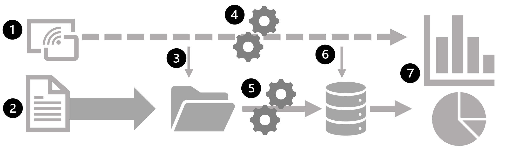

1 - Data events from a streaming data source are captured in real-time.
2 - Data from other sources is ingested into a data store (often a data lake) for batch processing.
3 - If real-time analytics is not required, the captured streaming data is written to the data store for subsequent batch processing.
4 - When real-time analytics is required, a stream processing technology is used to prepare the streaming data for real-time analysis or visualization; often by filtering or aggregating the data over temporal windows.
5 - The non-streaming data is periodically batch processed to prepare it for analysis, and the results are persisted in an analytical data store (often referred to as a data warehouse) for historical analysis.
6 - The results of stream processing may also be persisted in the analytical data store to support historical analysis.
7 - Analytical and visualization tools are used to present and explore the real-time and historical data.

## general architecture for stream processing

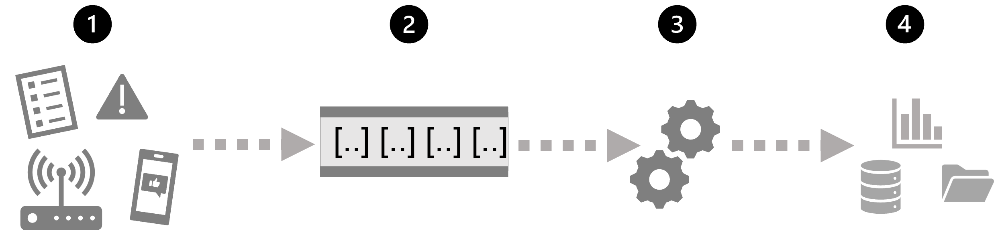

1 - An event generates some data. This might be a signal being emitted by a sensor, a social media message being posted, a log file entry being written, or any other occurrence that results in some digital data.
2 - The generated data is captured in a streaming source for processing. In simple cases, the source may be a folder in a cloud data store or a table in a database. In more robust streaming solutions, the source may be a "queue" that encapsulates logic to ensure that event data is processed in order and that each event is processed only once.
3 - The event data is processed, often by a perpetual query that operates on the event data to select data for specific types of events, project data values, or aggregate data values over temporal (time-based) periods (or windows) - for example, by counting the number of sensor emissions per minute.
4 - The results of the stream processing operation are written to an output (or sink), which may be a file, a database table, a real-time visual dashboard, or another queue for further processing by a subsequent downstream query.

## Microsoft real-time analytics services

* Azure Stream Analytics: A platform-as-a-service (PaaS) solution you can use to define streaming jobs that ingest data from a streaming source, apply a perpetual query, and write the results to an output.
* Spark Structured Streaming: An open-source library that enables you to develop complex streaming solutions on Apache Spark based services, including Microsoft Fabric and Azure Databricks.
* Microsoft Fabric: A high-performance database and analytics platform that includes Data Engineering, Data Factory, Data Science, Real-Time Analytics, Data Warehouse, and Databases.

### Microsoft Fabric Real-Time Intelligence

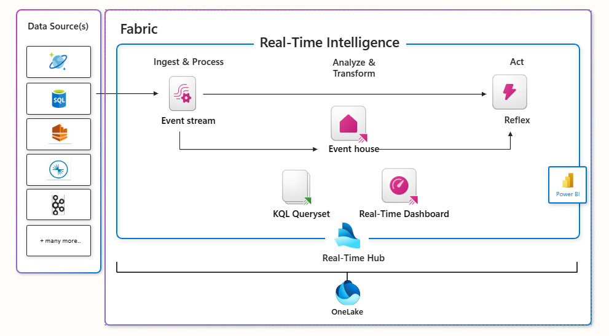

<https://learn.microsoft.com/en-us/fabric/real-time-intelligence/>

### Spark Structured Streaming

To process streaming data on Spark, you can use the Spark Structured Streaming library, which provides an application programming interface (API) for ingesting, processing, and outputting results from perpetual streams of data.

Spark Structured Streaming is built on a ubiquitous structure in Spark called a dataframe, which encapsulates a table of data. You use the Spark Structured Streaming API to read data from a real-time data source, such as a Kafka hub, a file store, or a network port, into a "boundless" dataframe that is continually populated with new data from the stream. You then define a query on the dataframe that selects, projects, or aggregates the data - often in temporal windows. The results of the query generate another dataframe, which can be persisted for analysis or further processing.

<https://spark.apache.org/docs/latest/structured-streaming-programming-guide.html>

### Delta Lake

Delta Lake is an open-source storage layer that adds support for transactional consistency, schema enforcement, and other common data warehousing features to data lake storage. It also unifies storage for streaming and batch data, and can be used in Spark to define relational tables for both batch and stream processing. When used for stream processing, a Delta Lake table can be used as a streaming source for queries against real-time data, or as a sink to which a stream of data is written.

The Spark runtimes in Microsoft Fabric and Azure Databricks include support for Delta Lake.

Delta Lake combined with Spark Structured Streaming is a good solution when you need to abstract batch and stream processed data in a data lake behind a relational schema for SQL-based querying and analysis.

<https://learn.microsoft.com/en-us/fabric/data-engineering/lakehouse-and-delta-tables>

## Sources for stream processing

The following services are commonly used to ingest data for stream processing on Azure:

* Azure Event Hubs: A data ingestion service you can use to manage queues of event data, to ensure that each event is processed in order, exactly once.
* Azure IoT Hub: A data ingestion service similar to Azure Event Hubs, but optimized to manage event data from Internet-of-things (IoT) devices.
* Azure Data Lake Store Gen 2: A highly scalable storage service often used in batch processing scenarios, but can also be used as a source of streaming data.
* Apache Kafka: An open-source data ingestion solution commonly used together with Apache Spark.

## Sinks for stream processing

The output from stream processing is often sent to the following services:

* Azure Event Hubs: Used to queue the processed data for further downstream processing.
* Azure Data Lake Store Gen 2, Microsoft OneLake, or Azure blob storage: Used to persist the processed results as a file.
* Azure SQL Database, Azure Databricks, or Microsoft Fabric: Used to persist the processed results in a table for querying and analysis.
* Microsoft Power BI: Used to generate real time data visualizations in reports and dashboards.

## Microsoft Power BI

There are many data visualization tools that data analysts can use to explore data and summarize insights visually; including chart support in productivity tools like Microsoft Excel and built-in data visualization widgets in notebooks used to explore data in services such as Azure Synapse Analytics and Azure Databricks. However, for enterprise-scale business analytics, an integrated solution that can support complex data modeling, interactive reporting, and secure sharing is often required.

Microsoft Power BI is a suite of tools and services within Microsoft Fabric that data analysts can use to build interactive data visualizations for business users to consume.

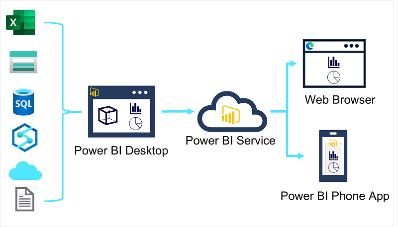

A typical workflow for creating a data visualization solution starts with Power BI Desktop, a Microsoft Windows application in which you can import data from a wide range of data sources, combine and organize the data from these sources in an analytics data model, and create reports that contain interactive visualizations of the data.

After you've created data models and reports, you can publish them to the Power BI service; a cloud service in which reports can be published and interacted with by business users. You can also do some basic data modeling and report editing directly in the service using a web browser, but the functionality for this is limited compared to the Power BI Desktop tool. You can use the service to schedule refreshes of the data sources on which your reports are based, and to share reports with other users. You can also define dashboards and apps that combine related reports in a single, easy to consume location.

Users can consume reports, dashboards, and apps in the Power BI service through a web browser, or on mobile devices by using the Power BI phone app.

## data modeling in Power BI

Analytical models enable you to structure data to support analysis. Models are based on related tables of data and define the numeric values that you want to analyze or report (known as measures) and the entities by which you want to aggregate them (known as dimensions). For example, a model might include a table containing numeric measures for sales (such as revenue or quantity) and dimensions for products, customers, and time. This would enable you aggregate sale measures across one or more dimensions (for example, to identify total revenue by customer, or total items sold by product per month). Conceptually, the model forms a multidimensional structure, which is commonly referred to as a cube, in which any point where the dimensions intersect represents an aggregated measure for those dimensions.

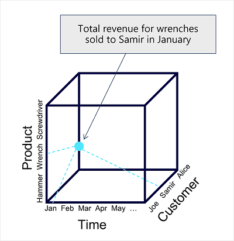

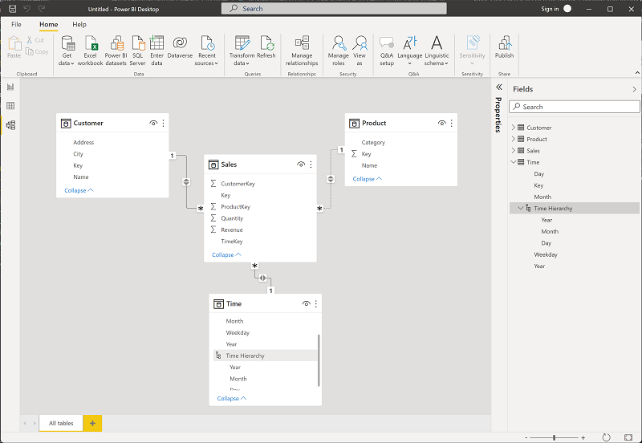

### tables and schema

Dimension tables represent the entities by which you want to aggregate numeric measures – for example product or customer. Each entity is represented by a row with a unique key value. The remaining columns represent attributes of an entity – for example, products have names and categories, and customers have addresses and cities. It’s common in most analytical models to include a Time dimension so that you can aggregate numeric measures associated with events over time.

The numeric measures that will be aggregated by the various dimensions in the model are stored in Fact tables. Each row in a fact table represents a recorded event that has numeric measures associated with it. For example, the Sales table in the schema below represents sales transactions for individual items, and includes numeric values for quantity sold and revenue.

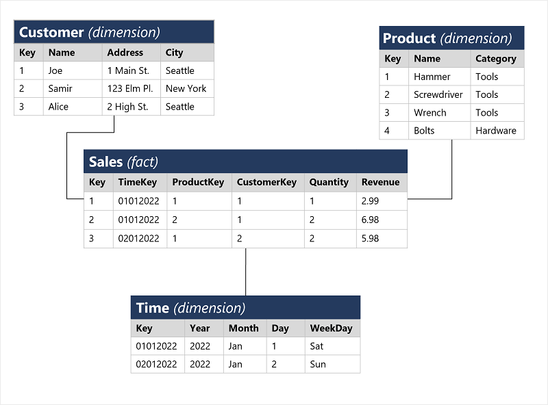

This type of schema, where a fact table is related to one or more dimension tables, is referred to as a star schema (imagine there are five dimensions related to a single fact table – the schema would form a five-pointed star!). You can also define a more complex schema in which dimension tables are related to additional tables containing more details (for example, you could represent attributes of product categories in a separate Category table that is related to the Product table – in which case the design is referred to as a snowflake schema. The schema of fact and dimension tables is used to create an analytical model, in which measure aggregations across all dimensions are pre-calculated; making performance of analysis and reporting activities much faster than calculating the aggregations each time.)

### attribute hierarchies

One final thing worth considering about analytical models is the creation of attribute hierarchies that enable you to quickly drill-up or drill-down to find aggregated values at different levels in a hierarchical dimension. For example, consider the attributes in the dimension tables we’ve discussed so far. In the Product table, you can form a hierarchy in which each category might include multiple named products. Similarly, in the Customer table, a hierarchy could be formed to represent multiple named customers in each city. Finally, in the Time table, you can form a hierarchy of year, month, and day. The model can be built with pre-aggregated values for each level of a hierarchy, enabling you to quickly change the scope of your analysis – for example, by viewing total sales by year, and then drilling down to see a more detailed breakdown of total sales by month.

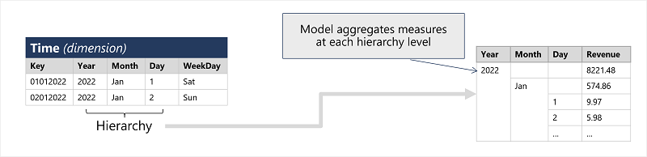

## visualizations in Power BI

some built-in visualizations

* Tables and text

  Tables and text are often the simplest way to communicate data. Tables are useful when numerous related values must be displayed, and individual text values in cards can be a useful way to show important figures or metrics.

  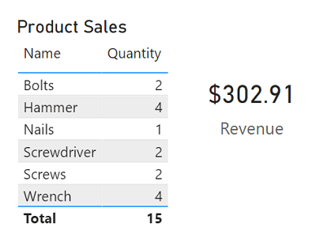

* Bar and column charts

  Bar and column charts are a good way to visually compare numeric values for discrete categories.

  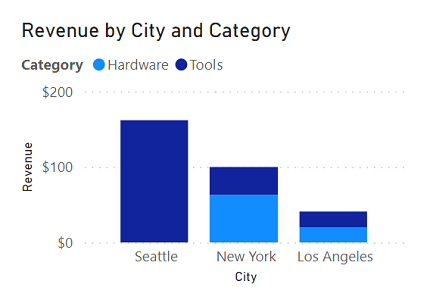

* Line charts

  Line charts can also be used to compare categorized values and are useful when you need to examine trends, often over time.

  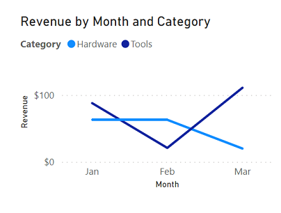

* Pie charts

  Pie charts are often used in business reports to visually compare categorized values as proportions of a total.

  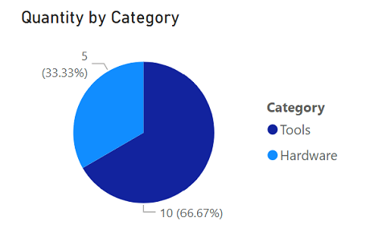

* Scatter plots

  Scatter plots are useful when you want to compare two numeric measures and identify a relationship or correlation between them.

  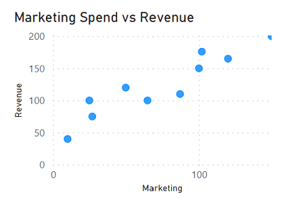

* Maps

  Maps are a great way to visually compare values for different geographic areas or locations.

  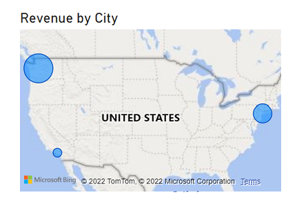
