#

[Microsoft Fabric](https://app.fabric.microsoft.com)

* Sign in
* switch to the Data Engineering experience


  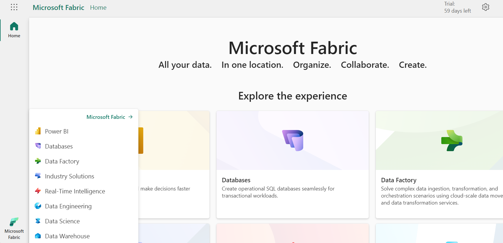

  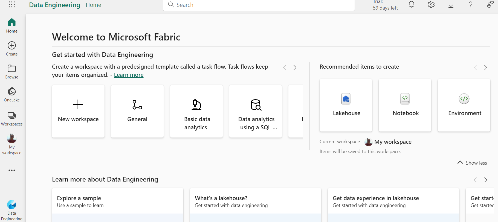

* Create a workspace

  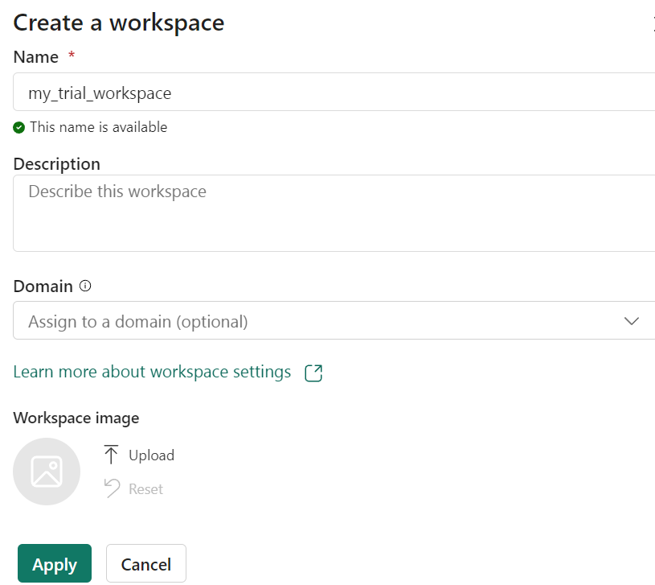

  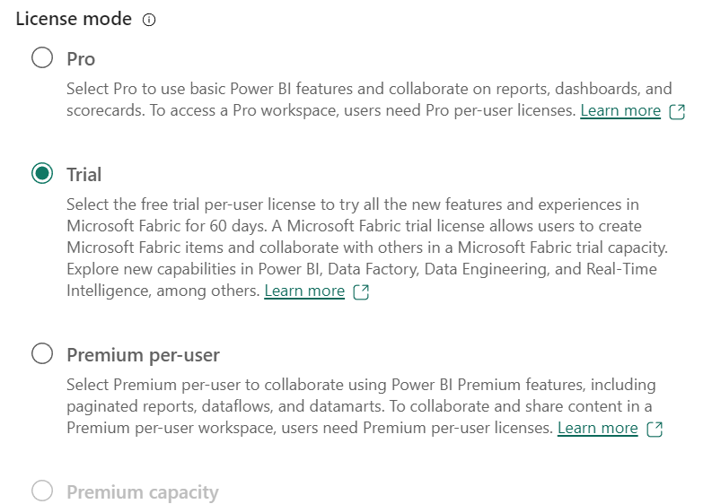

  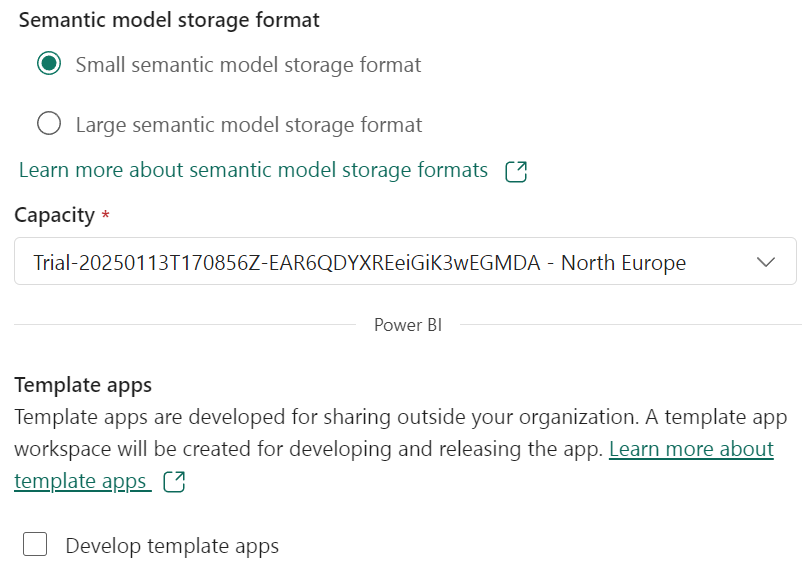

  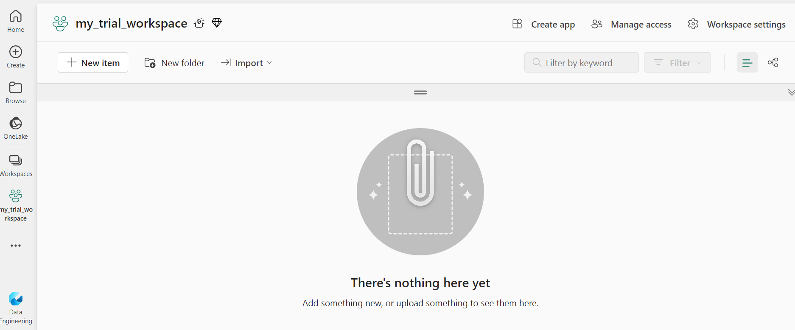

* Create a lakehouse

  Now that you have a workspace, it’s time to create a data lakehouse for your data files.

  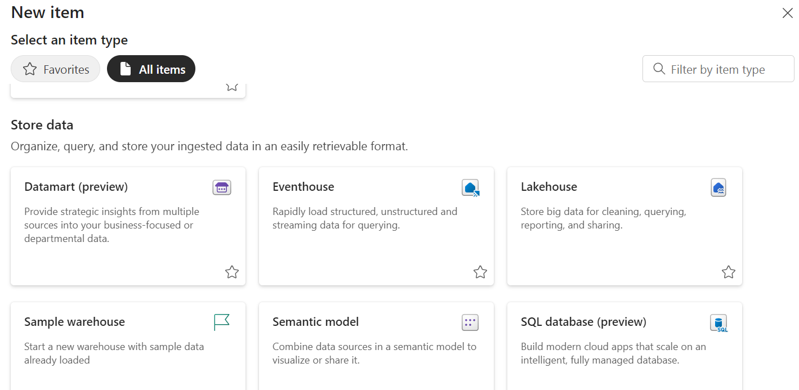

  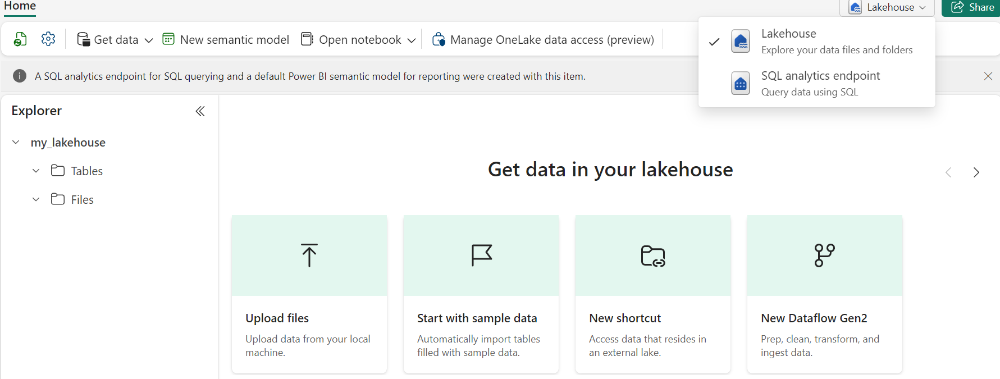

  Currently, there are no tables or files in the lakehouse.

  * The Tables folder contains tables that you can query using SQL. Tables in a Microsoft Fabric lakehouse are based on the open source Delta Lake file format, commonly used in Apache Spark.
  * The Files folder contains data files in the OneLake storage for the lakehouse that aren’t associated with managed delta tables. You can also create shortcuts in this folder to reference data that is stored externally.

* Ingest data

  A simple way to ingest data is to use a Copy Data activity in a pipeline to extract the data from a source and copy it to a file in the lakehouse.

  Get data menu > New data pipeline

  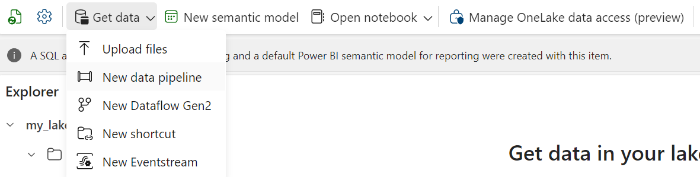

  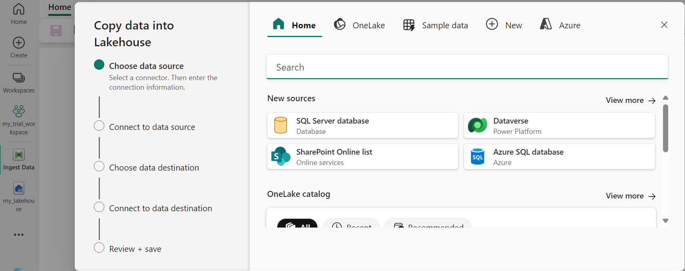

  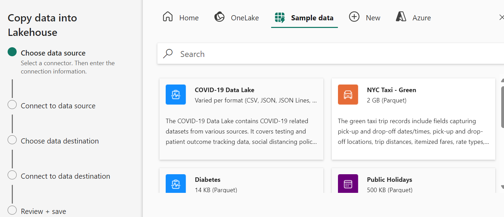

  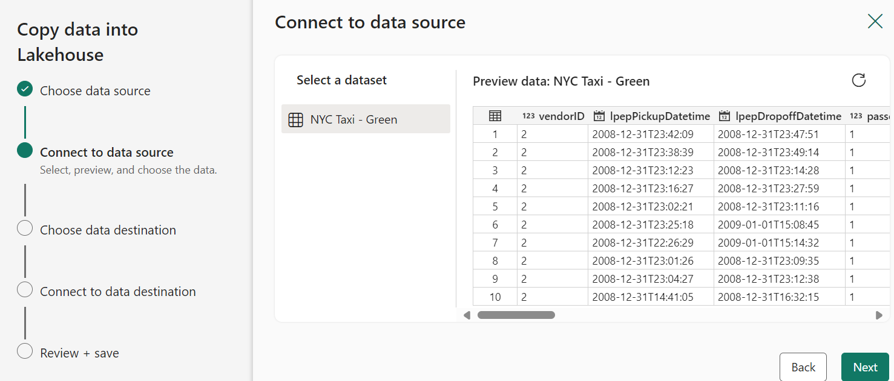

  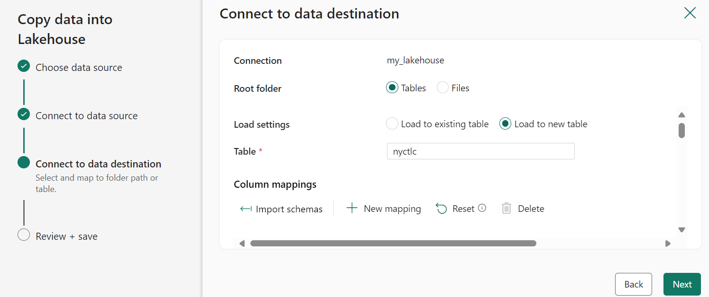

  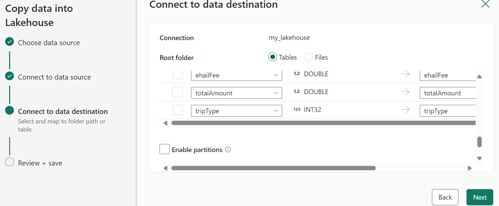

  At the end of the wizard, Save and run should run the pipeline

  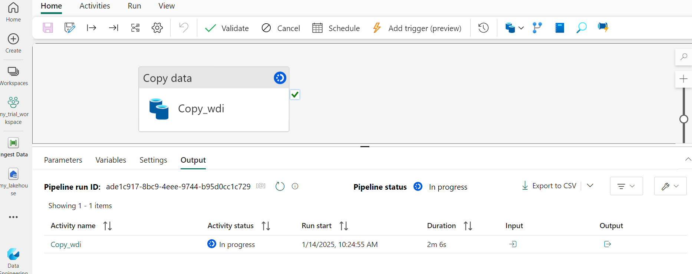

  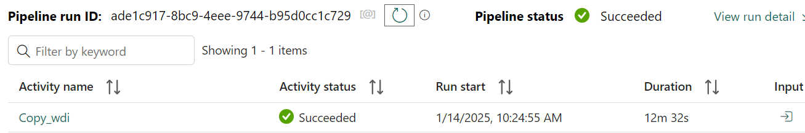

* Query the data

  go to the lakehouse, look at the table preview, switch from Lakehouse view to the SQL analytics endpoint for your lakehouse. Select New SQL query and run it.

  ```sql
  SELECT  DATENAME(dw,lpepPickupDatetime) AS Day,
         AVG(tripDistance) As AvgDistance
  FROM taxi_rides
  GROUP BY DATENAME(dw,lpepPickupDatetime)
  ```

  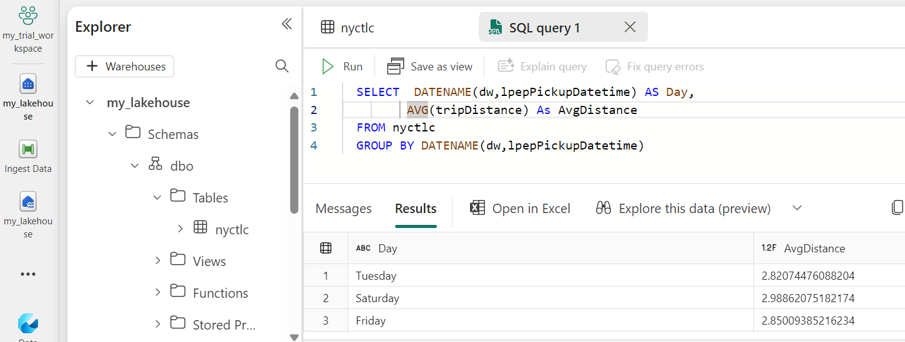

* clean up resources

  delete the workspace
