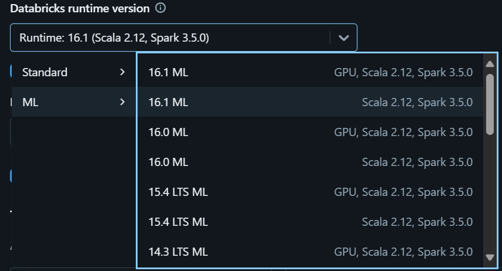
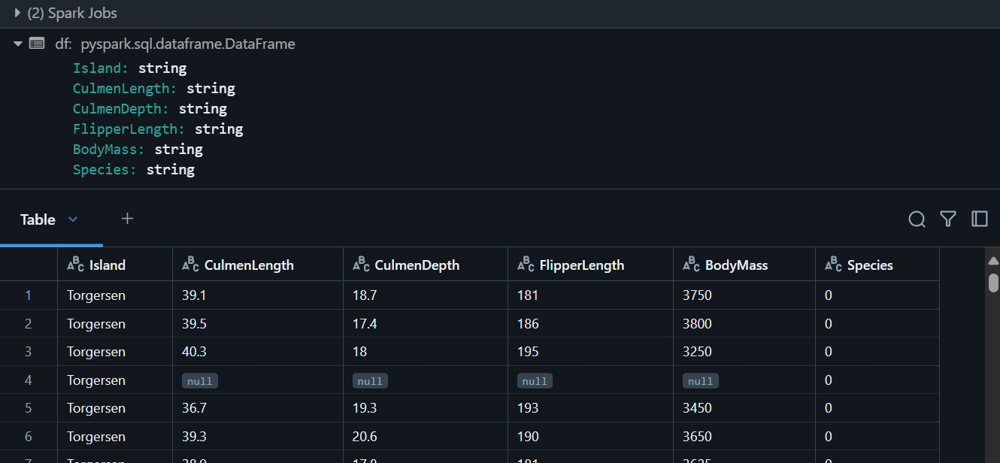
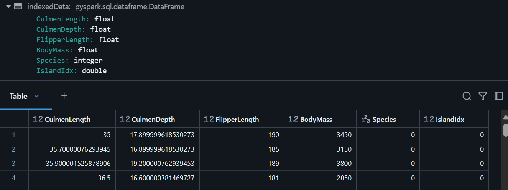
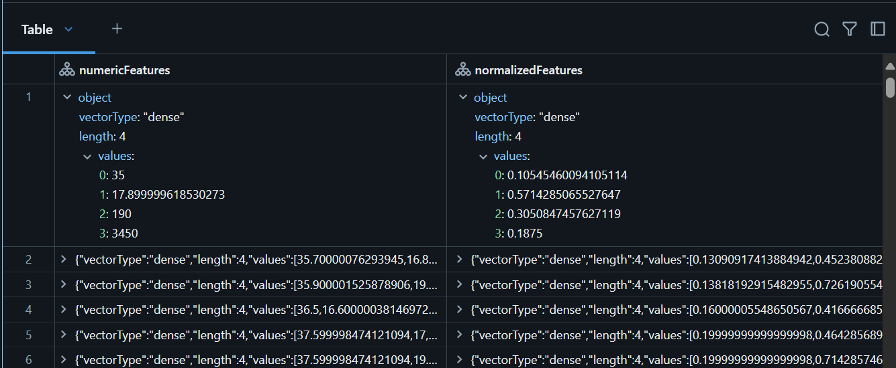
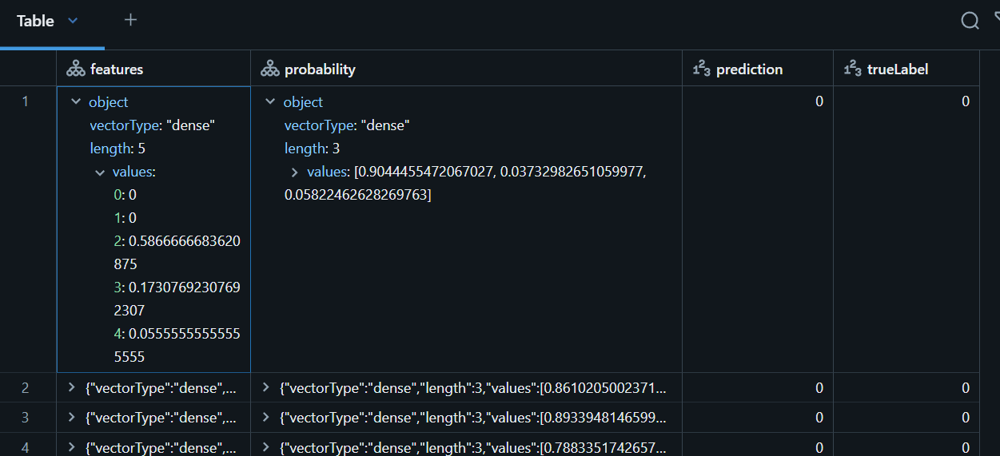
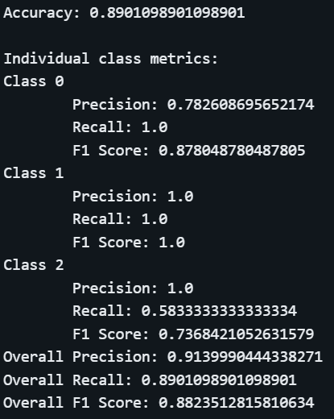

# module 1

* Train a machine learning model in Azure Databricks
  * Understand principles of machine learning
  * Machine learning in Azure Databricks
  * Prepare data for machine learning
  * Train a machine learning model
  * Evaluate a machine learning model
  * [lab](https://microsoftlearning.github.io/mslearn-databricks/Instructions/Exercises/DS-03-Train-machine-learning-model.html)

## ML frameworks in Azure Databricks

Azure Databricks is built on Apache Spark, a highly scalable platform for distributed data processing. On Spark, data scientists and machine learning engineers usually work in interactive notebooks in which code to prepare data and use it to train machine learning models is written in PySpark (a variant of Python that is optimized for Spark). Within the Python ecosystem there are many commonly used machine learning frameworks, including:

* Scikit-Learn: A popular framework for machine learning that provides a wide range of algorithms and other libraries to help you train and evaluate predictive models.
* Spark MLlib: A machine learning library built specifically for Spark. MLlib provides two ways to train and evaluate machine learning models:
  * Classes based on the Spark resilient distributed dataset (RDD) structure.
  * Classes based on the Spark dataframe structure. This framework (commonly referred to as Spark ML) is the preferred one for using MLlib.
* PyTorch: A deep learning framework used to build neural network models for complex forecasting, computer vision, and natural language processing workloads.
* TensorFlow: Another commonly used deep learning framework.

You can use any of these frameworks (and more)...

## Preparing data for ML

Typically, the preparation of data involves two key tasks:

* Data cleansing: Identifying and mitigating issues in the data that will affect its usefulness for machine learning.
* Feature engineering and pre-processing: Selecting and transforming suitable features for model training.

### Data cleansing

Typical issues you need to address include:

* Incomplete data: Data often includes records in which individual fields are missing (often indicated by the presence of NULL values). You need to identify missing values and mitigate them by:
  * Substituting them with a suitable replacement - either by interpolating a value in a series, using a mean (or median) value, or creating some other appropriate value.
  * Removing incomplete rows entirely (assuming this leaves enough suitable representative data for modeling)
* Errors: It's not uncommon for data to include errors, caused by data entry mistakes or failed upstream data processing. Finding errors can be difficult, and usually involves substantial scrutiny of the data using queries and visualizations to summarize the data and look for values that don't align with most of the other values in a given field.
* Outliers: Outliers are values that are significantly outside (above or below) the statistical distribution of the data. Sometimes outliers are an indication of an error (for example, someone may have a value with an extra zero or omitted a decimal point) and sometimes they're genuine values that are unusually high or low compared to most observations. In either case, extreme outliers can negatively impact the training of a machine learning model; so it's usually best to handle them by resetting them to an upper or lower threshold value, or by removing records that contain outliers from the dataset.
* Incorrect data types: Machine learning algorithms can be sensitive to the data types assigned to the feature values. It's common for datasets that were based on text files containing errors or null values to miscast numeric fields to a string data type, and often values that represent discrete integer values can be miscast to decimal numbers (or vice-versa). * You should examine the schema of your data and assign the appropriate data types that most effectively reflect the data values.
* Unbalanced data: Machine learning training works best if the training data has adequate representation for all of the different feature and label combinations that might be encountered. In an unbalanced dataset, records that include a particular categorical value or combination of fields are over-represented; which can influence the training algorithm and introduce bias into the model. A common technique to mitigate this problem is to oversample under-represented values by included duplicated rows, or to undersample over-represented rows (by removing them from the dataset).

For example, the following code loads data from a text file into a Spark dataframe:

```python
df = spark.read.format("csv").option("header", "true").load("/myfolder/mydata.csv")
```

Alternatively, if the data has been loaded into a delta table in the Azure Databricks workspace, you can use a SQL query to load its data into a dataframe:

```sql
df = spark.sql("SELECT * FROM mytable")
```

After the data is loaded into a dataframe, you can use its methods and other functions in the Spark SQL library to explore and transform the data. For example, the following code uses the dropna method to remove any rows that include null values, and assigns specific data types to columns in the dataframe.

```python
clean_data = df.dropna().select(col("column1").astype("string"), col("column2").astype("float"))
```

### Feature engineering and preprocessing

After ensuring that the dataset is complete and clean, you can start to prepare the features for machine learning. Feature engineering is an iterative approach that often involves some trial and error to determine which feature columns have predictive value, and how best to represent the features. Common feature engineering and preprocessing tasks include:

* Deriving new features: Often you can derive new, more predictive features from existing ones. For example, suppose a dataset includes a date column and you suspect that the complete date may not be an important predictive factor in identifying the label, but that the day of the week might be. You could create a new day_of_week feature derived from the date and test your theory.

* Discretizing numeric features: In some cases, a numeric value might prove more predictive when discretized into categories that represent specific ranges of values. For example, you might take the numeric values in a price feature and assign them into low, medium, and high categories based on appropriate thresholds.

* Encoding categorical features: Many datasets include categorical data that is represented by string values. However, most machine learning algorithms work best with numeric data. It's therefore common to assign numeric codes to represent categories instead of strings. For example, a dataset of product details might include a feature for color that can have a value of "Green", "Red", or "Blue". You could encode these values using simple integer codes such as 0 for "Green", 1 for "Red", and 2 for "Blue". Alternatively, you could use a one-hot encoding technique in which you create a new column for each possible category, and assign the value 1 or 0 to each column as appropriate for each row, like this:

|Original Color Column|Green|Red|Blue|
|---|---|---|---|
|Green|1|0|0|
|Blue|0|0|1|
|Red|0|1|0|

* Scaling (normalizing) numeric values: Numerical data values are often on different scales or units of measurement from one another. Machine learning algorithms process them all as absolute numeric values, and features with larger values can often dominate the training of the model. To resolve this problem, it's common to scale all of the numeric columns so that the individual values for a single column maintain the same proportional relationship to one another, but all of the numeric columns are on a similar scale. For example, suppose a dataset contains length and weight values measured in meters and kilograms. You could convert both of these features to a scaled value between 0 and 1 like this:

|length|weight|scaled_length|scaled_weight|
|---|---|---|---|
|250.0|2.1|0.250|0.210|
|176.0|0.9|0.176|0.09|

Many machine learning libraries include classes that you can use to perform common feature engineering tasks. For example, the Spark MLlib library includes the StringIndexer class, which you can use to perform simple integer-based encoding for string values.

```python
from pyspark.ml.feature import StringIndexer

encoder = StringIndexer(inputCol="catCol", outputCol="catColCode")
encoded_data = encoder.fit(data).transform(data)
```

It's worth explaining the StringIndexer code sample in a little more detail. Spark MLlib classes can include evaluators that fit an algorithm for a specific transformation operation to some sample data. In this case, the StringIndexer fits an an encoding algorithm to the discrete string values in the catCol column in the data dataframe to determine the specific calculations required to generate a new catColCode column containing the encoded values. The output of an evaluator is a transformer that encapsulates the function defined by the evaluator, and which can apply that function to data and generate a new dataframe. In this example, we pass the same data used to determine the encoding function to the resulting transformer to actually apply the encoding.

In Spark MLLib, you can chain a sequence of evaluators and transformers together in a pipeline that performs all the feature engineering and preprocessing steps you need to prepare your data. The pipeline can end with a machine learning algorithm that acts as an evaluator to determine the operations required to predict a label from the prepared features. The output of the pipeline is a machine learning model, which is in fact a transformer that can be used to apply the model function to features in a dataframe and predict the corresponding label values.

## Training

Train of a logistic regression model using the Spark MLlib framework. Two hyperparameters (maxIter and regParam) have also been specified.

```python
from pyspark.ml.classification import LogisticRegression

lr = LogisticRegression(labelCol="label", featuresCol="features", maxIter=10, regParam=0.3)
model = lr.fit(training_df)
```

## Evaluation - for regression models

Regression models predict numeric values, so any evaluation of the model's predictive performance requires you to consider the differences between the predicted values and the actual label values in the validation dataset. Since the validation dataset includes multiple cases, some of which may have more accurate predictions than others, you need some way to aggregate the differences and determine an overall metric for performance. Typical metrics used to evaluate a regression model include:

* Mean Squared Error (MSE): This metric is calculated by squaring the differences between each prediction and actual value, and adding the squared differences together, and calculating the mean (average). Squaring the values makes the differences absolute (ignoring whether the difference is negative or positive) and gives more weight to larger differences.
* Root Mean Squared Error (RMSE): While the MSE metric is a good indication of the level of error in the models predictions, it doesn't relate to the actual unit of measurement of the label. For example, in a model that predicts sales (in US dollars), the MSE value actually represents the dollar values squared. To evaluate how far off the predictions are in terms of dollars, you need to calculate the square root of the MSE.
* Coefficient of Determination (R2): The R2 metric measures the correlation between the squared feature and predicted values. This results in a value between 0 and 1 that measures the amount of variance that can be explained by the model. The closer this value is to 1, the better the model predicts.

Calculate a range of regression evaluation metrics to quantify the predictive performance of the model using the RegressionEvaluator class

```python
from pyspark.ml.evaluation import RegressionEvaluator

# Inference predicted labels from validation data
predictions_df = model.transform(validation_df)

# Assume predictions_df includes a 'prediction' column with the predicted labels
# and a 'label' column with the actual known label values

# Use an evaluator to get metrics
evaluator = RegressionEvaluator()
evaluator.setPredictionCol("prediction")
mse = evaluator.evaluate(predictions_df, {evaluator.metricName: "mse"})
rmse = evaluator.evaluate(predictions_df, {evaluator.metricName: "rmse"})
r2 = evaluator.evaluate(predictions_df, {evaluator.metricName: "r2"})
print("MSE:", str(mse))
print("RMSE:", str(rmse))
print("R2", str(r2))
```

## Evaluation - for classification models

Classification models predict categorical labels (classes) by calculating a probability value for each possible class and selecting the class label with the highest probability. The metrics used to evaluate a classification model reflect how often these class predictions were correct when compared to the actual known labels in the validation dataset. Typical metrics used to evaluate a classification model include:

* Accuracy: A simple metric that indicates the proportion of class predictions made by the model that were correct. While this may seem like the obvious way to evaluate the performance of a classification model, consider a scenario where a model is used to predict whether a person will commute to work by car, bus, or tram. Let's say that 95% of cases in the validation set use a car, 3% take the bus, and 2% catch a tram. A model that simply always predicts a car will be 95% accurate - even though it actually has no predictive ability to discriminate between the three classes.
* Per-class metrics:
  * Precision: The proportion of predictions of the specified class that were correct. This is measured as the number of true positives (correct predictions of this class) divided by the total number of predictions of this class (including false positives).
  * Recall: The proportion of actual instances of this class that were correctly predicted (true positives divided by the total number if instances of this class in the validation dataset, including false negatives - cases where the model incorrectly predicted a different class).
  * F1 score: A combined metric for precision and recall (calculated as the harmonic mean of precision and recall).
* Combined (weighted) precision, recall, and F1 metrics for all classes.

Calculate classification evalutation metrics using the MulticlassClassificationEvaluator in Spark MLlib

```python
from pyspark.ml.evaluation import MulticlassClassificationEvaluator

# Inference predicted labels from validation data
predictions_df = model.transform(validation_df)

# Assume predictions_df includes a 'prediction' column with the predicted labels
# and a 'label' column with the actual known label values

# Use an evaluator to get metrics
accuracy = evaluator.evaluate(predictions_df, {evaluator.metricName:"accuracy"})
print("Accuracy:", accuracy)

labels = [0,1,2]
print("\nIndividual class metrics:")
for label in sorted(labels):
    print ("Class %s" % (label))
    precision = evaluator.evaluate(predictions_df, {evaluator.metricLabel:label,
    evaluator.metricName:"precisionByLabel"})
    print("\tPrecision:", precision)
    recall = evaluator.evaluate(predictions_df, {evaluator.metricLabel:label,
    evaluator.metricName:"recallByLabel"})
    print("\tRecall:", recall)
    f1 = evaluator.evaluate(predictions_df, {evaluator.metricLabel:label,
    evaluator.metricName:"fMeasureByLabel"})
    print("\tF1 Score:", f1)
    
overallPrecision = evaluator.evaluate(predictions_df, {evaluator.metricName:"weightedPrecision"})
print("Overall Precision:", overallPrecision)
overallRecall = evaluator.evaluate(predictions_df, {evaluator.metricName:"weightedRecall"})
print("Overall Recall:", overallRecall)
overallF1 = evaluator.evaluate(predictions_df, {evaluator.metricName:"weightedFMeasure"})
print("Overall F1 Score:", overallF1)
```

## Evaluation - for clustering models

Unsupervised clustering models don't have known true label values. The goal of the clustering model is to group similar cases into clusters based on their features. To evaluate a cluster, you need a metric that indicates the level of separation between clusters. You can think of the clustered cases as plotted points in multidimensional space. Points in the same cluster should be close to one another, and far away from points in a different cluster.

One such metric is the Silhouette measure, which computes squared Euclidean distance and provides an indication of consistency within clusters. Silhouette values can be between 1 and -1, with a value close to 1 indicating that the points in a cluster are close to the other points in the same cluster and far from the points of the other clusters.

Use the ClusteringEvaluator class in Spark MLlib

```python
from pyspark.ml.evaluation import ClusteringEvaluator
from pyspark.ml.linalg import Vectors

# Inference predicted labels from validation data
predictions_df = model.transform(validation_df)

# Assume predictions_df includes a 'prediction' column with the predicted cluster

# Use an evaluator to get metrics
evaluator = ClusteringEvaluator(predictionCol="prediction")
silhouetteVal  = evaluator.evaluate(predictions_df)
print(silhouetteVal)
```

## lab

### Create a cluster

* Cluster name: User Name’s cluster (the default cluster name)
* Policy: Unrestricted
* Cluster mode: Single Node
* Access mode: Single user (with your user account selected)
* Databricks runtime version: Select the ML edition of the latest non-beta version of the runtime (Not a Standard runtime version) that:
  * Does not use a GPU
  * Includes Scala > 2.11
  * Includes Spark > 3.4
* Use Photon Acceleration: Unselected
* Node type: Standard_D4ds_v5
* Terminate after 20 minutes of inactivity



### Ingest the data

[`penguins.csv`](https://raw.githubusercontent.com/MicrosoftLearning/mslearn-databricks/main/data/penguins.csv)

```bash
%sh
rm -r /dbfs/ml_lab
mkdir /dbfs/ml_lab
wget -O /dbfs/ml_lab/penguins.csv https://raw.githubusercontent.com/MicrosoftLearning/mslearn-databricks/main/data/penguins.csv
```

### Explore and clean up the data

* Load into a dataframe

```python
df = spark.read.format("csv").option("header", "true").load("/ml_lab/penguins.csv")
display(df)
```



Since this data was loaded from a text file and contained some blank values, Spark has assigned a string data type to all of the columns.

The data itself consists of measurements of the following details of penguins that have been observed in Antarctica:

* Island: The island in Antarctica where the penguin was observed.
* CulmenLength: The length in mm of the penguin’s culmen (bill).
* CulmenDepth: The depth in mm of the penguin’s culmen.
* FlipperLength: The length in mm of the penguin’s flipper.
* BodyMass: The body mass of the penguin in grams.
* Species: An integer value that represents the species of the penguin:
  * 0: Adelie
  * 1: Gentoo
  * 2: Chinstrap

Our goal in this project is to use the observed characteristics of a penguin (its features) in order to predict its species (which in machine learning terminology, we call the label).

* Transform data

remove the rows with incomplete data by using the dropna method; apply appropriate data types to the data by using the select method with the col and astype functions

```python
from pyspark.sql.types import *
from pyspark.sql.functions import *
   
data = df.dropna().select(col("Island").astype("string"), col("CulmenLength").astype("float"),
  col("CulmenDepth").astype("float"),
  col("FlipperLength").astype("float"),
  col("BodyMass").astype("float"),
  col("Species").astype("int")
)
display(data)
```

other tasks - fix (or remove) errors in the data, identify and remove outliers (untypically large or small values), or to balance the data so there’s a reasonably equal number of rows for each label you’re trying to predict.

### Split the data

split the full data set into two randomized subsets

```python
splits = data.randomSplit([0.7, 0.3])
train = splits[0]
test = splits[1]
print ("Training Rows:", train.count(), " Testing Rows:", test.count())
```

### Perform feature engineering

* Encode categorical features

encode the Island categorical column values as numeric indexes.

```python
from pyspark.ml.feature import StringIndexer

indexer = StringIndexer(inputCol="Island", outputCol="IslandIdx")
indexedData = indexer.fit(train).transform(train).drop("Island")
display(indexedData)
```



* Normalize (scale) numeric features

These values (CulmenLength, CulmenDepth, FlipperLength, and BodyMass) all represent measurements of one sort or another, but they’re in different scales.

We need to scale multiple column values at the same time, so the technique we use is to create a single column containing a vector (essentially an array) of all the numeric features, and then apply a scaler to produce a new vector column with the equivalent normalized values.

```python
from pyspark.ml.feature import VectorAssembler, MinMaxScaler

# Create a vector column containing all numeric features
numericFeatures = ["CulmenLength", "CulmenDepth", "FlipperLength", "BodyMass"]
numericColVector = VectorAssembler(inputCols=numericFeatures, outputCol="numericFeatures")
vectorizedData = numericColVector.transform(indexedData)
   
# Use a MinMax scaler to normalize the numeric values in the vector
minMax = MinMaxScaler(inputCol = numericColVector.getOutputCol(), outputCol="normalizedFeatures")
scaledData = minMax.fit(vectorizedData).transform(vectorizedData)
   
# Display the data with numeric feature vectors (before and after scaling)
compareNumerics = scaledData.select("numericFeatures", "normalizedFeatures")
display(compareNumerics)
```



The numericFeatures column in the results contains a vector for each row. The vector includes four unscaled numeric values (the original measurements of the penguin). The normalizedFeatures column also contains a vector for each penguin observation, but this time the values in the vector are normalized to a relative scale based on the minimum and maximum values for each measurement.

* Prepare features and labels for training

Now, let’s bring everything together and create a single column containing all of the features (the encoded categorical island name and the normalized penguin measurements), and another column containing the class label we want to train a model to predict (the penguin species).

```python
featVect = VectorAssembler(inputCols=["IslandIdx", "normalizedFeatures"], outputCol="featuresVector")
preppedData = featVect.transform(scaledData)[col("featuresVector").alias("features"), col("Species").alias("label")]
display(preppedData)
```

The features vector contains five values (the encoded island and the normalized culmen length, culmen depth, flipper length, and body mass). The label contains a simple integer code that indicates the class of penguin species.

### Train a ML model

logistic regression, which iteratively attempts to find the optimal coefficients that can be applied to the features data in a logistic calculation that predicts the probability for each class label value. To train the model, you will fit the logistic regression algorithm to the training data. You specify the maximum number of iterations performed to find optimal coeficients for the logistic calculation, and a regularization parameter that is used to prevent the model from overfitting.

```python
from pyspark.ml.classification import LogisticRegression

lr = LogisticRegression(labelCol="label", featuresCol="features", maxIter=10, regParam=0.3)
model = lr.fit(preppedData)
print ("Model trained!")
```

### Test the model

prepare the test data and then generate predictions

```python
# Prepare the test data
indexedTestData = indexer.fit(test).transform(test).drop("Island")
vectorizedTestData = numericColVector.transform(indexedTestData)
scaledTestData = minMax.fit(vectorizedTestData).transform(vectorizedTestData)
preppedTestData = featVect.transform(scaledTestData)[col("featuresVector").alias("features"), col("Species").alias("label")]
   
# Get predictions
prediction = model.transform(preppedTestData)
predicted = prediction.select("features", "probability", col("prediction").astype("Int"), col("label").alias("trueLabel"))
display(predicted)
```



* features: The prepared features data from the test dataset.
* probability: The probability calculated by the model for each class. This consists of a vector containing three probability values (because there are three classes) which add up to a total of 1.0 (its assumed that there’s a 100% probability that the penguin belongs to one of the three species classes).
* prediction: The predicted class label (the one with the highest probability).
* trueLabel: The actual known label value from the test data.

get evaluation metrics for a classification model based on the results from the test data

```python
from pyspark.ml.evaluation import MulticlassClassificationEvaluator
   
evaluator = MulticlassClassificationEvaluator(labelCol="label", predictionCol="prediction")
   
# Simple accuracy
accuracy = evaluator.evaluate(prediction, {evaluator.metricName:"accuracy"})
print("Accuracy:", accuracy)
   
# Individual class metrics
labels = [0,1,2]
print("\nIndividual class metrics:")
for label in sorted(labels):
    print ("Class %s" % (label))
    
    # Precision
    precision = evaluator.evaluate(prediction, {evaluator.metricLabel:label,
      evaluator.metricName:"precisionByLabel"})
    print("\tPrecision:", precision)
    
    # Recall
    recall = evaluator.evaluate(prediction, {evaluator.metricLabel:label,
      evaluator.metricName:"recallByLabel"})
    print("\tRecall:", recall)
    
    # F1 score
    f1 = evaluator.evaluate(prediction, {evaluator.metricLabel:label,
      evaluator.metricName:"fMeasureByLabel"})
    print("\tF1 Score:", f1)
   
# Weighted (overall) metrics
overallPrecision = evaluator.evaluate(prediction, {evaluator.metricName:"weightedPrecision"})
print("Overall Precision:", overallPrecision)
overallRecall = evaluator.evaluate(prediction, {evaluator.metricName:"weightedRecall"})
print("Overall Recall:", overallRecall)
overallF1 = evaluator.evaluate(prediction, {evaluator.metricName:"weightedFMeasure"})
print("Overall F1 Score:", overallF1)
```



* Accuracy: The proportion of overall predictions that were correct.
* Per-class metrics:
  * Precision: The proportion of predictions of this class that were correct.
  * Recall: The proportion of actual instances of this class that were correctly predicted.
  * F1 score: A combined metric for precision and recall
* Combined (weighted) precision, recall, and F1 metrics for all classes.

### Use a pipeline

You trained your model by performing the required feature engineering steps and then fitting an algorithm to the data. To use the model with some test data to generate predictions (referred to as inferencing), you had to apply the same feature engineering steps to the test data. A more efficient way to build and use models is to encapsulate the transformers used to prepare the data and the model used to train it in a pipeline.

Create a pipeline that encapsulates the data preparation and model training steps

```python
from pyspark.ml import Pipeline
from pyspark.ml.feature import StringIndexer, VectorAssembler, MinMaxScaler
from pyspark.ml.classification import LogisticRegression
   
catFeature = "Island"
numFeatures = ["CulmenLength", "CulmenDepth", "FlipperLength", "BodyMass"]
   
# Define the feature engineering and model training algorithm steps
catIndexer = StringIndexer(inputCol=catFeature, outputCol=catFeature + "Idx")
numVector = VectorAssembler(inputCols=numFeatures, outputCol="numericFeatures")
numScaler = MinMaxScaler(inputCol = numVector.getOutputCol(), outputCol="normalizedFeatures")
featureVector = VectorAssembler(inputCols=["IslandIdx", "normalizedFeatures"], outputCol="Features")
algo = LogisticRegression(labelCol="Species", featuresCol="Features", maxIter=10, regParam=0.3)
   
# Chain the steps as stages in a pipeline
pipeline = Pipeline(stages=[catIndexer, numVector, numScaler, featureVector, algo])
   
# Use the pipeline to prepare data and fit the model algorithm
model = pipeline.fit(train)
print ("Model trained!")
```

Since the feature engineering steps are now encapsulated in the model trained by the pipeline, you can use the model with the test data without needing to apply each transformation (they’ll be applied automatically by the model).

Apply the pipeline to the test data

```python
prediction = model.transform(test)
predicted = prediction.select("Features", "probability", col("prediction").astype("Int"), col("Species").alias("trueLabel"))
display(predicted)
```

### Try a different algorithm

create a pipeline that uses a Decision tree algorithm

```python
from pyspark.ml import Pipeline
from pyspark.ml.feature import StringIndexer, VectorAssembler, MinMaxScaler
from pyspark.ml.classification import DecisionTreeClassifier
   
catFeature = "Island"
numFeatures = ["CulmenLength", "CulmenDepth", "FlipperLength", "BodyMass"]
   
# Define the feature engineering and model steps
catIndexer = StringIndexer(inputCol=catFeature, outputCol=catFeature + "Idx")
numVector = VectorAssembler(inputCols=numFeatures, outputCol="numericFeatures")
numScaler = MinMaxScaler(inputCol = numVector.getOutputCol(), outputCol="normalizedFeatures")
featureVector = VectorAssembler(inputCols=["IslandIdx", "normalizedFeatures"], outputCol="Features")
algo = DecisionTreeClassifier(labelCol="Species", featuresCol="Features", maxDepth=10)
   
# Chain the steps as stages in a pipeline
pipeline = Pipeline(stages=[catIndexer, numVector, numScaler, featureVector, algo])
   
# Use the pipeline to prepare data and fit the model algorithm
model = pipeline.fit(train)
print ("Model trained!")
```

use the new pipeline with the test data

```python
# Get predictions
prediction = model.transform(test)
predicted = prediction.select("Features", "probability", col("prediction").astype("Int"), col("Species").alias("trueLabel"))
   
# Generate evaluation metrics
from pyspark.ml.evaluation import MulticlassClassificationEvaluator
   
evaluator = MulticlassClassificationEvaluator(labelCol="Species", predictionCol="prediction")
   
# Simple accuracy
accuracy = evaluator.evaluate(prediction, {evaluator.metricName:"accuracy"})
print("Accuracy:", accuracy)
   
# Class metrics
labels = [0,1,2]
print("\nIndividual class metrics:")
for label in sorted(labels):
    print ("Class %s" % (label))
    
    # Precision
    precision = evaluator.evaluate(prediction, {evaluator.metricLabel:label,
      evaluator.metricName:"precisionByLabel"})
    print("\tPrecision:", precision)
    
    # Recall
    recall = evaluator.evaluate(prediction, {evaluator.metricLabel:label,
      evaluator.metricName:"recallByLabel"})
    print("\tRecall:", recall)
    
    # F1 score
    f1 = evaluator.evaluate(prediction, {evaluator.metricLabel:label,
      evaluator.metricName:"fMeasureByLabel"})
    print("\tF1 Score:", f1)
   
# Weighed (overall) metrics
overallPrecision = evaluator.evaluate(prediction, {evaluator.metricName:"weightedPrecision"})
print("Overall Precision:", overallPrecision)
overallRecall = evaluator.evaluate(prediction, {evaluator.metricName:"weightedRecall"})
print("Overall Recall:", overallRecall)
overallF1 = evaluator.evaluate(prediction, {evaluator.metricName:"weightedFMeasure"})
print("Overall F1 Score:", overallF1)
```

### Save the model

In reality, you’d iteratively try training the model with different algorithms (and parameters) to find the best model for your data. For now, we’ll stick with the decision trees model we’ve trained. Let’s save it so we can use it later with some new penguin observations.

```python
model.save("/models/penguin.model")
```

load the model and use it to predict the species for a new penguin observation

```python
from pyspark.ml.pipeline import PipelineModel

persistedModel = PipelineModel.load("/models/penguin.model")
   
newData = spark.createDataFrame ([{
  "Island": "Biscoe",
  "CulmenLength": 47.6,
  "CulmenDepth": 14.5,
  "FlipperLength": 215,
  "BodyMass": 5400
  }])

predictions = persistedModel.transform(newData)
display(predictions.select("Island", "CulmenDepth", "CulmenLength", "FlipperLength", "BodyMass", col("prediction").alias("PredictedSpecies")))
```
