# module 2

* Use MLflow in Azure Databricks

  * Capabilities of MLflow
  * Run experiments with MLflow
  * Register and serve models with MLflow
  * [lab](https://microsoftlearning.github.io/mslearn-databricks/Instructions/Exercises/DS-04-Use-MLflow.html)

## MLflow

MLflow is an open source platform for managing the machine learning lifecycle that is natively supported in Azure Databricks.

* <https://mlflow.org/>

There are four components to MLflow:

* MLflow Tracking

  For each run in an experiment, a data scientist can log parameter values, versions of libraries used, model evaluation metrics, and generated output files; including images of data visualizations and model files. This ability to log important details about experiment runs makes it possible to audit and compare the results of prior model training executions.

* MLflow Projects

  An MLflow Project is a way of packaging up code for consistent deployment and reproducibility of results. MLflow supports several environments for projects, including the use of Conda and Docker

* MLflow Models

  An MLflow Model is a standardized format for packaging models for distribution. This standardized model format allows MLflow to work with models generated from several popular libraries.

  <https://mlflow.org/docs/latest/models.html>

* MLflow Model Registry

  allows data scientists to register trained models.

## Run experiments with MLflow

MLflow experiments allow data scientists to track training runs in a collection called an experiment.

Creating an experiment in Azure Databricks happens automatically when you start a run. Here's an example of starting a run in MLflow, logging two parameters, and logging one metric:

```python
with mlflow.start_run():
  mlflow.log_param("input1", input1)
  mlflow.log_param("input2", input2)
  # Perform operations here like model training.
  mlflow.log_metric("rmse", rmse)
```

In this case, the experiment's name is the name of the notebook. It's possible to export a variable named MLFLOW_EXPERIMENT_NAME to change the name of your experiment should you choose.

Reviewing an experiment run - In the Azure Databricks portal, the Experiments page enables you to view details of each experiment run; including logged values for parameters, metrics, and other artifacts.

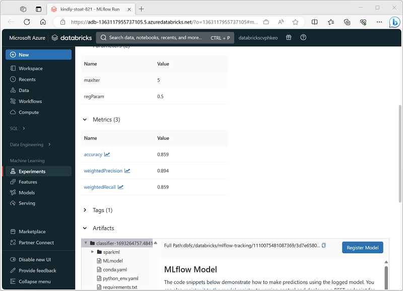

## Registering models

Model registration allows MLflow and Azure Databricks to keep track of models; which is important for two reasons:

* Registering a model allows you to serve the model for real-time, streaming, or batch inferencing. Registration makes the process of using a trained model easy, as now data scientists don't need to develop application code; the serving process builds that wrapper and exposes a REST API or method for batch scoring automatically.
* Registering a model allows you to create new versions of that model over time; giving you the opportunity to track model changes and even perform comparisons between different historical versions of models.

When you run an experiment to train a model, you can log the model itself as part of the experiment run, as shown here:

```python
with mlflow.start_run():
  # code to train model goes here

  # log the model itself (and the environment it needs to be used)
  unique_model_name = "my_model-" + str(time.time())
  mlflow.spark.log_model(spark_model = model,
                          artifact_path=unique_model_name,
                          conda_env=mlflow.spark.get_default_conda_env())
```

When you review the experiment run, including the logged metrics that indicate how well the model predicts, the model is included in the run artifacts. You can then select the option to register the model using the user interface in the experiment viewer.

Alternatively, if you want to register the model without reviewing the metrics in the run, you can include the registered_model_name parameter in the log_model method; in which case the model is automatically registered during the experiment run.

```python
with mlflow.start_run():
  # code to train model goes here

  # log the model itself (and the environment it needs to be used)
  unique_model_name = "my_model-" + str(time.time())
  mlflow.spark.log_model(spark_model=model,
                          artifact_path=unique_model_name
                          conda_env=mlflow.spark.get_default_conda_env(),
                          registered_model_name="my_model")
```

You can register multiple versions of a model, enabling you to compare the performance of model versions over a period of time before moving all client applications to the best performing version.

## Serving models

The process of using a model to predict labels from new feature data is known as inferencing. You can use MLflow in Azure Databricks to make models available for inferencing in the following ways:

* Host the model as a real-time service with an HTTP endpoint to which client applications can make REST requests.
* Use the model to perform perpetual streaming inferencing of labels based on a delta table of features, writing the results to an output table.
* Use the model for batch inferencing based on a delta table, writing the results of each batch operation to a specific folder.

You can deploy a model for inferencing from its page in the Models section of the Azure Databricks portal as shown here:

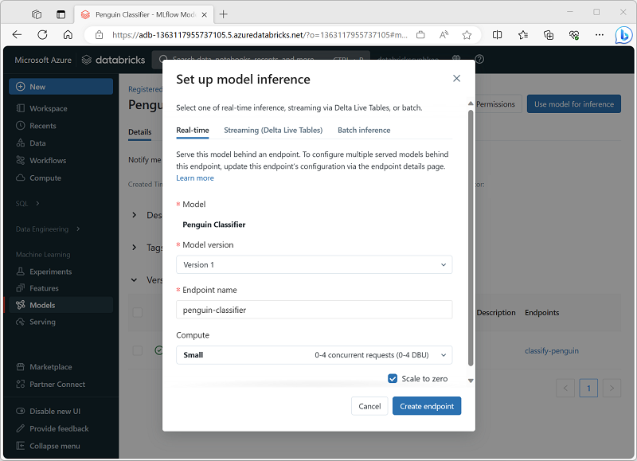

## lab

same dataset as before

```shell
%sh
rm -r /dbfs/mlflow_lab
mkdir /dbfs/mlflow_lab
wget -O /dbfs/mlflow_lab/penguins.csv https://raw.githubusercontent.com/MicrosoftLearning/mslearn-databricks/main/data/penguins.csv
```

prepare the data

```python
from pyspark.sql.types import *
from pyspark.sql.functions import *
   
data = spark.read.format("csv").option("header", "true").load("/mlflow_lab/penguins.csv")
data = data.dropna().select(col("Island").astype("string"),
                            col("CulmenLength").astype("float"),
                            col("CulmenDepth").astype("float"),
                            col("FlipperLength").astype("float"),
                            col("BodyMass").astype("float"),
                            col("Species").astype("int")
                          )
display(data.sample(0.2))
   
splits = data.randomSplit([0.7, 0.3])
train = splits[0]
test = splits[1]
print ("Training Rows:", train.count(), " Testing Rows:", test.count())
```

### Run an MLflow experiment

You can use the same libraries and techniques you normally use to train and evaluate a model (in this case, we’ll use the Spark MLLib library), but do so within the context of an MLflow experiment that includes additional commands to log important metrics and information during the process.

```python
import mlflow
import mlflow.spark
from pyspark.ml import Pipeline
from pyspark.ml.feature import StringIndexer, VectorAssembler, MinMaxScaler
from pyspark.ml.classification import LogisticRegression
from pyspark.ml.evaluation import MulticlassClassificationEvaluator
import time
   
# Start an MLflow run
with mlflow.start_run():
    catFeature = "Island"
    numFeatures = ["CulmenLength", "CulmenDepth", "FlipperLength", "BodyMass"]
     
    # parameters
    maxIterations = 5
    regularization = 0.5
   
    # Define the feature engineering and model steps
    catIndexer = StringIndexer(inputCol=catFeature, outputCol=catFeature + "Idx")
    numVector = VectorAssembler(inputCols=numFeatures, outputCol="numericFeatures")
    numScaler = MinMaxScaler(inputCol = numVector.getOutputCol(), outputCol="normalizedFeatures")
    featureVector = VectorAssembler(inputCols=["IslandIdx", "normalizedFeatures"], outputCol="Features")
    algo = LogisticRegression(labelCol="Species", featuresCol="Features", maxIter=maxIterations, regParam=regularization)
   
    # Chain the steps as stages in a pipeline
    pipeline = Pipeline(stages=[catIndexer, numVector, numScaler, featureVector, algo])
   
    # Log training parameter values
    print ("Training Logistic Regression model...")
    mlflow.log_param('maxIter', algo.getMaxIter())
    mlflow.log_param('regParam', algo.getRegParam())
    model = pipeline.fit(train)
      
    # Evaluate the model and log metrics
    prediction = model.transform(test)
    metrics = ["accuracy", "weightedRecall", "weightedPrecision"]
    for metric in metrics:
        evaluator = MulticlassClassificationEvaluator(labelCol="Species", predictionCol="prediction", metricName=metric)
        metricValue = evaluator.evaluate(prediction)
        print("%s: %s" % (metric, metricValue))
        mlflow.log_metric(metric, metricValue)
   
           
    # Log the model itself
    unique_model_name = "classifier-" + str(time.time())
    mlflow.spark.log_model(model, unique_model_name, mlflow.spark.get_default_conda_env())
    modelpath = "/model/%s" % (unique_model_name)
    mlflow.spark.save_model(model, modelpath)
       
    print("Experiment run complete.")
```

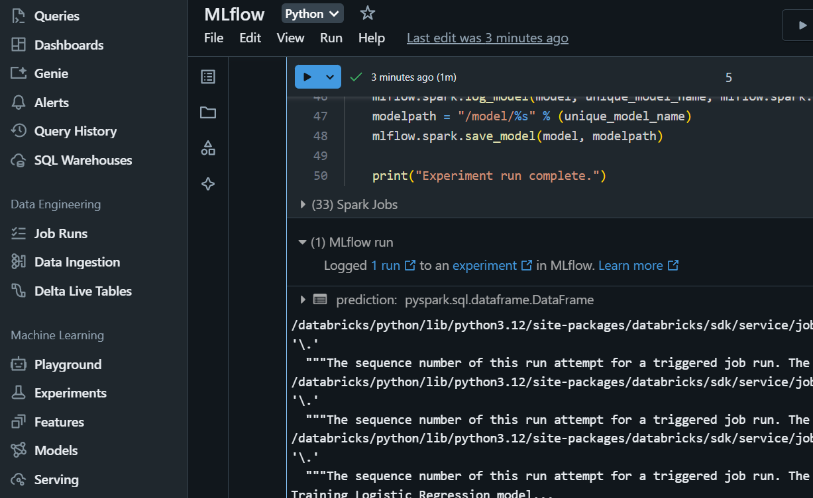

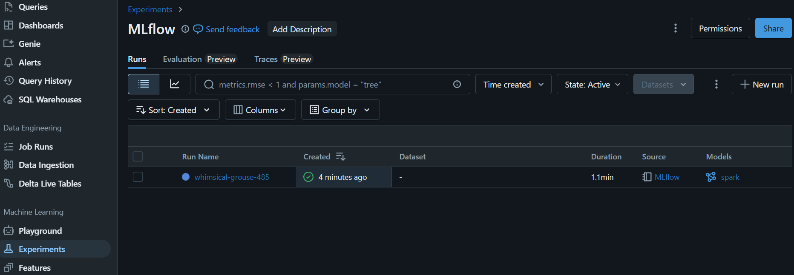

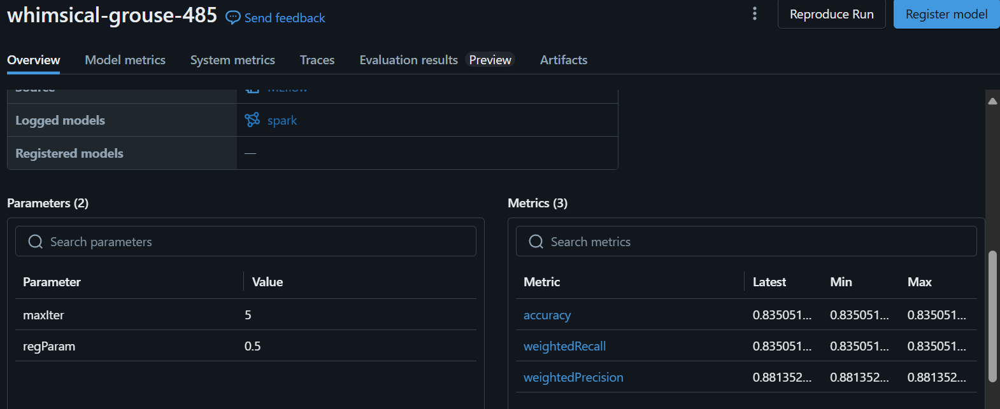

* Create a function

In machine learning projects, data scientists often try training models with different parameters, logging the results each time. To accomplish that, it’s common to create a function that encapsulates the training process and call it with the parameters you want to try.

Create a function based on the training code you used previously

```python
def train_penguin_model(training_data, test_data, maxIterations, regularization):
    import mlflow
    import mlflow.spark
    from pyspark.ml import Pipeline
    from pyspark.ml.feature import StringIndexer, VectorAssembler, MinMaxScaler
    from pyspark.ml.classification import LogisticRegression
    from pyspark.ml.evaluation import MulticlassClassificationEvaluator
    import time
   
    # Start an MLflow run
    with mlflow.start_run():
   
        catFeature = "Island"
        numFeatures = ["CulmenLength", "CulmenDepth", "FlipperLength", "BodyMass"]
   
        # Define the feature engineering and model steps
        catIndexer = StringIndexer(inputCol=catFeature, outputCol=catFeature + "Idx")
        numVector = VectorAssembler(inputCols=numFeatures, outputCol="numericFeatures")
        numScaler = MinMaxScaler(inputCol = numVector.getOutputCol(), outputCol="normalizedFeatures")
        featureVector = VectorAssembler(inputCols=["IslandIdx", "normalizedFeatures"], outputCol="Features")
        algo = LogisticRegression(labelCol="Species", featuresCol="Features", maxIter=maxIterations, regParam=regularization)
   
        # Chain the steps as stages in a pipeline
        pipeline = Pipeline(stages=[catIndexer, numVector, numScaler, featureVector, algo])
   
        # Log training parameter values
        print ("Training Logistic Regression model...")
        mlflow.log_param('maxIter', algo.getMaxIter())
        mlflow.log_param('regParam', algo.getRegParam())
        model = pipeline.fit(training_data)
   
        # Evaluate the model and log metrics
        prediction = model.transform(test_data)
        metrics = ["accuracy", "weightedRecall", "weightedPrecision"]
        for metric in metrics:
            evaluator = MulticlassClassificationEvaluator(labelCol="Species", predictionCol="prediction", metricName=metric)
            metricValue = evaluator.evaluate(prediction)
            print("%s: %s" % (metric, metricValue))
            mlflow.log_metric(metric, metricValue)
   
   
        # Log the model itself
        unique_model_name = "classifier-" + str(time.time())
        mlflow.spark.log_model(model, unique_model_name, mlflow.spark.get_default_conda_env())
        modelpath = "/model/%s" % (unique_model_name)
        mlflow.spark.save_model(model, modelpath)
   
        print("Experiment run complete.")
```

call it

```python
train_penguin_model(train, test, 10, 0.2)
```

### Register and deploy a model with MLflow

You’ve already logged the model trained by each experiment run. You can also register models and deploy them so they can be served to client applications. Model serving is only supported in Azure Databricks Premium workspaces, and is restricted to certain [regions](https://learn.microsoft.com/azure/databricks/resources/supported-regions).

* View the details page for the most recent experiment run.
* Use the Register Model button to register the model that was logged in that experiment and when prompted, create a new model named Penguin Predictor.
* When the model has been registered, view the Models page (in the navigation bar on the left) and select the Penguin Predictor model.
* In the page for the Penguin Predictor model, use the Use model for inference button to create a new real-time endpoint with the following settings:
  * Model: Penguin Predictor
  * Model version: 1
  * Endpoint: predict-penguin
  * Compute size: Small

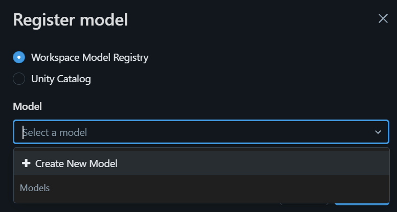

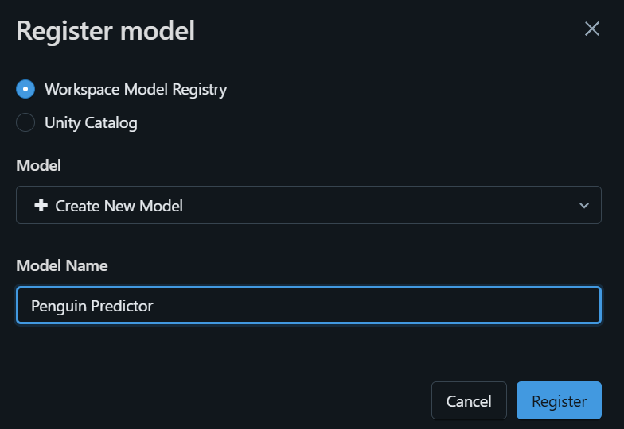

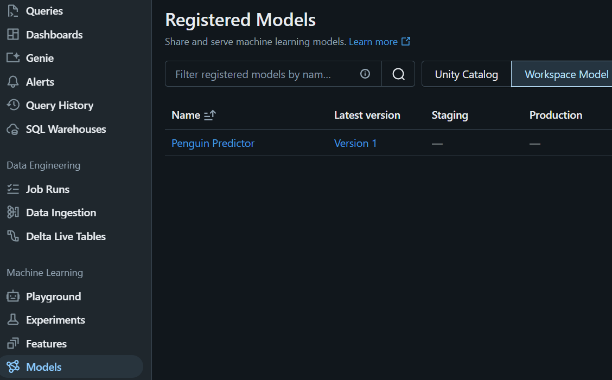

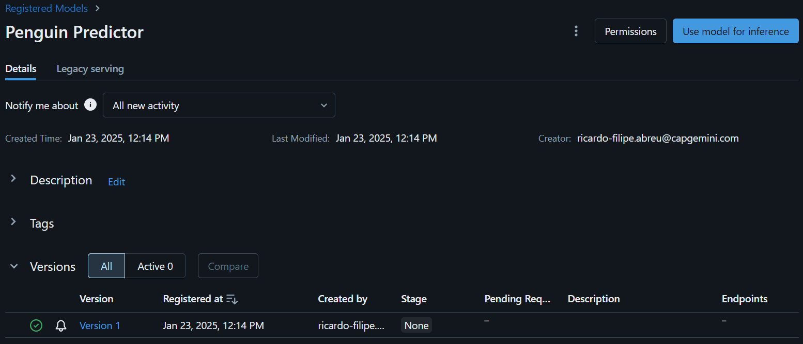

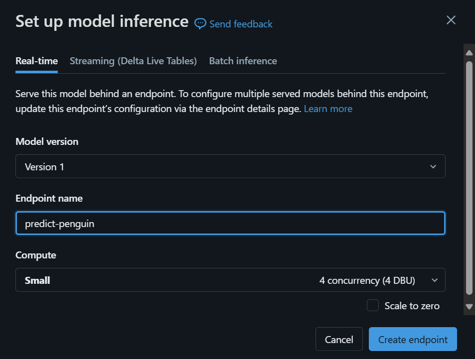

The serving endpoint is hosted in a new cluster, which it may take several minutes to create.

When the endpoint has been created, use the Query endpoint button at the top right to open an interface from which you can test the endpoint. Then in the test interface, on the Browser tab, enter the following JSON request and use the Send Request button to call the endpoint and generate a prediction.

```json
{
  "dataframe_records": [
  {
    "Island": "Biscoe",
    "CulmenLength": 48.7,
    "CulmenDepth": 14.1,
    "FlipperLength": 210,
    "BodyMass": 4450
  }
  ]
}
```

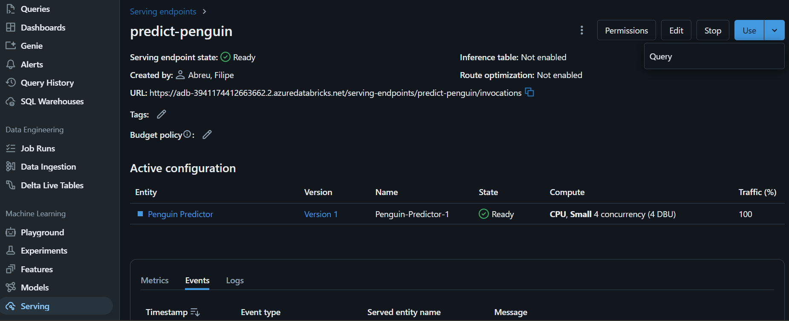

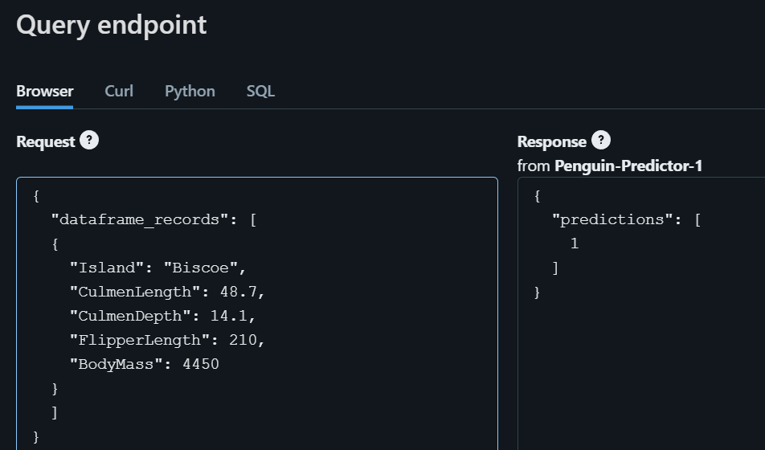

### Clean up

When the endpoint is not longer required, you should delete it to avoid unnecessary costs.

In the predict-penguin endpoint page, in the ⁝ menu, select Delete.
