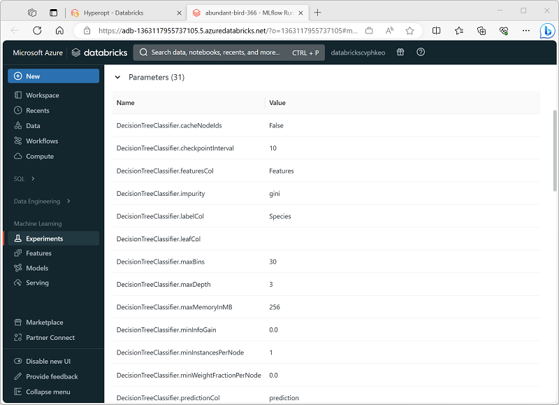
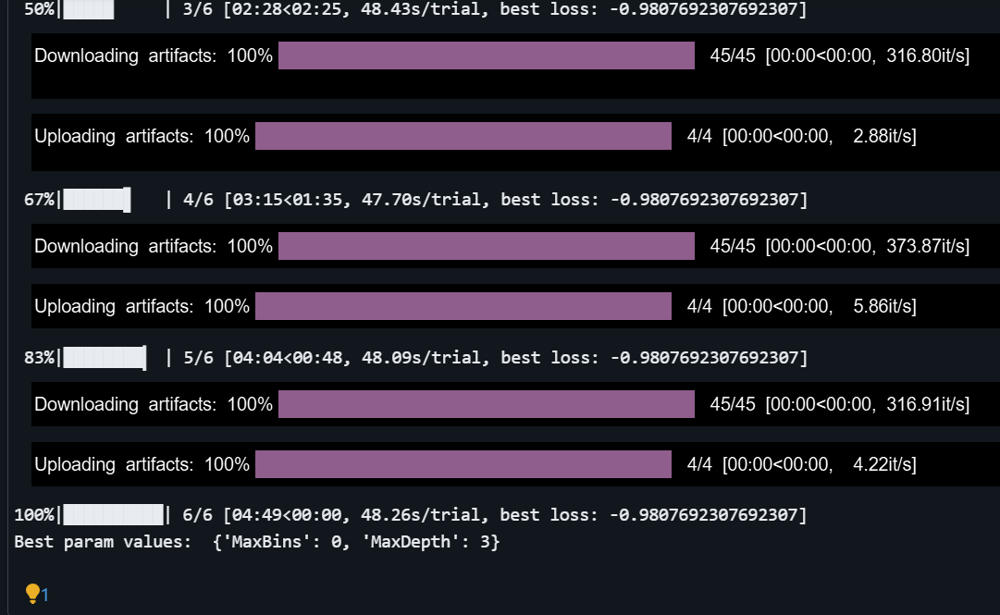

# module 3

* Tune hyperparameters in Azure Databricks

  * Optimize hyperparameters with Hyperopt
  * Review Hyperopt trials
  * Scale Hyperopt trials
  * [lab](https://microsoftlearning.github.io/mslearn-databricks/Instructions/Exercises/DS-06-Tune-hyperparameters.html)

## Hyperopt

Hyperparameter tuning is the process in which you repeatedly train and evaluate models using different combinations of hyperparameters until you find the values that work best for your data.

Hyperopt is an open source Python library for hyperparameter tuning.

* <https://hyperopt.github.io/hyperopt/>

Hyperopt is automatically installed when you create a cluster with an ML variant of the Databricks Runtime. To use it when training a model, follow these steps:

* Define an objective function to train and evaluate a model.
* Define the hyperparameter search space.
* Specify the search algorithm.
* Run the Hyperopt fmin function to optimize the training function.

```none
WARNING:dbruntime.MLDeprecationWarning.hyperopt:Hyperopt is deprecated for Databricks runtime for machine learning and will not be pre-installed in the next major version.
```

You should migrate to one of these

* Optuna
* Ray Tune
* Azure HyperDrive (managed service)
* Dask - grid search or random search

> The open-source version of Hyperopt is no longer being maintained.
Hyperopt will be removed in the next major DBR ML version. Azure Databricks recommends using either Optuna for single-node optimization or RayTune for a similar experience to the deprecated Hyperopt distributed hyperparameter tuning functionality. Learn more about using RayTune on Azure Databricks.

<https://learn.microsoft.com/en-us/azure/databricks/machine-learning/automl-hyperparam-tuning/>

that said, let's keep going with the copying and pasting

### define the objective function

Hyperopt works by iteratively calling a function (often referred to as the objective function) that returns a numeric value and tuning the parameters passed to the function so that the return value is minimized; an approach commonly referred to as optimization. The first requirement therefore is to encapsulate your model training and evaluation logic in a function that:

* Accepts a parameter containing a list of hyperparameter values.
* Trains a model using the provided hyperparameter values.
* Evaluates the model based on a target metric for predictive performance.
* Returns a numeric value that reflects the performance metric such that improving the model performance lowers the return value.

```python
def objective(params):
    from pyspark.ml.classification import LogisticRegression
    from pyspark.ml.evaluation import MulticlassClassificationEvaluator
    from hyperopt import STATUS_OK

    data_df = get_training_data() # This is just an example!
    splits = data_df.randomSplit([0.7, 0.3])
    training_df = splits[0]
    validation_df = splits[1]

    # Train a model using the provided hyperparameter values
    lr = LogisticRegression(labelCol="label", featuresCol="features",
                            maxIter=params['Iterations'],
                            regParam=params['Regularization'])
    model = lr.fit(training_df)

    # Evaluate the model
    predictions = model.transform(validation_df)
    eval = MulticlassClassificationEvaluator(labelCol="label",
                                             predictionCol="prediction",
                                             metricName="accuracy")
    accuracy = eval.evaluate(predictions)
    
    # Hyperopt *minimizes* the function, so return *negative* accuracy.
    return {'loss': -accuracy, 'status': STATUS_OK}
```

In this example, the params parameter is a dictionary containing values for two named values: Iterations and Regularization. These values are assigned to the maxIter and regParam hyperparameters of the logistic regression algorithm used to train the model.

The function then evaluates the trained model to calculate its accuracy metric, which is a value between 0.0 and 1.0 indicating the proportion of predictions the model made that were correct.

Finally, the function returns a value that Hyperopt should minimize to improve the model. In this case, the target metric is accuracy, for which a higher value indicates a better model; so the function returns the negative of this value (so the higher the accuracy, the lower the return value).

### define the hyperparameter search space

Each time the objective function is called, it requires a parameter containing the hyperparameter values to be tried. To try all possible value combinations, you need to define a search space for Hyperopt to select values from for each trial.

Hyperopt provides [parameter expressions](https://hyperopt.github.io/hyperopt/getting-started/search_spaces#parameter-expressions) that you can use to define a range of values for each hyperparameter, including:

* `hp.choice(label, options)`: Returns one of the options you listed.
* `hp.randint(label, upper)`: Returns a random integer in the range [0, upper].
* `hp.uniform(label, low, high)`: Returns a value uniformly between low and high.
* `hp.normal(label, mu, sigma)`: Returns a real value that's normally distributed with mean mu and standard deviation sigma.

The following example code defines a search space for the hyperparameters used in the previous example:

```python
from hyperopt import hp

search_space = {
    'Iterations': hp.randint('Iterations', 10),
    'Regularization': hp.uniform('Regularization', 0.0, 1.0)
}
```

### specify the search algorithm

Hyperopt uses a search algorithm to select hyperparameter values from the search space and try to optimize the objective function. There are two main choices in how Hyperopt samples over the search space:

* `hyperopt.tpe.suggest`: Tree of Parzen Estimators (TPE), a Bayesian approach that adaptively selects new hyperparameter settings based on past results.
* `hyperopt.rand.suggest`: Random search, a nonadaptive approach that samples randomly over the search space.

The following example code specifies the TPE algorithm.

```python
from hyperopt import tpe

algo = tpe.suggest
```

### run the fmin function

Finally, to execute a Hyperopt run, you can use the fmin function, which repeatedly calls the objective function using hyperparameter combinations from the search space based on the search algorithm. The goal of the fmin function is to minimize the value returned by the objective function (and therefore optimizing the performance of the model).

The following example code uses the fmin function to call the objective function defined previously. The search space and algorithm defined in previous examples are used, and the function is evaluated up to 100 times before the fmin function returns the best-performing parameter value combination that was found.

```python
from hyperopt import fmin

argmin = fmin(
  fn=objective,
  space=search_space,
  algo=algo,
  max_evals=100)

print("Best param values: ", argmin)
```

The output from the previous code looks similar to the following example.

```none
Best param values:  {'Iterations': 6, 'Regularization': 0.5461699702338606}
```

## Review Hyperopt trials

When you use Hyperopt to try multiple hyperparameter combinations, you can review the details of each trial. You can review these details in two ways:

* View the MLflow run for each trial.

  In Azure Databricks, calls to the Hyperopt fmin function automatically generate MLflow experiment runs that you can view in the Azure Databricks portal; providing you with an easy way to view the full set of hyperparameters and metrics for each trial, as shown here:

  

* Use the Trials class to capture run details.

Hyperopt includes a Trials class that logs details for each trial that is run during an fmin function call.

```python
from hyperopt import Trials

# Create a Trials object to track each run
trial_runs = Trials()

argmin = fmin(
  fn=objective,
  space=search_space,
  algo=algo,
  max_evals=100,
  trials=trial_runs)

print("Best param values: ", argmin)

# Get details from each trial run
print ("trials:")
for trial in trial_runs.trials:
    print ("\n", trial)
```

The full detail output for a collection of trials resembles this example:

```none
{'state': 2, 'tid': 0, 'spec': None, 'result': {'loss': -0.8571428571428571, 'status': 'ok'}, 'misc': {'tid': 0, 'cmd': ('domain_attachment', 'FMinIter_Domain'), 'workdir': None, 'idxs': {'Iterations': [0], 'Regularization': [0]}, 'vals': {'Iterations': [1], 'Regularization': [0.4965634473237057]}}, 'exp_key': None, 'owner': None, 'version': 0, 'book_time': datetime.datetime(2023, 3, 17, 22, 45, 24, 993000), 'refresh_time': datetime.datetime(2023, 3, 17, 22, 46, 30, 374000)}

 {'state': 2, 'tid': 1, 'spec': None, 'result': {'loss': -0.8857142857142857, 'status': 'ok'}, 'misc': {'tid': 1, 'cmd': ('domain_attachment', 'FMinIter_Domain'), 'workdir': None, 'idxs': {'Iterations': [1], 'Regularization': [1]}, 'vals': {'Iterations': [9], 'Regularization': [0.8446551490616772]}}, 'exp_key': None, 'owner': None, 'version': 0, 'book_time': datetime.datetime(2023, 3, 17, 22, 46, 30, 379000), 'refresh_time': datetime.datetime(2023, 3, 17, 22, 47, 34, 155000)}

 {'state': 2, 'tid': 2, 'spec': None, 'result': {'loss': -0.9523809523809523, 'status': 'ok'}, 'misc': {'tid': 2, 'cmd': ('domain_attachment', 'FMinIter_Domain'), 'workdir': None, 'idxs': {'Iterations': [2], 'Regularization': [2]}, 'vals': {'Iterations': [9], 'Regularization': [0.3931915704555482]}}, 'exp_key': None, 'owner': None, 'version': 0, 'book_time': datetime.datetime(2023, 3, 17, 22, 47, 34, 160000), 'refresh_time': datetime.datetime(2023, 3, 17, 22, 48, 45, 986000)}

 ...
```

When using Hyperopt with a distributed training library like MLlib, the work is automatically scaled across the available worker nodes in the cluster.

Hyperopt supports the scaling out of hyperparameter tuning trials for libraries that aren't distributed by using the SparkTrials class in place of a regular Trials class. This approach enables you to take advantage of scale-out parallelism of Spark to distribute hyperparameter tuning runs across multiple nodes, even when using a library that is designed for processing on a single computer such as Scikit-Learn.

```python
from hyperopt import SparkTrials

  spark_trials = SparkTrials()
  with mlflow.start_run():
    argmin = fmin(
      fn=objective,
      space=search_space,
      algo=algo,
      max_evals=100,
      trials=spark_trials)
  
  print("Best param values: ", argmin)
```

## lab

same dataset as before. Prepare the data as before

* create the objective function

  uses the penguin data to rain a classification model that predicts the species of a penguin based on its location and measurements

  ```python
  from hyperopt import STATUS_OK
  import mlflow
  from pyspark.ml import Pipeline
  from pyspark.ml.feature import StringIndexer, VectorAssembler, MinMaxScaler
  from pyspark.ml.classification import DecisionTreeClassifier
  from pyspark.ml.evaluation import MulticlassClassificationEvaluator
    
  def objective(params):
      # Train a model using the provided hyperparameter value
      catFeature = "Island"
      numFeatures = ["CulmenLength", "CulmenDepth", "FlipperLength", "BodyMass"]
      catIndexer = StringIndexer(inputCol=catFeature, outputCol=catFeature + "Idx")
      numVector = VectorAssembler(inputCols=numFeatures, outputCol="numericFeatures")
      numScaler = MinMaxScaler(inputCol = numVector.getOutputCol(), outputCol="normalizedFeatures")
      featureVector = VectorAssembler(inputCols=["IslandIdx", "normalizedFeatures"], outputCol="Features")
      mlAlgo = DecisionTreeClassifier(labelCol="Species",    
                                      featuresCol="Features",
                                      maxDepth=params['MaxDepth'], maxBins=params['MaxBins'])
      pipeline = Pipeline(stages=[catIndexer, numVector, numScaler, featureVector, mlAlgo])
      model = pipeline.fit(train)
        
      # Evaluate the model to get the target metric
      prediction = model.transform(test)
      eval = MulticlassClassificationEvaluator(labelCol="Species", predictionCol="prediction", metricName="accuracy")
      accuracy = eval.evaluate(prediction)
        
      # Hyperopt tries to minimize the objective function, so you must return the negative accuracy.
      return {'loss': -accuracy, 'status': STATUS_OK}
  ```

* define a search space, specify the Hyperopt algorithm, use hyperopt.fmin

  ```python
  from hyperopt import fmin, tpe, hp
    
  # Define a search space for two hyperparameters (maxDepth and maxBins)
  search_space = {
      'MaxDepth': hp.randint('MaxDepth', 10),
      'MaxBins': hp.choice('MaxBins', [10, 20, 30])
  }
    
  # Specify an algorithm for the hyperparameter optimization process
  algo=tpe.suggest
    
  # Call the training function iteratively to find the optimal hyperparameter values
  argmin = fmin(
    fn=objective,
    space=search_space,
    algo=algo,
    max_evals=6)
    
  print("Best param values: ", argmin)
  ```

  Observe as the code iteratively runs the training function 6 times (based on the max_evals setting). Each run is recorded by MLflow. Each run is assigned a random name, and you can view each of them in the MLflow run viewer to see details of parameters and metrics that were recorded.

  When all of the runs have finished, observe that the code displays details of the best hyperparameter values that were found (the combination that resulted in the least loss). In this case, the MaxBins parameter is defined as a choice from a list of three possible values (10, 20, and 30) - the best value indicates the zero-based item in the list (so 0=10, 1=20, and 2=30). The MaxDepth parameter is defined as a random integer between 0 and 10, and the integer value that gave the best result is displayed.

  

* use the Trials class to log run details

  In addition to using MLflow experiment runs to log details of each iteration, you can also use the hyperopt.Trials class to record and view details of each run.

  ```python
  from hyperopt import Trials
    
  # Create a Trials object to track each run
  trial_runs = Trials()
    
  argmin = fmin(
    fn=objective,
    space=search_space,
    algo=algo,
    max_evals=3,
    trials=trial_runs)
    
  print("Best param values: ", argmin)
    
  # Get details from each trial run
  print ("trials:")
  for trial in trial_runs.trials:
      print ("\n", trial)
  ```
