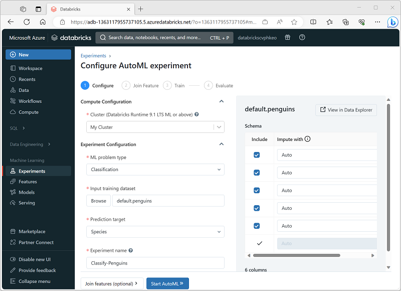
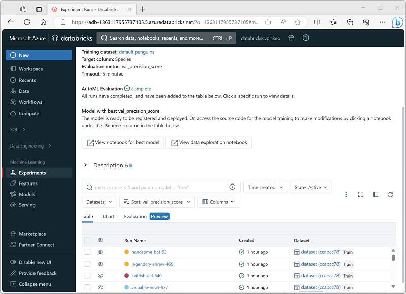
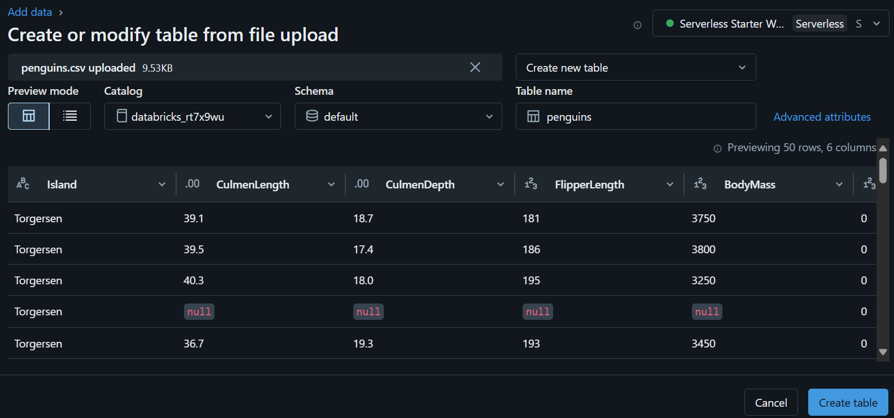
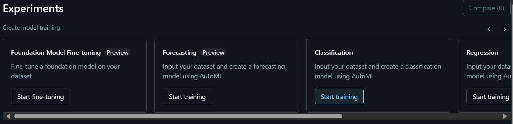

# module 4

* Use AutoML in Azure Databricks

  * What is AutoML?
  * Use AutoML in the Azure Databricks user interface
  * Use code to run an AutoML experiment
  * [lab](https://microsoftlearning.github.io/mslearn-databricks/Instructions/Exercises/DS-05-Use-AutoML.html)

## AutoML

* <https://learn.microsoft.com/en-us/azure/databricks/machine-learning/automl/>

AutoML works by generating multiple experiment runs, each one training a model using a different algorithm and hyperparameter combination. In each run, a model is trained and evaluated based on the data and predictive metric that you specify.

Azure Databricks has an AutoML feature that automates the process of training and validating models using different algorithms and hyperparameters. AutoML significantly reduces the effort needed to run and track model training experiments.

* You start an AutoML experiment, specifying a table in your Azure Databricks workspace as the data source for training and the specific performance metric for which you want to optimize.
* The AutoML experiment generates multiple MLflow runs, each producing a notebook with code to preprocess the data before training and validating a model. The trained models are saved as artifacts in the MLflow runs or files in the DBFS store.
* The experiment runs are listed in order of performance, with the best performing models shown first. You can explore the notebooks that were generated for each run, choose the model you want to use, and then register and deploy it.

### AutoML experiment steps

* Prepare data for AutoML

  To provide this data, create a table in the Hive metastore in your Azure Databricks workspace.

* Configure an AutoML experiment

  you must specify the settings for your specific model training requirements, including:

  * The cluster on which you run the experiment.
  * The type of machine learning model to be trained (clustering, regression, or forecasting).
  * The table containing the training data.
  * The target label field to the model needs to predict.
  * A unique name for the AutoML experiment (child runs for each training trial are uniquely named automatically).
  * The evaluation metric you want to use to determine the best performing model.
  * The machine learning training frameworks you want to try.
  * The maximum time for the experiment.
  * The positive label value (for binary classification only).
  * The time column (for forecasting models only).
  * Where to save the trained models (as MLflow artifacts or in the DBFS store).

  

* Review AutoML results

  As the AutoML experiment progresses, its child runs are displayed, with the experiment that produced the best performing model so far first.

  

### Use code to run an AutoML experiment

If you want to run an AutoML experiment as part of an automated machine learning operations (ML Ops) process, you can write code to configure and initiate an AutoML experiment. To configure the specific details for an AutoML experiment, you must write code that uses the `classify`, `regress`, or `forecast` method as appropriate with the parameters for your specific needs.

For example, the following code runs a classification AutoML experiment.

```python
from databricks import automl

# Get the training data
train_df = spark.sql("SELECT * FROM penguins")

# Configure and initiate the AutoML experiment
summary = automl.classify(train_df, target_col="Species",
                          primary_metric="precision", timeout_minutes=5)

# Get the best model
model_uri = summary.best_trial.model_path
```

## lab

* Upload training data to a SQL Warehouse

  uses the `penguins.csv`

  

* Create an AutoML experiment

  On the Experiments page, select Create AutoML experiment.

  * Cluster: Select your cluster
  * ML problem type: Classification
  * Input training dataset: Browse to the default database and select the penguins table
  * Prediction target: Species
  * Experiment name: Penguin-classification
  * Advanced configuration:
    * Evaluation metric: Precision
    * Training frameworks: lightgbm, sklearn, xgboost
    * Timeout: 5
    * Time column for training/validation/testing split: Leave blank
    * Positive label: Leave blank
    * Intermediate data storage location: MLflow Artifact
  
  

* Deploy the best performing model

  In the Penguin-classification experiment page, select View notebook for best model to open the notebook used to rain the model in a new browser tab. In the Artifacts section, note that the model has been saved as an MLflow artifact. Then use the Register model button to register the model as a new model named Penguin-Classifier.
