# module 1

* Explore Azure Databricks

  * Get started with Azure Databricks
  * Identify Azure Databricks workloads
  * Understand key concepts
  * Data governance using Unity Catalog and Microsoft Purview
  * [lab](https://microsoftlearning.github.io/mslearn-databricks/Instructions/Exercises/LA-01-Explore-Azure-Databricks.html)

Azure Databricks is a

* data analytics platform
* Microsoft Azure-based version of the popular open-source Databricks platform.

## Creating an Workspace

To use Azure Databricks, you must create an Azure Databricks workspace in your Azure subscription.

When you create a workspace, you must specify one of the following pricing tiers.

* Standard - Core Apache Spark capabilities with Microsoft Entra ID integration.
* Premium - Role-based access controls and other enterprise-level features.
* Trial - A 14-day free trial of a premium-level workspace

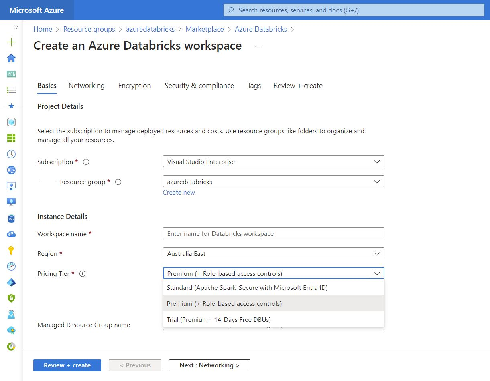

## Using the Portal

After you provision an Azure Databricks workspace, you can use the Azure Databricks portal to work with data and compute resources. The Azure Databricks portal is a web-based user interface where you can create and manage workspace resources, such as Spark clusters, and use notebooks and queries to work with data in files and tables.

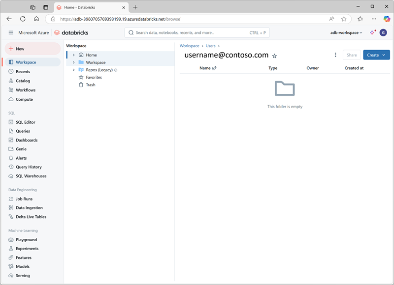

### identify workloads

* Data Engineering

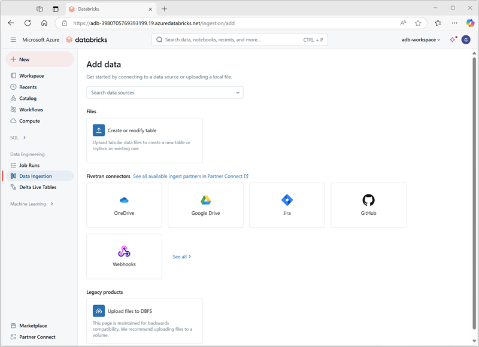

* Machine Learning

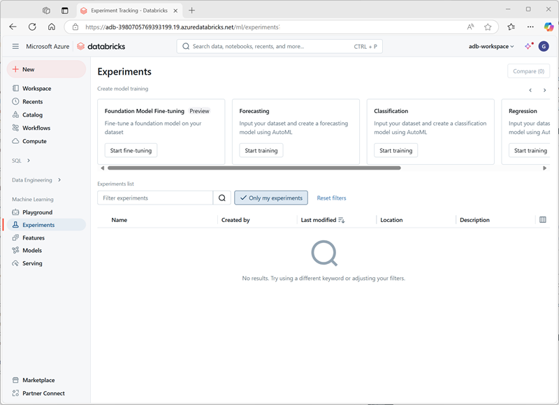

* SQL

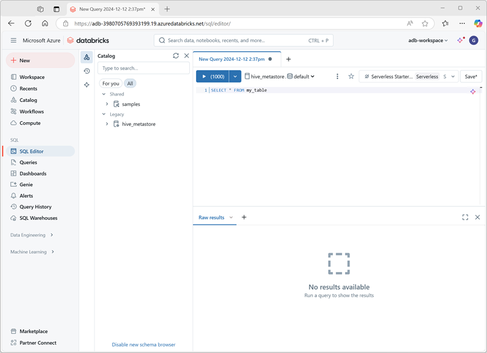

## Data Governance Tools

Data governance can be implemented using Unity Catalog and Microsoft Purview

Unity Catalog in Azure Databricks is a centralized metastore that manages metadata for all data assets and AI assets across Databricks workspaces.

Microsoft Purview is a unified data governance service that helps you manage and govern your on-premises, multicloud, and software-as-a-service (SaaS) data. It provides capabilities like data discovery, data classification, data lineage, and data access governance.

## lab

* Sign into the Azure portal at <https://portal.azure.com>
* Create an Azure Databricks resource
  * Subscription: Select your Azure subscription
  * Resource group: Create a new resource group named msl-xxxxxxx (where “xxxxxxx” is a unique value)
  * Workspace name: databricks-xxxxxxx (where “xxxxxxx” is the value used in the resource group name)
  * Region: Select any available region
  * Pricing tier: Premium or Trial
  * Managed Resource Group name: databricks-xxxxxxx-managed (where “xxxxxxx” is the value used in the resource group name)

  After that, launch the Workspace

* Create a cluster

  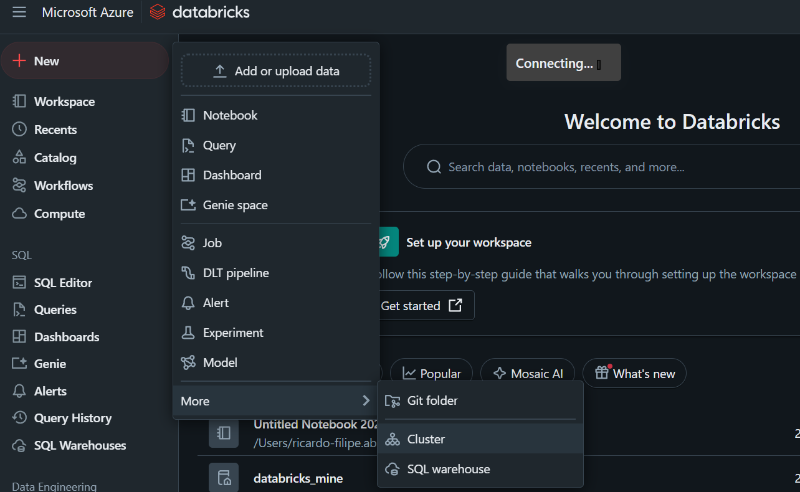

  Each cluster consists of a driver node to coordinate the work, and worker nodes to perform processing tasks.

  To create a single-node cluster (In a production environment, you’d typically create a cluster with multiple worker nodes)

  * Cluster name: User Name’s cluster (the default cluster name)
  * Policy: Unrestricted
  * Cluster mode: Single Node
  * Access mode: Single user (with your user account selected)
  * Databricks runtime version: 13.3 LTS (Spark 3.4.1, Scala 2.12) or later
  * Use Photon Acceleration: Selected
  * Node type: Standard_D4ds_v5
  * Terminate after 20 minutes of inactivity

  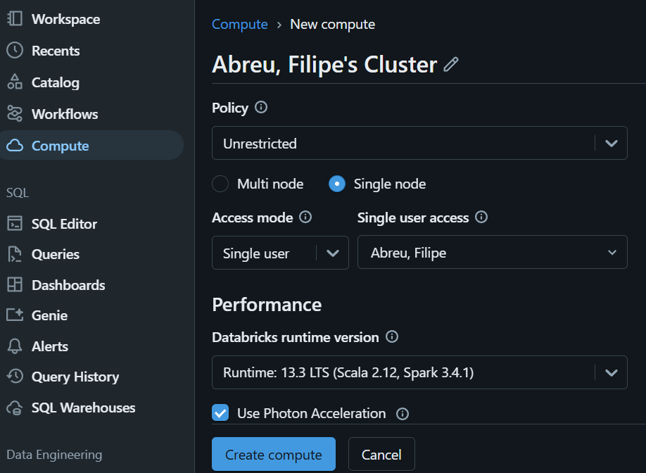

  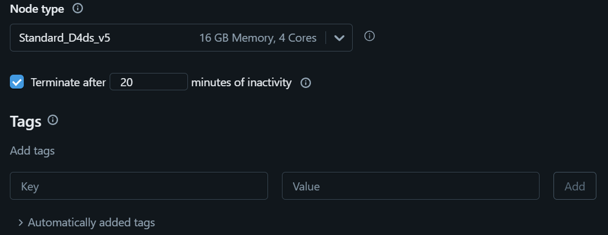

* Use Spark to analyze data

  Download the products.csv file from <https://raw.githubusercontent.com/MicrosoftLearning/mslearn-databricks/main/data/products.csv> to your local computer, saving it as products.csv.

  (+) New link menu, select Add or upload data > Create or modify table and upload the products.csv

  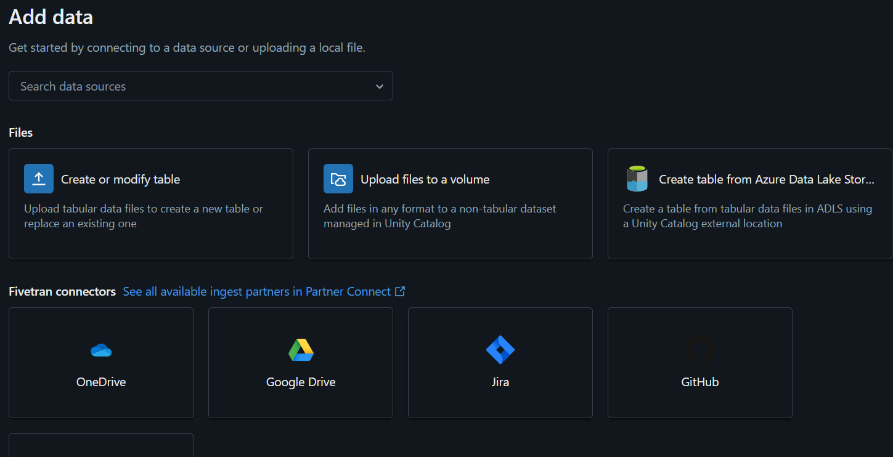

  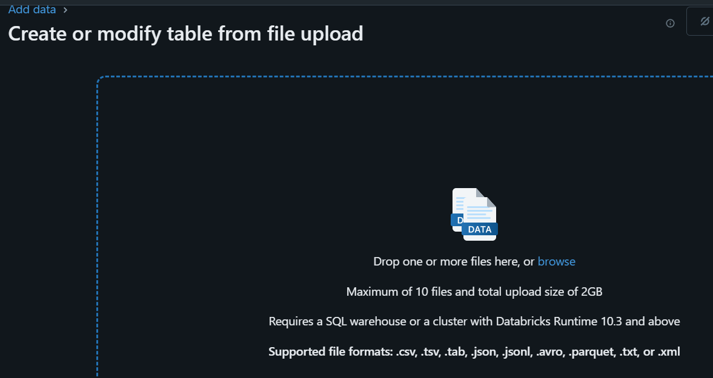

  choose the hive_metastore catalog and its default schema to create a new table named products.

  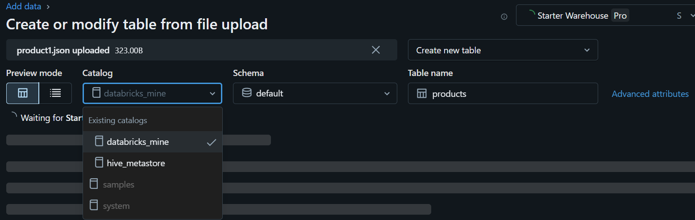

  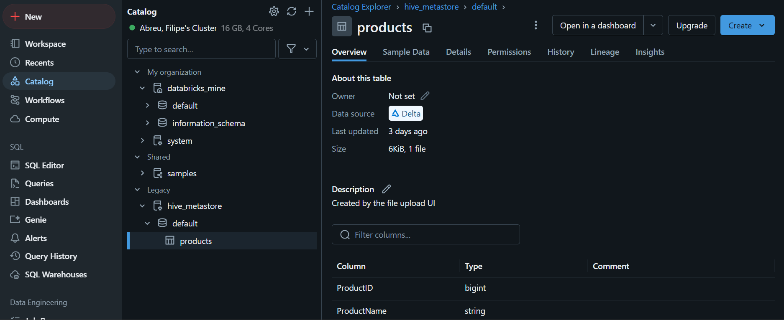

  Create a notebook

  Run SQL code

  ```sql
  %sql
  SELECT * FROM `hive_metastore`.`default`.`products`;
  ```

  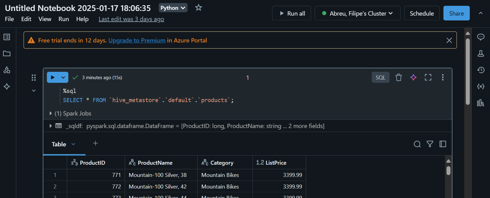

  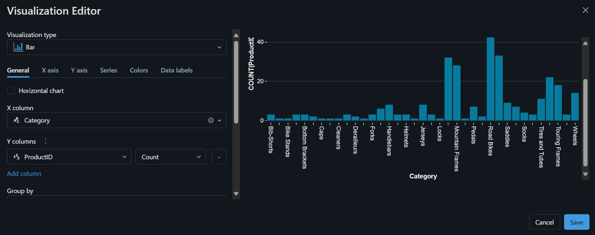

  Use Spark dataframes

  ```python
  df = spark.sql("SELECT * FROM hive_metastore.default.products")
  df = df.filter("Category == 'Road Bikes'")
  display(df)
  ```

  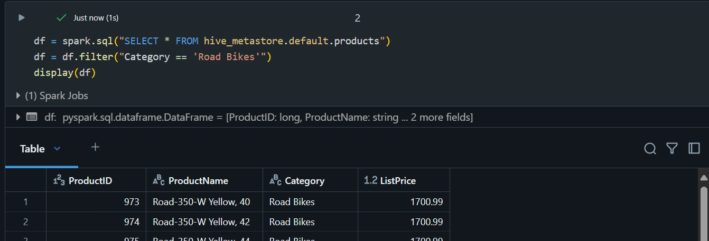

* Clean up

  In Azure Databricks portal, on the Compute page, select your cluster and select ■ Terminate to shut it down.

  If you’ve finished exploring Azure Databricks, you can delete the resources you’ve created to avoid unnecessary Azure costs and free up capacity in your subscription.
