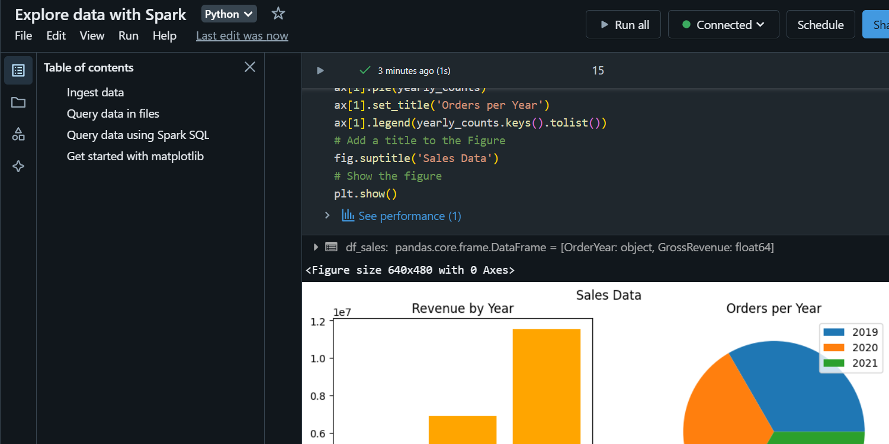

# module 2

* Perform data analysis with Azure Databricks

  * Ingest data with Azure Databricks
  * Data exploration tools in Azure Databricks
  * Data analysis using DataFrame APIs
  * [lab](https://microsoftlearning.github.io/mslearn-databricks/Instructions/Exercises/LA-02-Explore-data.html)

## Spark DataFrame API

<https://learn.microsoft.com/en-us/azure/databricks/getting-started/dataframes>

To create a simple DataFrame

```python
data = [("Alice", 34), ("Bob", 45), ("Cathy", 29)]
columns = ["Name", "Age"]
df = spark.createDataFrame(data, columns)
```

DataFrames support operations like filtering, aggregation, and joining

```python

# Select columns
df.select("Name").show()

# Filter rows
df.filter(df["Age"] > 30).show()

# Group by and aggregate
df.groupBy("Age").count().show()
```

To filter the DataFrame using a SQL query, you first create a temporary view:

```python
df.createOrReplaceTempView("people")

sql_df = spark.sql("SELECT Name, Age FROM people WHERE Age > 30")
```

## using libraries and APIs

<https://learn.microsoft.com/en-us/azure/databricks/libraries/>

* install open-source libraries
* use Spark's MLlib
* visualize data with external visualization tools

  Besides built-in chart options, Azure Databricks integrates with external visualization tools like Tableau or Power BI through data visualization APIs

## lab

* Provision an Azure Databricks workspace

  The script (`setup.ps1`) attempts to create a Premium tier Azure Databricks workspace resource in a region in which your Azure subscription has sufficient quota for the compute cores required in this exercise; and assumes your user account has sufficient permissions in the subscription to create an Azure Databricks workspace resource.

  ```shell
  rm -r mslearn-databricks -f

  # get the code
  git clone https://github.com/MicrosoftLearning/mslearn-databricks

  # run the setup.ps1 script
  ./mslearn-databricks/setup.ps1
  ```

* Create a cluster

  same as before

* Create a notebook

  same as before

* Ingest data

In the first cell of the notebook, enter the following code, which uses shell commands to download data files from GitHub into the file system used by your cluster.

```sh
 %sh
 rm -r /dbfs/spark_lab
 mkdir /dbfs/spark_lab
 wget -O /dbfs/spark_lab/2019.csv https://raw.githubusercontent.com/MicrosoftLearning/mslearn-databricks/main/data/2019.csv
 wget -O /dbfs/spark_lab/2020.csv https://raw.githubusercontent.com/MicrosoftLearning/mslearn-databricks/main/data/2020.csv
 wget -O /dbfs/spark_lab/2021.csv https://raw.githubusercontent.com/MicrosoftLearning/mslearn-databricks/main/data/2021.csv
```

  this actually didn't work for me tho... But this did it

  ```python
  # File URLs
  urls = [
      "https://raw.githubusercontent.com/MicrosoftLearning/mslearn-databricks/main/data/2019.csv",
      "https://raw.githubusercontent.com/MicrosoftLearning/mslearn-databricks/main/data/2020.csv",
      "https://raw.githubusercontent.com/MicrosoftLearning/mslearn-databricks/main/data/2021.csv",
  ]

  # Create the DBFS directory
  dbutils.fs.mkdirs("/spark_lab")

  # Download and save each file
  import requests

  for url in urls:
    file_name = url.split("/")[-1]
    response = requests.get(url)
    
    # Write the content to DBFS
    dbutils.fs.put(f"/spark_lab/{file_name}", response.text, overwrite=True)
    print(f"Saved {file_name} to /spark_lab/")
  ```

  ```python
  # check that the files have been saved correctly
  display(dbutils.fs.ls("/spark_lab"))
  ```

* Query data in files

  ```python
  # Load all CSV files in the spark_lab directory
  df = spark.read.load('/spark_lab/*.csv', format='csv', header=True, inferSchema=True)

  # Display the first 100 rows
  display(df.limit(100))
  ```

  View the output and note that the data in the file relates to sales orders, but doesn’t include the column headers or information about the data types. To make more sense of the data, you can define a schema for the dataframe.

  ```python
  from pyspark.sql.types import *
  from pyspark.sql.functions import *
  orderSchema = StructType([
      StructField("SalesOrderNumber", StringType()),
      StructField("SalesOrderLineNumber", IntegerType()),
      StructField("OrderDate", DateType()),
      StructField("CustomerName", StringType()),
      StructField("Email", StringType()),
      StructField("Item", StringType()),
      StructField("Quantity", IntegerType()),
      StructField("UnitPrice", FloatType()),
      StructField("Tax", FloatType())
  ])
  df = spark.read.load('/spark_lab/*.csv', format='csv', schema=orderSchema)
  display(df.limit(100))
  ```

  Observe that this time, the dataframe includes column headers.

  ```python
  df.printSchema()
  ```

* Query data using Spark SQL

```python
df.createOrReplaceTempView("salesorders")
spark_df = spark.sql("SELECT * FROM salesorders")
display(spark_df)
```

```sql
%sql
    
SELECT * FROM salesorders
```

* Use matplotlib

  ```python
  sqlQuery = "SELECT CAST(YEAR(OrderDate) AS CHAR(4)) AS OrderYear, \
                  SUM((UnitPrice * Quantity) + Tax) AS GrossRevenue \
          FROM salesorders \
          GROUP BY CAST(YEAR(OrderDate) AS CHAR(4)) \
          ORDER BY OrderYear"
  df_spark = spark.sql(sqlQuery)
  df_spark.show()
  ```

  ```python
  from matplotlib import pyplot as plt
      
  # matplotlib requires a Pandas dataframe, not a Spark one
  df_sales = df_spark.toPandas()
  # Create a bar plot of revenue by year
  plt.bar(x=df_sales['OrderYear'], height=df_sales['GrossRevenue'])
  # Display the plot
  plt.show()
  ```

  more customization

  ```python
  # Clear the plot area
  plt.clf()
  # Create a bar plot of revenue by year
  plt.bar(x=df_sales['OrderYear'], height=df_sales['GrossRevenue'], color='orange')
  # Customize the chart
  plt.title('Revenue by Year')
  plt.xlabel('Year')
  plt.ylabel('Revenue')
  plt.grid(color='#95a5a6', linestyle='--', linewidth=2, axis='y', alpha=0.7)
  plt.xticks(rotation=45)
  # Show the figure
  plt.show()
  ```

  A plot is technically contained with a Figure. In the previous examples, the figure was created implicitly for you; but you can create it explicitly

  ```python
  # Clear the plot area
  plt.clf()
  # Create a Figure
  fig = plt.figure(figsize=(8,3))
  # Create a bar plot of revenue by year
  plt.bar(x=df_sales['OrderYear'], height=df_sales['GrossRevenue'], color='orange')
  # Customize the chart
  plt.title('Revenue by Year')
  plt.xlabel('Year')
  plt.ylabel('Revenue')
  plt.grid(color='#95a5a6', linestyle='--', linewidth=2, axis='y', alpha=0.7)
  plt.xticks(rotation=45)
  # Show the figure
  plt.show()
  ```

  A figure can contain multiple subplots, each on its own axis. Use this code to create multiple charts:

  ```python
  # Clear the plot area
  plt.clf()
  # Create a figure for 2 subplots (1 row, 2 columns)
  fig, ax = plt.subplots(1, 2, figsize = (10,4))
  # Create a bar plot of revenue by year on the first axis
  ax[0].bar(x=df_sales['OrderYear'], height=df_sales['GrossRevenue'], color='orange')
  ax[0].set_title('Revenue by Year')
  # Create a pie chart of yearly order counts on the second axis
  yearly_counts = df_sales['OrderYear'].value_counts()
  ax[1].pie(yearly_counts)
  ax[1].set_title('Orders per Year')
  ax[1].legend(yearly_counts.keys().tolist())
  # Add a title to the Figure
  fig.suptitle('Sales Data')
  # Show the figure
  plt.show()
  ```

  

* Use seaborn

```python
import seaborn as sns
   
# Clear the plot area
plt.clf()
# Create a bar chart
ax = sns.barplot(x="OrderYear", y="GrossRevenue", data=df_sales)
plt.show()
```

```python
# Clear the plot area
plt.clf()
   
# Set the visual theme for seaborn
sns.set_theme(style="whitegrid")
   
# Create a bar chart
ax = sns.barplot(x="OrderYear", y="GrossRevenue", data=df_sales)
plt.show()
```

```python
# Clear the plot area
plt.clf()
   
# Create a line chart
ax = sns.lineplot(x="OrderYear", y="GrossRevenue", data=df_sales)
plt.show()
```
