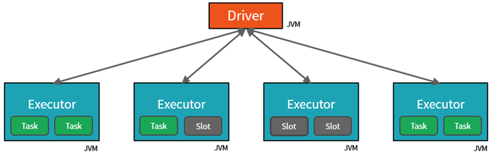

# module 3

* Use Apache Spark in Azure Databricks

  * Get to know Spark
  * Create a Spark cluster
  * Use Spark in notebooks
  * Use Spark to work with data files
  * Visualize data
  * [lab](https://microsoftlearning.github.io/mslearn-databricks/Instructions/Exercises/LA-03-Transform-data.html)

## Spark

Apache Spark clusters are groups of computers that are treated as a single computer and handle the execution of commands issued from notebooks. Clusters enable processing of data to be parallelized across many computers to improve scale and performance. They consist of a Spark driver and worker nodes. The driver node sends work to the worker nodes and instructs them to pull data from a specified data source.



Spark can run on a variety of distributed systems, including Hadoop YARN, Apache Mesos, Kubernetes, or Spark's own cluster manager. It also reads from and writes to diverse data sources like HDFS, Cassandra, HBase, and Amazon S3.

### jobs, tasks, partitions

Work submitted to the cluster is split into as many independent jobs as needed. This is how work is distributed across the Cluster's nodes. Jobs are further subdivided into tasks. The input to a job is partitioned into one or more partitions. These partitions are the unit of work for each slot. In between tasks, partitions may need to be reorganized and shared over the network.

The secret to Spark's high performance is parallelism. Scaling vertically (by adding resources to a single computer) is limited to a finite amount of RAM, Threads and CPU speeds; but clusters scale horizontally, adding new nodes to the cluster as needed.

Spark parallelizes jobs at two levels:

* The first level of parallelization is the executor - a Java virtual machine (JVM) running on a worker node, typically, one instance per node.
* The second level of parallelization is the slot - the number of which is determined by the number of cores and CPUs of each node.
Each executor has multiple slots to which parallelized tasks can be assigned.

The JVM is naturally multi-threaded, but a single JVM, such as the one coordinating the work on the driver, has a finite upper limit. By splitting the work into tasks, the driver can assign units of work to slots in the executors on worker nodes for parallel execution. Additionally, the driver determines how to partition the data so that it can be distributed for parallel processing. So, the driver assigns a partition of data to each task so that each task knows which piece of data it is to process. Once started, each task will fetch the partition of data assigned to it.

Depending on the work being performed, multiple parallelized jobs may be required. Each job is broken down into stages.

### Creating a Spark cluster

When creating the cluster, you can specify configuration settings, including:

* A name for the cluster.
* A cluster mode, which can be:
  * Standard: Suitable for single-user workloads that require multiple worker nodes.
  * High Concurrency: Suitable for workloads where multiple users will be using the cluster concurrently.
  * Single Node: Suitable for small workloads or testing, where only a single worker node is required.
* The version of the Databricks Runtime to be used in the cluster; which dictates the version of Spark and individual components such as Python, Scala, and others that get installed.
* The type of virtual machine (VM) used for the worker nodes in the cluster.
* The minimum and maximum number of worker nodes in the cluster.
* The type of VM used for the driver node in the cluster.
* Whether the cluster supports autoscaling to dynamically resize the cluster.
* How long the cluster can remain idle before being shut down automatically.

Internally, Azure Kubernetes Service (AKS) is used to run the Azure Databricks control-plane and data-planes via containers

## lab

same as before, and using the data ingested in module2.md

* Clean the data

Observe that this dataset has some duplicated rows and null values in the Tax column. Therefore, a cleaning step is required before any further processing and analysis is done with the data.

```python
# remove duplicate rows from the table and replace the null entries with the correct values

from pyspark.sql.functions import col
df = df.dropDuplicates()
df = df.withColumn('Tax', col('UnitPrice') * 0.08)
df = df.withColumn('Tax', col('Tax').cast("float"))
display(df.limit(100))
```

* Filter a dataframe

```python
"""
Filter the columns of the sales orders dataframe to include only the customer name and email address.
Count the total number of order records
Count the number of distinct customers
Display the distinct customers
"""

customers = df['CustomerName', 'Email']
print(customers.count())
print(customers.distinct().count())
display(customers.distinct())
```

```python
# filter to include only the customers who have placed an order for a specific product 

customers = df.select("CustomerName", "Email").where(df['Item']=='Road-250 Red, 52')
print(customers.count())
print(customers.distinct().count())
display(customers.distinct())
```

* Aggregate and group data in a dataframe

```python
# sum of order quantities grouped by product
productSales = df.select("Item", "Quantity").groupBy("Item").sum()
display(productSales)

"""
The groupBy method groups the rows by Item, and the subsequent sum aggregate function is applied to all of the remaining numeric columns (in this case, Quantity)
"""
```

```python
# number of sales orders per year
yearlySales = df.select(year("OrderDate").alias("Year")).groupBy("Year").count().orderBy("Year")
display(yearlySales)

"""
the select method includes a SQL year function to extract the year component of the OrderDate field, and then an alias method is used to assign a column name to the extracted year value. The data is then grouped by the derived Year column and the count of rows in each group is calculated before finally the orderBy method is used to sort the resulting dataframe.
"""
```

* using SQL

```python
df.createOrReplaceTempView("salesorders")
```

```sql
%sql
    
SELECT YEAR(OrderDate) AS OrderYear,
       SUM((UnitPrice * Quantity) + Tax) AS GrossRevenue
FROM salesorders
GROUP BY YEAR(OrderDate)
ORDER BY OrderYear;
```
