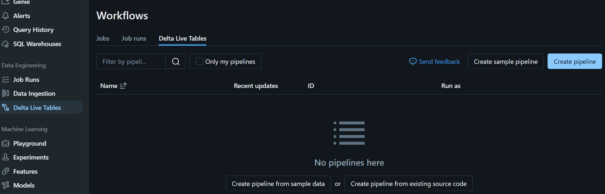

# module 5

* Build data pipelines with Delta Live Tables

  * Explore Delta Live Tables
  * Data ingestion and integration
  * Real-time processing
  * [lab](https://microsoftlearning.github.io/mslearn-databricks/Instructions/Exercises/LA-05-Build-data-pipeline.html)

## Delta Live Tables

Delta Live Tables (DLT) are an integrated environment for managing and automating data pipelines, and are designed for large-scale data processing within Azure. Instead of defining your data pipelines using a series of separate Apache Spark tasks, you define streaming tables and materialized views that the system should create and keep up to date. DLT manages how your data is transformed based on queries you define for each process step.

eg.

```sql
-- Create the Delta Tables
-- Create Delta table for customer data
CREATE TABLE customer_data (
    customer_id INT,
    customer_name STRING,
    email STRING
);
-- Create Delta table for transaction data
CREATE TABLE transaction_data (
    transaction_id INT,
    customer_id INT,
    transaction_date DATE,
    amount DOUBLE
);

-- Insert data
-- read data from a CSV file and a JSON file, and then insert it into Delta tables.
-- Load customer data from CSV
CREATE OR REPLACE TEMPORARY VIEW customer_data_view AS
SELECT * FROM csv.`/path/to/customer_data.csv`
OPTIONS (header "true", inferSchema "true");
-- Insert data into customer Delta table
INSERT INTO customer_data
SELECT * FROM customer_data_view;
-- Load transaction data from JSON
CREATE OR REPLACE TEMPORARY VIEW transaction_data_view AS
SELECT * FROM json.`/path/to/transaction_data.json`;
-- Insert data into transaction Delta table
INSERT INTO transaction_data
SELECT * FROM transaction_data_view;

-- Transforming and integrating data
-- You can perform transformations and join data from multiple tables
-- Create a unified view of customer transactions
CREATE OR REPLACE TEMPORARY VIEW customer_transactions AS
SELECT
    t.transaction_id,
    t.customer_id,
    c.customer_name,
    c.email,
    t.transaction_date,
    t.amount
FROM
    transaction_data t
JOIN
    customer_data c
ON
    t.customer_id = c.customer_id;

-- Create a Delta table for the integrated data
CREATE TABLE integrated_data USING DELTA AS
SELECT * FROM customer_transactions;

-- Query the integrated data
SELECT
    customer_name,
    SUM(amount) AS total_spent
FROM
    integrated_data
GROUP BY
    customer_name
ORDER BY
    total_spent DESC;
```

### Setting up DLT for real time data processing

* Creating DLT Pipelines - Create Delta Live Tables pipelines in your Azure Databricks workspace.
* Integrating with data sources - After creating a DLT pipeline, connect to real-time data sources, such as event hubs or IoT devices.
* Implementing data transformations - After you integrate your pipeline with data sources, configure Delta Live Tables to apply transformation logic on the streaming data.
* Monitoring and managing pipeline health - You can use the built-in monitoring features of DLT to track the health and performance of your pipelines. Adjustments to scaling, troubleshooting, and optimizing performance can be managed directly from the Databricks interface.

## lab

this lab uses the `covid_data.csv`

```python
urls = [
    "https://github.com/MicrosoftLearning/mslearn-databricks/raw/main/data/covid_data.csv",
]

dbutils.fs.mkdirs("/delta_lab")

import requests

for url in urls:
  file_name = url.split("/")[-1]
  response = requests.get(url)
  
  dbutils.fs.put(f"/delta_lab/{file_name}", response.text, overwrite=True)
  print(f"Saved {file_name} to /delta_lab/")
```

```python
dbutils.fs.ls('/delta_lab')
```

* Create Delta Live Tables Pipeline using SQL

```sql
%sql

CREATE OR REFRESH LIVE TABLE raw_covid_data
COMMENT "COVID sample dataset. This data was ingested from the COVID-19 Data Repository by the Center for Systems Science and Engineering (CSSE) at Johns Hopkins University."
AS
SELECT
  Last_Update,
  Country_Region,
  Confirmed,
  Deaths,
  Recovered
FROM read_files('dbfs:/delta_lab/covid_data.csv', format => 'csv', header => true)
```

ERROR: DriverException: No token to authorize principal

well, it isn't working for me. Even tho, the path seems right. But anyway, i think i got the idea... Moving on,

query, filter, and format the data from the previous table before analysis

```sql
CREATE OR REFRESH LIVE TABLE processed_covid_data(
  CONSTRAINT valid_country_region EXPECT (Country_Region IS NOT NULL) ON VIOLATION FAIL UPDATE
)
COMMENT "Formatted and filtered data for analysis."
AS
SELECT
    TO_DATE(Last_Update, 'MM/dd/yyyy') as Report_Date,
    Country_Region,
    Confirmed,
    Deaths,
    Recovered
FROM live.raw_covid_data;
```

create an enriched data view for further analysis once the pipeline is successfully executed.

```sql
CREATE OR REFRESH LIVE TABLE aggregated_covid_data
COMMENT "Aggregated daily data for the US with total counts."
AS
SELECT
    Report_Date,
    sum(Confirmed) as Total_Confirmed,
    sum(Deaths) as Total_Deaths,
    sum(Recovered) as Total_Recovered
FROM live.processed_covid_data
GROUP BY Report_Date;
```

Then, create the pipeline and run it

Delta Live Tables > Create Pipeline

* Pipeline name: Covid Pipeline
* Product edition: Advanced
* Pipeline mode: Triggered
* Source code: Browse to your Pipeline Notebook notebook in the Users/user@name folder.
* Storage options: Hive Metastore
* Storage location: dbfs:/pipelines/delta_lab
* Target schema: Enter default



After the pipeline finished running, you can query the tables

```sql
%sql

SHOW TABLES

-- select from the last table
SELECT * FROM aggregated_covid_data
```
