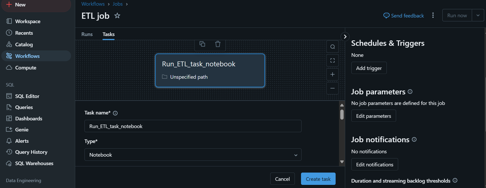
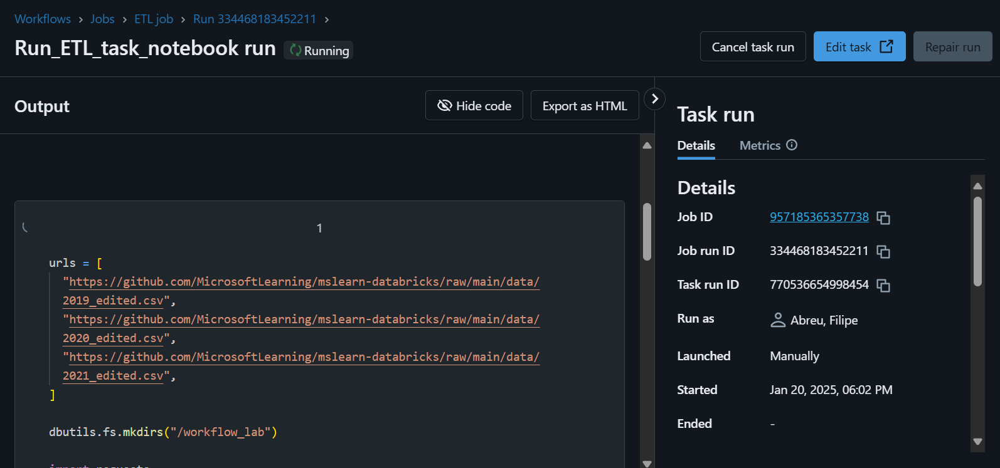

# module 6

* Deploy workloads with Azure Databricks Workflows

  * What are Azure Databricks Workflows?
  * Understand key components of Azure Databricks Workflows
  * Explore the benefits of Azure Databricks Workflows
  * Deploy workloads using Azure Databricks Workflows
  * [lab](https://microsoftlearning.github.io/mslearn-databricks/Instructions/Exercises/LA-06-Build-workflow.html)

## Azure Databricks Workflows

Azure Databricks Workflows are a set of tools and features within the Azure Databricks environment designed to help you orchestrate, schedule, and automate data processing tasks. These workflows allow you to define, manage, and run multi-step data pipelines that can include data ingestion, transformation, and analysis processes. It upports both batch and streaming data processes, ensuring flexible and real-time data handling.

## lab

Usa os `2019_edited.csv`, `2020_edited.csv`, `2021_edited.csv`

```python
urls = [
    "https://github.com/MicrosoftLearning/mslearn-databricks/raw/main/data/2019_edited.csv",
    "https://github.com/MicrosoftLearning/mslearn-databricks/raw/main/data/2020_edited.csv",
    "https://github.com/MicrosoftLearning/mslearn-databricks/raw/main/data/2021_edited.csv",
]

dbutils.fs.mkdirs("/workflow_lab")

import requests

for url in urls:
  file_name = url.split("/")[-1]
  response = requests.get(url)
  
  dbutils.fs.put(f"/workflow_lab/{file_name}", response.text, overwrite=True)
  print(f"Saved {file_name} to /workflow_lab/")
```

```python
from pyspark.sql.types import *
from pyspark.sql.functions import *
orderSchema = StructType([
     StructField("SalesOrderNumber", StringType()),
     StructField("SalesOrderLineNumber", IntegerType()),
     StructField("OrderDate", DateType()),
     StructField("CustomerName", StringType()),
     StructField("Email", StringType()),
     StructField("Item", StringType()),
     StructField("Quantity", IntegerType()),
     StructField("UnitPrice", FloatType()),
     StructField("Tax", FloatType())
])
df = spark.read.load('/workflow_lab/*.csv', format='csv', schema=orderSchema)
display(df.limit(100))

# replace the null entries with the correct values
from pyspark.sql.functions import col
df = df.dropDuplicates()
df = df.withColumn('Tax', col('UnitPrice') * 0.08)
df = df.withColumn('Tax', col('Tax').cast("float"))

# aggregate and group
yearlySales = df.select(year("OrderDate").alias("Year")).groupBy("Year").count().orderBy("Year")
display(yearlySales)
```

* Build the Workflow

  Workflows > Create job

  * Task name: Run ETL task notebook
  * Type: Notebook
  * Source: Workspace
  * Path: Select your ETL task notebook
  * Cluster: Select your cluster

  

  and then run the task

  
