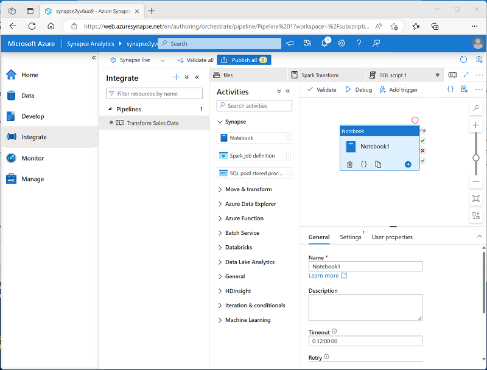
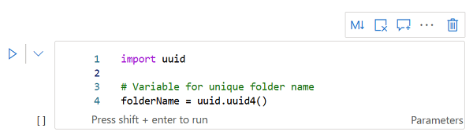
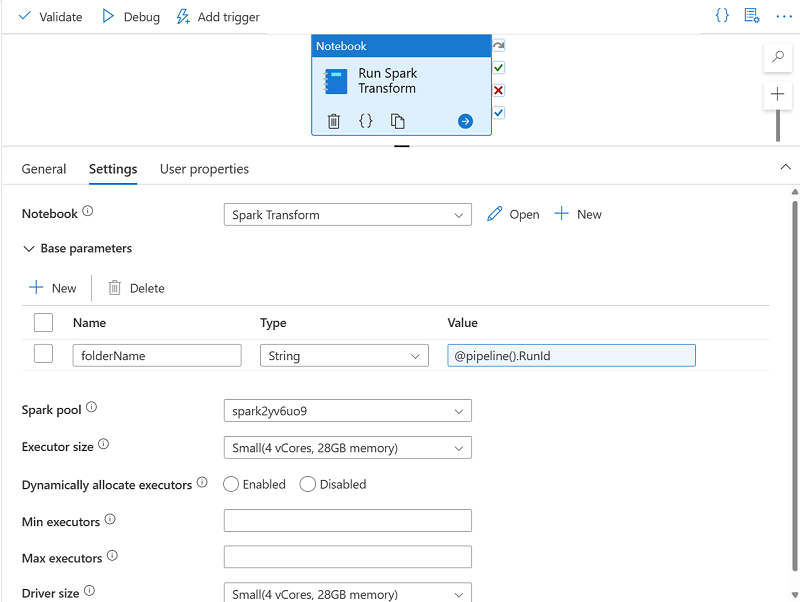
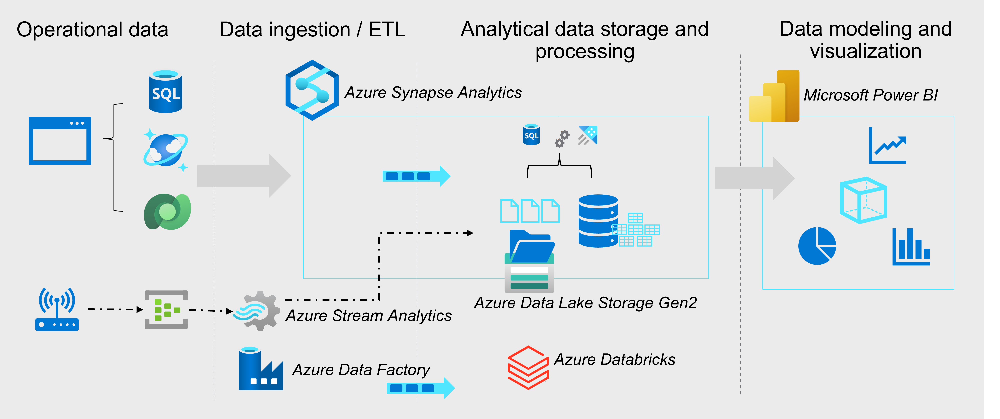

# other modules

## Use Spark Notebooks in an Azure Synapse Pipeline

[Use Spark Notebooks in an Azure Synapse Pipeline](https://learn.microsoft.com/en-gb/training/modules/use-spark-notebooks-azure-synapse-pipeline/)

* Describe notebook and pipeline integration.
* Use a Synapse notebook activity in a pipeline.
* Use parameters with a notebook activity.
* [lab](https://microsoftlearning.github.io/dp-203-azure-data-engineer/Instructions/Labs/11-Spark-nobook-in-Synapse-Pipeline.html)

### pipelines and notebooks

It's common in big data analytics solutions for data engineers to use Spark notebooks for initial data exploration and interactive experimentation when designing data transformation processes. When the transformation logic has been completed, you can perform some final code optimization and refactoring for maintainability, and then include the notebook in a pipeline. The pipeline can then be run on a schedule or in response to an event (such as new data files being loaded into the data lake).

The notebook is run on a Spark pool, which you can configure with the appropriate compute resources and Spark runtime for your specific workload. The pipeline itself is run in an integration runtime that orchestrates the activities in the pipeline, coordinating the external services needed to run them.
The Synapse Notebook activity enables you to run data processing code in Spark notebooks as a task in a pipeline; making it possible to automate big data processing and integrate it into extract, transform, and load (ETL) workloads.

### use a Synapse notebook activity in a pipeline

You'll find the Notebook activity in the Synapse section of the activities pane in the Azure Synapse Analytics pipeline designer.

To configure the notebook activity, edit the settings in the properties pane beneath the pipeline designer canvas. Notebook activity specific settings include:

* Notebook: The notebook you want to run. You can select an existing notebook in your Azure Synapse Analytics workspace, or create a new one.
* Spark pool: The Apache Spark pool on which the notebook should be run.
* Executor size: The node size for the worker nodes in the pool, which determines the number of processor cores and the amount of memory allocated to worker nodes.
* Dynamically allocate executors: Configures Spark dynamic allocation, enabling the pool to automatically scale up and down to support the workload.
* Min executors: The minimum number of executors to be allocated.
* Max executors: The maximum number of executors to be allocated.
* Driver size: The node size for the driver node.

### use parameters in a notebook

Parameters enable you to dynamically pass values for variables in the notebook each time it's run.

* Create a parameters cell in the notebook

To define the parameters for a notebook, you declare and initialize variables in a cell, which you then configure as a Parameters cell by using the toggle option in the notebook editor interface.

Initializing a variable ensures that it has a default value, which will be used if the parameter isn't set in the notebook activity.

* Set base parameters for the notebook activity

After defining a parameters cell in the notebook, you can set values to be used when the notebook is run by a notebook activity in a pipeline. To set parameter values, expand and edit the Base parameters section of the settings for the activity.

You can assign explicit parameter values, or use an expression to assign a dynamic value. For example, the expression @pipeline().RunId returns the unique identifier for the current run of the pipeline.

### lab

...

## Introduction to Azure Data Factory

[Introduction to Azure Data Factory](https://learn.microsoft.com/en-us/training/modules/intro-to-azure-data-factory/)

* Evaluate whether Azure Data Factory can help you integrate your data sources.
* Describe how Azure Data Factory can ingest data from on-premises, multicloud, and SaaS data sources.

Microsoft Azure Data Factory is a fully managed, serverless data integration service. It enables you to visually integrate data sources with more than 90 built-in, maintenance-free connectors.
It is a cloud-based extract, transform, load (ETL) and data-integration service that helps you to create data-driven workflows (pipelines) to:

* Orchestrate data movement.
* Transform data at scale.

Microsoft Azure includes many services that can be used to implement and manage data engineering workloads.

* Azure Synapse Analytics
* Azure Data Lake Storage Gen2
* Azure Stream Analytics
* Azure Data Factory
* Azure Databricks

Other technologies that you can implement to help with your organization's data analytics:

* Azure Blob Storage
* Azure Data Lake Analytics
* Azure Analysis Services
* Azure HDInsight
* Azure Machine Learning

You can use some or all of these services, as needed, to analyze your organization's data. However, none of these services addresses data integration. Data integration allows you to collect data from multiple sources, then load this combined data to a location suitable for data analysis. If necessary, you can transform the data during this process. Although you can perform these tasks manually, you could consider using Azure Data Factory.

Azure Data Factory consists of several functions

* Connect and collect

  you can use the copy activity to move data from various sources to a single centralized data store in the cloud. After you copy the data, you use other systems to transform and analyze it.

  The copy activity performs the following high-level steps:

  * Read data from source data store.

  * Perform the following tasks on the data:

    * Serialization/deserialization
    * Compression/decompression
    * Column mapping
  * Write data to the destination data store (known as the sink).

* Transform and enrich

  Data flows enable you to create data transformation graphs that run on Spark. Although not necessary, you might prefer to code your transformations manually. If so, Azure Data Factory supports external activities for running your transformations.

* Continuous integration and delivery (CI/CD) and publish

  Continuous integration means automatically testing each change made to your codebase as soon as possible. Continuous delivery follows this testing and pushes changes to a staging or production system.

  Azure Data Factory provides for CI/CD of your data pipelines by using:
  * Azure DevOps
  * GitHub

* Monitoring

  After you successfully build and deploy your data-integration pipeline, it's important that you can monitor your scheduled activities and pipelines. Monitoring allows you to track success and failure rates. Azure Data Factory provides support for pipeline monitoring by using one of the following methods:

  * Azure Monitor
  * API
  * PowerShell
  * Azure Monitor logs
  * Health panels in the Azure portal
