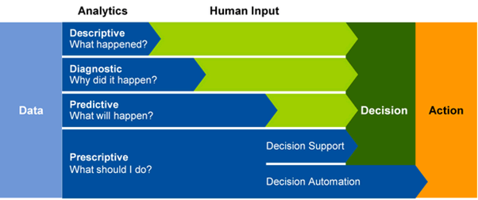
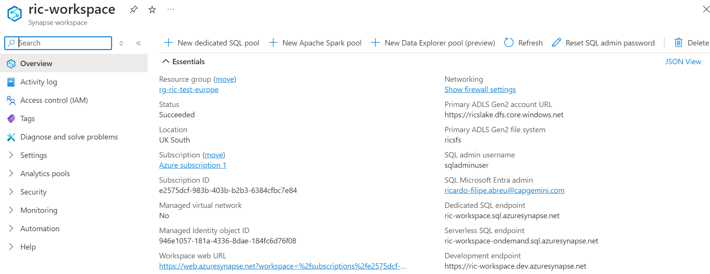
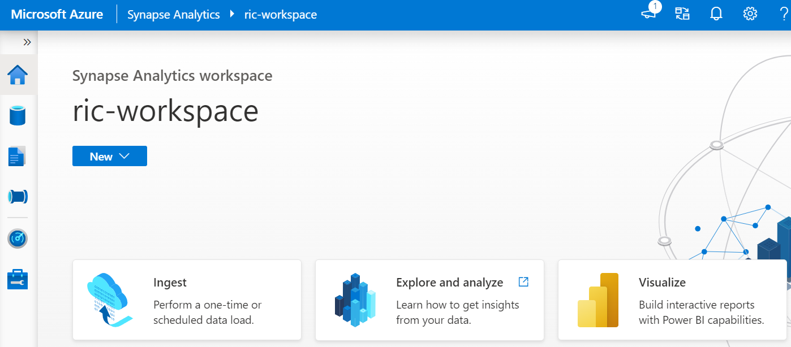
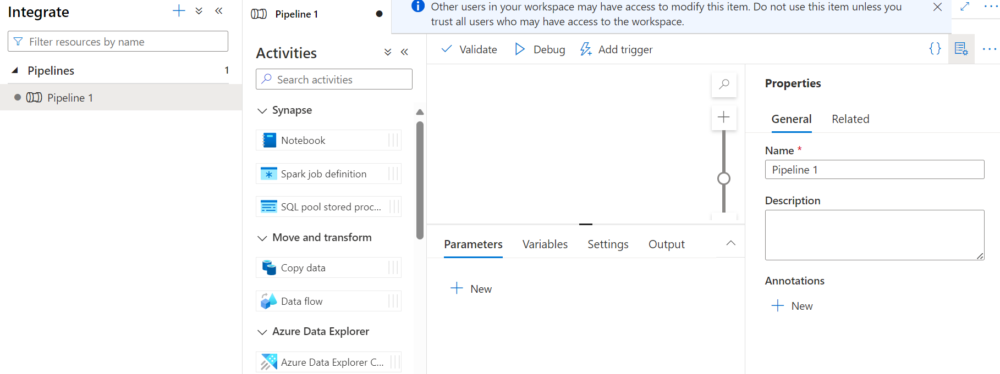

# module 1

* Introduction to Azure Synapse Analytics
  * What is Azure Synapse Analytics
  * How Azure Synapse Analytics works
  * When to use Azure Synapse Analytics
  * [lab](https://microsoftlearning.github.io/dp-203-azure-data-engineer/Instructions/Labs/01-Explore-Azure-Synapse.html)

To support the analytics needs of today's organizations, Azure Synapse Analytics combines a centralized service for data storage and processing with an extensible architecture through which linked services enable you to integrate commonly used data stores, processing platforms, and visualization tools.

## types of analytics

Data analytics is the process of gathering raw data and examining it to draw conclusions from it. This process can be difficult if the data is in multiple locations, such as hosted databases and on-premises locations.

* Descriptive analytics, which answers the question “What is happening in my business?”. The data to answer this question is typically answered through the creation of a data warehouse in which historical data is persisted in relational tables for multidimensional modeling and reporting.

* Diagnostic analytics, which deals with answering the question “Why is it happening?”. This may involve exploring information that already exists in a data warehouse, but typically involves a wider search of your data estate to find more data to support this type of analysis.

* Predictive analytics, which enables you to answer the question “What is likely to happen in the future based on previous trends and patterns?”

* Prescriptive analytics, which enables autonomous decision making based on real-time or near real-time analysis of data, using predictive analytics.



## creating and using an Azure Synapse Analytics workspace

A Synapse Analytics workspace defines an instance of the Synapse Analytics service in which you can manage the services and data resources needed for your analytics solution.

After creating a Synapse Analytics workspace, you can manage the services in it and perform data analytics tasks with them by using Synapse Studio; a web-based portal for Azure Synapse Analytics.







### workspace - data tab


* A Workspace tab containing databases defined in the workspace (including dedicated SQL databases and Data Explorer databases)
* A Linked tab containing data sources that are linked to the workspace, including Azure Data Lake storage.

create a data lake or a database, ...

One of the core resources in a Synapse Analytics workspace is a data lake. A workspace typically has a default data lake, which is implemented as a linked service to an Azure Data Lake Storage Gen2 container. You can add linked services for multiple data lakes that are based on different storage platforms as required.


in the tab, you can also query and manipulate data with SQL

Azure Synapse Analytics supports SQL-based data querying and manipulation through two kinds of SQL pool that are based on the SQL Server relational database engine:

* A built-in serverless pool that is optimized for using relational SQL semantics to query file-based data in a data lake.
* Custom dedicated SQL pools that host relational data warehouses.

The Azure Synapse SQL system uses a distributed query processing model to parallelize SQL operations, resulting in a highly scalable solution for relational data processing. You can use the built-in serverless pool for cost-effective analysis and processing of file data in the data lake, and use dedicated SQL pools to create relational data warehouses for enterprise data modeling and reporting.

Azure Synapse Data Explorer is a data processing engine in Azure Synapse Analytics that is based on the Azure Data Explorer service. Data Explorer uses an intuitive query syntax named Kusto Query Language (KQL) to enable high performance, low-latency analysis of batch and streaming data.

### workspace - develop tab


create SQL scripts, Spark jobs, ...

In Azure Synapse Analytics, you can create one or more Spark pools and use interactive notebooks to combine code and notes as you build solutions for data analytics, machine learning, and data visualization.


### workspace - integrate tab


* Pipeline

  create pipelines (to ingest and transform data)

  Pipelines in Azure Synapse Analytics are based on the same underlying technology as Azure Data Factory. If you are already familiar with Azure Data Factory, you can leverage your existing skills to build data ingestion and transformation solutions in Azure Synapse Analytics.

  in the pipelines, you can link/integrate with various other services

  

* Link connection

  add aother data sources

  

* Copy data tool

### workspace - monitor tab

observe data processing jobs as they run and view their history.


### workspace - manage tab

manage the pools, runtimes, and other assets used in your Azure Synapse workspace


## lab

### Azure Cloud Shell

* [docs](https://learn.microsoft.com/en-gb/azure/cloud-shell/overview)


```shell
# clone the repo 
rm -r dp-203 -f
git clone https://github.com/MicrosoftLearning/dp-203-azure-data-engineer dp-203

# run a script
cd dp-203/Allfiles/labs/01
./setup.ps1
```


on the manage tab/page,


SQL pools:

* Built-in: A serverless SQL pool that you can use on-demand to explore or process data in a data lake by using SQL commands.
* sqlxxxxxxx: A dedicated SQL pool that hosts a relational data warehouse database.

Apache Spark pools:

* sparkxxxxxxx: that you can use on-demand to explore or process data in a data lake by using programming languages like Scala or Python.

### Ingest data with a pipeline

* Use the Copy Data task to create a pipeline
* View the ingested data


### Use a serverless SQL pool to analyze data


```sql
-- top 100
 SELECT
     TOP 100 *
 FROM
     OPENROWSET(
         BULK 'https://datalakexxxxxxx.dfs.core.windows.net/files/product_data/products.csv',
         FORMAT = 'CSV',
         PARSER_VERSION='2.0',
         HEADER_ROW = TRUE
     ) AS [result]

-- stuff
SELECT
     Category, COUNT(*) AS ProductCount
 FROM
     OPENROWSET(
         BULK 'https://datalakexxxxxxx.dfs.core.windows.net/files/product_data/products.csv',
         FORMAT = 'CSV',
         PARSER_VERSION='2.0',
         HEADER_ROW = TRUE
     ) AS [result]
 GROUP BY Category;
```


### Use a Spark pool to analyze data

you can run Python (and other) code in a Spark pool; which uses a distributed data processing engine based on Apache Spark.


### Use a dedicated SQL pool to query a data warehouse

on the Manage page, in the SQL pools section, select the sqlxxxxxxx dedicated SQL pool row and then use its ▷ icon to resume it.


Expand the sqlxxxxxxx database and its Tables folder, and then in the … menu for the FactInternetSales table, point to New SQL script, and select Select TOP 100 rows.


```sql
SELECT d.CalendarYear, d.MonthNumberOfYear, d.EnglishMonthName,
      p.EnglishProductName AS Product, SUM(o.OrderQuantity) AS UnitsSold
FROM dbo.FactInternetSales AS o
JOIN dbo.DimDate AS d ON o.OrderDateKey = d.DateKey
JOIN dbo.DimProduct AS p ON o.ProductKey = p.ProductKey
GROUP BY d.CalendarYear, d.MonthNumberOfYear, d.EnglishMonthName, p.EnglishProductName
ORDER BY d.MonthNumberOfYear
```

### delete resources

Select the dp203-xxxxxxx resource group for your Synapse Analytics workspace (not the managed resource group) > Delete resource group


