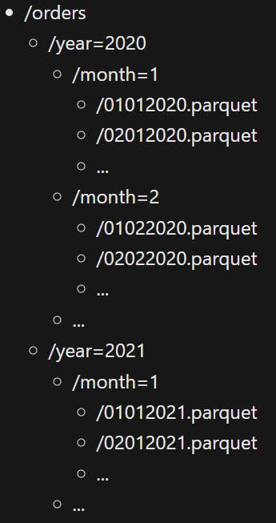

# module 2

<https://learn.microsoft.com/en-gb/training/modules/query-data-lake-using-azure-synapse-serverless-sql-pools/>

* Use Azure Synapse serverless SQL pool to query files in a data lake
  * Understand Azure Synapse serverless SQL pool capabilities and use cases
  * Query files using a serverless SQL pool
  * Create external database objects
  * [lab](https://microsoftlearning.github.io/dp-203-azure-data-engineer/Instructions/Labs/03-Transform-data-with-sql.html)

## SQL pools

* Serverless SQL pool: on-demand SQL query processing, primarily used to work with data in a data lake. Provides a pay-per-query endpoint to query the data in your data lake
* Dedicated SQL pool: Enterprise-scale relational database instances used to host data warehouses in which data is stored in relational tables.

## Query files using a serverless SQL pool

You can use a serverless SQL pool to query data files in various common file formats, including:

* Delimited text, such as comma-separated values (CSV) files.
* JavaScript object notation (JSON) files.
* Parquet files.

The basic syntax for querying is the same for all of these types of file, and is built on the OPENROWSET SQL function; which generates a tabular rowset from data in one or more files.

```sql
SELECT TOP 100 *
FROM OPENROWSET(
    BULK 'https://mydatalake.blob.core.windows.net/data/files/*.csv',
    FORMAT = 'csv') AS rows
```

The [OPENROWSET function](https://learn.microsoft.com/en-us/azure/synapse-analytics/sql/develop-openrowset#syntax) includes more parameters that determine factors such as:

* The schema of the resulting rowset
* Additional formatting options for delimited text files.

The output from OPENROWSET is a rowset to which an alias must be assigned. In the previous example, the alias rows is used to name the resulting rowset.

The BULK parameter includes the full URL to the location in the data lake containing the data files. This can be an individual file, or a folder with a wildcard expression to filter the file types that should be included. The FORMAT parameter specifies the type of data being queried. The example above reads delimited text from all .csv files in the files folder.

As seen in the previous example, you can use wildcards in the BULK parameter to include or exclude files in the query. The following list shows a few examples of how this can be used:

* <https://mydatalake.blob.core.windows.net/data/files/file1.csv>: Only include file1.csv in the files folder.
* <https://mydatalake.blob.core.windows.net/data/files/file*.csv>: All .csv files in the files folder with names that start with "file".
* <https://mydatalake.blob.core.windows.net/data/files/>*: All files in the files folder.
* <https://mydatalake.blob.core.windows.net/data/files/>**: All files in the files folder, and recursively its subfolders.

You can also specify multiple file paths in the BULK parameter, separating each path with a comma.

### Querying delimited text files

Delimited text files are a common file format within many businesses. The specific formatting used in delimited files can vary, for example:

* With and without a header row.
* Comma and tab-delimited values.
* Windows and Unix style line endings.
* Non-quoted and quoted values, and escaping characters.

Regardless of the type of delimited file you're using, you can read data from them by using the OPENROWSET function with the csv FORMAT parameter, and other parameters as required to handle the specific formatting details for your data. For example:

```sql
SELECT TOP 100 *
FROM OPENROWSET(
    BULK 'https://mydatalake.blob.core.windows.net/data/files/*.csv',
    FORMAT = 'csv',
    PARSER_VERSION = '2.0',
    FIRSTROW = 2) AS rows
```

The PARSER_VERSION is used to determine how the query interprets the text encoding used in the files. Version 1.0 is the default and supports a wide range of file encodings, while version 2.0 supports fewer encodings but offers better performance. The FIRSTROW parameter is used to skip rows in the text file, to eliminate any unstructured preamble text or to ignore a row containing column headings.

Additional parameters you might require when working with delimited text files include:

* FIELDTERMINATOR - the character used to separate field values in each row. For example, a tab-delimited file separates fields with a TAB (\t) character. The default field terminator is a comma (,).
* ROWTERMINATOR - the character used to signify the end of a row of data. For example, a standard Windows text file uses a combination of a carriage return (CR) and line feed (LF), which is indicated by the code \n; while UNIX-style text files use a single line feed character, which can be indicated using the code 0x0a.
* FIELDQUOTE - the character used to enclose quoted string values. For example, to ensure that the comma in the address field value 126 Main St, apt 2 isn't interpreted as a field delimiter, you might enclose the entire field value in quotation marks like this: "126 Main St, apt 2". The double-quote (") is the default field quote character.

Specifying the rowset schema - It's common for delimited text files to include the column names in the first row. The OPENROWSET function can use this to define the schema for the resulting rowset, and automatically infer the data types of the columns based on the values they contain. For example, consider the following delimited text:

```text
product_id,product_name,list_price
123,Widget,12.99
124,Gadget,3.99
```

The data consists of the following three columns:

* product_id (integer number)
* product_name (string)
* list_price (decimal number)

You could use the following query to extract the data with the correct column names and appropriately inferred SQL Server data types (in this case INT, NVARCHAR, and DECIMAL)

```sql
SELECT TOP 100 *
FROM OPENROWSET(
    BULK 'https://mydatalake.blob.core.windows.net/data/files/*.csv',
    FORMAT = 'csv',
    PARSER_VERSION = '2.0',
    HEADER_ROW = TRUE) AS rows
```

The HEADER_ROW parameter (which is only available when using parser version 2.0) instructs the query engine to use the first row of data in each file as the column names

Now consider the following data:

```text
123,Widget,12.99
124,Gadget,3.99
```

This time, the file doesn't contain the column names in a header row; so while the data types can still be inferred, the column names will be set to C1, C2, C3, and so on.

To specify explicit column names and data types, you can override the default column names and inferred data types by providing a schema definition in a WITH clause, like this:

```sql
SELECT TOP 100 *
FROM OPENROWSET(
    BULK 'https://mydatalake.blob.core.windows.net/data/files/*.csv',
    FORMAT = 'csv',
    PARSER_VERSION = '2.0')
WITH (
    product_id INT,
    product_name VARCHAR(20) COLLATE Latin1_General_100_BIN2_UTF8,
    list_price DECIMAL(5,2)
) AS rows
```

When working with text files, you may encounter some incompatibility with UTF-8 encoded data and the collation used in the master database for the serverless SQL pool. To overcome this, you can specify a compatible collation for individual VARCHAR columns in the schema.

### Querying JSON files

JSON is a popular format for web applications that exchange data through REST interfaces or use NoSQL data stores such as Azure Cosmos DB. So, it's not uncommon to persist data as JSON documents in files in a data lake for analysis.

For example, a JSON file that defines an individual product might look like this:

```json
{
    "product_id": 123,
    "product_name": "Widget",
    "list_price": 12.99
}
```

To return product data from a folder containing multiple JSON files in this format, you could use the following SQL query:

```sql
SELECT doc
FROM
    OPENROWSET(
        BULK 'https://mydatalake.blob.core.windows.net/data/files/*.json',
        FORMAT = 'csv',
        FIELDTERMINATOR ='0x0b',
        FIELDQUOTE = '0x0b',
        ROWTERMINATOR = '0x0b'
    ) WITH (doc NVARCHAR(MAX)) as rows
```

OPENROWSET has no specific format for JSON files, so you must use csv format with FIELDTERMINATOR, FIELDQUOTE, and ROWTERMINATOR set to 0x0b, and a schema that includes a single NVARCHAR(MAX) column. The result of this query is a rowset containing a single column of JSON documents, like this:

|doc|
|---|
|{"product_id":123,"product_name":"Widget","list_price": 12.99}|
|{"product_id":124,"product_name":"Gadget","list_price": 3.99}|

To extract individual values from the JSON, you can use the JSON_VALUE function in the SELECT statement, as shown here:

```sql
SELECT JSON_VALUE(doc, '$.product_name') AS product,
           JSON_VALUE(doc, '$.list_price') AS price
FROM
    OPENROWSET(
        BULK 'https://mydatalake.blob.core.windows.net/data/files/*.json',
        FORMAT = 'csv',
        FIELDTERMINATOR ='0x0b',
        FIELDQUOTE = '0x0b',
        ROWTERMINATOR = '0x0b'
    ) WITH (doc NVARCHAR(MAX)) as rows
```

### Querying Parquet files

Parquet is a commonly used format for big data processing on distributed file storage. It's an efficient data format that is optimized for compression and analytical querying.

In most cases, the schema of the data is embedded within the Parquet file, so you only need to specify the BULK parameter with a path to the file(s) you want to read, and a FORMAT parameter of parquet; like this:

```sql
SELECT TOP 100 *
FROM OPENROWSET(
    BULK 'https://mydatalake.blob.core.windows.net/data/files/*.*',
    FORMAT = 'parquet') AS rows
```

### Query partitioned data

It's common in a data lake to partition data by splitting across multiple files in subfolders that reflect partitioning criteria. This enables distributed processing systems to work in parallel on multiple partitions of the data, or to easily eliminate data reads from specific folders based on filtering criteria. For example, suppose you need to efficiently process sales order data, and often need to filter based on the year and month in which orders were placed. You could partition the data using folders, like this:



To create a query that filters the results to include only the orders for January and February 2020, you could use the following code:

```sql
SELECT *
FROM OPENROWSET(
    BULK 'https://mydatalake.blob.core.windows.net/data/orders/year=*/month=*/*.*',
    FORMAT = 'parquet') AS orders
WHERE orders.filepath(1) = '2020'
    AND orders.filepath(2) IN ('1','2');
```

The numbered filepath parameters in the WHERE clause reference the wildcards in the folder names in the BULK path -so the parameter 1 is the `*` in the `year=*` folder name, and parameter 2 is the `*` in the `month=*` folder name.

## Create external database objects

You can use the OPENROWSET function in SQL queries that run in the default master database of the built-in serverless SQL pool to explore data in the data lake. However, sometimes you may want to create a custom database that contains some objects that make it easier to work with external data in the data lake that you need to query frequently.

You can create a database in a serverless SQL pool just as you would in a SQL Server instance. You can use the graphical interface in Synapse Studio, or a CREATE DATABASE statement. One consideration is to set the collation of your database so that it supports conversion of text data in files to appropriate Transact-SQL data types.

The following example code creates a database named salesDB with a collation that makes it easier to import UTF-8 encoded text data into VARCHAR columns.

```sql
CREATE DATABASE SalesDB
    COLLATE Latin1_General_100_BIN2_UTF8
```

### Creating an external data source

You can use the OPENROWSET function with a BULK path to query file data from your own database, just as you can in the master database; but if you plan to query data in the same location frequently, it's more efficient to define an external data source that references that location. For example, the following code creates a data source named files for the hypothetical <https://mydatalake.blob.core.windows.net/data/files/> folder:

```sql
CREATE EXTERNAL DATA SOURCE files
WITH (
    LOCATION = 'https://mydatalake.blob.core.windows.net/data/files/'
)
```

One benefit of an external data source, is that you can simplify an OPENROWSET query to use the combination of the data source and the relative path to the folders or files you want to query:

```sql
SELECT *
FROM
    OPENROWSET(
        BULK 'orders/*.csv',
        DATA_SOURCE = 'files',
        FORMAT = 'csv',
        PARSER_VERSION = '2.0'
    ) AS orders
```

In this example, the BULK parameter is used to specify the relative path for all .csv files in the orders folder, which is a subfolder of the files folder referenced by the data source.

Another benefit of using a data source is that you can assign a credential for the data source to use when accessing the underlying storage, enabling you to provide access to data through SQL without permitting users to access the data directly in the storage account. For example, the following code creates a credential that uses a shared access signature (SAS) to authenticate against the underlying Azure storage account hosting the data lake.

```sql
CREATE DATABASE SCOPED CREDENTIAL sqlcred
WITH
    IDENTITY='SHARED ACCESS SIGNATURE',  
    SECRET = 'sv=xxx...';
GO

CREATE EXTERNAL DATA SOURCE secureFiles
WITH (
    LOCATION = 'https://mydatalake.blob.core.windows.net/data/secureFiles/'
    CREDENTIAL = sqlcred
);
GO
```

In addition to SAS authentication, you can define credentials that use managed identity (the Microsoft Entra identity used by your Azure Synapse workspace), a specific Microsoft Entra principal, or passthrough authentication based on the identity of the user running the query (which is the default type of authentication).

### Creating an external file format

While an external data source simplifies the code needed to access files with the OPENROWSET function, you still need to provide format details for the file being access; which may include multiple settings for delimited text files. You can encapsulate these settings in an external file format, like this:

```sql
CREATE EXTERNAL FILE FORMAT CsvFormat
    WITH (
        FORMAT_TYPE = DELIMITEDTEXT,
        FORMAT_OPTIONS(
            FIELD_TERMINATOR = ',',
            STRING_DELIMITER = '"'
        )
    );
GO
```

After creating file formats for the specific data files you need to work with, you can use the file format to create external tables, as discussed next.

### Creating an external table

When you need to perform a lot of analysis or reporting from files in the data lake, using the OPENROWSET function can result in complex code that includes data sources and file paths. To simplify access to the data, you can encapsulate the files in an external table; which users and reporting applications can query using a standard SQL SELECT statement just like any other database table. To create an external table, use the CREATE EXTERNAL TABLE statement, specifying the column schema as for a standard table, and including a WITH clause specifying the external data source, relative path, and external file format for your data.

```sql
CREATE EXTERNAL TABLE dbo.products
(
    product_id INT,
    product_name VARCHAR(20),
    list_price DECIMAL(5,2)
)
WITH
(
    DATA_SOURCE = files,
    LOCATION = 'products/*.csv',
    FILE_FORMAT = CsvFormat
);
GO

-- query the table
SELECT * FROM dbo.products;
```

By creating a database that contains the external objects discussed in this unit, you can provide a relational database layer over files in a data lake, making it easier for many data analysts and reporting tools to access the data by using standard SQL query semantics.
