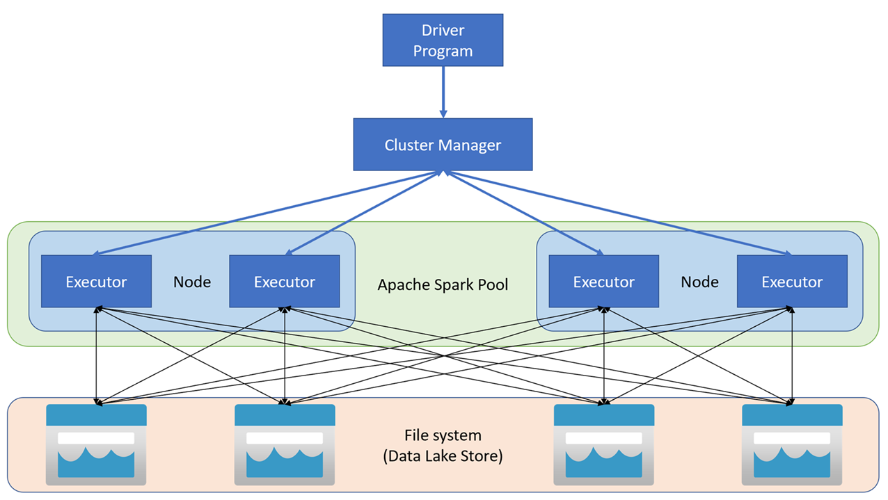
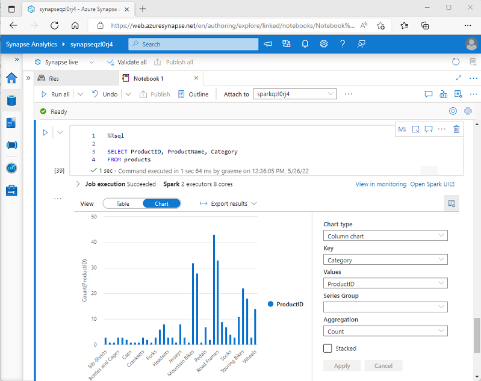

# module 3

* Analyze data with Apache Spark in Azure Synapse Analytics
  * Get to know Apache Spark
  * Use Spark in Azure Synapse Analytics
  * Analyze data with Spark
  * Visualize data with Spark
  * [lab](https://microsoftlearning.github.io/dp-203-azure-data-engineer/Instructions/Labs/05-Analyze-files-with-Spark.html)

## Apache Spark

Apache Spark is distributed data processing framework that enables large-scale data analytics by coordinating work across multiple processing nodes in a cluster.

Apache Spark applications run as independent sets of processes on a cluster, coordinated by the SparkContext object in your main program (called the driver program). The SparkContext connects to the cluster manager, which allocates resources across applications using an implementation of Apache Hadoop YARN. Once connected, Spark acquires executors on nodes in the cluster to run your application code.

The SparkContext runs the main function and parallel operations on the cluster nodes, and then collects the results of the operations. The nodes read and write data from and to the file system and cache transformed data in-memory as Resilient Distributed Datasets (RDDs).



The SparkContext is responsible for converting an application to a directed acyclic graph (DAG). The graph consists of individual tasks that get executed within an executor process on the nodes. Each application gets its own executor processes, which stay up for the duration of the whole application and run tasks in multiple threads.

You can run many different kinds of application on Spark, including code in Python or Scala scripts, Java code compiled as a Java Archive (JAR), and others. Spark is commonly used in two kinds of workload:

* Batch or stream processing jobs to ingest, clean, and transform data - often running as part of an automated pipeline.
* Interactive analytics sessions to explore, analyze, and visualize data.

## Azure Synapse Analytics - Spark pools

In Azure Synapse Analytics, a cluster is implemented as a Spark pool, which provides a runtime for Spark operations. When defining a Spark pool, you can specify configuration options for the pool, including:

* A name for the spark pool.
* The size of virtual machine (VM) used for the nodes in the pool, including the option to use hardware accelerated GPU-enabled nodes.
The number of nodes in the pool, and whether the pool size is fixed or individual nodes can be brought online dynamically to auto-scale the cluster; in which case, you can specify the minimum and maximum number of active nodes.
* The version of the Spark Runtime to be used in the pool; which dictates the versions of individual components such as Python, Java, and others that get installed.

Spark pools in an Azure Synapse Analytics Workspace are serverless - they start on-demand and stop when idle.

You can work with data from various sources, including:

* A data lake based on the primary storage account for the Azure Synapse Analytics workspace.
* A data lake based on storage defined as a linked service in the workspace.
* A dedicated or serverless SQL pool in the workspace.
* An Azure SQL or SQL Server database (using the Spark connector for SQL Server)
* An Azure Cosmos DB analytical database defined as a linked service and configured using Azure Synapse Link for Cosmos DB.
* An Azure Data Explorer Kusto database defined as a linked service in the workspace.
* An external Hive metastore defined as a linked service in the workspace.

<https://learn.microsoft.com/en-us/azure/synapse-analytics/spark/apache-spark-pool-configurations>

## Azure Synapse Analytics - Spark in notebooks

Azure Synapse Studio includes an integrated notebook interface for working with Spark.

The default language in a new Azure Synapse Analytics Spark notebook is PySpark - a Spark-optimized version of Python, which is commonly used by data scientists and analysts due to its strong support for data manipulation and visualization. Additionally, you can use languages such as Scala (a Java-derived language that can be used interactively) and SQL (a variant of the commonly used SQL language included in the Spark SQL library to work with relational data structures). Software engineers can also create compiled solutions that run on Spark using frameworks such as Java and Microsoft .NET.

<https://learn.microsoft.com/en-us/azure/synapse-analytics/spark/apache-spark-development-using-notebooks>

## Analyze data with Spark

Natively, Spark uses a data structure called a resilient distributed dataset (RDD); but while you can write code that works directly with RDDs, the most commonly used data structure for working with structured data in Spark is the dataframe, which is provided as part of the Spark SQL library. Dataframes in Spark are similar to those in the ubiquitous Pandas Python library, but optimized to work in Spark's distributed processing environment.

In addition to the Dataframe API, Spark SQL provides a strongly-typed Dataset API that is supported in Java and Scala. We'll focus on the Dataframe API in this module.

### Loading data into a dataframe

Let's explore a hypothetical example to see how you can use a dataframe to work with data. Suppose you have the following data in a comma-delimited text file named products.csv in the primary storage account for an Azure Synapse Analytics workspace:

```csv
ProductID,ProductName,Category,ListPrice
771,"Mountain-100 Silver, 38",Mountain Bikes,3399.9900
772,"Mountain-100 Silver, 42",Mountain Bikes,3399.9900
773,"Mountain-100 Silver, 44",Mountain Bikes,3399.9900
...
```

In a Spark notebook, you could use the following PySpark code to load the data into a dataframe and display the first 10 rows:

```python
%%pyspark
df = spark.read.load('abfss://container@store.dfs.core.windows.net/products.csv',
    format='csv',
    header=True
)
display(df.limit(10))
```

The %%pyspark line at the beginning is called a magic, and tells Spark that the language used in this cell is PySpark. You can select the language you want to use as a default in the toolbar of the Notebook interface, and then use a magic to override that choice for a specific cell. For example, here's the equivalent Scala code for the products data example:

```java
%%spark
val df = spark.read.format("csv").option("header", "true").load("abfss://container@store.dfs.core.windows.net/products.csv")
display(df.limit(10))
```

The magic %%spark is used to specify Scala.

### Specifying a dataframe schema

In the previous example, the first row of the CSV file contained the column names, and Spark was able to infer the data type of each column from the data it contains. You can also specify an explicit schema for the data, which is useful when the column names aren't included in the data file, like this CSV example:

```csv
771,"Mountain-100 Silver, 38",Mountain Bikes,3399.9900
772,"Mountain-100 Silver, 42",Mountain Bikes,3399.9900
773,"Mountain-100 Silver, 44",Mountain Bikes,3399.9900
...
```

The following PySpark example shows how to specify a schema for the dataframe to be loaded from a file named product-data.csv in this format:

```python
from pyspark.sql.types import *
from pyspark.sql.functions import *

productSchema = StructType([
    StructField("ProductID", IntegerType()),
    StructField("ProductName", StringType()),
    StructField("Category", StringType()),
    StructField("ListPrice", FloatType())
    ])

df = spark.read.load('abfss://container@store.dfs.core.windows.net/product-data.csv',
    format='csv',
    schema=productSchema,
    header=False)
display(df.limit(10))
```

### Filtering and grouping dataframes

You can use the methods of the Dataframe class to filter, sort, group, and otherwise manipulate the data it contains. For example, the following code example uses the select method to retrieve the ProductName and ListPrice columns from the df dataframe containing product data in the previous example:

```python
pricelist_df = df.select("ProductID", "ListPrice")
```

In common with most data manipulation methods, select returns a new dataframe object.

Selecting a subset of columns from a dataframe is a common operation, which can also be achieved by using the following shorter syntax:

```python
pricelist_df = df["ProductID", "ListPrice"]
```

You can "chain" methods together to perform a series of manipulations that results in a transformed dataframe. For example, this example code chains the select and where methods to create a new dataframe containing the ProductName and ListPrice columns for products with a category of Mountain Bikes or Road Bikes:

```python
bikes_df = df.select("ProductName", "ListPrice").where((df["Category"]=="Mountain Bikes") | (df["Category"]=="Road Bikes"))
display(bikes_df)
```

To group and aggregate data, you can use the groupBy method and aggregate functions. For example, the following PySpark code counts the number of products for each category:

```python
counts_df = df.select("ProductID", "Category").groupBy("Category").count()
display(counts_df)
```

### Using SQL expressions in Spark

The Dataframe API is part of a Spark library named Spark SQL, which enables data analysts to use SQL expressions to query and manipulate data.

The Spark catalog is a metastore for relational data objects such as views and tables. The Spark runtime can use the catalog to seamlessly integrate code written in any Spark-supported language with SQL expressions that may be more natural to some data analysts or developers.

One of the simplest ways to make data in a dataframe available for querying in the Spark catalog is to create a temporary view, as shown in the following code example:

```python
df.createOrReplaceTempView("products")
```

A view is temporary, meaning that it's automatically deleted at the end of the current session. You can also create tables that are persisted in the catalog to define a database that can be queried using Spark SQL.

* You can create an empty table by using the `spark.catalog.createTable` method. Tables are metadata structures that store their underlying data in the storage location associated with the catalog. Deleting a table also deletes its underlying data.
* You can save a dataframe as a table by using its `saveAsTable` method.
* You can create an external table by using the `spark.catalog.createExternalTable` method. External tables define metadata in the catalog but get their underlying data from an external storage location; typically a folder in a data lake. Deleting an external table does not delete the underlying data.

### Using the Spark SQL API to query data

You can use the Spark SQL API in code written in any language to query data in the catalog. For example, the following PySpark code uses a SQL query to return data from the products view as a dataframe.

```python
bikes_df = spark.sql("SELECT ProductID, ProductName, ListPrice \
                      FROM products \
                      WHERE Category IN ('Mountain Bikes', 'Road Bikes')")
display(bikes_df)
```

### Using SQL code

The previous example demonstrated how to use the Spark SQL API to embed SQL expressions in Spark code. In a notebook, you can also use the %%sql magic to run SQL code that queries objects in the catalog, like this:

```sql
%%sql

SELECT Category, COUNT(ProductID) AS ProductCount
FROM products
GROUP BY Category
ORDER BY Category
```

## Visualize data with Spark

### using the built-in notebook charts



The built-in charting functionality in notebooks is useful when you're working with results of a query that don't include any existing groupings or aggregations, and you want to quickly summarize the data visually. When you want to have more control over how the data is formatted, or to display values that you have already aggregated in a query, you should consider using a graphics package to create your own visualizations.

### using graphics packages in code

```python
from matplotlib import pyplot as plt

# Get the data as a Pandas dataframe
data = spark.sql("SELECT Category, COUNT(ProductID) AS ProductCount \
                  FROM products \
                  GROUP BY Category \
                  ORDER BY Category").toPandas()

# Clear the plot area
plt.clf()

# Create a Figure
fig = plt.figure(figsize=(12,8))

# Create a bar plot of product counts by category
plt.bar(x=data['Category'], height=data['ProductCount'], color='orange')

# Customize the chart
plt.title('Product Counts by Category')
plt.xlabel('Category')
plt.ylabel('Products')
plt.grid(color='#95a5a6', linestyle='--', linewidth=2, axis='y', alpha=0.7)
plt.xticks(rotation=70)

# Show the plot area
plt.show()
```

The Matplotlib library requires data to be in a Pandas dataframe rather than a Spark dataframe, so the toPandas method is used to convert it. The code then creates a figure with a specified size and plots a bar chart with some custom property configuration before showing the resulting plot.

You can use the Matplotlib library to create many kinds of chart; or if preferred, you can use other libraries such as Seaborn to create highly customized charts.

## lab
