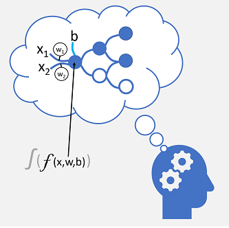
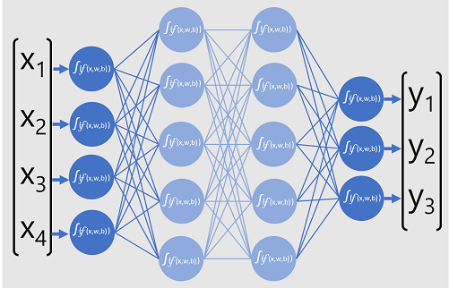
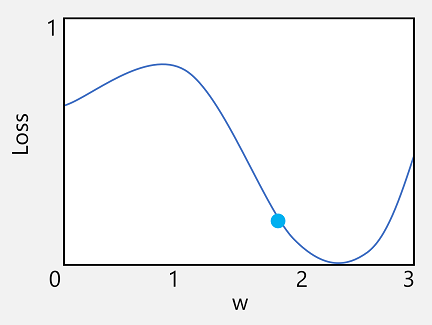

# module 5

* Train and evaluate deep learning models

  * Deep neural network concepts
  * Convolutional neural networks
  * Transfer learning

## Neural networks

Deep learning is an advanced form of machine learning that tries to emulate the way the human brain learns. In your brain, you have nerve cells called neurons, which are connected to one another by nerve extensions that pass electrochemical signals through the network.

When the first neuron in the network is stimulated, the input signal is processed, and if it exceeds a particular threshold, the neuron is activated and passes the signal on to the neurons to which it is connected. These neurons in turn may be activated and pass the signal on through the rest of the network. Over time, the connections between the neurons are strengthened by frequent use as you learn how to respond effectively. For example, if someone throws a ball towards you, your neuron connections enable you to process the visual information and coordinate your movements to catch the ball. If you perform this action repeatedly, the network of neurons involved in catching a ball will grow stronger as you learn how to be better at catching a ball.

Deep learning emulates this biological process using artificial neural networks that process numeric inputs rather than electrochemical stimuli.



The incoming nerve connections are replaced by numeric inputs that are typically identified as x. When there's more than one input value, x is considered a vector with elements named x1, x2, and so on.

Associated with each x value is a weight (w), which is used to strengthen or weaken the effect of the x value to simulate learning. Additionally, a bias (b) input is added to enable fine-grained control over the network. During the training process, the w and b values will be adjusted to tune the network so that it "learns" to produce correct outputs.

The neuron itself encapsulates a function that calculates a weighted sum of x, w, and b. This function is in turn enclosed in an activation function that constrains the result (often to a value between 0 and 1) to determine whether or not the neuron passes an output onto the next layer of neurons in the network.

### a simple classification example

For example, suppose your observation consists of some measurements of a penguin. Specifically, the measurements are:

* The length of the penguin's bill.
* The depth of the penguin's bill.
* The length of the penguin's flipper.
* The penguin's weight.

In this case, the features (x) are a vector of four values, or mathematically, `x=[x1,x2,x3,x4]`.

Let's suppose that the label we're trying to predict (y) is the species of the penguin, and that there are three possible species it could be:

* Adelie
* Gentoo
* Chinstrap

This is an example of a classification problem, in which the machine learning model must predict the most probable class to which the observation belongs. A classification model accomplishes this by predicting a label that consists of the probability for each class. In other words, y is a vector of three probability values; one for each of the possible classes: `y=[P(0),P(1),P(2)]`.

You train the machine learning model by using observations for which you already know the true label. For example, you may have the following feature measurements for an Adelie specimen:

x=[37.3, 16.8, 19.2, 30.0]

You already know that this is an example of an Adelie (class 0), so a perfect classification function should result in a label that indicates a 100% probability for class 0, and a 0% probability for classes 1 and 2:

y=[1, 0, 0]

### deep neural network - model

So how would we use deep learning to build a classification model for the penguin classification model? Let's look at an example:



The deep neural network model for the classifier consists of multiple layers of artificial neurons. In this case, there are four layers:

* An input layer with a neuron for each expected input (x) value.
* Two so-called hidden layers, each containing five neurons.
* An output layer containing three neurons - one for each class probability (y) value to be predicted by the model.

Because of the layered architecture of the network, this kind of model is sometimes referred to as a multilayer perceptron. Additionally, notice that all neurons in the input and hidden layers are connected to all neurons in the subsequent layers - this is an example of a fully connected network.

When you create a model like this, you must define an input layer that supports the number of features your model will process, and an output layer that reflects the number of outputs you expect it to produce. You can decide how many hidden layers you want to include and how many neurons are in each of them; but you have no control over the input and output values for these layers - these are determined by the model training process.

### deep neural network - training

The training process for a deep neural network consists of multiple iterations, called epochs. For the first epoch, you start by assigning random initialization values for the weight (w) and bias b values. Then the process is as follows:

* Features for data observations with known label values are submitted to the input layer. Generally, these observations are grouped into batches (often referred to as mini-batches).
* The neurons then apply their function, and if activated, pass the result onto the next layer until the output layer produces a prediction.
* The prediction is compared to the actual known value, and the amount of variance between the predicted and true values (which we call the loss) is calculated.
* Based on the results, revised values for the weights and bias values are calculated to reduce the loss, and these adjustments are backpropagated to the neurons in the network layers.
* The next epoch repeats the batch training forward pass with the revised weight and bias values, hopefully improving the accuracy of the model (by reducing the loss).

Processing the training features as a batch improves the efficiency of the training process by processing multiple observations simultaneously as a matrix of features with vectors of weights and biases. Linear algebraic functions that operate with matrices and vectors also feature in 3D graphics processing, which is why computers with graphic processing units (GPUs) provide significantly better performance for deep learning model training than central processing unit (CPU) only computers.

## loss functions and backpropagation

The previous description of the deep learning training process mentioned that the loss from the model is calculated and used to adjust the weight and bias values. How exactly does this work?

* Calculating loss

Suppose one of the samples passed through the training process contains features of an Adelie specimen (class 0). The correct output from the network would be [1, 0, 0]. Now suppose that the output produced by the network is [0.4, 0.3, 0.3]. Comparing these, we can calculate an absolute variance for each element (in other words, how far is each predicted value away from what it should be) as [0.6, 0.3, 0.3].

In reality, since we're actually dealing with multiple observations, we typically aggregate the variance - for example by squaring the individual variance values and calculating the mean, so we end up with a single, average loss value, like 0.18.

* Optimizers

Now, here's the clever bit. The loss is calculated using a function, which operates on the results from the final layer of the network, which is also a function. The final layer of network operates on the outputs from the previous layers, which are also functions. So in effect, the entire model from the input layer right through to the loss calculation is just one big nested function. Functions have a few really useful characteristics, including:

You can conceptualize a function as a plotted line comparing its output with each of its variables.
You can use differential calculus to calculate the derivative of the function at any point with respect to its variables.
Let's take the first of these capabilities. We can plot the line of the function to show how an individual weight value compares to loss, and mark on that line the point where the current weight value matches the current loss value.



Now let's apply the second characteristic of a function. The derivative of a function for a given point indicates whether the slope (or gradient) of the function output (in this case, loss) is increasing or decreasing with respect to a function variable (in this case, the weight value). A positive derivative indicates that the function is increasing, and a negative derivative indicates that it is decreasing. In this case, at the plotted point for the current weight value, the function has a downward gradient. In other words, increasing the weight will have the effect of decreasing the loss.

We use an optimizer to apply this same trick for all of the weight and bias variables in the model and determine in which direction we need to adjust them (up or down) to reduce the overall amount of loss in the model. There are multiple commonly used optimization algorithms, including stochastic gradient descent (SGD), Adaptive Learning Rate (ADADELTA), Adaptive Momentum Estimation (Adam), and others; all of which are designed to figure out how to adjust the weights and biases to minimize loss.

## learning rate

Now, the obvious next question is, by how much should the optimizer adjust the weights and bias values? If you look at the plot for our weight value, you can see that increasing the weight by a small amount will follow the function line down (reducing the loss), but if we increase it by too much, the function line starts to go up again, so we might actually increase the loss; and after the next epoch, we might find we need to reduce the weight.

The size of the adjustment is controlled by a parameter that you set for training called the learning rate. A low learning rate results in small adjustments (so it can take more epochs to minimize the loss), while a high learning rate results in large adjustments (so you might miss the minimum altogether).

## pytorch

installing locally


customize the url to your needs <https://pytorch.org/get-started/locally/>

```bash
pip3 install torch torchvision torchaudio --index-url https://download.pytorch.org/whl/cu118
```

in requirements_pytorch.txt it's listed like this

```txt
torch
torchvision
torchaudio
```

and install it like this (using your custom url)

```bash
pip install -r requirements_pytorch.txt --index-url https://download.pytorch.org/whl/cu118
```
