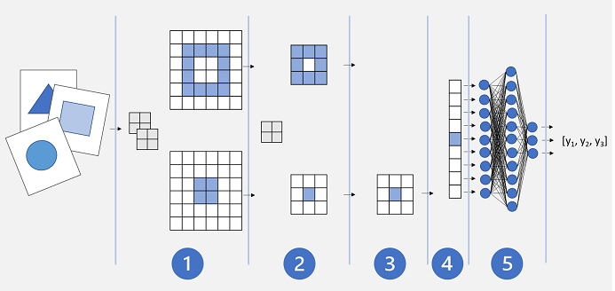
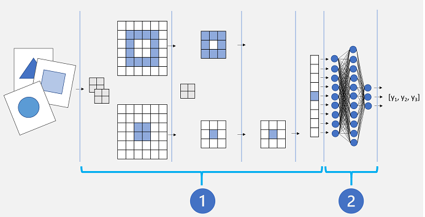

# module 5

* Train and evaluate deep learning models

  * Deep neural network concepts
  * Convolutional neural networks
  * Transfer learning

## Neural networks

Deep learning is an advanced form of machine learning that tries to emulate the way the human brain learns. In your brain, you have nerve cells called neurons, which are connected to one another by nerve extensions that pass electrochemical signals through the network.

When the first neuron in the network is stimulated, the input signal is processed, and if it exceeds a particular threshold, the neuron is activated and passes the signal on to the neurons to which it is connected. These neurons in turn may be activated and pass the signal on through the rest of the network. Over time, the connections between the neurons are strengthened by frequent use as you learn how to respond effectively. For example, if someone throws a ball towards you, your neuron connections enable you to process the visual information and coordinate your movements to catch the ball. If you perform this action repeatedly, the network of neurons involved in catching a ball will grow stronger as you learn how to be better at catching a ball.

Deep learning emulates this biological process using artificial neural networks that process numeric inputs rather than electrochemical stimuli.


The incoming nerve connections are replaced by numeric inputs that are typically identified as x. When there's more than one input value, x is considered a vector with elements named x1, x2, and so on.

Associated with each x value is a weight (w), which is used to strengthen or weaken the effect of the x value to simulate learning. Additionally, a bias (b) input is added to enable fine-grained control over the network. During the training process, the w and b values will be adjusted to tune the network so that it "learns" to produce correct outputs.

The neuron itself encapsulates a function that calculates a weighted sum of x, w, and b. This function is in turn enclosed in an activation function that constrains the result (often to a value between 0 and 1) to determine whether or not the neuron passes an output onto the next layer of neurons in the network.

### a simple classification example

For example, suppose your observation consists of some measurements of a penguin. Specifically, the measurements are:

* The length of the penguin's bill.
* The depth of the penguin's bill.
* The length of the penguin's flipper.
* The penguin's weight.

In this case, the features (x) are a vector of four values, or mathematically, `x=[x1,x2,x3,x4]`.

Let's suppose that the label we're trying to predict (y) is the species of the penguin, and that there are three possible species it could be:

* Adelie
* Gentoo
* Chinstrap

This is an example of a classification problem, in which the machine learning model must predict the most probable class to which the observation belongs. A classification model accomplishes this by predicting a label that consists of the probability for each class. In other words, y is a vector of three probability values; one for each of the possible classes: `y=[P(0),P(1),P(2)]`.

You train the machine learning model by using observations for which you already know the true label. For example, you may have the following feature measurements for an Adelie specimen:

x=[37.3, 16.8, 19.2, 30.0]

You already know that this is an example of an Adelie (class 0), so a perfect classification function should result in a label that indicates a 100% probability for class 0, and a 0% probability for classes 1 and 2:

y=[1, 0, 0]

### deep neural network - model

So how would we use deep learning to build a classification model for the penguin classification model? Let's look at an example:


The deep neural network model for the classifier consists of multiple layers of artificial neurons. In this case, there are four layers:

* An input layer with a neuron for each expected input (x) value.
* Two so-called hidden layers, each containing five neurons.
* An output layer containing three neurons - one for each class probability (y) value to be predicted by the model.

Because of the layered architecture of the network, this kind of model is sometimes referred to as a multilayer perceptron. Additionally, notice that all neurons in the input and hidden layers are connected to all neurons in the subsequent layers - this is an example of a fully connected network.

When you create a model like this, you must define an input layer that supports the number of features your model will process, and an output layer that reflects the number of outputs you expect it to produce. You can decide how many hidden layers you want to include and how many neurons are in each of them; but you have no control over the input and output values for these layers - these are determined by the model training process.

### deep neural network - training

The training process for a deep neural network consists of multiple iterations, called epochs. For the first epoch, you start by assigning random initialization values for the weight (w) and bias b values. Then the process is as follows:

* Features for data observations with known label values are submitted to the input layer. Generally, these observations are grouped into batches (often referred to as mini-batches).
* The neurons then apply their function, and if activated, pass the result onto the next layer until the output layer produces a prediction.
* The prediction is compared to the actual known value, and the amount of variance between the predicted and true values (which we call the loss) is calculated.
* Based on the results, revised values for the weights and bias values are calculated to reduce the loss, and these adjustments are backpropagated to the neurons in the network layers.
* The next epoch repeats the batch training forward pass with the revised weight and bias values, hopefully improving the accuracy of the model (by reducing the loss).

Processing the training features as a batch improves the efficiency of the training process by processing multiple observations simultaneously as a matrix of features with vectors of weights and biases. Linear algebraic functions that operate with matrices and vectors also feature in 3D graphics processing, which is why computers with graphic processing units (GPUs) provide significantly better performance for deep learning model training than central processing unit (CPU) only computers.

## loss functions and backpropagation

The previous description of the deep learning training process mentioned that the loss from the model is calculated and used to adjust the weight and bias values. How exactly does this work?

* Calculating loss

Suppose one of the samples passed through the training process contains features of an Adelie specimen (class 0). The correct output from the network would be [1, 0, 0]. Now suppose that the output produced by the network is [0.4, 0.3, 0.3]. Comparing these, we can calculate an absolute variance for each element (in other words, how far is each predicted value away from what it should be) as [0.6, 0.3, 0.3].

In reality, since we're actually dealing with multiple observations, we typically aggregate the variance - for example by squaring the individual variance values and calculating the mean, so we end up with a single, average loss value, like 0.18.

* Optimizers

Now, here's the clever bit. The loss is calculated using a function, which operates on the results from the final layer of the network, which is also a function. The final layer of network operates on the outputs from the previous layers, which are also functions. So in effect, the entire model from the input layer right through to the loss calculation is just one big nested function. Functions have a few really useful characteristics, including:

You can conceptualize a function as a plotted line comparing its output with each of its variables.
You can use differential calculus to calculate the derivative of the function at any point with respect to its variables.
Let's take the first of these capabilities. We can plot the line of the function to show how an individual weight value compares to loss, and mark on that line the point where the current weight value matches the current loss value.


Now let's apply the second characteristic of a function. The derivative of a function for a given point indicates whether the slope (or gradient) of the function output (in this case, loss) is increasing or decreasing with respect to a function variable (in this case, the weight value). A positive derivative indicates that the function is increasing, and a negative derivative indicates that it is decreasing. In this case, at the plotted point for the current weight value, the function has a downward gradient. In other words, increasing the weight will have the effect of decreasing the loss.

We use an optimizer to apply this same trick for all of the weight and bias variables in the model and determine in which direction we need to adjust them (up or down) to reduce the overall amount of loss in the model. There are multiple commonly used optimization algorithms, including stochastic gradient descent (SGD), Adaptive Learning Rate (ADADELTA), Adaptive Momentum Estimation (Adam), and others; all of which are designed to figure out how to adjust the weights and biases to minimize loss.

## learning rate

Now, the obvious next question is, by how much should the optimizer adjust the weights and bias values? If you look at the plot for our weight value, you can see that increasing the weight by a small amount will follow the function line down (reducing the loss), but if we increase it by too much, the function line starts to go up again, so we might actually increase the loss; and after the next epoch, we might find we need to reduce the weight.

The size of the adjustment is controlled by a parameter that you set for training called the learning rate. A low learning rate results in small adjustments (so it can take more epochs to minimize the loss), while a high learning rate results in large adjustments (so you might miss the minimum altogether).

## pytorch

installing locally


customize the url to your needs <https://pytorch.org/get-started/locally/>

eg. if only using CPU,

```bash
pip3 install torch torchvision torchaudio
```

in requirements_pytorch.txt it's listed like this

```txt
torch
torchvision
torchaudio
```

so you can just run

```bash
pip install -r requirements_pytorch.txt
```

but if you want to use a version of CUDA (Compute Unified Device Architecture, extends the C/C++ programming languages, enabling developers to write programs that can execute on the GPU)

```bash
pip3 install torch torchvision torchaudio --index-url https://download.pytorch.org/whl/cu118
```

and install it like this (using your custom url)

```bash
pip install -r requirements_pytorch.txt --index-url https://download.pytorch.org/whl/cu118
```

## Convolutional neural networks

A CNN typically works by extracting features from images, and then feeding those features into a fully connected neural network to generate a prediction. The feature extraction layers in the network have the effect of reducing the number of features from the potentially huge array of individual pixel values to a smaller feature set that supports label prediction.

CNNs consist of multiple layers, each performing a specific task in extracting features or predicting labels.

### Convolution layers

One of the principal layer types is a convolutional layer that extracts important features in images. A convolutional layer works by applying a filter to images. The filter is defined by a kernel that consists of a matrix of weight values.

For example, a 3x3 filter might be defined like this:

```none
 1  -1   1
-1   0  -1
 1  -1   1
```

An image is also just a matrix of pixel values. To apply the filter, you "overlay" it on an image and calculate a weighted sum of the corresponding image pixel values under the filter kernel. The result is then assigned to the center cell of an equivalent 3x3 patch in a new matrix of values that is the same size as the image. For example, suppose a 6 x 6 image has the following pixel values:

```none
255 255 255 255 255 255 
255 255 100 255 255 255
255 100 100 100 255 255
100 100 100 100 100 255
255 255 255 255 255 255
255 255 255 255 255 255
```

Applying the filter to the top-left 3x3 patch of the image would work like this:

```none
255 255 255      1  -1   1    (255 x 1)+(255 x -1)+(255 x 1) +
255 255 100  x  -1   0  -1  = (255 x -1)+(255 x 0)+(100 x -1) +   = 155
255 100 100      1  -1   1    (255 x1 )+(100 x -1)+(100 x 1)
```

The result is assigned to the corresponding pixel value in the new matrix like this:

```none
?   ?   ?   ?   ?   ?  
?  155  ?   ?   ?   ?
?   ?   ?   ?   ?   ?
?   ?   ?   ?   ?   ?
?   ?   ?   ?   ?   ?
?   ?   ?   ?   ?   ?
```

Now the filter is moved along (convolved), typically using a step size of 1 (so moving along one pixel to the right), and the value for the next pixel is calculated

```none
255 255 255      1  -1   1    (255 x 1)+(255 x -1)+(255 x 1) +
255 100 255  x  -1   0  -1  = (255 x -1)+(100 x 0)+(255 x -1) +   = -155
100 100 100      1  -1   1    (100 x1 )+(100 x -1)+(100 x 1)
```

So now we can fill in the next value of the new matrix.

```none
?   ?   ?   ?   ?   ?  
?  155 -155 ?   ?   ?
?   ?   ?   ?   ?   ?
?   ?   ?   ?   ?   ?
?   ?   ?   ?   ?   ?
?   ?   ?   ?   ?   ?
```

The process repeats until we've applied the filter across all of the 3x3 patches of the image to produce a new matrix of values like this:

```none
?   ?   ?    ?    ?   ?
?  155 -155 155 -155  ?
? -155 310 -155  155  ?
?  310 155  310   0   ?
? -155 -155 -155  0   ?
?   ?   ?    ?    ?   ?
```

Because of the size of the filter kernel, we can't calculate values for the pixels at the edge; so we typically just apply a padding value (often 0):

```none
0   0   0    0    0   0
0  155 -155 155 -155  0
0 -155 310 -155  155  0
0  310 155  310   0   0
0 -155 -155 -155  0   0
0   0   0    0    0   0
```

The output of the convolution is typically passed to an activation function, which is often a Rectified Linear Unit (ReLU) function that ensures negative values are set to 0:

```none
0   0   0    0    0   0
0  155  0   155   0   0
0   0  310   0   155  0
0  310 155  310   0   0
0   0   0    0    0   0
0   0   0    0    0   0
```

The resulting matrix is a feature map of feature values that can be used to train a machine learning model.

Note: The values in the feature map can be greater than the maximum value for a pixel (255), so if you wanted to visualize the feature map as an image you would need to normalize the feature values between 0 and 255.

The convolution process is shown in the animation below.


1. An image is passed to the convolutional layer. In this case, the image is a simple geometric shape.
2. The image is composed of an array of pixels with values between 0 and 255 (for color images, this is usually a 3-dimensional array with values for red, green, and blue channels).
3. A filter kernel is generally initialized with random weights (in this example, we've chosen values to highlight the effect that a filter might have on pixel values; but in a real CNN, the initial weights would typically be generated from a random Gaussian distribution). This filter will be used to extract a feature map from the image data.
4. The filter is convolved across the image, calculating feature values by applying a sum of the weights multiplied by their corresponding pixel values in each position. A Rectified Linear Unit (ReLU) activation function is applied to ensure negative values are set to 0.
5. After convolution, the feature map contains the extracted feature values, which often emphasize key visual attributes of the image. In this case, the feature map highlights the edges and corners of the triangle in the image.

Typically, a convolutional layer applies multiple filter kernels. Each filter produces a different feature map, and all of the feature maps are passed onto the next layer of the network.

### Pooling layers

After extracting feature values from images, pooling (or downsampling) layers are used to reduce the number of feature values while retaining the key differentiating features that have been extracted.

One of the most common kinds of pooling is max pooling in which a filter is applied to the image, and only the maximum pixel value within the filter area is retained. So for example, applying a 2x2 pooling kernel to the following patch of an image would produce the result 155.

```none
0   0
0  155
```

Note that the effect of the 2x2 pooling filter is to reduce the number of values from 4 to 1.

As with convolutional layers, pooling layers work by applying the filter across the whole feature map. The animation below shows an example of max pooling for an image map.


1. The feature map extracted by a filter in a convolutional layer contains an array of feature values.
2. A pooling kernel is used to reduce the number of feature values. In this case, the kernel size is 2x2, so it will produce an array with quarter the number of feature values.
3. The pooling kernel is convolved across the feature map, retaining only the highest pixel value in each position.

### Dropping layers

One of the most difficult challenges in a CNN is the avoidance of overfitting, where the resulting model performs well with the training data but doesn't generalize well to new data on which it wasn't trained. One technique you can use to mitigate overfitting is to include layers in which the training process randomly eliminates (or "drops") feature maps. This may seem counterintuitive, but it's an effective way to ensure that the model doesn't learn to be over-dependent on the training images.

Other techniques you can use to mitigate overfitting include randomly flipping, mirroring, or skewing the training images to generate data that varies between training epochs.

### Flattening layers

After using convolutional and pooling layers to extract the salient features in the images, the resulting feature maps are multidimensional arrays of pixel values. A flattening layer is used to flatten the feature maps into a vector of values that can be used as input to a fully connected layer.

### Fully connected layers

Usually, a CNN ends with a fully connected network in which the feature values are passed into an input layer, through one or more hidden layers, and generate predicted values in an output layer.

A basic CNN architecture might look similar to this:



1. Images are fed into a convolutional layer. In this case, there are two filters, so each image produces two feature maps.
2. The feature maps are passed to a pooling layer, where a 2x2 pooling kernel reduces the size of the feature maps.
3. A dropping layer randomly drops some of the feature maps to help prevent overfitting.
4. A flattening layer takes the remaining feature map arrays and flattens them into a vector.
5. The vector elements are fed into a fully connected network, which generates the predictions. In this case, the network is a classification model that predicts probabilities for three possible image classes (triangle, square, and circle).

### Training a CNN model

As with any deep neural network, a CNN is trained by passing batches of training data through it over multiple epochs, adjusting the weights and bias values based on the loss calculated for each epoch. In the case of a CNN, backpropagation of adjusted weights includes filter kernel weights used in convolutional layers as well as the weights used in fully connected layers.

## Transfer learning

In life, it’s often easier to learn a new skill if you already have expertise in a similar, transferrable skill. For example, it’s probably easier to teach someone how to drive a bus if they have already learned how to drive a car. The driver can build on the driving skills they've already learned in a car, and apply them to driving a bus.

The same principle can be applied to training deep learning models through a technique called transfer learning.

A Convolutional Neural Network (CNN) for image classification is typically composed of multiple layers that extract features, and then use a final fully connected layer to classify images based on these features.

Conceptually, this neural network consists of two distinct sets of layers:

1. A set of layers from the base model that perform feature extraction.
2. A fully connected layer that takes the extracted features and uses them for class prediction.



The feature extraction layers apply convolutional filters and pooling to emphasize edges, corners, and other patterns in the images that can be used to differentiate them, and in theory should work for any set of images with the same dimensions as the input layer of the network. The prediction layer maps the features to a set of outputs that represent probabilities for each class label you want to use to classify the images.

By separating the network into these types of layers, we can take the feature extraction layers from a model that has already been trained and append one or more layers to use the extracted features for prediction of the appropriate class labels for your images. This approach enables you to keep the pre-trained weights for the feature extraction layers, which means you only need to train the prediction layers you have added.

There are many established convolutional neural network architectures for image classification that you can use as the base model for transfer learning, so you can build on the work someone else has already done to easily create an effective image classification model.
