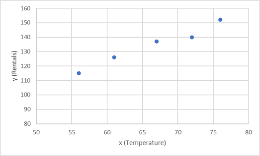
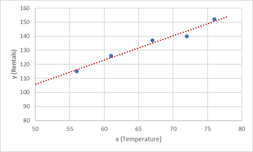
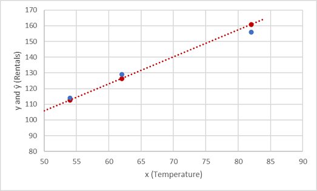

# module 2

* Train and evaluate regression models

  * What is regression?
  * Discover new regression models
  * Improve models with hyperparameters

  * nbs
    * `2_1-training.ipynb`
    * `2_2-experimenting.ipynb`
    * `2_3-tuning.ipynb`
    * `02 - Real Estate Regression Challenge.ipynb`

## Regression

Regression is where models predict a number.

In machine learning, the goal of regression is to create a model that can predict a numeric, quantifiable value, such as a price, amount, size, or other scalar number.

In real world situations, particularly when little data are available, regression models are very useful for making predictions. For example, if a company that rents bicycles wants to predict the expected number of rentals on a given day in the future, a regression model can predict this number. You could create a model using existing data, such as the number of bicycles that were rented on days where the season, day of the week, and so on, were also recorded.

Regression works by establishing a relationship between variables in the data that represent characteristics—known as the features—of the thing being observed, and the variable we're trying to predict—known as the label.

Recall our company rents bicycles and wants to predict the expected number of rentals in a given day. In this case, features include things like the day of the week, month, and so on, while the label is the number of bicycle rentals.

To train the model, we start with a data sample containing the features, as well as known values for the label; so in this case, we need historical data that includes dates, weather conditions, and the number of bicycle rentals.

We'll then split this data sample into two subsets:

A training dataset to which we'll apply an algorithm that determines a function encapsulating the relationship between the feature values and the known label values.
A validation or test dataset that we can use to evaluate the model by using it to generate predictions for the label and comparing them to the actual known label values.
The use of historic data with known label values to train a model makes regression an example of supervised machine learning.

### A simple example

Let's take a simple example to see how the training and evaluation process works in principle. Suppose we simplify the scenario so that we use a single feature—average daily temperature—to predict the bicycle rentals label.

We start with some data that includes known values for the average daily temperature feature and the bicycle rentals label.

|Temperature|Rentals|
|---|---|
|56|115|
|61|126|
|67|137|
|72|140|
|76|152|
|82|156|
|54|114|
|62|129|

Now we'll randomly select five of these observations and use them to train a regression model. When we're talking about ‘training a model’, what we mean is finding a function (a mathematical equation; let’s call it f) that can use the temperature feature (which we’ll call x) to calculate the number of rentals (which we’ll call y). In other words, we need to define the following function: f(x) = y.

Our training dataset looks like this:

|x|y|
|---|---|
|56|115|
|61|126|
|67|137|
|72|140|
|76|152|
|82|156|
|54|114|
|62|129|

Let's start by plotting the training values for x and y on a chart:

Now we need to fit these values to a function, allowing for some random variation. You can probably see that the plotted points form an almost straight diagonal line; in other words, there's an apparent linear relationship between x and y, so we need to find a linear function that's the best fit for the data sample. There are various algorithms we can use to determine this function, which will ultimately find a straight line with minimal overall variance from the plotted points; like this:

The line represents a linear function that can be used with any value of x to apply the slope of the line and its intercept (where the line crosses the y axis when x is 0) to calculate y. In this case, if we extended the line to the left, we'd find that when x is 0, y is about 20, and the slope of the line is such that for each unit of x you move along to the right, y increases by about 1.7. We can therefore calculate our f function as 20 + 1.7x.

Now that we've defined our predictive function, we can use it to predict labels for the validation data we held back and compare the predicted values (which we typically indicate with the symbol ŷ, or "y-hat") with the actual known y values.

|x|y|ŷ|
|---|---|---|
|82|156|159.4|
|54|114|111.8|
|62|129|125.4|

Let's see how the y and ŷ values compare in a plot:

The plotted points that are on the function line are the predicted ŷ values calculated by the function, and the other plotted points are the actual y values.

There are various ways we can measure the variance between the predicted and actual values, and we can use these metrics to evaluate how well the model predicts.

Machine learning is based in statistics and math, and it's important to be aware of specific terms that statisticians and mathematicians (and therefore data scientists) use. You can think of the difference between a predicted label value and the actual label value as a measure of error. However, in practice, the "actual" values are based on sample observations (which themselves might be subject to some random variance). To make it clear that we're comparing a predicted value (ŷ) with an observed value (y) we refer to the difference between them as the residuals. We can summarize the residuals for all of the validation data predictions to calculate the overall loss in the model as a measure of its predictive performance.

One of the most common ways to measure the loss is to square the individual residuals, sum the squares, and calculate the mean. Squaring the residuals has the effect of basing the calculation on absolute values (ignoring whether the difference is negative or positive) and giving more weight to larger differences. This metric is called the Mean Squared Error.

For our validation data, the calculation looks like this:

|y|ŷ|`y - ŷ`|`(y - ŷ)^2`|
|---|---|---|---|
|156|159.4|-3.4|11.56|
|114|111.8|2.2|4.84|
|129|125.4|3.6|12.96|
| |Sum|∑|29.36|
| |Mean|x̄|9.79|

Therefore, the loss for our model based on the MSE metric is 9.79.

So, is that any good? It's difficult to tell, because MSE value isn't expressed in a meaningful unit of measurement. We do know that the lower the value is, the less loss there is in the model, and therefore, the better it's predicting. This makes it a useful metric to compare two models and find the one that performs best.

Sometimes, it's more useful to express the loss in the same unit of measurement as the predicted label value itself; in this case, the number of rentals. It's possible to do this by calculating the square root of the MSE, which produces a metric known, unsurprisingly, as the Root Mean Squared Error (RMSE).

√9.79 = 3.13

So, our model's RMSE indicates that the loss is just over 3, which you can interpret loosely as meaning that on average, incorrect predictions are wrong by around three rentals.

There are many other metrics that can be used to measure loss in a regression. For example, R2 (R-Squared) (sometimes known as coefficient of determination) is the correlation between x and y squared. This produces a value between 0 and 1 that measures the amount of variance that can be explained by the model. Generally, the closer this value is to 1, the better the model predicts.

### Experimenting with models

Regression models are often chosen because they work with small data samples, are robust, easy to interpret, and a variety exist.

* Linear regression is the simplest form of regression, with no limit to the number of features used. Linear regression comes in many forms, often named by the number of features used and the shape of the curve that fits.

* Decision trees take a step-by-step approach to predicting a variable. If we think of our bicycle example, the decision tree might be first split examples between ones that are during Spring/Summer and Autumn/Winter, make a prediction based on the day of the week. Spring/Summer-Monday might have a bike-rental rate of 100 per day, while Autumn/Winter-Monday might have a rental rate of 20 per day.

* Ensemble algorithms construct not just one decision tree, but a large number of trees, allowing better predictions on more complex data. Ensemble algorithms, such as Random Forest, are widely used in machine learning and data science due to their strong prediction abilities.

Data scientists often experiment with using different models. In the following exercise, we'll experiment with different types of models to compare how they perform on the same data.

### Improve models with hyperparameters

Simple models with small datasets can often be fit in a single step, while larger datasets and more complex models must be fit by repeatedly using the model with training data and comparing the output with the expected label. If the prediction is accurate enough, we consider the model trained. If not, we adjust the model slightly and loop again.

Hyperparameters are values that change the way that the model is fit during these loops. Learning rate, for example, is a hyperparameter that sets how much a model is adjusted during each training cycle. A high learning rate means a model can be trained faster; but if it’s too high, the adjustments can be so large that the model is never "finely tuned" and not optimal.

### Preprocessing data

Preprocessing refers to changes you make to your data before it's passed to the model. We've previously read that preprocessing can involve cleaning your dataset. While this is important, preprocessing can also include changing the format of your data so it's easier for the model to use. For example, data described as "red," "orange," "yellow," "lime," and "green" might work better if converted into a format more native to computers, such as numbers stating the amount of red and the amount of green.

* Scaling features

  The most common preprocessing step is to scale features so they fall between zero and one. For example, the weight of a bike and the distance a person travels on a bike may be two very different numbers, but by scaling both numbers to between zero and one allows models to learn more effectively from the data.

* Using categories as features

  In machine learning, you can also use categorical features such as "bicycle," "skateboard," or "car." These features are represented by 0 or 1 values in one-hot vectors; vectors that have a 0 or 1 for each possible value. For example, bicycle, skateboard, and car might respectively be (1,0,0), (0,1,0), and (0,0,1).
