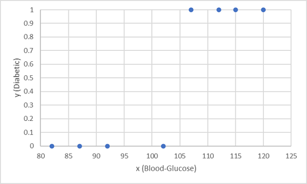
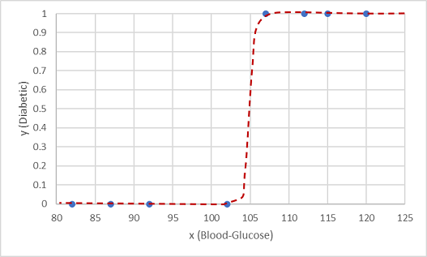
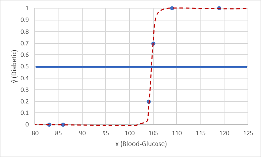
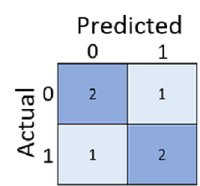

# module 3

* Train and evaluate classification models

  * What is classification?
  * Evaluate classification models
  * Create multiclass classification models

  * nbs
    * `3_1-binary.ipynb`
    * `3_2-metrics.ipynb`
    * `3_3-multiclass.ipynb`
    * `03 - Wine Classification Challenge.ipynb`

## Classification

Classification is a form of machine learning where you train a model to predict which category an item belongs to. For example, a health clinic might use patient diagnostic data such as height, weight, blood pressure, and blood glucose level to predict whether the patient is diabetic.

Categorical data has classes rather than numeric values. Some kinds of data can be either numeric or categorical. For example, the time to run a race could be a numeric time in seconds, or a categorical class of fast, medium, or slow. Other kinds of data can only be categorical, such as a type of shape - circle, triangle, or square.

Binary classification is classification with two categories. For example, we could label patients as non-diabetic or diabetic.

The class prediction is made by determining the probability for each possible class as a value between 0 (impossible) and 1 (certain). The total probability for all classes is always 1, as the patient is definitely either diabetic or non-diabetic. So, if the predicted probability of a patient being diabetic is 0.3, then there's a corresponding probability of 0.7 that the patient is non-diabetic.

A threshold value, often 0.5, is used to determine the predicted class. If the positive class (in this case, diabetic) has a predicted probability greater than the threshold, then a classification of diabetic is predicted.

### A simple example

Suppose we have the following patient data, which consists of a single feature (blood glucose level) and a class label 0 for non-diabetic, 1 for diabetic.

|Blood-Glucose|Diabetic|
|---|---|
|82|0|
|92|0|
|112|1|
|102|0|
|115|1|
|107|1|
|87|0|
|120|1|
|83|0|
|119|1|
|104|1|
|105|0|
|86|0|
|109|1|

We use the first eight observations to train a classification model, and we start by plotting the blood glucose feature (x) and the predicted diabetic label (y).

What we need is a function that calculates a probability value for y based on x (in other words, we need the function f(x) = y). You can see from the chart that patients with a low blood-glucose level are all non-diabetic, while patients with a higher blood-glucose level are diabetic. It seems like the higher the blood-glucose level, the more probable it is that a patient is diabetic, with the inflection point being somewhere between 100 and 110. We need to fit a function that calculates a value between 0 and 1 for y to these values.

One such function is a logistic function, which forms a sigmoidal (S-shaped) curve.

Now we can use the function to calculate a probability value that y is positive, meaning the patient is diabetic, from any value of x by finding the point on the function line for x. We can set a threshold value of 0.5 as the cut-off point for the class label prediction.

Let's test it with the two data values we held back.

Points plotted below the threshold line yield a predicted class of 0 (non-diabetic) and points above the line are predicted as 1 (diabetic).

Now we can compare the label predictions (ŷ, or "y-hat"), based on the logistic function encapsulated in the model, to the actual class labels (y).

|x|y|ŷ|
|---|---|---|
|83|0|0|
|119|1|1|
|104|1|0|
|105|0|1|
|86|0|0|
|109|1|1|

## Evaluate classification models

In the previous units, we created a model that would predict whether a patient had diabetes or not based on their blood glucose level. Now, when applied to some data that wasn't part of the training set we get the following predictions.

|x|y|ŷ|
|83|0|0|
|119|1|1|
|104|1|0|
|105|0|1|
|86|0|0|
|109|1|1|

Recall that x refers to blood glucose level, y refers to whether they're actually diabetic, and ŷ refers to the model’s prediction as to whether they're diabetic or not.

Just calculating how many predictions were correct is sometimes misleading or too simplistic for us to understand the kinds of errors it will make in the real world. To get more detailed information, we can tabulate the results in a structure called a confusion matrix, like this:

The confusion matrix shows the total number of cases where:

* The model predicted 0 and the actual label is 0 (true negatives, top left)
* The model predicted 1 and the actual label is 1 (true positives, bottom right)
* The model predicted 0 and the actual label is 1 (false negatives, bottom left)
* The model predicted 1 and the actual label is 0 (false positives, top right)

The cells in a confusion matrix are often shaded so that higher values have a deeper shade. This makes it easier to see a strong diagonal trend from top-left to bottom-right, highlighting the cells where the predicted value and actual value are the same.

From these core values, you can calculate a range of other metrics that can help you evaluate the performance of the model. For example:

* Accuracy: $\frac{TP+TN}{TP+TN+FP+FN}$ - out all of the predictions, how many were correct?
* Recall: $TP/(TP+FN)$ - of all the cases that are positive, how many did the model identify?
* Precision: $TP/(TP+FP)$ - of all the cases that the model predicted to be positive, how many actually are positive?

## Multiclass classification models

It's also possible to create multiclass classification models, in which there are more than two possible classes. For example, the health clinic might expand the diabetes model to classify patients as:

* Non-diabetic
* Type-1 diabetic
* Type-2 diabetic

The individual class probability values would still add up to a total of 1 as the patient is definitely in only one of the three classes, and the most probable class would be predicted by the model.

Multiclass classification can be thought of as a combination of multiple binary classifiers. There are two ways in which you approach the problem:

One vs Rest (OVR), in which a classifier is created for each possible class value, with a positive outcome for cases where the prediction is this class, and negative predictions for cases where the prediction is any other class. For example, a classification problem with four possible shape classes (square, circle, triangle, hexagon) would require four classifiers that predict:

* square or not
* circle or not
* triangle or not
* hexagon or not

One vs One (OVO), in which a classifier for each possible pair of classes is created. The classification problem with four shape classes would require the following binary classifiers:

* square or circle
* square or triangle
* square or hexagon
* circle or triangle
* circle or hexagon
* triangle or hexagon

In both approaches, the overall model must take into account all of these predictions to determine which single category the item belongs to.

Fortunately, in most machine learning frameworks, including Scikit-Learn, implementing a multiclass classification model isn't significantly more complex than binary classification - and in most cases, the estimators used for binary classification implicitly support multiclass classification by abstracting an OVR algorithm, an OVO algorithm, or by allowing a choice of either.
