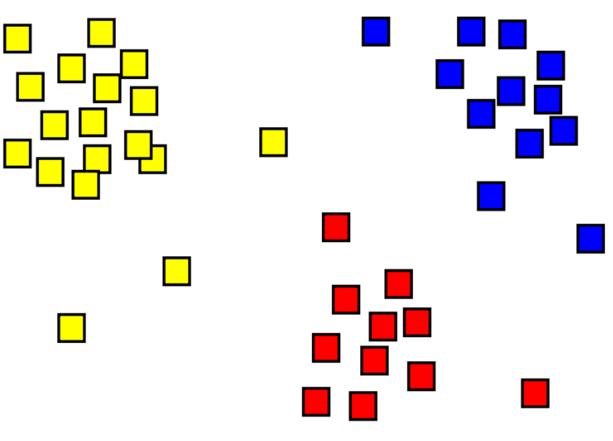
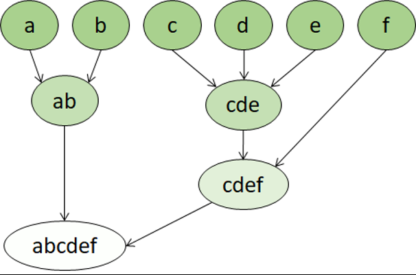

# module 4

* Train and evaluate clustering models

  * What is clustering?
  * Evaluate different types of clustering

  * nbs
    * `4_1-clustering-pca.ipynb`
    * `4_2-kmeans-and-hierarchical.ipynb`
    * `04 - Clustering Challenge.ipynb`

## Clustering

Clustering is the process of grouping objects with similar objects. For example, in the image below we have a collection of 2D coordinates that have been clustered into three categories - top left (yellow), bottom (red), and top right (blue).

Clustering is common and useful for exploring new data where patterns between data points, such as high-level categories, aren't yet known. It's used in many fields that need to automatically label complex data, including analysis of social networks, brain connectivity, spam filtering, and so on.

Clustering is a form of unsupervised machine learning in which observations are grouped into clusters based on similarities in their data values, or features. This kind of machine learning is considered unsupervised because it doesn't make use of previously known label values to train a model. In a clustering model, the label is the cluster to which the observation is assigned, based only on its features.

For example, suppose a botanist observes a sample of flowers and records the number of petals and leaves on each flower. It may be useful to group these flowers into clusters based on similarities between their features. There are many ways to determine this grouping. For example, if most flowers have the same number of leaves, they could be grouped into flowers with many vs few petals. Alternatively, if both petal and leaf counts vary considerably there may be a pattern to discover, such as flowers with many leaves also having many petals. The goal of the clustering algorithm is to find the optimal way to split the dataset into groups. What optimal means depends on both the algorithm used and the dataset that is provided.

## Evaluate different types of clustering

### K-Means clustering

There are multiple algorithms you can use for clustering. One of the most commonly used algorithms is K-Means clustering that, in its simplest form, consists of the following steps:

* The feature values are vectorized to define n-dimensional coordinates (where n is the number of features). In the flower example, we have two features: number of petals and number of leaves. So, the feature vector has two coordinates that we can use to conceptually plot the data points in two-dimensional space.
* You decide how many clusters you want to use to group the flowers - call this value k. For example, to create three clusters, you would use a k value of 3. Then k points are plotted at random coordinates. These points become the center points for each cluster, so they're called centroids.
* Each data point (in this case a flower) is assigned to its nearest centroid.
* Each centroid is moved to the center of the data points assigned to it based on the mean distance between the points.
* After the centroid is moved, the data points may now be closer to a different centroid, so the data points are reassigned to clusters based on the new closest centroid.
* The centroid movement and cluster reallocation steps are repeated until the clusters become stable or a predetermined maximum number of iterations is reached.

The following animation shows this process:

### Hierarchical clustering

Hierarchical clustering is another type of clustering algorithm in which clusters themselves belong to larger groups, which belong to even larger groups, and so on. The result is that data points can be clusters in differing degrees of precision: with a large number of very small and precise groups, or a small number of larger groups.

For example, if we apply clustering to the meanings of words, we may get a group containing adjectives specific to emotions ('angry,' 'happy,' and so on). This group belongs to a group containing all human-related adjectives ('happy,' 'handsome,' 'young'), which belongs to an even higher group containing all adjectives ('happy,' 'green,' 'handsome,' 'hard,' and so on).

Hierarchical clustering is useful for not only breaking data into groups, but understanding the relationships between these groups. A major advantage of hierarchical clustering is that it doesn't require the number of clusters to be defined in advance. And, it can sometimes provide more interpretable results than nonhierarchical approaches. The major drawbacks are that these approaches can take longer to compute than simpler approaches, and sometimes they aren't suitable for large datasets.
