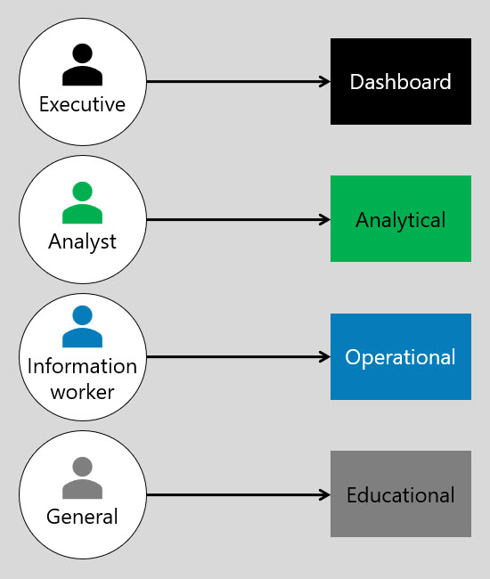
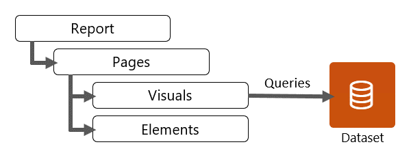
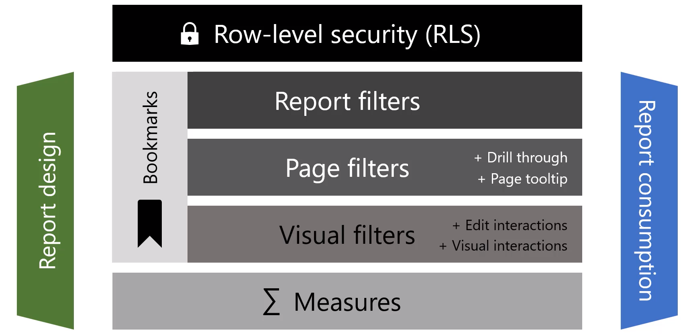

#

## unit 1

unit 1 - Introduction to designing reports for filtering

You can show details by using four different techniques:

* Use drillable visuals
* Add tooltips
* Add drillthrough
* Embed paginated reports

### Reports

* An information worker is someone who uses data to help them make decisions or to take actions. Typically, information workers make operational decisions that are made on a daily basis.
* An executive audience makes plans and decisions, often with a medium or long-term focus.
* An analytical report allows the report consumer to discover answers to a broad array of questions, often involving interactive features like slicers.
* An operational report is designed to give the report consumer the ability to monitor current or real-time data, make decisions, and act on those decisions.

a Power BI report connects to a single semantic model (semantic model), and it has at least one report page. However, it's common that reports have multiple pages. On each page, report objects are laid out. Report objects include:

* Visuals - Visualizations of semantic model data.
* Elements - Provide visual interest but don't use semantic model data. Elements include text boxes, buttons, shapes, and images.

### KPIs

Key performance indicators (KPIs) are excellent in helping you track progress toward a specific goal over time. To use a KPI, you need three pieces of information:

* A unit of measurement that you want to track, for instance total sales, number of employee hires, number of loans serviced, or number of students enrolled.
* A goal for the measurement so that you can compare your progress with that goal.
* A time series, for instance daily, monthly, or yearly.

## unit 2

unit 2 - Apply filters to the report structure

Fields added to the Filters pane can achieve the same result as a slicer. One difference is they don’t take up space on the report page. Another difference is that they can be configured to achieve more sophisticated filtering requirements.

### Row-level security

<https://learn.microsoft.com/en-us/power-bi/admin/service-admin-rls/>

## unit 3

unit 3 - Apply filters with slicers

## unit 4

unit 4 - Design reports with advanced filtering techniques

Beyond filters and slicers, report authors can employ other filtering techniques, such as:

* Visual interactions
* Drillthrough
* Report tooltip
* Bookmarks
* Report options
* Query reduction options

Highlighting values in reports helps you to quickly communicate important and relevant facts about data. Power BI supports several techniques to highlight values:

* Conditional formatting
* Overlaid analytics
* Anomaly detection
* Specialized visuals

The button element can take your Power BI reports to the next level by making them behave like an app. Buttons support six different actions that take effect when the button is selected.

When you are inserting a button, many preconfigured buttons are available for you to choose from. These preconfigured buttons include icons and preconfigured actions, such as the Back button, Q&A button, and Bookmark button.

## unit 5

unit 5 - Consumption-time filtering

## unit 6

unit 6 - Select report filter techniques
