# info

Here we create some DAGs

## setup

first, to have the correct context (and have your linter work), install airflow on the virtualenv

don't forget to activate the virtualenv and select the right interpreter

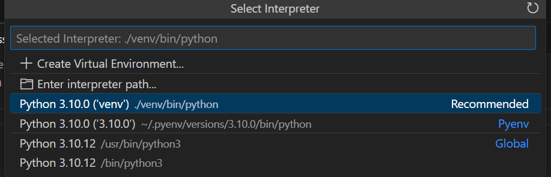

```bash
pip install apache-airflow
```

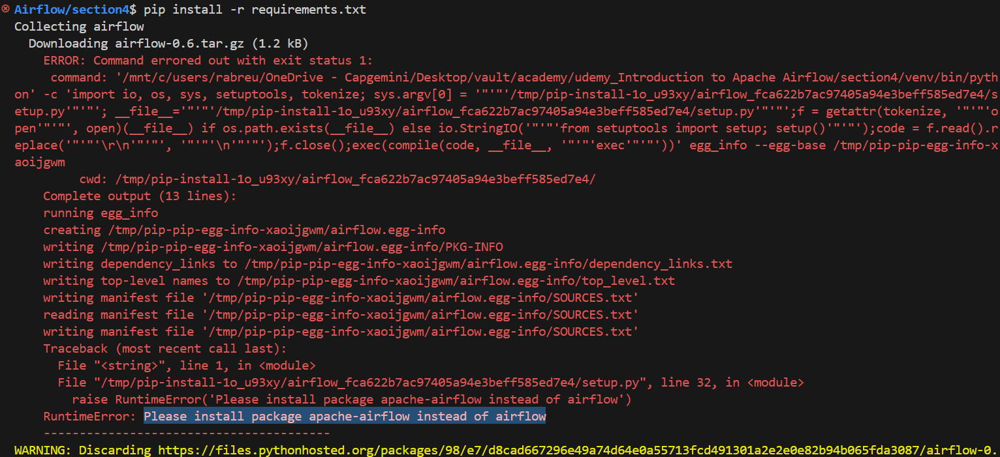

<https://github.com/apache/airflow>

Alternatively, instead of running the code locally (in Windows or your WSL), you can connect to the running docker container (airflow-webserver), which obviously already has those dependencies already there... so you don't need a virtualen/to install dependencies

## defining a DAG

after defining DAGs (in the dags folder in this project setup), they show up on the web server

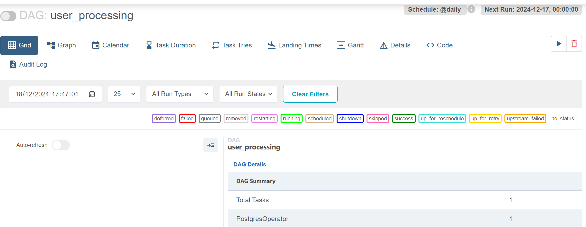

```python
with DAG(
    dag_id="user_processing", # Set unique identifier for the DAG
    start_date=datetime(2023, 1, 1), # Start on 1st january 2023
    schedule_interval="@daily", # Run every day at midnight using a cron preset
    catchup=False # Have catchup=False as we don't want to backfill missed runs (yet)
) as dag:
    pass
```

## using a database operator

Next we want to use a postgres database, so we need the postgres provider. PostgresOperator comes from the PostgreSQL provider (airflow.providers.postgres).

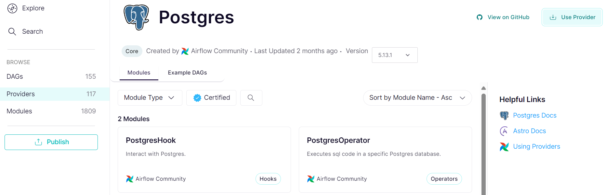

clicking the Use Provider button

```bash
pip install apache-airflow-providers-postgres==5.13.1
```

For any external operator, you need to use it's provider to define it and you need to establish a connection to it. To do that, go to Admin>Connections

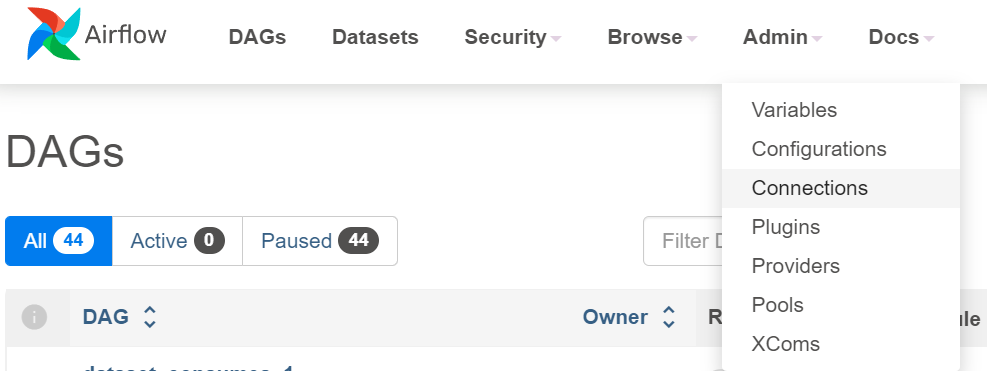

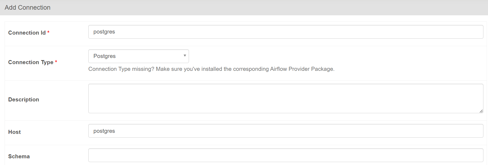

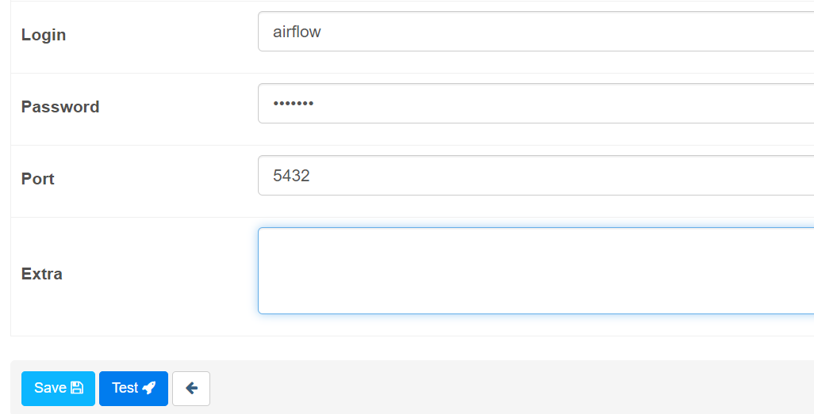

```python
# use the postgres operator to create a table in postgres
create_table = PostgresOperator(
    task_id = 'create_table',
    postgres_conn_id = 'postgres',
    sql = '''
        CREATE TABLE IF NOT EXISTS users(
        firstname TEXT NOT NULL,
        lastname TEXT NOT NULL,
        country TEXT NOT NULL,
        username TEXT NOT NULL,
        password TEXT NOT NULL,
        email TEXT NOT NULL
        );
        '''
)
```

## airflow CLI

There's also the airflow cli

```bash
airflow --help
```

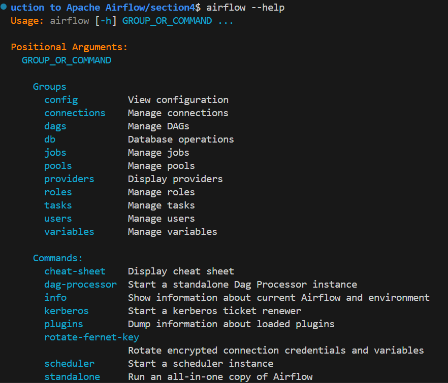

After you create a task, you can test it works right away by attaching to the scheduler container and running that task

You can attach to the container manually by identifying it

```bash
docker compose ps
```

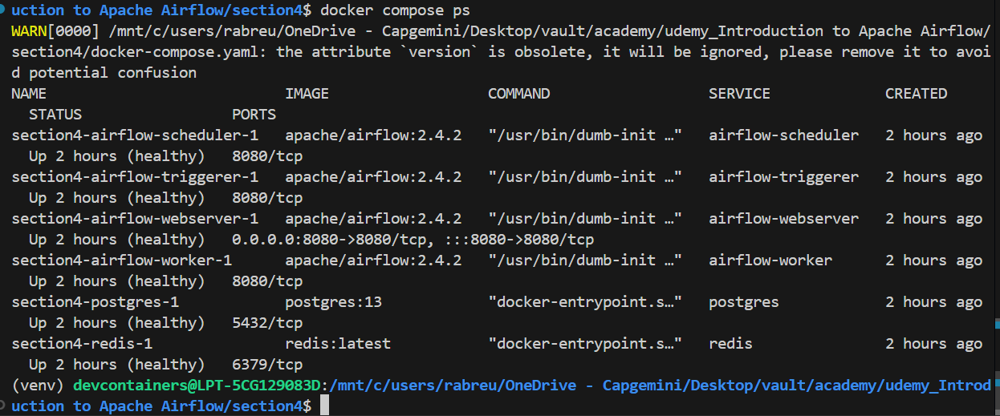

mine is called section4-airflow-scheduler-1

and running a bash shell on it

```bash
docker exec -it section4-airflow-scheduler-1 bash
```

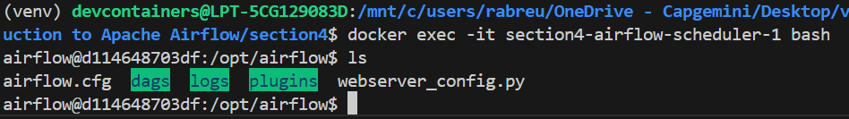

Or simply use the VSCode extension for that

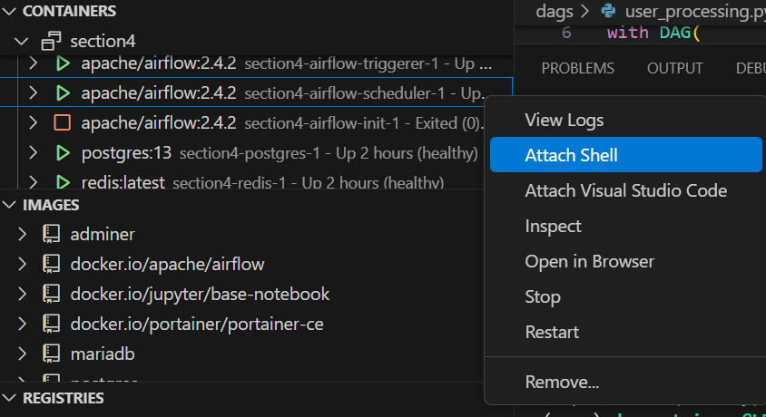

then test the task

```bash
# airflow tasks test <name_of_the_task> <task_id> <a_date_in_the_past>

airflow tasks test user_processing create_table 2022-01-01
```

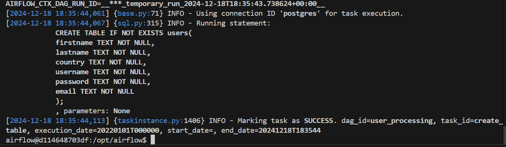

## using a API

We want to use this api

<https://randomuser.me/>

or more specifically, this endpoint <https://randomuser.me/api/>

Add a task to check the connection to the api, using HttpSensor. HttpSensor comes from the HTTP provider (airflow.providers.http).
You need to create a connection to it. As before, go to the Airflow UI (on your machine localhost:80880) and create the following connection:

* Name: user_api
* Connection type: HTTP
* Host: `https://randomuser.me`

Careful, no trailing slash!

Use the SimpleHttpOperator to make the GET request

<https://airflow.apache.org/docs/apache-airflow-providers-http/stable/_api/airflow/providers/http/operators/http/index.html>

Next, define a task that uses the PythonOperator to parse the response from the API

```python
# use the http sensor operator to ping a url
is_api_available = HttpSensor(
    task_id = 'is_api_available',
    http_conn_id = 'user_api',
    endpoint = 'api/'
)

# use the http operator to make a GET request
extract_user = SimpleHttpOperator(
    task_id = 'extract_user',
    http_conn_id = 'user_api',
    endpoint = 'api/',
    method = 'GET',
    # convert the data received from the api to json
    response_filter = lambda res: json.loads(res.text),
    log_response = True
)
```

We want the data from extract_user to be available to process user (that is, to exchange data between tasks). For that you use `xcom_pull()`

```python
def _process_user(ti:PythonOperator): # task instance
    user:json = ti.xcom_pull(task_ids='extract_user')
    user = user['results'][0]
    processed_user = json_normalize(
        {
            'firstname': user['name']['first'],
            'lastname': user['name']['last'],
            'country': user['location']['country'],
            'username': user['login']['username'],
            'password': user['login']['password'],
            'email': user['email']
        }
    )
    # Exclude the index and header from the CSV
    processed_user.to_csv('/tmp/processed_user.csv', index=False, header=False)
    
# ...

process_user = PythonOperator(
    task_id = 'process_user',
    python_callable = _process_user 
)

extract_user >> process_user
```

## storing data in the database

use the PostgresHook to save the data from a csv file (the data we got from the api in the previous step) into a table. We use the hook instead of the database operator because it is lower level (has that COPY command below)

```python
def _store_user():
    hook = PostgresHook(postgres_conn_id='postgres')
    # make a copy from the csv file into teh table
    hook.copy_expert(
        sql="COPY users FROM stdin WITH DELIMITER as ','",
        filename='/tmp/processed_user.csv'
    )

# ...

store_user = PythonOperator(
        task_id = 'store_user',
        python_callable=_store_user
    )
```

## specify the dependencies

You represent dependencies using bitshit operators (`>>`, `<<`) or the set_upstream() and set_downstream() functions

```python
create_table >> is_api_available >> extract_user >> process_user >> store_user

# same thing
store_user << process_user << extract_user << is_api_available << create_table
```

```python
# Dependencies using set_upstream
store_user.set_upstream(process_user)
process_user.set_upstream(extract_user)
extract_user.set_upstream(is_api_available)
is_api_available.set_upstream(create_table)

# Optionally, you can use set_downstream
create_table.set_downstream(is_api_available)
```

## verify the work

connect to the worker container and check the file was created; connect to the postgres container and verify the table was created

```bash
psql -U airflow
```

## DAG schedulling

* The `schedule_interval` property defines how often a DAG should run, such as daily (@daily), hourly (@hourly), or custom intervals (e.g., cron expressions).
* The `start_date` defines the earliest possible execution date for the DAG. However, a DAG does not run exactly at the start_date. Instead, it waits for the first schedule_interval period to pass.
* A DAG runs after the period it represents has passed.

    eg., if start_date is set to 2023-01-01 and schedule_interval="@daily", the first DAG run represents work for 2023-01-01 00:00 to 2023-01-02 00:00. This run will execute at 2023-01-02 00:00.

```python
with DAG(
    # ...
    start_date=datetime(2023, 1, 1), # Start on 1st january 2023
    schedule_interval="@daily", # Run every day at midnight using a cron preset
) as dag:
    pass
```

the schedule_interval property for a DAG defines how often the DAG should run from the start_date + schedule_time

## Backfilling

The catch up mechanism allows you to automatically run non triggered DAG runs between the last time your DAG was triggered and the present date.

```python
with DAG(
    # ...
    catchup=True
) as dag:
    pass
```
