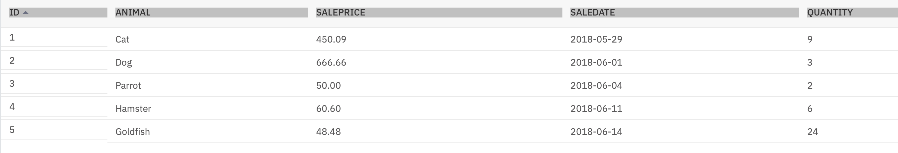

PETSALE table




```sql
DELIMITER //
CREATE PROCEDURE RETRIEVE_ALL()
BEGIN
   SELECT *  FROM PETSALE;
END //
DELIMITER ;
```

To call the RETRIEVE_ALL routine, open another SQL tab by clicking Open in new Tab

```sql
CALL RETRIEVE_ALL;
DROP PROCEDURE RETRIEVE_ALL;
```


You will create a stored procedure routine named UPDATE_SALEPRICE with parameters Animal_ID and Animal_Health.
For animal with ID XX having BAD health condition, the sale price will be reduced further by 25%.
For animal with ID YY having WORSE health condition, the sale price will be reduced further by 50%.
For animal with ID ZZ having other health condition, the sale price won't change.

```sql
DELIMITER @
CREATE PROCEDURE UPDATE_SALEPRICE (IN Animal_ID INTEGER, IN Animal_Health VARCHAR(5))
BEGIN
    IF Animal_Health = 'BAD' THEN
        UPDATE PETSALE
        SET SALEPRICE = SALEPRICE - (SALEPRICE * 0.25)
        WHERE ID = Animal_ID;
    ELSEIF Animal_Health = 'WORSE' THEN
        UPDATE PETSALE
        SET SALEPRICE = SALEPRICE - (SALEPRICE * 0.5)
        WHERE ID = Animal_ID;
    ELSE
        UPDATE PETSALE
        SET SALEPRICE = SALEPRICE
        WHERE ID = Animal_ID;
    END IF;
END @

DELIMITER ;
```

```sql
CALL RETRIEVE_ALL;
CALL UPDATE_SALEPRICE(1, 'BAD');
CALL RETRIEVE_ALL;
```