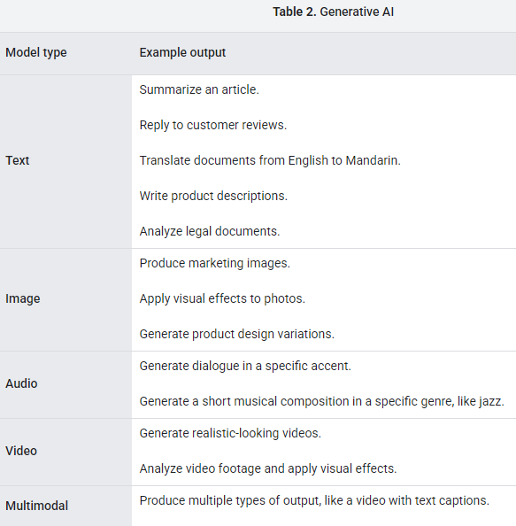

# Introduction to Machine Learning Problem Framing

* Identify if ML is a good solution for a problem.
* Learn how to frame an ML problem.
* Understand how to pick the right model and define success metrics.

<https://developers.google.com/machine-learning/problem-framing>

my rating: 6/10

## Problem framing

Problem framing is the process of analyzing a problem to isolate the individual elements that need to be addressed to solve it.

At a high level, ML problem framing consists of two distinct steps:

* Determining whether ML is the right approach for solving a problem.
* Framing the problem in ML terms.

To understand the problem, perform the following tasks:

* State the goal for the product you are developing or refactoring.
* Determine whether the goal is best solved using predictive ML, generative AI, or a non-ML solution.
* Verify you have the data required to train a model if you're using a predictive ML approach.

## Problem framing - State the goal

Begin by stating your goal in non-ML terms. The goal is the answer to the question, "What am I trying to accomplish?"

The following table clearly states goals for hypothetical apps:

Application - Goal

* Weather app - Calculate precipitation in six-hour increments for a geographic region.
* Fashion app - Generate a variety of shirt designs.
* Video app - Recommend useful videos.
* Mail app - Detect spam.
* Financial app - Summarize financial information from multiple news sources.
* Map app - Calculate travel time.
* Banking app - Identify fraudulent transactions.
* Dining app - Identify cuisine by a restaurant's menu.
* Ecommerce app - Reply to reviews with helpful answers.

## Problem framing - Clear use case for ML

ML systems can be divided into two broad categories: predictive ML and generative AI.

To confirm that ML is the right approach, first verify that your current non-ML solution is optimized. If you don't have a non-ML solution implemented, try solving the problem manually using a heuristic.

The non-ML solution is the benchmark you'll use to determine whether ML is a good use case for your problem. Consider the following questions when comparing a non-ML approach to an ML one:

* Quality. How much better do you think an ML solution can be? If you think an ML solution might be only a small improvement, that might indicate the current solution is the best one.

* Cost and maintenance. How expensive is the ML solution in both the short- and long-term? In some cases, it costs significantly more in terms of compute resources and time to implement ML. Consider the following questions:

  * Can the ML solution justify the increase in cost? Note that small improvements in large systems can easily justify the cost and maintenance of implementing an ML solution.
  * How much maintenance will the solution require? In many cases, ML implementations need dedicated long-term maintenance.
  * Does your product have the resources to support training or hiring people with ML expertise?

## Problem framing - good enough data for Predictive ML

Data is the driving force of predictive ML. To make good predictions, you need data that contains features with predictive power. Your data should have the following characteristics:

* Abundant. The more relevant and useful examples in your dataset, the better your model will be.

* Consistent and reliable. Having data that's consistently and reliably collected will produce a better model. For example, an ML-based weather model will benefit from data gathered over many years from the same reliable instruments.

* Trusted. Understand where your data will come from. Will the data be from trusted sources you control, like logs from your product, or will it be from sources you don't have much insight into, like the output from another ML system?

* Available. Make sure all inputs are available at prediction time in the correct format. If it will be difficult to obtain certain feature values at prediction time, omit those features from your datasets.

* Correct. In large datasets, it's inevitable that some labels will have incorrect values, but if more than a small percentage of labels are incorrect, the model will produce poor predictions.

* Representative. The datasets should be as representative of the real world as possible. In other words, the datasets should accurately reflect the events, user behaviors, and/or the phenomena of the real world being modeled. Training on unrepresentative datasets can cause poor performance when the model is asked to make real-world predictions.

If you can't get the data you need in the required format, your model will make poor predictions.

For a model to make good predictions, the features in your dataset should have predictive power. The more correlated a feature is with a label, the more likely it is to predict it.

Some features will have more predictive power than others. For example, in a weather dataset, features such as cloud_coverage, temperature, and dew_point would be better predictors of rain than moon_phase or day_of_week. For the video app example, you could hypothesize that features such as video_description, length and views might be good predictors for which videos a user would want to watch.

Be aware that a feature's predictive power can change because the context or domain changes. For example, in the video app, a feature like upload_date might—in general—be weakly correlated with the label. However, in the sub-domain of gaming videos, upload_date might be strongly correlated with the label.

Determining which features have predictive power can be a time consuming process. You can manually explore a feature's predictive power by removing and adding it while training a model. You can automate finding a feature's predictive power by using algorithms such as Pearson correlation, Adjusted mutual information (AMI), and Shapley value, which provide a numerical assessment for analyzing the predictive power of a feature.

There's no value in predicting something if you can't turn the prediction into an action that helps users. That is, your product should take action from the model's output.

For example, a model that predicts whether a user will find a video useful should feed into an app that recommends useful videos. A model that predicts whether it will rain should feed into a weather app.

## Problem framing - steps

You frame a problem in ML terms by completing the following tasks:

* Define the ideal outcome and the model's goal.
* Identify the model's output.
* Define success metrics.

## Problem framing - step 1: Define the ideal outcome and the model's goal

## Problem framing - step 2: Identify the model's output

### labels as outputs

A classification model predicts what category the input data belongs to, for example, whether an input should be classified as A, B, or C.

Based on the model's prediction, your app might make a decision. For example, if the prediction is category A, then do X; if the prediction is category B, then do, Y; if the prediction is category C, then do Z. In some cases, the prediction is the app's output.

### numbers as outputs

A regression model predicts a numerical value.

Based on the model's prediction, your app might make a decision. For example, if the prediction falls within range A, do X; if the prediction falls within range B, do Y; if the prediction falls within range C, do Z. In some cases, the prediction is the app's output.

Regression models are unaware of product-defined thresholds. Therefore, if your app's behavior changes significantly because of small differences in a regression model's predictions, you should consider implementing a classification model instead.

* Predict the decision. When possible, predict the decision your app will take. In the video example, a classification model would predict the decision if the categories it classified videos into were "no cache," "cheap cache," and "expensive cache." Hiding your app's behavior from the model can cause your app to produce the wrong behavior.

* Understand the problem's constraints. If your app takes different actions based on different thresholds, determine if those thresholds are fixed or dynamic.

  * Dynamic thresholds: If thresholds are dynamic, use a regression model and set the thresholds limits in your app's code. This lets you easily update the thresholds while still having the model make reasonable predictions.
  * Fixed thresholds: If thresholds are fixed, use a classification model and label your datasets based on the threshold limits.

### proxy labels as outputs

In some cases, a one-to-one relationship isn't apparent between the ideal outcome and the label. For example, in the video app, the ideal outcome is to recommend useful videos. However, there's no label in the dataset called useful_to_user. Therefore, you must find a proxy label.

Proxy labels substitute for labels that aren't in the dataset. Proxy labels are necessary when you can't directly measure what you want to predict. In the video app, we can't directly measure whether or not a user will find a video useful. It would be great if the dataset had a useful feature, and users marked all the videos that they found useful, but because the dataset doesn't, we'll need a proxy label that substitutes for usefulness.

A proxy label for usefulness might be whether or not the user will share or like the video.

Be cautious with proxy labels because they don't directly measure what you want to predict. For example, the following table outlines issues with potential proxy labels for Recommend useful videos:

No proxy label can be a perfect substitute for your ideal outcome. All will have potential problems. Pick the one that has the least problems for your use case.

### generation as output

In most cases, you won't train your own generative model because doing so requires massive amounts of training data and computational resources. Instead, you'll customize a pre-trained generative model. To get a generative model to produce your desired output, you might need to use one or more of the following techniques:

* Distillation. To create a smaller version of a larger model, you generate a synthetic labeled dataset from the larger model that you use to train the smaller model. Generative models are typically gigantic and consume substantial resources (like memory and electricity). Distillation allows the smaller, less resource-intensive model to approximate the performance of the larger model.

* Fine-tuning or parameter-efficient tuning. To improve the performance of a model on a specific task, you need to further train the model on a dataset that contains examples of the type of output you want to produce.

* Prompt engineering. To get the model to perform a specific task or produce output in a specific format, you tell the model the task you want it to do or explain how you want the output formatted. In other words, the prompt can include natural language instructions for how to perform the task or illustrative examples with the desired outputs.

Distillation and fine-tuning update the model's parameters. Prompt engineering doesn't update the model's parameters. Instead, prompt engineering helps the model learn how to produce a desired output from the context of the prompt.

In some cases, you'll also need a test dataset to evaluate a generative model's output against known values, for example, checking that the model's summaries are similar to human-generated ones, or that humans rate the model's summaries as good.

Generative AI can also be used to implement a predictive ML solution, like classification or regression. For example, because of their deep knowledge of natural language, large language models (LLMs) can frequently perform text classification tasks better than predictive ML trained for the specific task.

## Problem framing - step 3: Identify the model's output: Define success metrics

Define the metrics you'll use to determine whether or not the ML implementation is successful. Success metrics define what you care about, like engagement or helping users take appropriate action, such as watching videos that they'll find useful. Success metrics differ from the model's evaluation metrics, like accuracy, precision, recall, or AUC.

For example, the weather app's success and failure metrics might be defined as the following:

* Success - Users open the "Will it rain?" feature 50 percent more often than they did before.
* Failure - Users open the "Will it rain?" feature no more often than before.

The video app metrics might be defined as the following:

* Success - Users spend on average 20 percent more time on the site.
* Failure - Users spend on average no more time on site than before.

For instance, when analyzing the model's performance, consider the following question: Would improving the model get you closer to your defined success criteria? For example, a model might have great evaluation metrics, but not move you closer to your success criteria, indicating that even with a perfect model, you wouldn't meet the success criteria you defined. On the other hand, a model might have poor evaluation metrics, but get you closer to your success criteria, indicating that improving the model would get you closer to success.

The following are dimensions to consider when determining if the model is worth improving:

* Not good enough, but continue. The model shouldn't be used in a production environment, but over time it might be significantly improved.

* Good enough, and continue. The model could be used in a production environment, and it might be further improved.

* Good enough, but can't be made better. The model is in a production environment, but it is probably as good as it can be.

* Not good enough, and never will be. The model shouldn't be used in a production environment and no amount of training will probably get it there.

When deciding to improve the model, re-evaluate if the increase in resources, like engineering time and compute costs, justify the predicted improvement of the model.

After defining the success and failure metrics, you need to determine how often you'll measure them. For instance, you could measure your success metrics six days, six weeks, or six months after implementing the system.

When analyzing failure metrics, try to determine why the system failed. For example, the model might be predicting which videos users will click, but the model might start recommending clickbait titles that cause user engagement to drop off. In the weather app example, the model might accurately predict when it will rain but for too large of a geographic region.

## Implementing a model

When implementing a model, start simple. Most of the work in ML is on the data side, so getting a full pipeline running for a complex model is harder than iterating on the model itself. After setting up your data pipeline and implementing a simple model that uses a few features, you can iterate on creating a better model.

Simple models provide a good baseline, even if you don't end up launching them.

### Train your own model versus using an already trained model

Trained models exist for a variety of use cases and offer many advantages. However, trained models only really work when the label and features match your dataset exactly. For example, if a trained model uses 25 features and your dataset only includes 24 of them, the trained model will most likely make bad predictions.

Commonly, ML practitioners use matching subsections of inputs from a trained model for fine-tuning or transfer learning. If a trained model doesn't exist for your particular use case, consider using subsections from a trained model when training your own.

If your solution is a generative AI model, you'll almost always fine-tune a pre-trained model instead of training your own.

* [Trained models from TensorFlow Hub](https://www.tensorflow.org/hub)
* [Trained models from Kaggle](https://www.kaggle.com/models)

### Monitoring

Model deployment - In some cases, a newly trained model might be worse than the model currently in production. If it is, you'll want to prevent it from being released into production and get an alert that your automated deployment has failed.

Training-serving skew - If any of the incoming features used for inference have values that fall outside the distribution range of the data used in training, you'll want to be alerted because it's likely the model will make poor predictions. For example, if your model was trained to predict temperatures for equatorial cities at sea level, then your serving system should alert you of incoming data with latitudes and longitudes, and/or altitudes outside the range the model was trained on. Conversely, the serving system should alert you if the model is making predictions that are outside the distribution range that was seen during training.

Inference server - If you're providing inferences through an RPC system, you'll want to monitor the RPC server itself and get an alert if it stops providing inferences.
