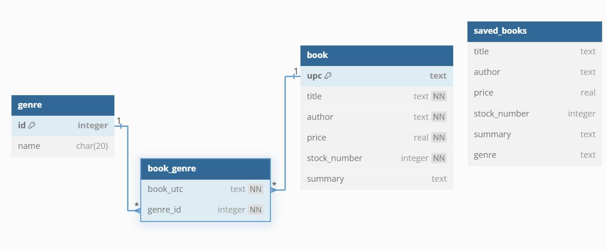

# BooksScrapper - Book Search Engine Project

## Instructions

To run the cmd search engine program:

`python -m search_tools.search`

To run the cmd program to query saved books:

`python -m search_tools.search_saved`

If you want to run ETL yourself, change the parameters in the run_etl function in main.py and run it

`python main.py`

## Summary:

The main goal for this project is to build a book search engine, applying an ETL process to extract, transform and then load the data needed. In the end, the user should be able to search for any book that's available.

The program should be able to let the user search books though one of the following fields:
- Price
- Stock
- Title
- Author
- Keywords on description

The program must run on cmd, asking the user which field he would like to search the books by.

The user can then save the search results and further query those results later.

## ETL Process

### Extract data needed:
- Title
- Summary
- Price
- Stock number
- Author
- Genre

The first 4 fields can be fetched through web scrapping on the following website: https://books.toscrape.com/

The last 2 fields can be fetched through the API: https://openlibrary.org/dev/docs/api/search

### Transform

We converte the text data obtained from the sources to more appropriate data types, when needed.

We are not verifying:
* the existence of duplicates
* the quality of the data store (no validation)

### Load

After all data has been extracted and transformed correctly, we should load it to a database. We've opted for a relational database, sqlite, through the sqlite3 API to make the connection (database driver). Why a relational database? For one, we can build table relationships. Since one of the requirements was that the genre should be validated, by creating a separate entity (table) for the genres, we can validate the entries on the books table with a foreign key. We also can guarantee data integrity with this kind of database. Each column has a specific data type. The scalability might be an issue, since it's vertical. But the data does not seem to be complex, even though the size might increase significantly as more books are added. Here's a diagram of the database schema:

## Search funtionality

Use case: The user can search for a book present on the database. The search results can be filtered based on
* Number of books to search
* Minimum price (default value of 0)
* Maximum price (default value of 100)
* Minimum stock value
* Books genres - a list of at most 3 genres

To achieve that, the book and genre tables are queried directly using SQL (and joining the tables when needed).

### Save functionality

Use case: The user can choose to save the results of queries. He can then further query those saved results later. 

To achieve that, the `saved_books` tables is used.