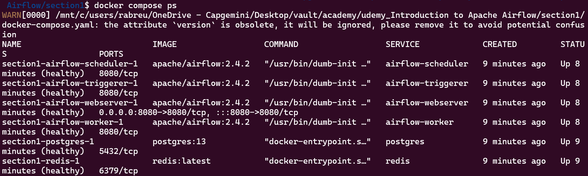

This is a "blank" project. You just need the docker-compose.yml file and the environment variables (.env file). Running docker compose will create the required structure

```bash
docker compose up -d
```

and go to localhost:8080

```bash
docker compose ps
```

All of your "containers" should be healthy as follows:



If a container is not healthy. You can check the logs with 
```bash
docker logs <name_of_the_container>
```

Try to spot the error; once you fix it, restart Airflow with 

```bash
docker compose down
docker compose up -d
```

remove your volumes with
```bash
docker volume prune
```