Here we add some DAGs

first, to have the correct context (and have your linter work), install airflow on the virtualenv

don't forget to activate the virtualenv and select the right interpreter

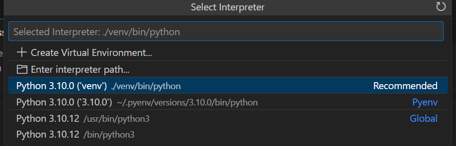


```bash
pip install apache-airflow
```

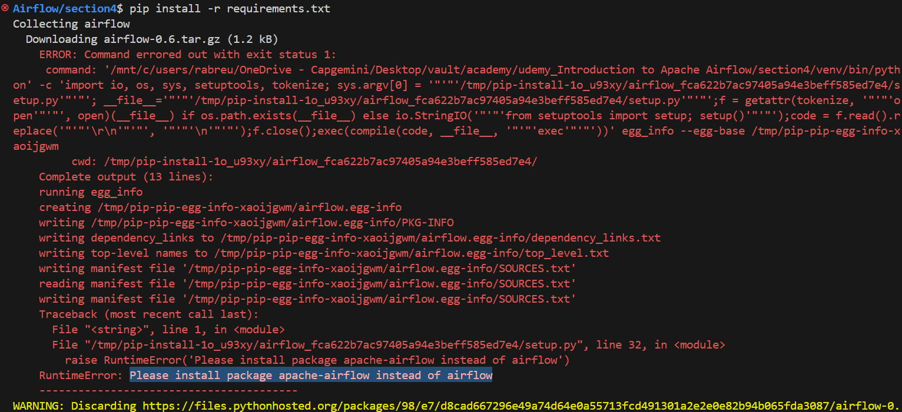

https://github.com/apache/airflow

Alternatively, instead of running the code locally (in Windows or your WSL), you can connect to the running docker container (airflow-webserver), which obviously already has those dependencies already there... so you don't need a virtualen/to install dependencies

Next, we also need the postgres provider

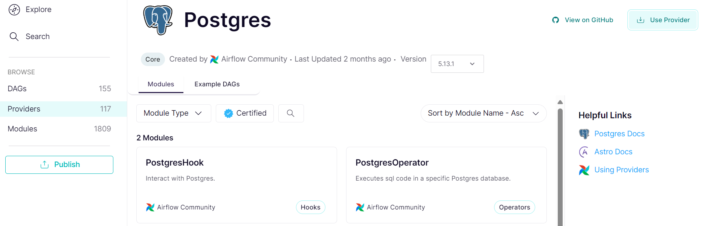

clicking the Use Provider button

```bash
pip install apache-airflow-providers-postgres==5.13.1
```

after defining DAGs (in the dags folder in this project setup), they show up on the web server


For any external operator (provider), you need to establish a connection to it. To do that, go to Admin>Connections

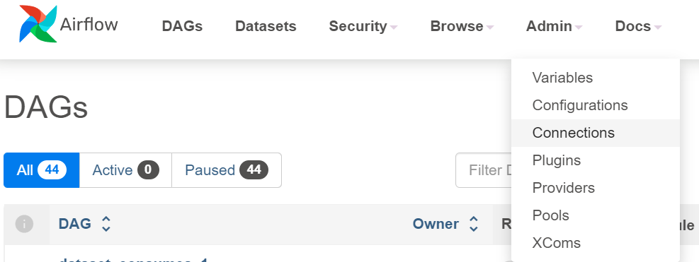

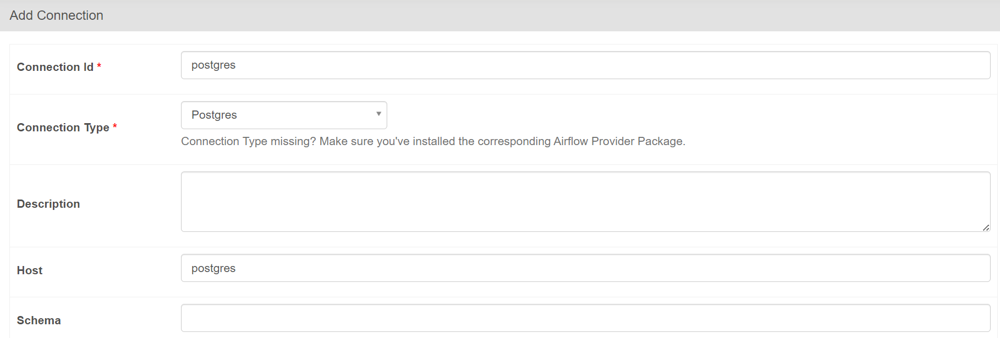

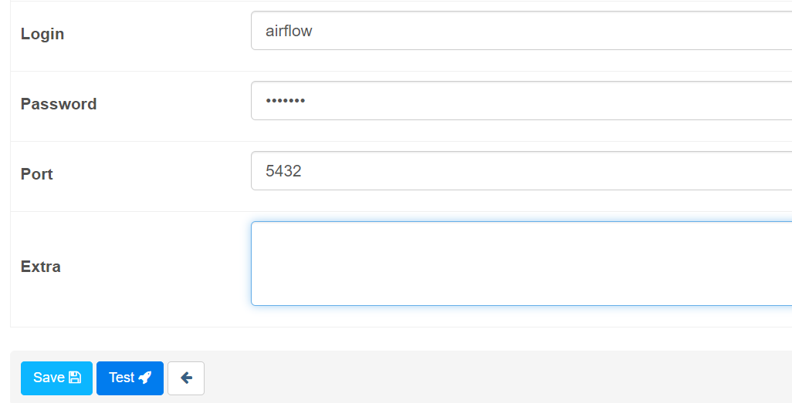

There's also the airflow cli

```bash
airflow --help
```

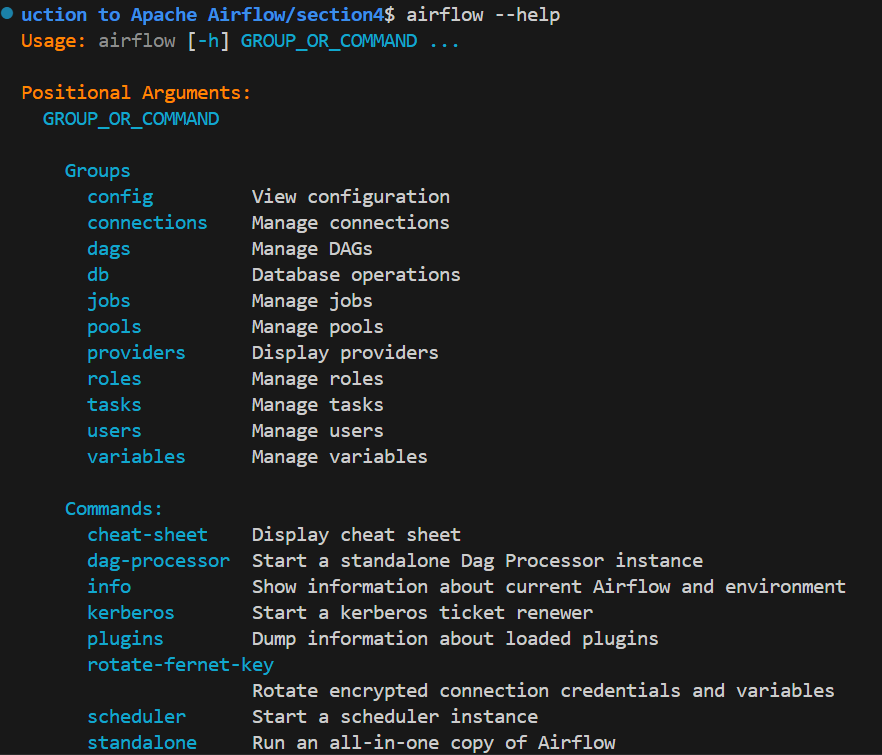

After you create a task, you can test it works right away by attaching to the scheduler container and running that task

You can attach to the container manually by identifying it
```
docker compose ps
```
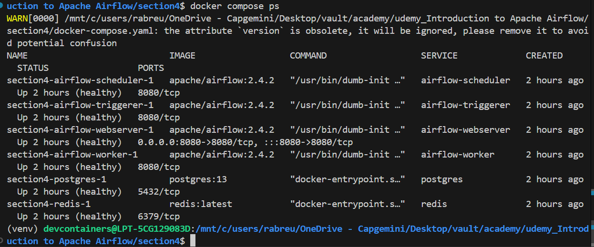

mine is called section4-airflow-scheduler-1

and running a bash shell on it
```
docker exec -it section4-airflow-scheduler-1 bash
```
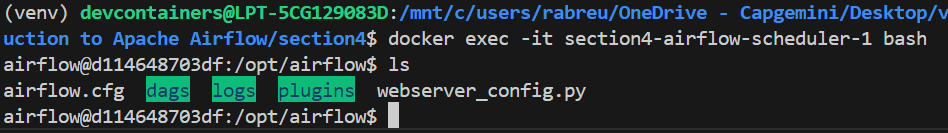

Or simply use the VSCode extension for that

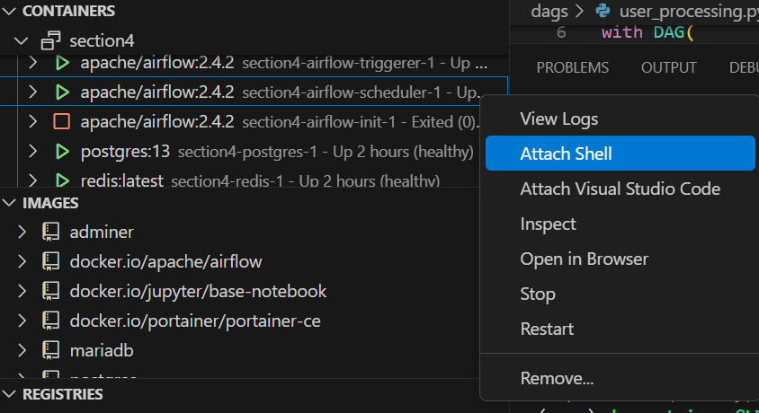

then test the task

```bash
# airflow tasks test <name_of_the_task> <task_id> <a_date_in_the_past>

airflow tasks test user_processing create_table 2022-01-01
```

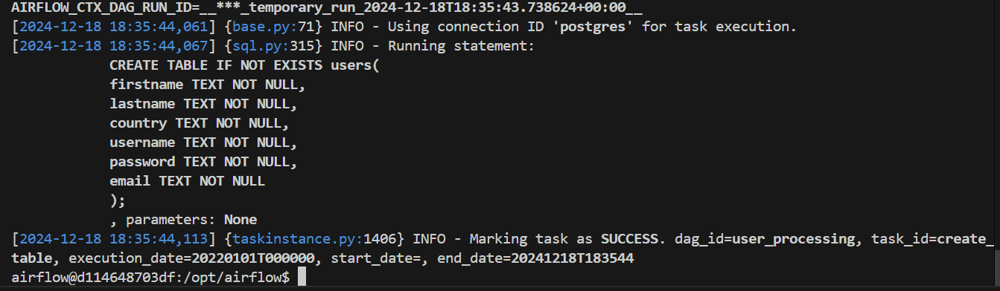