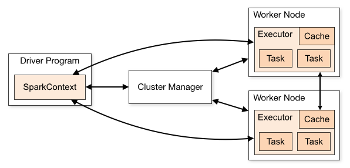

#

## course info

on udemy,

Amin Karami - Best Hands-on Big Data Practices with PySpark & Spark Tuning


## intro

PySpark is the Python API for Apache Spark. It enables you to perform real-time, large-scale data processing in a distributed environment using Python.

```bash
pip install pyspark
```



## installing PySpark

He installed it on Google Colab and on a virtual machine

* he used this on the vm <https://github.com/minrk/findspark>

## resources

* <https://spark.apache.org/docs/3.5.4/>
* <https://sparkbyexamples.com/pyspark-tutorial/>
* <https://spark.apache.org/docs/latest/api/python/index.html>
