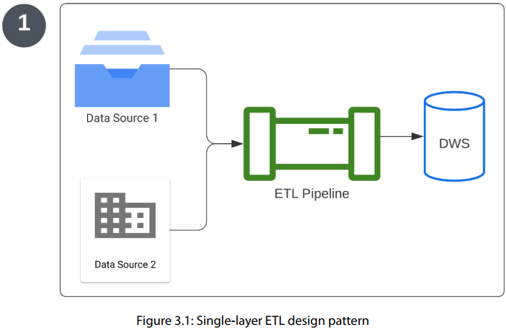
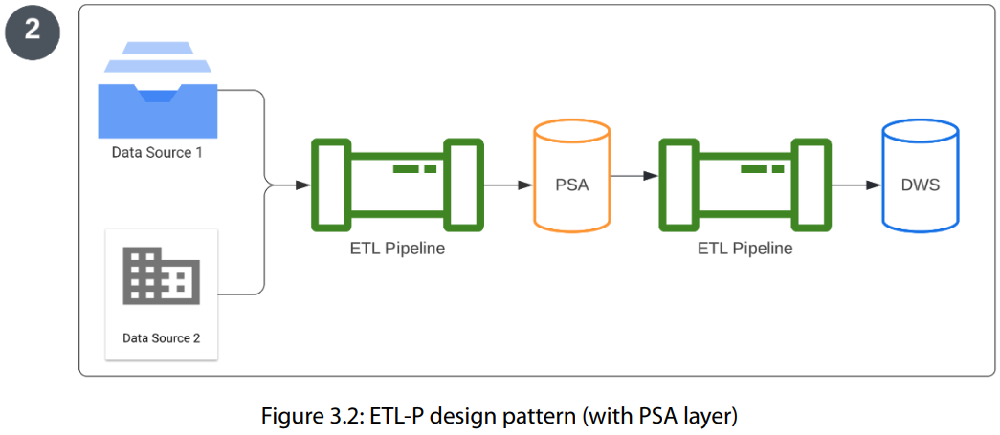
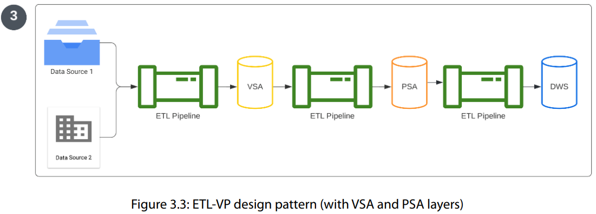
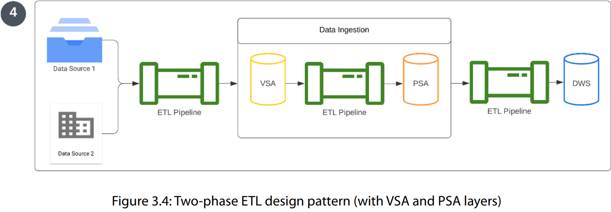
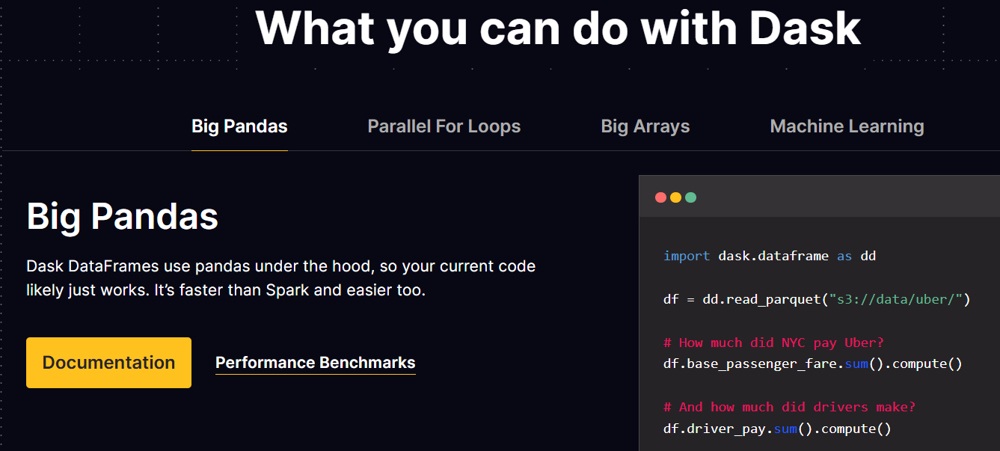
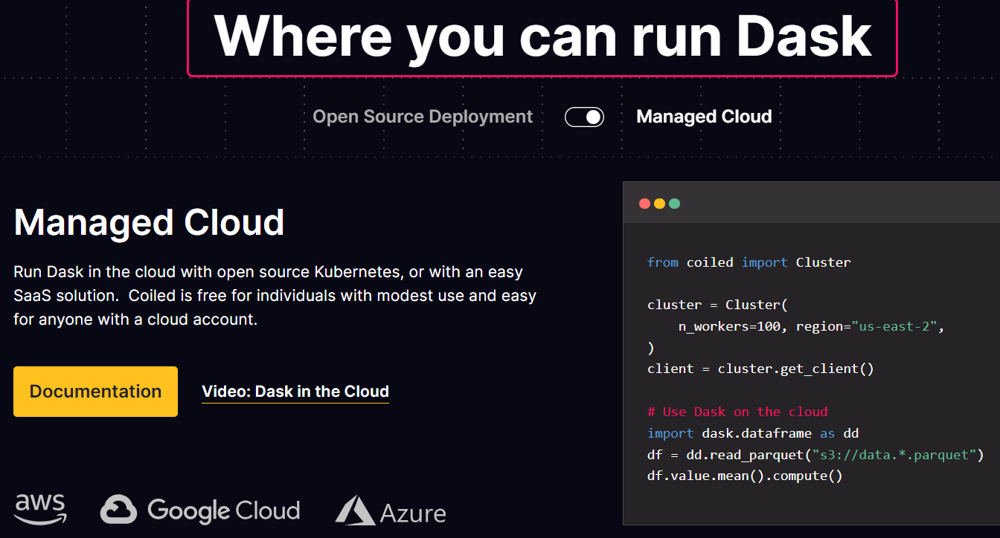
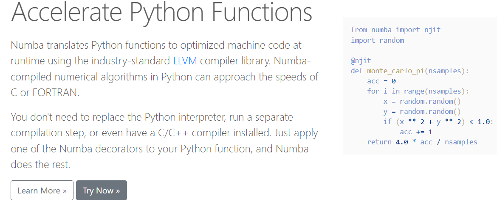

# 3 - Design Principles for Creating Scalable and Resilient Pipelines

"The true art of data engineering is the architecture of the pipeline design."

## design patterns for ETL

* basic ETL design pattern



Reading from right to left, you see one or two data sources that are fed into an ETL process that records the resulting data in one data warehouse (DWS in the diagram) location.

But what happens when a network issue occurs mid-operation? What happens to the data in the middle of the pipeline? Is any data retained? It quickly becomes clear that things get a little hairy for basic pipeline designs when anything but perfect conditions arises.

* ETL-P design pattern

To address some of the data loss and processing power challenges found in the most basic ETL design, engineers added a Persistent Staging Area (PSA) layer to the pipeline to preserve segments of data source conversions during the data migration, even if the source system is facing network or latency issues.



The PSA layer breaks up the data importation and data exportation stages to limit the
liability of data movement issues from the connection between the source and sink data locations
being severed.

However, what happens if the connection to the data source is inconsistent, or on a different frequency than what’s needed for the business needs for data ingestion? The PSA layer alone can’t accommodate this need; it looks like there’s a need for an additional layer.

* ETL-VP design pattern

With an added volatile staging area (VSA) layer, the ETL-VP is the glow-up version of the ETL-P
pipeline design pattern



The ETL-VP can handle asynchronous data importation processes with ease due to its ability to use
the VSA layer to batch-load data into the PSA layer on a predictable and consistent schedule. This
additional layer also further minimizes the impact of network connectivity issues by maintaining
the ETL’s performance at a predictable frequency.

* ELT two-phase pattern

While the ELT-VP compensates for many connectivity issues, it is a high computational investment to sync the data loading process with the data collection process.



As it turns out, breaking the collection of sources and the loading of data into separate steps is a
handy way to reduce some of these preventable costs. Building a data pipeline in this fashion gives
more control over the pipeline as well as makes each process more dynamic and reusable, as the same
method for data importation can be used with customizable and interchangeable methods of loading
the data with various other filters and audit mechanisms.

## Libraries - `Pandas` and `NumPy`

Pandas and NumPy are both incredibly powerful and useful Python packages, but they have their limitations. Both Pandas and NumPy require a contiguous allocation of memory, thus, simple data manipulation operations become quite costly as each new version of the data is stored in contiguous memory locations. Even in large-capacity environments, both packages perform rather poorly (and unbearably slow) on large datasets. Since the premise of this book is creating reliable, scalable, data pipelines, restricting our code base to Pandas and NumPy simply won’t do

## Libraries - `Dask`

* <https://www.dask.org/>
* <https://docs.dask.org/>

Dask is the Python library that allows for the parallelization of processing tasks in a flexible and dynamic scope. Dask is a cloud-based module that uses “clusters”, which are extra processing units in the cloud on standby, that can lend a helping hand to heavy-processing tasks initiated on your local device. The creators of Dask designed this parallelization module to be an extension of popular data processing modules, such as Pandas and NumPy, so Dask’s syntax mimics the same format.

To install Dask with pip run the following:

```shell
python -m pip install "dask[complete]"    # Install everything
```

This installs Dask, the distributed scheduler, and common dependencies like pandas, Numpy, and others.

You can also install only the Dask library and no optional dependencies:

```shell
python -m pip install dask                # Install only core parts of dask
```

Dask modules like dask.array, dask.dataframe, or dask.distributed won’t work until you also install NumPy, pandas, or Tornado, respectively. This is uncommon for users but more common for downstream library maintainers.





## Libraries - `Numba`

* <https://numba.pydata.org/>
* <https://numba.readthedocs.io/>

One of the main complaints about data processing in Python is its overall
speed, even without dealing with big data files. This is partially due to Python’s “preference” to wait
to compile data before a command is executed. Numba uses a just-in-time (JIT) compilation (also
dynamic translation), which brings Python processing speeds to be more in line with its humble C/
C++ beginnings. With Numba, there’s no need to run a separate compilation step; all you need to do
is add Numba decorators before a Python function, and Numba does the rest

```shell
pip install numba
```



🔴**I won't use this here but feel free to**❗
