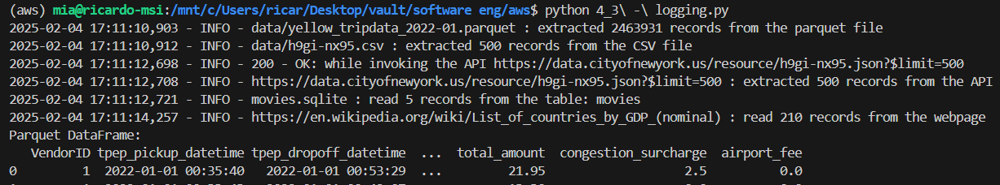
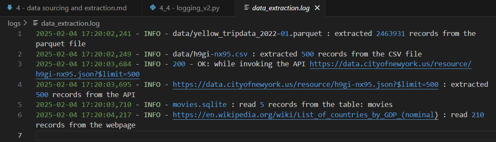

# 4 - Sourcing Insightful Data and Data Extraction Strategies

* `4_1 - sourcing.ipynb`
* `4_2 - extraction pipeline.ipynb`
* `4_4 - logging.ipynb`

## What is data sourcing?

Data sourcing refers to connecting your pipeline environment to all data input sources relevant to
your data pipeline.

All this data can be acquired from two types of sources: internal and external, where internal data
refers to sources related to a company’s business operations and external data refers to any data sourced
outside of an organization

## Accessibility to data

Even though there are many existing data sources, some of them might be inaccessible, unreliable,
or irrelevant to the purpose of your pipeline.

## Types of data sources

Some common data sources include

* CSV/Excel files
* Parquet files
* APIs
* RDBMS databases
* HTML

See `4_1 - sourcing.ipynb`

## Creating a data extraction pipeline

See `4_2 - extraction pipeline.ipynb` or `4_2 - extraction pipeline.py`

Next, is the improved version that uses logging

`4_3 - logging.py`

```python
# eg.
import logging

# Define top-level module logger
logger = logging.getLogger(__name__)
logging.basicConfig(level=logging.INFO, format='%(asctime)s - %(levelname)s - %(message)s')

def source_data_from_parquet(parquet_file_name):
    try:
        df_parquet = pd.read_parquet(parquet_file_name)
        logger.info(f'{parquet_file_name} : extracted {df_parquet.shape[0]} records from the parquet file')
    except Exception as e:
        logger.exception(f'{parquet_file_name} : exception {e} encountered while extracting the parquet file')
        df_parquet = pd.DataFrame()
    return df_parquet
```



And finally, a version that logs to a folder (/logs)

`4_4 - logging_v2`

```python
# Define top-level module logger
logger = logging.getLogger(__name__)

# Create a /logs directory if it doesn't exist
log_directory = 'logs'
os.makedirs(log_directory, exist_ok=True)

# Define the log file path
log_file = os.path.join(log_directory, 'data_extraction.log')

# Set up logging to a file
logging.basicConfig(
    level=logging.INFO,
    format='%(asctime)s - %(levelname)s - %(message)s',
    handlers=[
        logging.FileHandler(log_file),  # Log to a file
        logging.StreamHandler()  # Also log to console
    ]
)

def source_data_from_parquet(parquet_file_name):
    try:
        df_parquet = pd.read_parquet(parquet_file_name)
        logger.info(f'{parquet_file_name} : extracted {df_parquet.shape[0]} records from the parquet file')
    except Exception as e:
        logger.exception(f'{parquet_file_name} : exception {e} encountered while extracting the parquet file')
        df_parquet = pd.DataFrame()
    return df_parquet
```



<https://docs.python.org/3/howto/logging.html>
