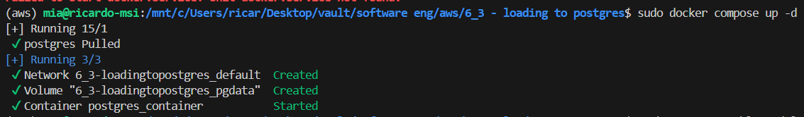
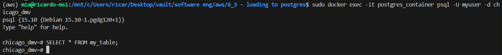

#

* Run the database container

make sure the docker engine is running and run the compose file

```shell
docker compose up -d

# you might need premissions
sudo docker compose up -d
```



* and then run the notebook/script to create the table and load some data

The table should have this schema

|Name|Data Type|Can be NULL|Primary Key|Default Value|
|---|---|---|---|---|
|primaryID|int|No|Yes|01|
|num_column|bitint|Yes|-|6749380428|
|string_column|char|Yes|-|"this is a string"|
|json_column|json|Yes|-|{ "key": 1 }|

```shell
# you may need
sudo apt update && sudo apt install -y libpq-dev python3-dev

pipenv install psycopg2
```

Then, run the script

```shell
python create_table_and_load.py
```

or run the notebook `create_table_and_load.ipynb`

* (optional) verify the data was inserted

You can do this using a client cli tool

```shell
# attach to the container and connect to the db (using psql)
docker exec -it postgres_container psql -U myuser -d chicago_dmv

# then query
SELECT * FROM my_table;
```



Or a GUI tool - eg. use pgAdmin, DBeaver, or TablePlus to connect to your database and see the data in a graphical user interface

Or by code - see `postgres_practice.ipynb` for a review

* clean up

If you are done,

```shell
# To stop and remove everything
docker compose down

# If you want to remove all data as well
docker compose down -v
```
