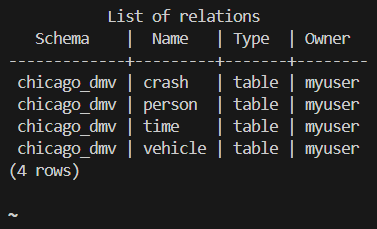

# 7 - Tutorial – Building an End-to-End ETL Pipeline in Python

tasks:

* Data extraction: Read the source CSV files and store the data in separate DataFrames
* Data cleansing and transformation: Perform key data cleaning and transformation activities
on each DataFrame to prepare the data so that it can be imported to the desired output location:
  * Remove duplicate rows
  * Handle missing values
  * Convert columns into their appropriate data types
  * Merge the DataFrames into a single DataFrame
  * Drop unnecessary columns
  * Rename columns so that they match the output data schema
* Data loading: Load the data from the merged DataFrame into PostgreSQL tables:
  * Create a PostgreSQL database
  * Create PostgreSQL data tables based on table schemas
  * Use the psycopg2 module to connect to the PostgreSQL database
  * Execute SQL queries to create the table and insert data into the PostgreSQL database

## Database creation

Instead of doing the database creation through code, I'm doing it manually this time

Steps

* Run the database (PostgreSQL server)
* connect to it via `psql`:

```shell
psql -U myuser

# attach to the container and connect to the db (using psql)
docker exec -it postgres_container psql -U myuser -d chicago_dmv
```

* Create a new database called chicago_vehicle_crash_data:

```sql
CREATE DATABASE chicago_vehicle_crash_data;
```

* Create a new data schema, chicago_dmv, within the chicago_vehicle_crash_data database:

```sql
CREATE SCHEMA chicago_dmv;
```

* Verify that the new schema has been created by running the following command:

```shell
\dn
```

* Create a new data table for the Vehicle dataset using the chicago_dmv schema:

```sql
CREATE TABLE chicago_dmv.Vehicle (
CRASH_UNIT_ID integer,
CRASH_ID text,
CRASH_DATE timestamp,
VEHICLE_ID integer,
VEHICLE_MAKE text,
VEHICLE_MODEL text,
VEHICLE_YEAR integer,
VEHICLE_TYPE text
);
```

* Using the chicago_dmv schema, create tables for each of the desired datasets:

```sql
-- The Person dataset:
CREATE TABLE chicago_dmv.Person (
PERSON_ID text,
CRASH_ID text,
CRASH_DATE timestamp,
PERSON_TYPE text,
VEHICLE_ID integer,
PERSON_SEX text,
PERSON_AGE integer
);

-- The Time dataset:
CREATE TABLE chicago_dmv.Time (
CRASH_DATE timestamp,
CRASH_ID text,
CRASH_HOUR integer,
CRASH_DAY_OF_WEEK integer,
CRASH_MONTH integer,
DATE_POLICE_NOTIFIED timestamp
);

-- The Crash dataset:
CREATE TABLE chicago_dmv.Crash (
CRASH_UNIT_ID integer,
CRASH_ID text,
PERSON_ID text,
VEHICLE_ID integer,
NUM_UNITS numeric,
TOTAL_INJURIES numeric
);

ALTER TABLE chicago_dmv.Crash
  ALTER COLUMN CRASH_UNIT_ID TYPE text USING CRASH_UNIT_ID::text;
```

* Verify that the tables have been created by running the following command:

```shell
\dt chicago_dmv.*
```



## Pipeline

`pipeline.ipynb`

after getting it working, you could organize the code like this

```none
project
├── data
│ ├── traffic_crashes.csv
│ ├── traffic_crash_vehicle.csv
│ └── traffic_crash_people.csv
├── etl
│ ├── __init__.py
│ ├── extract.py
│ ├── transform.py
│ └── load.py
└── config.yaml
├── main.py
├── README.md
```

```yaml
# Configuration for a Basic Data Pipeline
pipeline:
  name: My First Data Pipeline
  version: 1.0

# DISCLAIMER: modify the following code to match your local Postgre instance
postgresql:
  host: localhost
  port: 5432
  username: postgres
  password: mypassword
  database_name: chicago_dmv

# Chicago Data file paths
crash_filepath: data/traffic_crashes.csv
vehicle_filepath: data/traffic_crash_vehicle.csv
people_filepath: data/traffic_crash_people.csv

# Chicago Data output tables in PSQL
crash_table_PSQL: chicago_dmv.Crash
vehicle_table_PSQL: chicago_dmv.Vehicle
person_table_PSQL:  chicago_dmv.Person

# Chicago Data output schemas in PSQL
crash_insert_PSQL: '''(CRASH_UNIT_ID,
                      CRASH_ID,
                      PERSON_ID,
                      VEHICLE_ID,
                      NUM_UNITS,
                      TOTAL_INJURIES)
                      VALUES (%s, %s, %s, %s, %s, %s)'''
vehicle_insert_PSQL: '''(CRASH_UNIT_ID,
                        CRASH_ID,
                        CRASH_DATE,
                        VEHICLE_ID,
                        VEHICLE_MAKE,
                        VEHICLE_MODEL,
                        VEHICLE_YEAR,
                        VEHICLE_TYPE)
                        VALUES (%s, %s, %s, %s, %s, %s, %s, %s)'''
person_insert_PSQL: '''(PERSON_ID,
                        CRASH_ID,
                        CRASH_DATE,
                        PERSON_TYPE,
                        VEHICLE_ID,
                        PERSON_SEX,
                        PERSON_AGE)
                        VALUES (%s, %s, %s, %s, %s, %s, %s)'''
```
