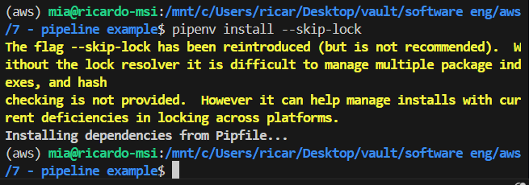
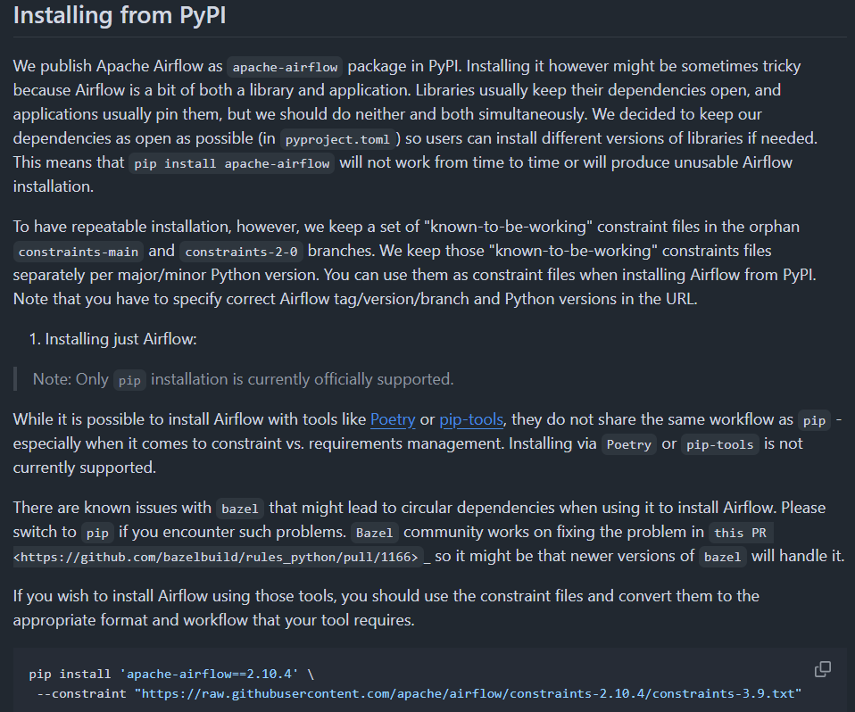

# 8 - Powerful ETL Libraries and Tools in Python

Python’s most popular ETL pipeline libraries

* Bonobo
* Odo
* mETL
* Riko
* pETL
* Luigi

⚠️**The book goes about installing and setting all of those up, but I'll skip because I'll likely never use any of them**⚠️

pipeline workflow management tools

* Apache Airflow: A platform to programmatically author, schedule, and monitor workflows
  * <https://airflow.apache.org/>
* Apache Nifi: An easy-to-use, powerful, and reliable system to process and distribute data
  * <https://nifi.apache.org/>
* Prefect: A platform for building, deploying, and managing workflows in Python
  * <https://www.prefect.io/>

ℹ️ **The book lists these but only uses Airflow** ℹ

## installing Airflow

⚠️ **It's better to run airflow in docker containers - especially if you want to use a depency manager other than pip. Look at the examples in the `airflow/` folder**⚠️

In order to correctly install Airflow in your internal environment, you will have to install this package directly into your local environment with pip:

```shell
# Create a virtual environment with Pipenv
# pipenv --python 3.8  # Airflow works best with Python 3.8 or 3.9
pipenv shell  # Activate the virtual environment

# Manually install Airflow using pip inside pipenv's venv
pip install apache-airflow==2.7.3 --constraint "https://raw.githubusercontent.com/apache/airflow/constraints-2.7.3/constraints-3.10.txt"

# Manually add it to Pipfile
pipenv install --skip-lock
# This adds apache-airflow to your Pipfile without breaking dependency resolution.
```

That's installing apache airflow version 2.7.3. For that constraint part, you should match with your python version. Here's a table

|Python Version|Use This Constraint File|
|---|---|
|3.7|constraints-3.7.txt|
|3.8|constraints-3.8.txt|
|3.9|constraints-3.9.txt|
|3.10|constraints-3.10.txt|
|3.11|constraints-3.11.txt|

eg. my python version is 3.10.16 so i picked the `constraints-3.10.txt` file





## using Airflow

* Start the Airflow web server: `airflow webserver`
* Start the Airflow scheduler: `airflow scheduler`
* Access the Airflow web interface at <http://localhost:8080> in your web browser.

By default, Apache Airflow requires authentication when you access the web interface.

If Airflow was installed via pip and you're using the default setup, try logging in with:

```none
Username: airflow
Password: airflow
```

If that doesn't work, create an admin user like this:

```shell
airflow users create \
    --username admin \
    --password admin \
    --firstname YourName \
    --lastname YourLastName \
    --role Admin \
    --email your@email.com

# You can change admin and admin (username & password) to something more secure.
# The role must be Admin to have full access.
# The email is just for records and doesn't have to be real.
```

Once you've created the user, restart both services:

```shell
# Find the PID of the running web server
ps aux | grep airflow
# Terminate the running process
kill 90206 # assuming it's that one

# with a single command (with weird output)
ps aux | grep 'airflow webserver' | awk '{print $2}' | xargs kill

airflow webserver -D
# airflow webserver --daemon # same thing
airflow scheduler -D

# Daemonized (`-D`): This is specific to Airflow and runs the process as a background service that continues running even if the terminal session is closed.
# Shell Background (`&`): This is a general shell feature that runs the process in the background, but it may stop if the terminal is closed unless you use a tool like nohup or screen to keep the process alive.
```

* Create a new DAG

In Apache Airflow, DAGs (Directed Acyclic Graphs) are typically created as Python files rather than through the web interface.

DAG files should be placed inside the DAGs folder configured in your Airflow setup.

By default, this folder is:

```none
~/airflow/dags/
```

You can check your DAGs folder location by running:

```shell
airflow config get-value core dags_folder
# eg output: /home/mia/airflow/dags
```

You can change the DAGs folder location in Apache Airflow by modifying the airflow.cfg file

```shell
# open the config file
code ~/airflow/airflow.cfg

# and change this to your desired location
dags_folder = /path/to/your/new/dags_folder

# restart Airflow Services for changes to take effect
```

Instead of modifying airflow.cfg, you can set an environment variable:

```shell
export AIRFLOW__CORE__DAGS_FOLDER="/path/to/your/new/dags_folder"

# i used this
export AIRFLOW__CORE__DAGS_FOLDER="$(pwd)/dags"
```

* Write the DAG

```python
from airflow.operators.empty import EmptyOperator

start = EmptyOperator(task_id="start")
end = EmptyOperator(task_id="end")
```

After adding the DAG file, restart the scheduler to detect new DAGs

```shell
# this lists the existing dag files
airflow dags list

# if the new dag isn't listed, restart the scheduler
airflow scheduler
```

* start a DAG

  in the web interface by toggling the DAG switch to On

  or
  
  ```shell
  airflow dags trigger my_first_dag
  ```

```error
TODO

airflow.exceptions.DagNotFound: Dag id my_first_dag not found in DagModel

well, idk why this isn't working (`my_first_dag.py`). It detects them if i put them in the expected folder but not where i want. Anyway, i guess the takeaway is to just use docker instead.
```

The main point was to run the pipeline using airflow. See `pipeline_dag.py` (but it's incomplete. See <https://github.com/PacktPublishing/Building-ETL-Pipelines-with-Python/blob/main/Chapters/chapter_08/workflow/airflow_pipeline.py>)
