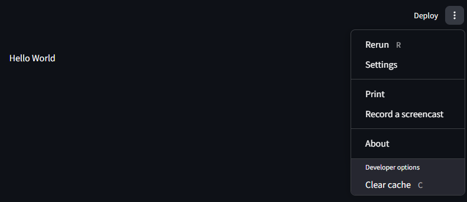
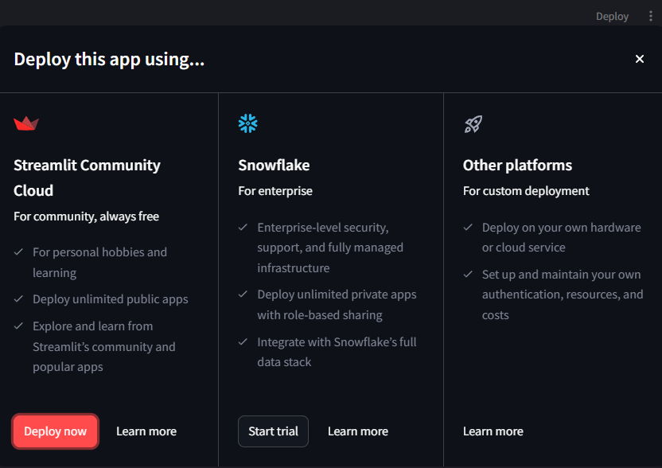

# 1 - Introduction

## create a venv, install the dependencies

```none
# requirements.txt

streamlit<2.0.0
matplotlib
```

script that does that for you: `setup_env.sh`

## run the demo

```shell
streamlit hello
```

## run a streamlit program

```shell
streamlit run hello_world.py
```




The users will see the same thing, except for the "Developer options" fields



```shell
streamlit run plot_demo.py
```
