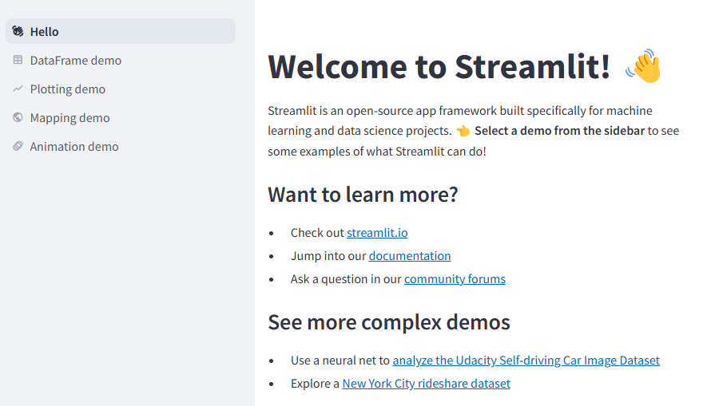
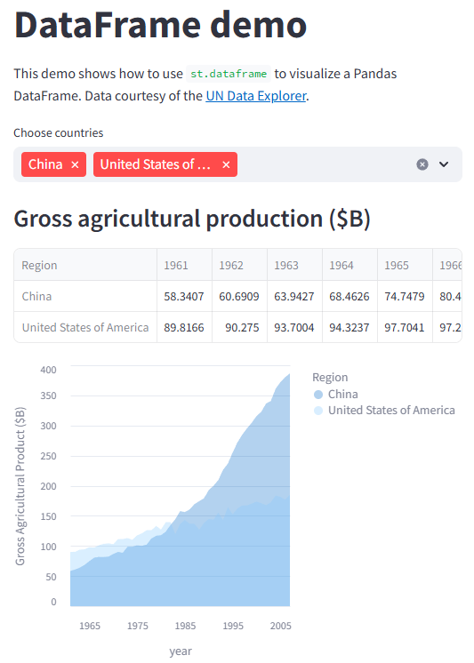
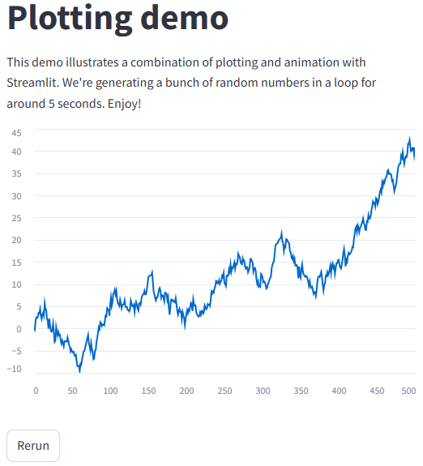
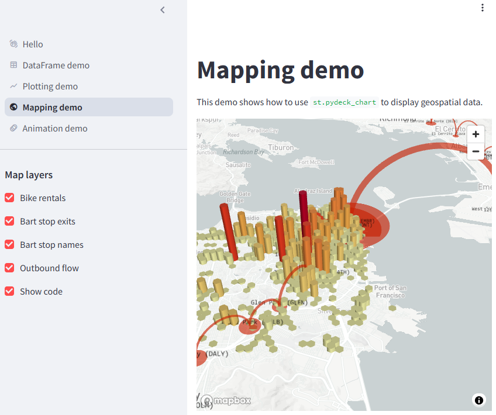
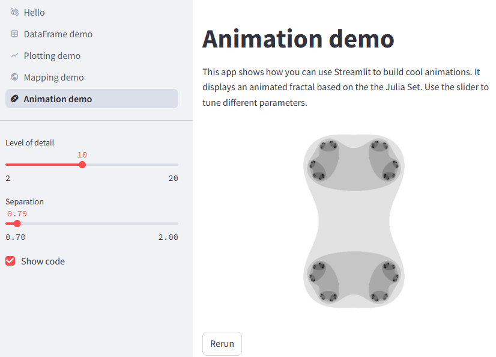

#

The following is included in the demo





```python
# DataFrame demo

@st.cache_data
def get_UN_data():
    AWS_BUCKET_URL = "https://streamlit-demo-data.s3-us-west-2.amazonaws.com"
    df = pd.read_csv(AWS_BUCKET_URL + "/agri.csv.gz")
    return df.set_index("Region")

try:
    df = get_UN_data()
    countries = st.multiselect(
        "Choose countries", list(df.index), ["China", "United States of America"]
    )
    if not countries:
        st.error("Please select at least one country.")
    else:
        data = df.loc[countries]
        data /= 1000000.0
        st.subheader("Gross agricultural production ($B)")
        st.dataframe(data.sort_index())

        data = data.T.reset_index()
        data = pd.melt(data, id_vars=["index"]).rename(
            columns={"index": "year", "value": "Gross Agricultural Product ($B)"}
        )
        chart = (
            alt.Chart(data)
            .mark_area(opacity=0.3)
            .encode(
                x="year:T",
                y=alt.Y("Gross Agricultural Product ($B):Q", stack=None),
                color="Region:N",
            )
        )
        st.altair_chart(chart, use_container_width=True)
except URLError as e:
    st.error(f"This demo requires internet access. Connection error: {e.reason}")
```



```python
# Plotting demo

progress_bar = st.sidebar.progress(0)
status_text = st.sidebar.empty()
last_rows = np.random.randn(1, 1)
chart = st.line_chart(last_rows)

for i in range(1, 101):
    new_rows = last_rows[-1, :] + np.random.randn(5, 1).cumsum(axis=0)
    status_text.text(f"{i}% complete")
    chart.add_rows(new_rows)
    progress_bar.progress(i)
    last_rows = new_rows
    time.sleep(0.05)

progress_bar.empty()

# Streamlit widgets automatically run the script from top to bottom. Since
# this button is not connected to any other logic, it just causes a plain
# rerun.
st.button("Rerun")
```



```python
# Mapping demo

@st.cache_data
def from_data_file(filename):
    url = (
        "https://raw.githubusercontent.com/streamlit/"
        "example-data/master/hello/v1/%s" % filename
    )
    return pd.read_json(url)

try:
    ALL_LAYERS = {
        "Bike rentals": pdk.Layer(
            "HexagonLayer",
            data=from_data_file("bike_rental_stats.json"),
            get_position=["lon", "lat"],
            radius=200,
            elevation_scale=4,
            elevation_range=[0, 1000],
            extruded=True,
        ),
        "Bart stop exits": pdk.Layer(
            "ScatterplotLayer",
            data=from_data_file("bart_stop_stats.json"),
            get_position=["lon", "lat"],
            get_color=[200, 30, 0, 160],
            get_radius="[exits]",
            radius_scale=0.05,
        ),
        "Bart stop names": pdk.Layer(
            "TextLayer",
            data=from_data_file("bart_stop_stats.json"),
            get_position=["lon", "lat"],
            get_text="name",
            get_color=[0, 0, 0, 200],
            get_size=10,
            get_alignment_baseline="'bottom'",
        ),
        "Outbound flow": pdk.Layer(
            "ArcLayer",
            data=from_data_file("bart_path_stats.json"),
            get_source_position=["lon", "lat"],
            get_target_position=["lon2", "lat2"],
            get_source_color=[200, 30, 0, 160],
            get_target_color=[200, 30, 0, 160],
            auto_highlight=True,
            width_scale=0.0001,
            get_width="outbound",
            width_min_pixels=3,
            width_max_pixels=30,
        ),
    }
    st.sidebar.subheader("Map layers")
    selected_layers = [
        layer
        for layer_name, layer in ALL_LAYERS.items()
        if st.sidebar.checkbox(layer_name, True)
    ]
    if selected_layers:
        st.pydeck_chart(
            pdk.Deck(
                map_style=None,
                initial_view_state={
                    "latitude": 37.76,
                    "longitude": -122.4,
                    "zoom": 11,
                    "pitch": 50,
                },
                layers=selected_layers,
            )
        )
    else:
        st.error("Please choose at least one layer above.")
except URLError as e:
    st.error(
        """
        **This demo requires internet access.**
        Connection error: %s
    """
        % e.reason
    )
```



```python
# Animation demo

# Interactive Streamlit elements, like these sliders, return their value.
# This gives you an extremely simple interaction model.
iterations = st.sidebar.slider("Level of detail", 2, 20, 10, 1)
separation = st.sidebar.slider("Separation", 0.7, 2.0, 0.7885)

# Non-interactive elements return a placeholder to their location
# in the app. Here we're storing progress_bar to update it later.
progress_bar = st.sidebar.progress(0)

# These two elements will be filled in later, so we create a placeholder
# for them using st.empty()
frame_text = st.sidebar.empty()
image = st.empty()

m, n, s = 960, 640, 400
x = np.linspace(-m / s, m / s, num=m).reshape((1, m))
y = np.linspace(-n / s, n / s, num=n).reshape((n, 1))

for frame_num, a in enumerate(np.linspace(0.0, 4 * np.pi, 100)):
    # Here were setting value for these two elements.
    progress_bar.progress(frame_num)
    frame_text.text("Frame %i/100" % (frame_num + 1))

    # Performing some fractal wizardry.
    c = separation * np.exp(1j * a)
    Z = np.tile(x, (n, 1)) + 1j * np.tile(y, (1, m))
    C = np.full((n, m), c)
    M: Any = np.full((n, m), True, dtype=bool)
    N = np.zeros((n, m))

    for i in range(iterations):
        Z[M] = Z[M] * Z[M] + C[M]
        M[np.abs(Z) > 2] = False
        N[M] = i

    # Update the image placeholder by calling the image() function on it.
    image.image(1.0 - (N / N.max()), use_container_width=True)

# We clear elements by calling empty on them.
progress_bar.empty()
frame_text.empty()

# Streamlit widgets automatically run the script from top to bottom. Since
# this button is not connected to any other logic, it just causes a plain
# rerun.
st.button("Rerun")
```
