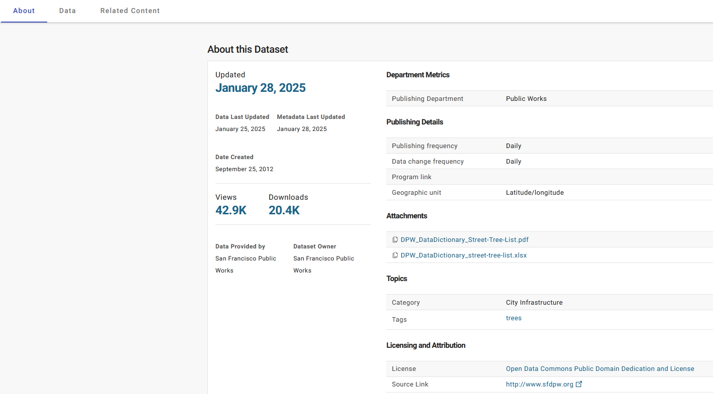

# 3 - Data Visualization

* Streamlit’s built-in [Chart elements](https://docs.streamlit.io/develop/api-reference/charts): `with_builtin.py`
* [Plotly](https://github.com/plotly/plotly.py) (for interactive visualizations): `with_plotly.py`
* [Seaborn](https://github.com/mwaskom/seaborn) and Matplotlib (for classic statistical visualizations): `with_matplotlib_seaborn.py`
* Bokeh (for interactive visualization in web browsers)
* Altair (for declarative, interactive visualizations)
* PyDeck (for interactive map-based visualizations)

It uses the San Francisco Trees dataset

* [dataset](https://data.sfgov.org/City-Infrastructure/Street-Tree-List/tkzw-k3nq/about_data) of every tree planted and maintained in the city of SF.
* `tress.csv` is random subset of 10,000 trees

