# install Git

## installing Git for Windows

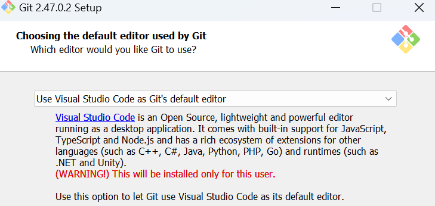

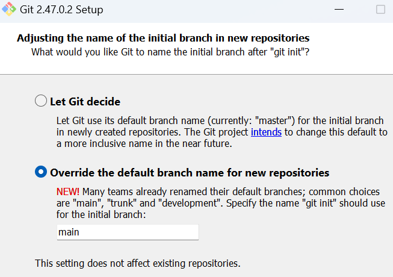

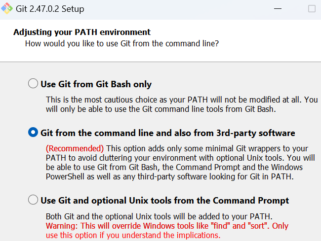

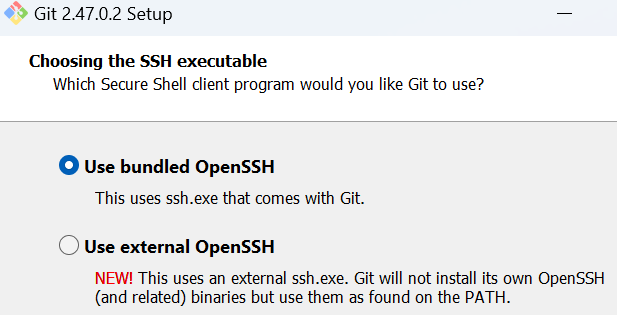

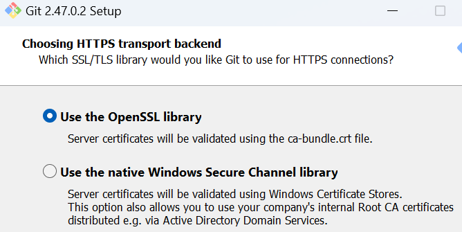

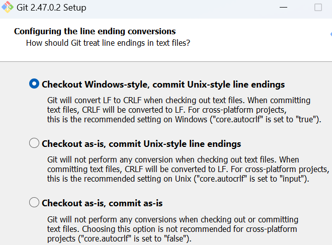

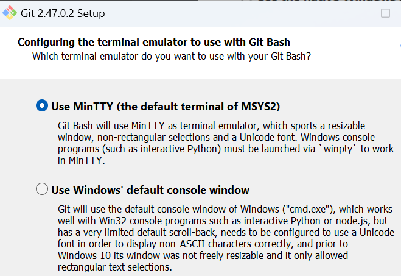

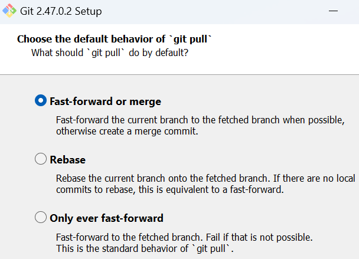

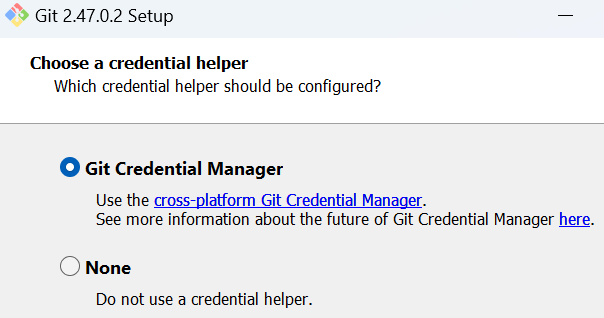

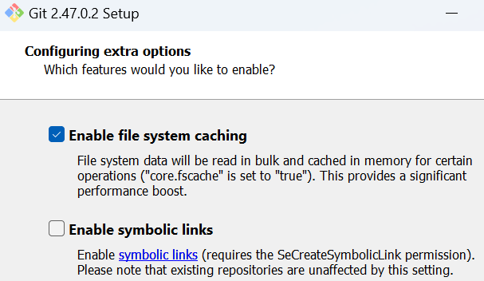

# git configuration

# read the existing configuration

`git config --list`

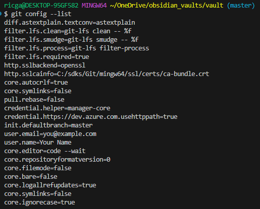

To know the username, type:

`git config user.name`

To know the email, type:

`git config user.email`

# set a configuration

You can set configurations globally or locally.

Set the user information (`user.name` and `user.email`)

globally

```bash
git config --global user.name "FIRST_NAME LAST_NAME"
git config --global user.email "MY_NAME@example.com"
```

locally (in a specific folder)

```bash
git config --local user.name "FIRST_NAME LAST_NAME"
git config --local user.email "MY_NAME@example.com"
```

Set the editor to use (`core.editor`)

```bash
git config --global core.editor "code --wait --new-window"
```

This sets vscode as the default code editor

The global configurations are stored in a file (`~/.gitconfig`). 

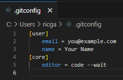

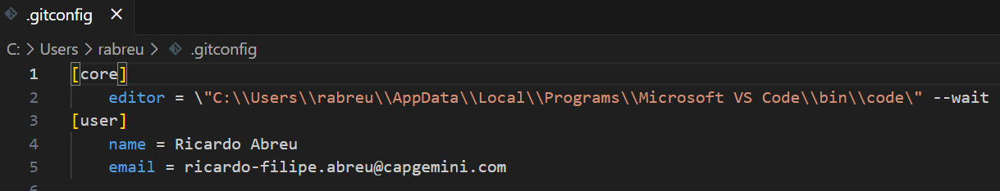

You can navigate there and change them, or you can use this command to open that file for you

```bash
git config --edit --global
```

In each git repo (`.git/`) you have a local `config` file 

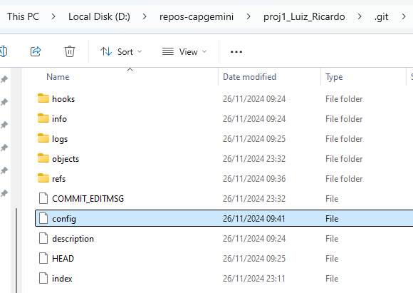

Setting a local configuration changes this file

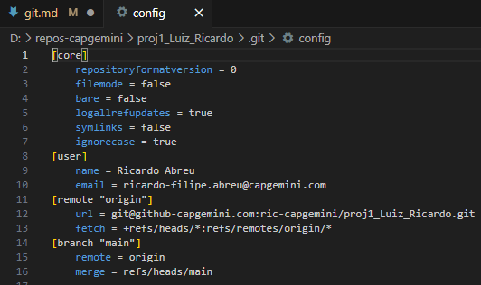