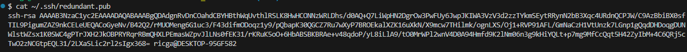

## Verify if i have a key

They are stored in `~/.ssh`

On Windows it's this folder for my user


```bash 
ls -al ~/.ssh
```
This lists (`ls`) the files in your home folder (`~/`) under the .ssh sub-folder including any hidden files (`-a` for "all files"). `-l` for "long format"


in this example i have two pairs

The public key is for sharing. The private key is to be kept secret and hidden. If your private key is compromised, only your passphrase protects your credentials. If you left the passphrase blank, then you have no further protection.

let's cat the public key for the host github.com

```bash
# cat ~/.ssh/id_rsa
cat ~/.ssh/id_rsa.pub 
```

This display the contents of your public key


## Generate keys

previously i created two pairs with

```
ssh-keygen -C "random.character.pick@gmail.com"
ssh-keygen -C "ricardo-filipe.abreu@capgemini.com"
```

let's create a new one

`ssh-keygen`

In the keygen generation step, if you accept the default, by default, the keys are called id_rsa (the private key) and id_rsa.pub (the public key), both of which are stored in your home folder in a sub-folder called .ssh.
The last question asked is the passphrase for the key. You can enter a password for the key for extra security, or just press Enter for an empty passphrase. This is generally not advisable, since security is tighter when you create a passphrase.

below is an example of something you don't want to do


you don't want to do this. The keys will get created in the folder you run the command, and you generally want to store the keys in a single place or somewhere outside of github ofc


let's cat the public key. This is the key you want to copy and add it to your github account


## Add a SSH public key to GitHub

```
cat ~/.ssh/redundant.pub
```




## Test your SSH connection to GitHub

`ssh -T git@github.com`

exaplantion:
* `ssh`: The SSH client initiates a connection to the specified host.
* `-T`: Suppresses the execution of a remote shell (i.e., no interactive terminal is opened).* `git@github.com`: Specifies the GitHub SSH host and user to connect as.
GitHub requires SSH connections to use the git user.

You should be sucessfully authentucated if you are using the default SSH key (~/.ssh/id_rsa) and it’s added to your GitHub account


If you have multiple keys, you can specify the key explicitly in the command:
```bash
ssh -i ~/.ssh/id_rsa_capgemini -T git@github.com
```

And you can simplify the command if you create a configuration file for the SSH client (see below), 

```bash
ssh -T git@github.com
```
That command will use the current user (the local one if available, or if not the global one)

## Create a configuration file for the SSH client (optional)

The `~/.ssh/config` file can be used to map keys to hosts. It is not created automatically. You need to create and configure it yourself if you want to manage multiple SSH keys or customize your SSH connections.

```bash 
cat ~/.ssh/config
```


## Add the key to a SSH agent (optional)

This is useful in the following cases:
* if your key requires a passphrase and you don’t want to be prompted every time you use it.
* if your private key is stored in a non-standard location and isn’t specified in the ~/.ssh/config file.

To add a key to the SSH agent, first verify the ssh agent is running
```bash
eval $(ssh-agent -s)
```


then give it the keys to add

```bash
ssh-add ~/.ssh/redundant
```


