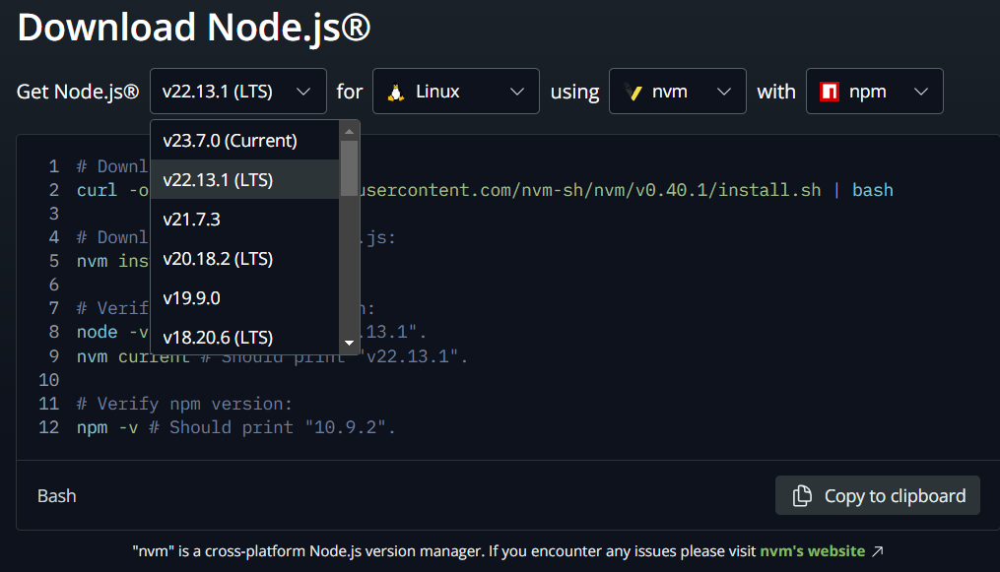

# Node.js

Node.js is a free, open-source, cross-platform JavaScript runtime environment that lets developers create servers, web apps, command line tools and scripts.

<https://nodejs.org/>

## installation

install a version of Node.js. I recommend installing on WSL/Linux using nvm



```shell
# Download and install nvm:
curl -o- https://raw.githubusercontent.com/nvm-sh/nvm/v0.40.1/install.sh | bash
# Download and install Node.js:
nvm install 22

node -v
```

You can install multiple versions easily using nvm. In practice, it's common to use a long-term support (LTS) version of Node.js since a lot of modules expect that.

## run code

create a script

```js
// app.js

// Print 'Hello, World!' to the console
console.log('Hello, World!');
```

and run it

```shell
node app.js
```

## npm

⚠️**Much of this is repeated in `npm.md`**⚠️

This is the default package manager for Node.js. You can install libraries using it.

```shell
# version
npm -v
npm --version

# list of available commands
npm
```

<https://github.com/npm/documentation>

## npm - initializing a project

For eg., if you want to use the express module, first, you create a new project (with a `package.json`)

```shell
npm init

# accept the defaults
npm init -y
```

this is the file it creates if you accept the defaults

```json
// package.json
{
  "name": "nodejs",
  "version": "1.0.0",
  "description": "Node.js is a free, open-source, cross-platform JavaScript runtime environment that lets developers create servers, web apps, command line tools and scripts.",
  "license": "ISC",
  "author": "",
  "type": "commonjs",
  "main": "index.js",
  "scripts": {
    "test": "echo \"Error: no test specified\" && exit 1"
  }
}
```

## npm - `package.json`

The package.json file

* holds all the metadata about the project and includes all the information others will need to install required modules on their machine and run the application
* it should be placed/created at the project’s root
* it must contain a name field and a version field. All other fields are optional.

    The version field must follow semantic versioning guidelines, which suggest this format: `major.minor.patch`; for example, 1.2.3. We call this semantic versioning because each number conveys a meaning. A major version introduces an incompatible API change. A minor version change adds new functionality in a backward-compatible manner and therefore shouldn’t pose problems for your application. A patch version applies backward-compatible bug fixes, and you should always keep it up to date.

    <https://semver.org/>

* it can contain optional data, such as the project’s description, a license, scripts, and dependencies

## npm - installing dependencies

to install the express module

```shell
# npm install <package>
npm install express
# installs the latest stable version of the express package from the npm registry
npm i express # same thing
npm i express@latest # same thing
```

This downloads and places a specific package in the node_modules folder, next to your package.json file, and adds it to the dependencies list in package.json.

Details about what the command actually does:

* Download: downloads the Express module from the npm registry (an online repository of open-source Node.js packages) and its dependencies into the node_modules directory in your project.
  * The npm registry website is <https://www.npmjs.com>.
  * You can find the specific page for the Express module here: <https://www.npmjs.com/package/express>.
  * The source code for Express is hosted on GitHub: <https://github.com/expressjs/express>
* Update package.json: Express is added to the dependencies section of your package.json

The updated package.json looks like this

```json
{
  "name": "nodejs",
  "version": "1.0.0",
  "description": "Node.js is a free, open-source, cross-platform JavaScript runtime environment that lets developers create servers, web apps, command line tools and scripts.",
  "license": "ISC",
  "author": "",
  "type": "commonjs",
  "main": "index.js",
  "scripts": {
    "test": "echo \"Error: no test specified\" && exit 1"
  },
  "dependencies": {
    "express": "^4.21.2"
  }
}
```

The dependencies field lists all the dependencies needed to run the project, along with their required version ranges, following the semantic versioning syntax.

Modules have different versions and you can be specific about it

```shell
# npm install <package-name>@<version>

# exact version
npm i express@4.17.1

# latest minor version in 4.x
# latest version of a.x.x (> a.0.0 and < a+1.0.0) = caret dependency
npm i express@^4.0.0
# requires version 4.0.0 or later but less than version 5.0.0
npm i express@^4.x # same thing

# latest patch version in 4.17.x
# latest version of a.b.x (>a.b.0 and <a.b+1.0)
npm i express@~4.17.0

# the most recent release (generally not a good idea or needed unless you are helping with open source projects)
npm i express@next

```

But for example the following won't be reflected on package.json. You need to edit it manually

```shell
# highest available version that is less than 5
npm i "express@<5"
```

```json
"dependencies": {
    "express": "<5"
}
```

Development dependencies

* are those that are required only to develop, and not to run, the application. Hence, they are ignored by the packaging scripts and are not part of the deployed application.
* eg.
  * TypeScript’s type definitions
  * testing frameworks
  * linters
  * build tools (eg. webpack and babel)
* The `devDependencies` field lists all the dependencies necessary to develop the project

```shell
# eg.
# install karma, a module used for testing
npm install --save-dev karma
```

```json
// the updated package.json
{
  "name": "nodejs",
  "version": "1.0.0",
  "description": "Node.js is a free, open-source, cross-platform JavaScript runtime environment that lets developers create servers, web apps, command line tools and scripts.",
  "license": "ISC",
  "author": "",
  "type": "commonjs",
  "main": "index.js",
  "scripts": {
    "test": "echo \"Error: no test specified\" && exit 1"
  },
  "dependencies": {
    "express": "^4.21.2"
  },
  "devDependencies": {
    "karma": "^6.4.4"
  }
}
```

`node_modules` and `package-lock.json`

* the actual code that was downloaded gets stored in the `node_modules` folder.
* you never ship or store the node_modules folder

  the package.json (along with the package-lock.json) contains all the information you need. When you install a project on a new machine, all dependencies listed in the package.json file will be installed and placed in the node_modules folder, next to package.json. Since you don't store the node_modules in your code repository, this minimizes the repository’s size.

  ```shell
  # install all the dependencies listed in package.json
  npm install
  ```

* the npm automatically generates the package-lock.json file for each project. That lockfile stores the exact version of each dependency

  the npm default is to define only the major version and to use the latest minor and patch versions available (aka the default uses `^` in package.json). While this ensures that your application includes the latest bug fixes, it introduces a new issue: without an exact version, builds aren’t reproducible.

  Because there’s no quality control in the npm registry, even a patch or minor version update could introduce an incompatible API change that should have been a major version change. Consequently, a slight deviation between versions could result in a broken build.

  The package-lock.json file solves this by tracking the exact version of every package and its dependencies.

## npm - auditing the package.json file

The npm audit command inspects the local package.json file for any known vulnerabilities

```shell
npm audit
```

```text
# eg. good output:
found 0 vulnerabilities

# eg. bad output:
found 5 vulnerabilities (2 low, 1 moderate, 2 high)
  run `npm audit fix` to fix 4 of them.
  run `npm audit fix --force` to fix all issues (may introduce breaking changes).
```

If there is a vulnerability, sometimes it can be fixed automatically with

```shell
npm audit fix
```

This command automatically resolves vulnerabilities in your Node.js project's dependencies by updating them to safer versions. This will work if the updates do not require breaking changes or are within your current version ranges (e.g., ^1.0.0). It attempts to install updated versions of vulnerable packages based on the constraints in your package.json. For example, if a newer version of a dependency is available and is compatible with your specified version range, npm audit fix will install it. It also handles nested dependencies - if a vulnerability is found in a transitive dependency (a dependency of another dependency), npm audit fix will attempt to update the parent dependency to a version that resolves the issue.

```shell
npm audit fix --force
```

This updates dependencies to the latest versions regardless of compatibility.

⚠️**You should use `npm audit` every few months, along with `npm update`, to avoid using outdated dependencies and creating security risks**⚠️

## npm - updating packages

```shell
# updates all installed packages to their latest acceptable version
npm update
```

## npm - uninstalling dependencies

```shell
npm uninstall <package>
```
