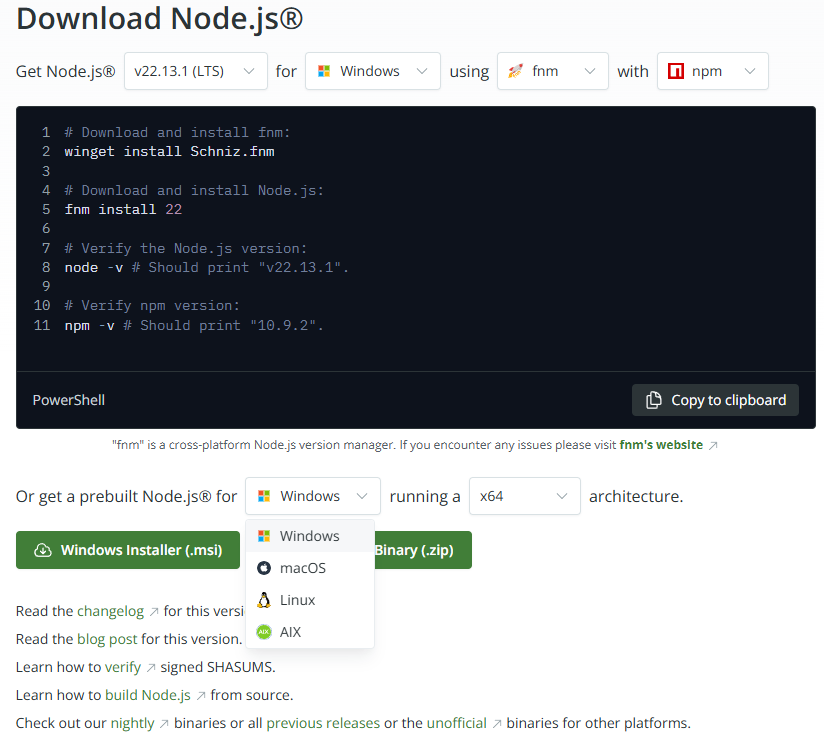
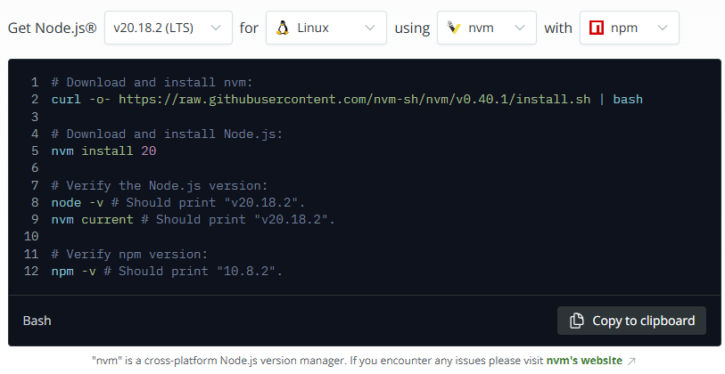

# Node.js

## Installing and uninstalling

To install it, on the page <https://nodejs.org/> there's instructions for each platform

* on Windows

  you would run those commands on powershell or download and run the executable

  

* in WSL

  

  i prefer it with this nvm (Node.js version manager) tool

  ```shell
  # Download and install nvm
  curl -o- https://raw.githubusercontent.com/nvm-sh/nvm/v0.40.1/install.sh | bash
  # or
  # wget -qO- https://raw.githubusercontent.com/nvm-sh/nvm/v0.40.1/install.sh | bash

  # Activate nvm
  # After installing, you need to load nvm. The previous command should output the instructions for your shell
  export NVM_DIR="$HOME/.nvm"
  [ -s "$NVM_DIR/nvm.sh" ] && \. "$NVM_DIR/nvm.sh"  # This loads nvm
  [ -s "$NVM_DIR/bash_completion" ] && \. "$NVM_DIR/bash_completion"  # This loads nvm bash_completion

  # Download and install Node.js
  nvm install 20

  # Verify it worked
  node -v # Should print "v20.18.2".
  nvm current # Should print "v20.18.2".
  npm -v # Should print "10.8.2".

  # Set it as the default version
  nvm alias default 20
  ```

  how to **NOT** do it

  (even tho you shouldn't do it like this, you see it a lot so i'll write it down anyway)

  ```shell
  # Update your package list
  sudo apt update

  # Install Node.js and npm
  sudo apt install nodejs npm

  # Verify the installation
  node --version
  npm --version

  # location in the PATH
  which node # if this returns nothing, Node.js is not in your PATH
  ```

  (optional) Add Node.js to your PATH (if it's not already):

  * open your shell configuration file (e.g., `~/.bashrc` or `~/.zshrc`):

  ```shell
  nano ~/.bashrc
  ```

  * Add the following line at the end of the file:

  ```shell
  export PATH=$PATH:/usr/bin/node
  ```

    Save and exit (Ctrl+O, Enter, Ctrl+X).

  * Reload the configuration:

  ```shell
  source ~/.bashrc
  ```

  * Verify the PATH:

  ```shell
  echo $PATH
  ```

To uninstall it

```shell
# If installed using NodeSource (Linux)
sudo apt-get remove -y nodejs
# optionally, remove the NodeSource repository
sudo rm /etc/apt/sources.list.d/nodesource.list
sudo apt-get update

# If installed using nvm
nvm uninstall <version>
```

## npm

...

## yarn

i don't really use this but you see it a lot

<https://yarnpkg.com/>

The preferred way to manage Yarn is by-project and through Corepack, a tool shipped by default with Node.js. Modern releases of Yarn aren't meant to be installed globally, or from npm.

* Start by enabling Corepack, if it isn't already; this will add the yarn binary to your PATH:

```shell
corepack enable
```

Then initialize a new project:

```shell
yarn init -2
```

Any time you'll want to update Yarn to the latest version, just run:

```shell
yarn set version stable
yarn install
```
