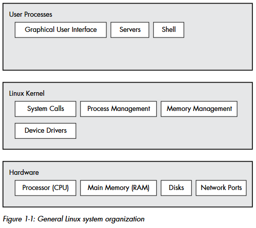
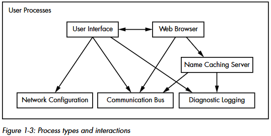

## levels and layers of abstraction

* A Linux system has three main levels

    The hardware is at the base. Hardware includes the memory as well as one or more central processing units (CPUs) to perform computation and to read from and write to memory.
    Devices such as disks and network interfaces are also part of the hardware.
    The next level up is the kernel, which is the core of the operating system.
    The kernel is software residing in memory that tells the CPU where to look for its next task. Acting as a mediator, the kernel manages the hardware (especially main memory) and is the primary interface between the hardware and any running program.
    Processes—the running programs that the kernel manages—collectively make up the system’s upper level, called user space. (A more specific term for process is user process, regardless of whether a user directly interacts with the process. For example, all web servers run as user processes.)

    

* kernel 
    * kernel vs user processes

        There is a critical difference between how the kernel and the user processes run: the kernel runs in kernel mode, and the user processes run in user mode. Code running in kernel mode has unrestricted access to the processor and main memory. This is a powerful but dangerous privilege that allows the kernel to easily corrupt and crash the entire system. The memory area that only the kernel can access is called kernel space.
        User mode, in comparison, restricts access to a (usually quite small) subset of memory and safe CPU operations. User space refers to the parts of main memory that the user processes can access. If a process makes a mistake and crashes, the consequences are limited and can be cleaned up by the kernel. This means that if your web browser crashes, it probably won’t take down the scientific computation that has been running in the background for days.

    * kernel threads

        The Linux kernel can run kernel threads, which look much like processes but have access to kernel space. Some examples are kthreadd and kblockd.
    
    * kernel responsabilities:
        * Processes - The kernel is responsible for determining which processes are allowed to use the CPU.

            Process management describes the starting, pausing, resuming, scheduling, and terminating of processes. The concepts behind starting and terminating processes are fairly straightforward, but describing how a process uses the CPU in its normal course of operation is a bit more complex.
            Consider a system with a one-core CPU. Many processes may be able to use the CPU, but only one process can actually use the CPU at any given time. In practice, each process uses the CPU for a small fraction of a second, then pauses; then another process uses the CPU for another small fraction of a second; then another process takes a turn, and so on. The act of one process giving up control of the CPU to another process is called a context switch. Each piece of time—called a time slice—gives a process enough time for significant computation (and indeed, a process often finishes its current task during a single slice). However, because the slices are so small, humans can’t perceive them, and the system appears to be running multiple processes at the same time (a capability known as multitasking). In the case of a multi-CPU system, as most current machines are, things become slightly more complicated because the kernel doesn’t need to relinquish control of its current CPU in order to allow a process to run on a different CPU, and more than one process may run at a time.

        * Memory - The kernel needs to keep track of all memory—what is currently allocated to a particular process, what might be shared between processes, and what is free.

            Modern CPUs include a memory management unit (MMU) that enables a memory access scheme called virtual memory. When using virtual memory, a process does not directly access the memory by its physical location in the hardware. Instead, the kernel sets up each process to act as if it had an entire machine to itself. When the pro- cess accesses some of its memory, the MMU intercepts the access and uses a memory address map to translate the memory location from the process point of view into an actual physical memory location in the machine. The implementation of a memory address map is called a page table.

        * Device drivers - The kernel acts as an interface between hardware (such as a disk) and processes. It’s usually the kernel’s job to operate the hardware.

            A device is typically accessible only in kernel mode because improper access (such as a user process asking to turn off the power) could crash the machine. A notable difficulty is that different devices rarely have the same programming interface, even if the devices perform the same task (for example, two different network cards). Therefore, device drivers have traditionally been part of the kernel, and they strive to present a uniform interface to user processes in order to simplify the software developer’s job.

        * System calls and support - Processes normally use system calls to communicate with the kernel.

            There are several other kinds of kernel features available to user processes. For example, system calls (or syscalls) perform specific tasks that a user process alone cannot do well or at all. For example, the acts of opening, reading, and writing files all involve system calls. System calls are normally denoted with parentheses. 

            * fork() - When a process calls fork(), the kernel creates a nearly identical copy of the process. 
            * exec() - When a process calls exec(program), the kernel loads and starts program, replacing the current process.

            Other than init, all new user processes on a Linux system start as a result of fork(), and most of the time, you also run exec() to start a new program instead of running a copy of an existing process. A very simple example is any program that you run at the command line, such as the ls command to show the contents of a directory. When you enter ls into a terminal window, the shell that’s running inside the terminal window calls fork() to create a copy of the shell, and then the new copy of the shell calls exec(ls) to run ls.

            

            The kernel also supports user processes with features other than traditional system calls, the most common of which are pseudodevices. Pseudodevices look like devices to user processes, but they’re implemented purely in software. This means they don’t technically need to be in the kernel, but they are usually there for practical reasons. For example, the kernel random number generator device (/dev/random) would be difficult to implement securely with a user process. Technically, a user process that accesses a pseudodevice must use a system call to open the device, so processes can’t entirely avoid system calls

* hardware

    Of all of the hardware on a computer system, main memory is perhaps the most important. In its rawest form, main memory is just a big storage area for a bunch of 0s and 1s. Each slot for a 0 or 1 is called a bit. This is where the running kernel and processes reside—they’re just big collections of bits. All input and output from peripheral devices flows through main memory, also as a bunch of bits. A CPU is just an operator on memory; it reads its instructions and data from the memory and writes data back out to the memory.

    When you consider that a single process can easily consist of millions of bits in memory, it’s often easier to use abstract terms when talking about states. Instead of describing a state using bits, you describe what something has done or is doing at the moment. For example, you might say, “The process is waiting for input” or, “The process is performing Stage 2 of its startup.”. Because it’s common to refer to the state in abstract terms rather than to the actual bits, the term image refers to a particular physical arrangement of bits

* user processes

    an example set of components fit together and interact on a Linux system

    

    this is only an approximation of the arrangement of user space. In reality, there are no rules in user space. For example, most applications and services write diagnostic messages known as logs. Most programs use the standard syslog service to write log messages, but some prefer to do all of the logging themselves. In addition, it’s difficult to categorize some user-space components. Server components such as web and database servers can be considered very high-level applications because their tasks are often complicated, so you might place these at the top level. However, user applications may depend on these servers to perform tasks that they’d rather not do themselves, so you could also make a case for placing them at the middle level.

    * Unix user

        The Linux kernel supports the traditional concept of a Unix user. A user is an entity that can run processes and own files. A user is most often associated with a username; for example, a system could have a user named billyjoe. However, the kernel does not manage the usernames; instead, it identifies users by simple numeric identifiers called user IDs.
        Users exist primarily to support permissions and boundaries. Every user-space process has a user owner, and processes are said to run as the owner. A user may terminate or modify the behavior of its own processes (within certain limits), but it cannot interfere with other users’ processes. In addition, users may own files and choose whether to share them with other users. 
        A Linux system normally has a number of users in addition to the ones that correspond to the real human beings who use the system. The root user is an exception to the preceding rules because root may terminate and alter another user’s processes and access any file on the local system. For this reason, root is known as the superuser. A person who can operate as root—that is, who has root access—is an administrator on a traditional Unix system. Operating as root is powerful and can be dangerous, but it still runs in the operating system’s user mode, not kernel mode. Groups are sets of users. The primary purpose of groups is to allow a user to share file access to other members of a group.

