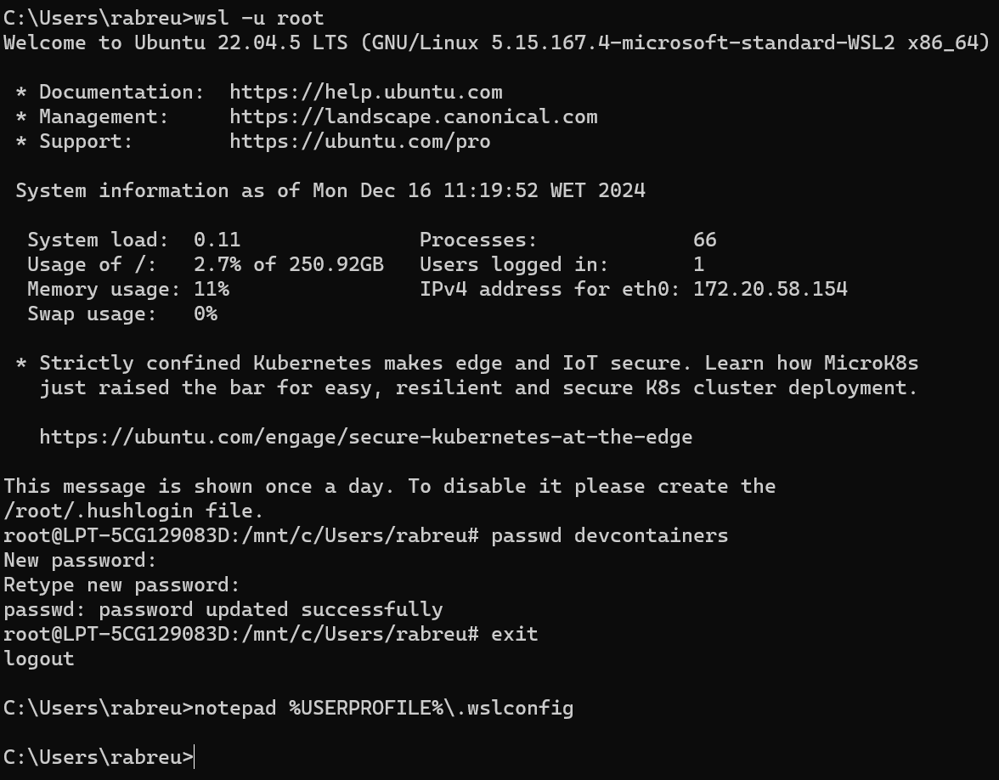
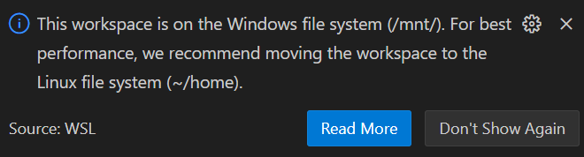

# WSL

## documentation

<https://learn.microsoft.com/en-gb/windows/wsl/>

## users

run wsl as the root user

```bash
wsl -u root
```

changing the password for a user

```bash
passwd <user_name>
```

## WSL configuration

editing the default wsl configurations
(`~/.wslconfig`)

- you can change the default user there (eg. to root or devcontainers)



## Windows filesystem vs Linux filesystem


