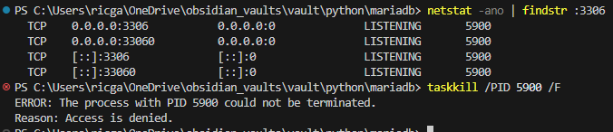
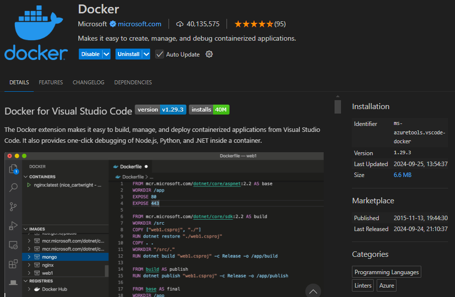
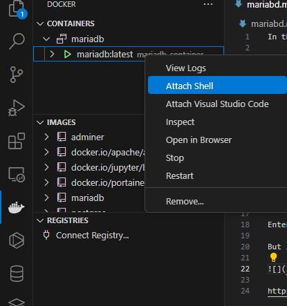
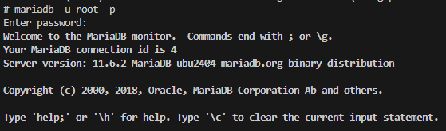

In this repo, I want to run maridb in a docker container and connect to it using sqlalchemy

I changed the default port to another value because I couldn't kill a already running process on Windows.



Idk what that is but anyway, change the ports mapping to "3307:3306"

Anyway,
```bash
docker compose up -d
```

To access the mariadb container, you could do
```bash
docker exec -it mariadb-container mariadb -u root -p
```
Notice the command is mariadb and not mysql. Enter the password (my-secret-pw) when prompted.

But it's easier to use this VSCode extension







to get out of there, type `exit`

https://code.visualstudio.com/docs/containers/overview

For the library, i decied to go with `PyMySQL`. If you are on Linux and have trouble with it, switch to `mysqlclient` + `libmysqlclient-dev`, which should work fine...